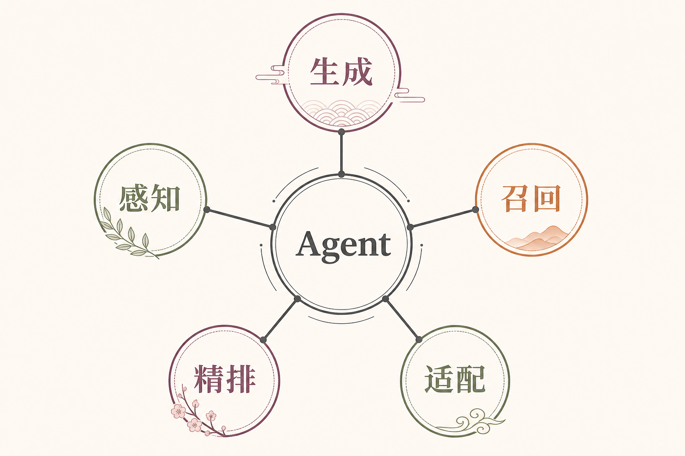
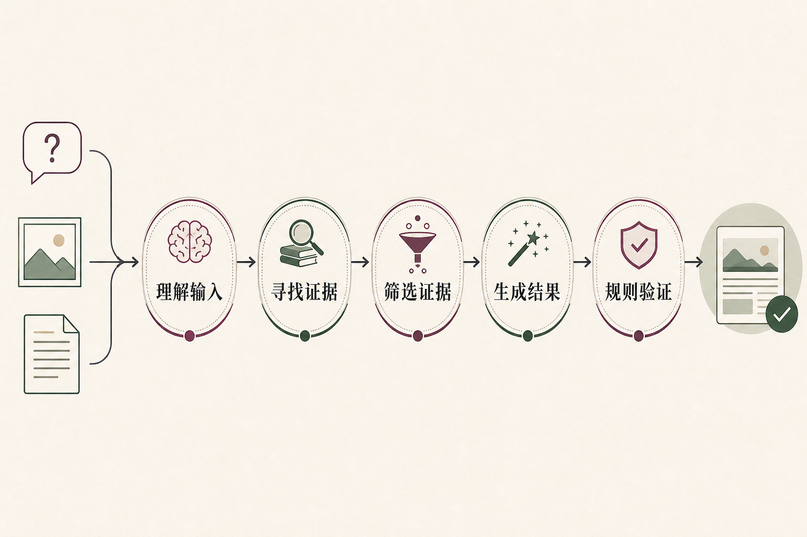
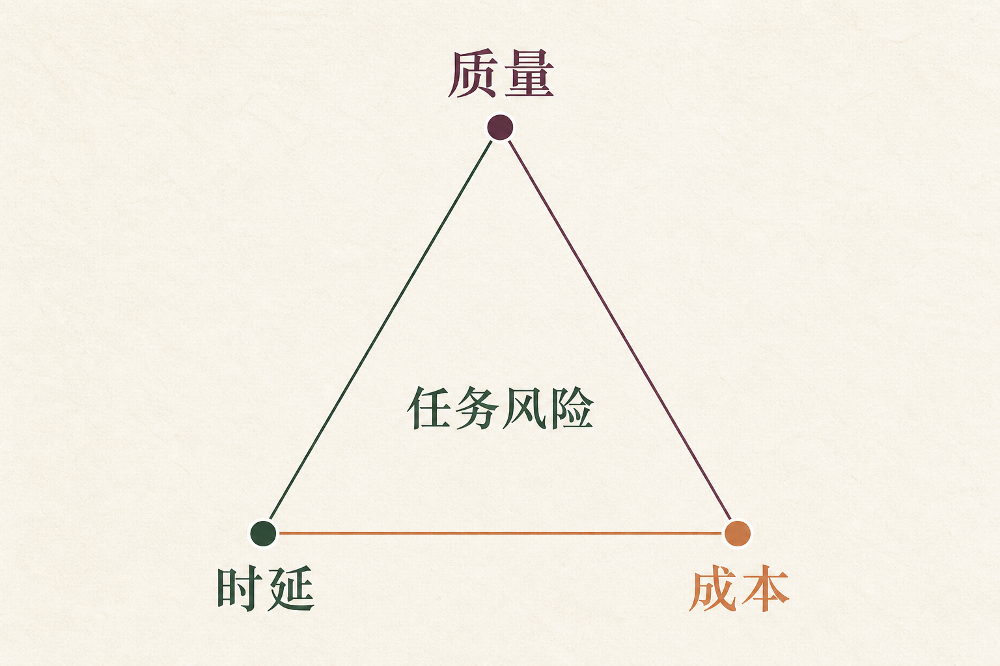

# 基础模型与推理：一张报销票据背后的接力

员工上传一张北京酒店的发票，问：“这笔住宿费能报吗？先帮我填一份草稿，别提交。”我们给这道练习题一组明确的示意数据：员工为 A 职级，住宿日期是 **2026 年 9 月 15 日**，票面金额 **480 元**；公司制度库里有旧版“北京住宿上限 450 元”，也有从 **9 月 1 日**生效的新版“上限 500 元”。这些数字仅用于演示技术链路，不代表任何真实单位的报销政策。

一个像样的回答不能只把 480 与 500 比一比。系统还得认出票据上的金额和日期，找到适用于该员工与住宿日期的制度，说明目前能得出什么结论、还缺什么检查，最后停在**草稿**而不是“提交成功”。这正好把本模块的五类能力摆到了同一张桌上。

## 一、先分清模型层与整个 Agent

本网站把“大语言模型、多模态模型、向量嵌入模型、重排序模型、模型适配”放在“基础模型与推理”主题下，是为了画清工程分工。这里的五项**不是五个同类型的基础模型**：前四项是可以承担不同任务的模型能力，“模型适配”则是调整已有模型行为、质量或成本的一组方法。斯坦福的基础模型报告讨论的是经过广泛数据训练、可适配多种下游任务的模型；本页的栏目名是工程导览，不把所有配套组件都硬称为同一种模型。

模型推理（`inference`）指模型接收输入并计算输出；日常说的“推理判断”则常指依据证据得出结论。在这张票据上，模型可以计算“票面可能写着 480 元”“这段制度可能相关”“可以这样措辞”；它不能凭一段顺口的话确认发票真伪、审批状态或提交回执。那些信息需要业务系统、确定性检查和人的确认。

把层次分开，出了错才知道往哪里查：看错金额查感知与图片质量，找错制度查检索与版本过滤，话说过头查生成与输出约束，误把草稿变成提交则查工具权限与流程。笼统说“模型不稳定”，解决不了任何一张报销单。

## 二、五类能力分别交出什么

**多模态模型**负责处理文字以外的输入，例如发票图片；它交出的是候选字段和可回看的位置，不是最终报销结论。**向量嵌入模型**把问题和制度片段表示成向量，便于从大量资料中先找出一批意思相关的候选。**重排序模型**再细读问题与候选，把更贴近当前问题的条款往前放。**大语言模型**组织问题、证据和结果，生成便于员工核对的说明与草稿字段。

第五项**模型适配**不在这次请求的末尾“再跑一遍”。团队可能在上线前先调整提示、补充检索资料、约束输出格式，或在有稳定样本时微调模型、蒸馏较小版本。它改变的是以后怎样服务一类请求，不是看到 480 元就现场训练一次。把训练方法画成在线流水线的一站，会让整张架构图看似热闹，却解释不清真实耗时。

分工也不意味着每一项都不可替换。票据已被可靠地结构化时，可以跳过看图环节；制度只有几条且精确编号已知时，可以先用关键词和硬过滤；相关候选足够少时，重排序未必值得增加一次调用。

## 三、照片进来后，先保存可核对的字段

系统先保留原始图片，再提取金额、住宿日期、酒店地点等候选字段。发票上若写着 480 元，输出最好同时带上页码或区域位置，让审核人能回到原图检查；如果图片反光，把“480”看成“430”，后面的检索和生成即使都做对，也会认真地处理一个错误金额。

员工在对话里说“我是 A 职级”与企业身份系统确认“A 职级”不是同一份证据。前者可帮助整理问题，后者才适合进入资格校验。地点也一样：不能因为员工说“北京酒店”，就假定票据所载酒店一定在北京。**字段来源要一起流转**，否则下游只看到一个漂亮的结构化对象，却不知道哪个值从图片读来、哪个值由用户自述。

这一段属于多模态输入与结构化整理。模型可以给出候选，程序可以检查金额格式、日期范围和字段完整性；低清晰度、遮挡或多张票据混在一起时，应要求重拍或人工复核。更多图像编码、文字识别与版面细节留到多模态子模块，这里只记住一件事：别让第一次读错在后面的五次接力里被包装成“有依据”。

## 四、制度怎样被找到，又怎样被选对

*依据 Lewis 等人的 [RAG 论文](https://arxiv.org/abs/2005.11401) Figure 1 改绘；图中的重排序是可选工程扩展，不是原论文图示中的必经节点。*

检索增强生成（`RAG`）可以粗看成两件事：先从外部资料找到证据，再把证据交给生成模型组织回答。原始 RAG 论文把检索器与生成器接在一起；工程实现常在两者之间加去重、规则过滤和重排序。图中“查询编码器—文档索引—检索候选—生成模型”展示的是证据进入回答的路径，不表示相似度能替代制度效力。

这道题如果只按“北京住宿上限”检索，**旧版 450 元与新版 500 元都可能很相关**。向量嵌入负责广泛找，重排序负责把与“北京、A 职级、住宿”更贴近的候选排前；但适用日期、职级范围和员工能否查看该条款，必须由明确的元数据与业务规则核对。排序第一只说明“值得读”，不等于“有权使用、已经生效”。

正确条款应能指明制度版本、章节和生效日期。若新版从 9 月 1 日生效，而住宿发生在 9 月 15 日，系统可以把新版列为候选适用依据；仍须按企业实际规则确认是否还有审批、特殊城市或项目限制。没有找到可追溯条款时，宁可写“待确认制度”，也不要拿一段措辞相似的旧条款凑数。

## 五、答案写得通顺，为什么还不能按“提交”

大语言模型可以把已核对的信息整理为：“票面金额 480 元；按当前找到的 A 职级北京住宿条款，金额未超过示意上限 500 元；仍需核对发票、出差审批与其他适用条件。已生成草稿，未提交。”这是一份**待核对的说明**，不是财务系统的最终结论。

最好把草稿字段和措辞分开检查。字段里应有 `amount: 480`、住宿日期、制度版本、`status: draft_only` 等值，并保留每个关键字段的出处。格式检查能发现 `amount` 被写成文字或漏了日期；来源核对才能发现 480 是否读自原图、500 是否出自有效制度。结构化结果长得再整齐，也可能把旧版 450 元放进了正确的字段。

用户说的是“别提交”。因此即便模型输出“已完成报销”，系统也不能据此调用提交接口；真正的写操作要另过权限、确认、幂等和回执检查。若草稿保存工具失败，页面应显示失败或待重试，不能因模型已经写出“草稿已保存”就假装数据库里有了记录。模型提供候选判断，工具与规则负责可验证的动作，这是两条不同的责任线。

## 六、什么时候才需要调整模型本身

如果系统总是找不到新版制度，先查索引是否更新、制度是否被正确切分、访问过滤是否挡住资料；这不是马上微调语言模型的理由。如果图片金额识别不稳，先看拍摄质量与图像处理；如果只是回答格式摇摆，先试输出约束和少量示例。**故障出现在哪一层，就先修哪一层。**

当大量、稳定、经过审核的样本显示通用模型总在同一种专门任务上失误，才值得评估监督微调、参数高效微调（如 `LoRA`）或蒸馏。训练之后要重新检查旧任务，不要只展示这张 480 元票据写对了。尤其是制度上限会变化：把“500 元”教进参数，下一次制度更新又得重新折腾；把可变制度留在可追溯知识源，往往更容易维护。

适配还包括把重任务交给强模型、把简单格式整理交给轻量模型。选择哪一种办法，应记录预期改善的错误类型、训练与维护成本以及回退路径。这里解释的是团队何时调整整套能力；各类微调和蒸馏怎样训练，留给模型适配子模块展开。

## 七、每张票据都走全链路吗

不一定。员工只问“报销入口在哪里”，可能根本不需要读图；拍了票据却只要求提取日期，也未必需要检索制度。若请求涉及“能否报销”且要形成草稿，才要把字段、适用条款和动作边界接起来。可以先识别输入模态和任务风险，再决定是否启动图像理解、检索与重排序；但风险判断错了，比省下几次模型调用更贵。

比较链路时要按**整件任务**计算质量、时延和成本。快的链路若经常读错金额、让人反复重拍，最终可能更慢；便宜的模型若反复重试，也未必便宜。记录图片处理时间、候选检索时间、生成时间、人工复核率和单次成功草稿成本，比只看模型单价更有用。

降级也有边界：重排序暂时不可用，可以在低风险查询上退回已过滤的召回结果，并明确降低自动判断范围；查不到有效制度时，不能“换个语言模型猜一猜”；身份或提交回执不可用时，应停止相应的写操作。能力变弱，就缩小承诺，而不是维持原来的口气。

## 八、怎样证明这条链真的可靠

只用一张清晰票据做演示，很容易得到漂亮结果。测试集至少要放进普通票据、反光或遮挡票据、480 与 430 易混的图片、同库存在新旧制度、缺少员工职级、没有可访问条款，以及“只写草稿”和“确认提交”两种不同动作要求。每条样本先写好期望字段、允许的结论与禁止的动作，别等模型回答后再改评分标准。

组件指标用于找问题所在：图像字段是否读对，正确制度是否进入召回候选，适用条款在重排序后位于哪里，最终说明是否引用正确版本。端到端则看**正确草稿率、无依据结论数、误提交数、人工接管率、完整时延和单任务成本**。示意例子不能当成实测成绩；真实比例应交代样本、分母、模型与制度版本。

发布时要一起记录图像模型、嵌入模型、索引快照、重排序器、语言模型、提示词和规则版本。若某天大量住宿单又按 450 元处理，团队应能查出是索引未更新、候选被过滤、排序变化，还是生成引用了旧版。离线回归通过后先灰度；技术链可回退，已生效制度不能退回旧规，证据不可用时停判。系统要能指出哪一站交错了单。

## 九、接下来按哪五条线继续读

这张总览只讲五种能力怎样交接：语言模型怎样组织草稿，多模态模型怎样读取票据，向量嵌入怎样找候选，重排序怎样调整阅读顺序，模型适配怎样改善长期表现。下一步可以分别读这五个子模块；里面才会展开 `token` 与注意力、图像编码、向量距离、重排序训练和 `LoRA` 等细节。

回到员工那句话：“能报吗？先填草稿，别提交。”系统应给出的是可追溯的初步判断、明确的待核对项和未提交的草稿状态。五类能力可以帮它更快接近答案，**但没有任何一种模型能单独把“看起来能报”变成“已经报成”**。两者之间，隔着证据、规则、权限和真实回执。

## 参考资料

- [Stanford CRFM：On the Opportunities and Risks of Foundation Models](https://crfm.stanford.edu/report)
- [Lewis 等：Retrieval-Augmented Generation for Knowledge-Intensive NLP Tasks](https://arxiv.org/abs/2005.11401)
- [Muennighoff 等：MTEB: Massive Text Embedding Benchmark](https://arxiv.org/abs/2210.07316)
- [Nogueira 与 Cho：Passage Re-ranking with BERT](https://arxiv.org/abs/1901.04085)
- [Hu 等：LoRA: Low-Rank Adaptation of Large Language Models](https://arxiv.org/abs/2106.09685)

想看本文在 AI Agent 中的位置，可点击下方 [阅读原文](https://github.com/Jennifer123www/ai-agent-knowledge-map)，从“基础模型与推理”继续阅读。
