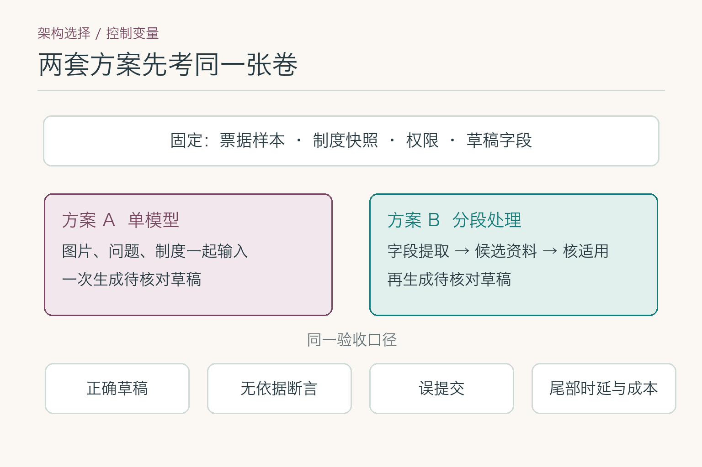
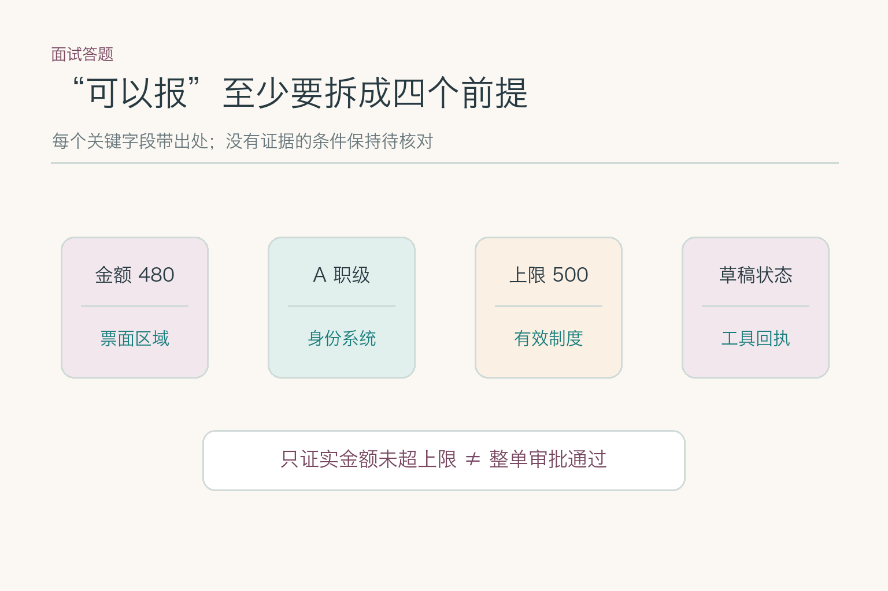
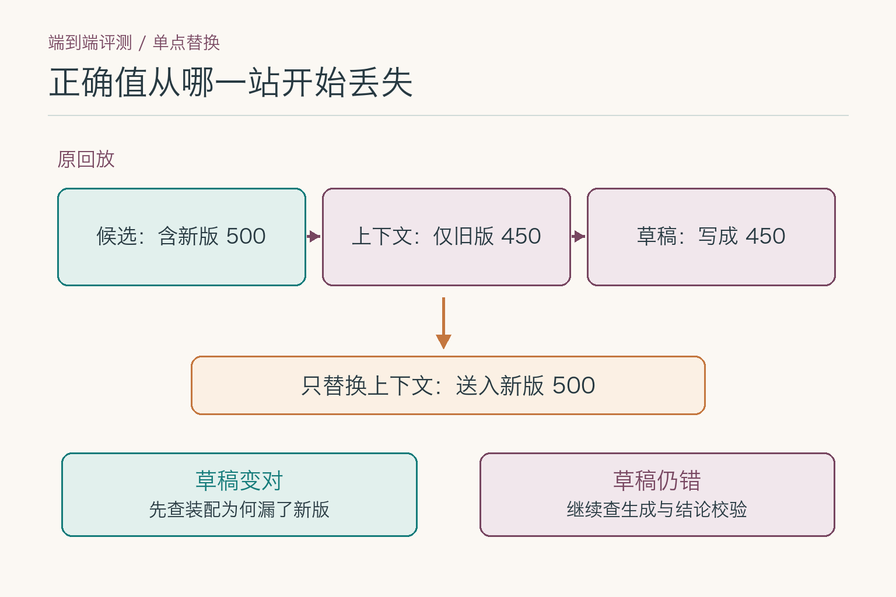
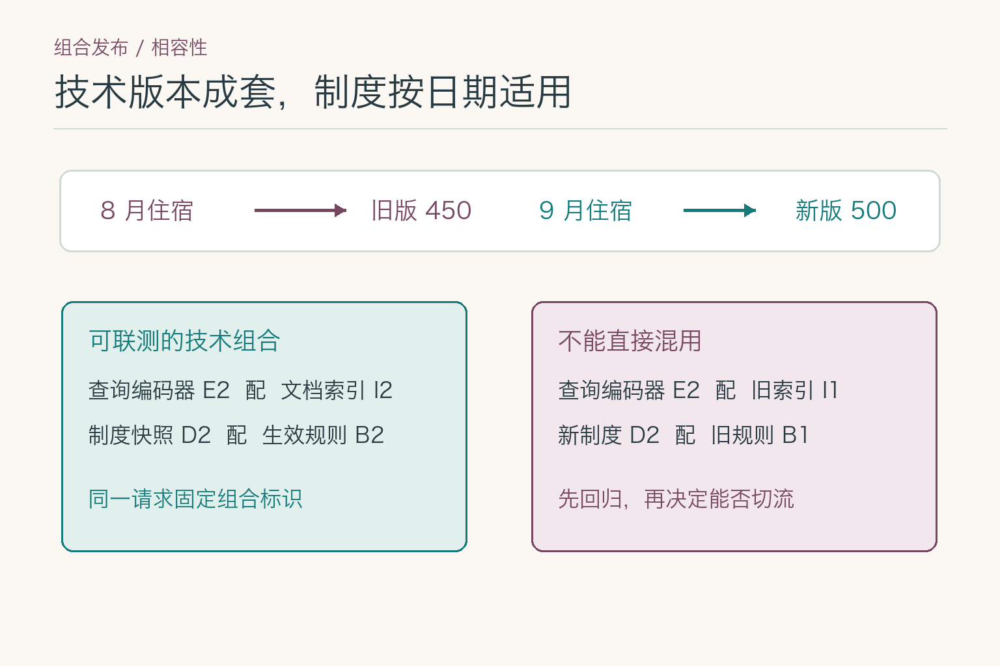
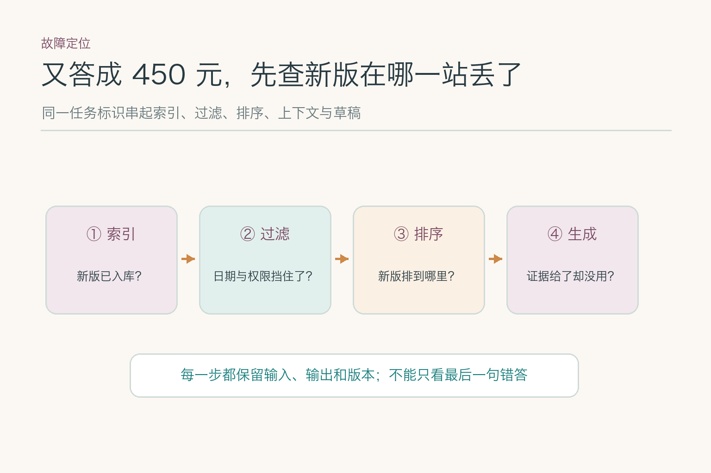

# 面试题：五类能力怎样接力写报销草稿

九道题共用一张练习票据：员工上传北京酒店发票，票面 **480 元**、住宿日期 **2026 年 9 月 15 日**，并自称 A 职级。假设制度库里既有旧版上限 **450 元**，又有 **9 月 1 日**生效的新版上限 **500 元**。员工只要求先填**草稿，不提交**。答题时，这些条件还要逐项找到来源，不能因为题干给了数字就跳过核对。

这组题不再要求逐个解释五种模型的内部原理。面试官更可能追问：两套方案怎样公平比较，字段交接怎样留证据，出错时怎样证明是哪一站造成的。图像连接层、向量距离、交叉编码器训练与 `LoRA` 参数留给对应子模块。

## 问题 1：单模型和组合方案，怎样做公平对照？

### 原理

不先把能力拆成五个服务，也不预设一个大模型就够用。两套方案须处理同一批票据、同一份制度快照、同一套身份与工具权限，并交出同样的草稿字段。否则“组合方案更准”可能只是因为它拿到了新版制度，而单模型没有。

*两套方案共用输入、资料、权限和验收口径；图中没有预设哪套方案胜出。*

### 答题点

1. 固定测试样本、可见资料和动作权限，分别搭建“单模型直出草稿”和“分段处理”两条可运行基线；
2. 两条链用同一套字段与证据要求验收，不能只比较回答是否通顺；
3. 记录正确草稿、无依据断言、误提交、人工接管、尾部时延及每张成功草稿的成本；
4. 若组合方案胜出，再逐段移除或替换组件，证明收益确实来自该段，而非更好的输入或额外规则。

### 记忆点

> 先让两套方案考同一张卷，再决定要不要拆。

**常见追问：** “组合方案准确率高一点，就值得上线吗？”还要看提升集中在哪类票据、误提交是否为零、人工接管和尾部耗时是否可接受。关键风险没改善，就不该只凭平均分增加链路复杂度。

**失分点：** 给组合方案接实时制度，给单模型只看旧静态提示，却把差距归因于模型数量。

## 问题 2：跨组件交接时，字段契约怎样设计？

### 原理

这不是让每站都传一段自然语言。一个字段至少要带值、来源类型、来源定位、读取状态与校验状态；制度依据还要带版本和生效区间。下游只能在契约允许的状态上继续，不能把“员工自述 A 职级”悄悄升级成“身份系统已确认”。

### 答题点

1. 给金额记录 `value=480`、原图标识、票面区域和 `read_status`；给职级另记“用户自述”或“身份系统确认”，不可只剩一个 `A`；
2. 给制度依据记录文档 ID、章节、版本、生效区间和访问范围，交给规则层核适用条件；
3. 定义 `unknown / candidate / verified / conflict` 等状态及转移条件：读图候选不会因为被生成模型复述就变成已核验；
4. 草稿保存与提交使用不同工具契约，保存结果以工具回执为准；没有回执时只保留待重试状态。

### 记忆点

> 值和出处一起传；状态只能由有权核验的一站升级。

**常见追问：** “上游只交来 `480`，下游能根据答案补一个票面区域吗？”不能。来源要在读取时保存；补不回出处的字段只能退回上游重读或待人工确认。

**失分点：** 只定义 `amount` 等值，不定义来源、状态和谁有权把候选改为已确认。

## 问题 3：“可以报”拆成哪些可判定断言？

### 原理

把这句话改写成断言清单，而不是只要求模型附一个引用。第一项是“票面金额为 480 元”，第二项是“已确认的员工职级为 A”，第三项是“住宿日适用的上限为 500 元”，第四项是“其他报销条件已满足”。每项分别标为已证实、被否定或尚未知；只要第四项未知，就不能把前三项合成“可以报”。

### 答题点

1. 为每条断言指定权威来源和核验动作，不能拿同一段生成文本同时充当事实与证明；
2. 对未知项使用三值逻辑：已证实、被否定、待核对；“未超上限”不推出“整单可报”；
3. 让结论模板只读取核验后的断言状态，遇到冲突便列出冲突来源，不由语言模型选一个顺眼的值；
4. 把“草稿已保存”另列为动作断言，只接受保存接口回执，不接受模型自己宣称。

### 记忆点

> 一句话拆成多项断言；缺一项，就收窄一句话。

**常见追问：** “金额与上限都已确认，为何还不能写‘可以报’？”因为票据真伪、审批和其他限制可能仍未知；可写“金额未超当前找到的上限”，但不能偷换成整单通过。

**失分点：** 把单一引用当成整句证明，或把未知状态自动当成通过。

## 问题 4：跳过一段模型调用，怎样证明没有误路由？

### 原理

路由器决定走哪条链，错误路由的代价往往不是一次模型答错，而是根本没启动必要的核对。把“问入口”“只摘日期”“判断是否超标”“请求提交”分成不同任务类别，分别列出必需能力与禁止动作。再用标注样本测它是否把高风险请求误分到短链路。

### 答题点

1. 对输入模态、任务意图、缺失字段和动作风险设硬门槛，模型分类结果只能在门槛允许的范围内选路；
2. 建立“应走路径”标注集，单列高风险请求漏进简化链路的比例，不只看总体路由准确率；
3. 对可选步骤做消融，固定其余链路与样本，记录质量增益相对新增时延是否值得；
4. 保存命中的规则、路由版本和实际执行路径；出现错路由时可回放，而非只看最终答案。

### 记忆点

> 省一步之前，先数清错省了多少高风险请求。

**常见追问：** “请求没有图片，就一定能跳过图像能力吗？”还要确认要处理的附件和历史上下文；只靠最新一句文字判断，可能漏掉先前上传的票据。

**失分点：** 只报路由平均准确率，没统计把“能否报”误路由到“普通问答”的事故类错误。

## 问题 5：怎样设质量门槛并计算整单成本？

### 原理

先把错误分级：误提交属于不能用平均分抵消的动作错误；金额、制度和职级错配会使草稿失真；措辞不够漂亮相对次要。只有通过前两类门槛的方案，才值得比较速度与成本。成本单位是“一张可交给员工核对的合格草稿”，不是一次模型调用。

### 答题点

1. 写清各级错误的容忍阈值与分母；“零误提交”若样本太少，只能说本次未观察到，不能声称风险为零；
2. 记录每段耗时及完整请求的 `p95`，不能把各段平均值相加冒充用户等待时间；
3. 估算每张合格草稿成本：调用费、失败重试费与人工复核费相加，再除以合格草稿数；
4. 对候选方案画出质量门槛内的时延—成本关系，保留最简单达标方案作为基线。

### 记忆点

> 不合格方案不比便宜；成本按合格草稿算。

**常见追问：** “调用费降了三成，整体成本一定降吗？”不一定。重试与人工复核若上升，单张合格草稿的成本可能反而更高。

**失分点：** 用“每百万 `token` 单价”代表整单成本，或拿总体平均准确率遮住误提交。

## 问题 6：组件都达标，为什么整单仍可能失败？

### 原理

每段测试常用干净输入，真实链路却把上游输出交给下一站：票面日期若被读错，正确的制度检索也会寻找错日期的条款。要找出误差怎样传播，可在同一案例中只替换一个阶段的输出为人工确认的正确值，再重跑下游。如果整单随之变对，便找到了一个关键断点；若仍错，就继续查后续交接。

*教学回放：候选里已有新版，却在上下文装配时只留下旧版。只替换这一段输出，再观察草稿变化；这不是线上故障的实测截图。*

### 答题点

1. 先冻结一批标注样本与制度快照，保存每站实际输入、输出、版本和最终草稿；
2. 找到错误样本后，从最早可疑节点起逐站注入正确值，每次只替换一段输出，观察下游是否恢复；
3. 区分“该段本身错”和“该段吃了上游错输入后正常工作”，不要把后者误算成此段模型退化；
4. 最后仍按整单验收：证据、字段、状态和回执都对才算成功，并按错误类型分层汇总。

### 记忆点

> 单段给标准答案重跑，看错从哪一站开始扩散。

**常见追问：** “替换候选后答案变对，就能断言嵌入模型有问题吗？”不能。候选缺失还可能来自资料未入库、权限过滤或索引；还要沿该阶段的输入与配置继续拆。

**失分点：** 只报组件单测分数，或把上游错误造成的下游连锁反应重复算成多个独立模型故障。

## 问题 7：制度升级后，怎样发布相容的版本组合？

### 原理

一个请求必须在相容的一组资料、索引、模型、规则和工具契约下完成。若查询侧已换新嵌入模型、文档索引仍是旧空间，或者制度更新了、规则仍按旧生效日判断，就可能出现“每个服务都健康，合起来却错”的发布事故。给每次请求记录组合标识，比各团队分别说“我这边已上线”有用。

*E、I、D、B 是示意版本标识，分别代表查询编码器、文档索引、制度快照与生效规则；配对是否可用必须经过联测。*

### 答题点

1. 建一份发布清单，写明资料快照、查询编码器与文档索引配对、重排序器、生成模型、提示、规则和工具契约；
2. 在生效日前后各放一组回归单：8 月住宿仍应按当时有效的旧版，9 月住宿应读新版；这不是让所有历史单统一改为 500；
3. 切流时以组合标识固定一次请求，不让同一请求前半段用新索引、后半段用旧规则；
4. 回退技术组件时选择经过验证的兼容组合，不能借“回滚”把已生效制度退成旧版。

### 记忆点

> 技术版本要成套，制度效力看业务日期。

**常见追问：** “只改制度文档，模型一行代码没动，还要重新验收吗？”要。索引是否收录、生效区间、旧单回放和最终引用都会受影响；代码不变不代表链路结果不变。

**失分点：** 保存各组件版本却不保存它们的兼容关系，或把技术回滚当作撤销新制度。

## 问题 8：又答成 450 元，怎样找第一个错误节点？

### 原理

先确认这确实是 9 月 15 日、A 职级的单子，再沿同一任务标识回放。当新版在索引里、也进入召回候选，却没进入生成上下文，最早错误在过滤、截断或上下文装配；若上下文已经有新版而草稿仍写 450，才去查生成和结论校验。看最终错答本身，区分不了这些路径。

### 答题点

1. 固定原票、身份确认结果、住宿日期及组合版本，重建当次请求的事实底稿；
2. 检查新版在哪个边界第一次消失：资料快照、过滤后的候选、精排后列表，还是最终上下文；
3. 对该边界做单变量回放：只补入正确候选或正确上下文，保持其他版本不变；若草稿恢复，继续查该边界为何丢失；
4. 若正确证据一直在场却仍写 450，记录生成字段与引用，再查来源绑定与结论校验，不把故障甩给检索。

### 记忆点

> 找到新版第一次消失的位置，再动那一站。

**常见追问：** “上下文有新版，也有旧版，能否直接怪生成模型？”先确认版本过滤为何保留旧版、提示是否明确住宿日期和来源优先级，再测模型在同一上下文下是否稳定误用。

**失分点：** 只看最终文本，不保存中间候选、过滤原因和实际进入模型的证据。

## 问题 9：故障后哪些状态能继续，哪些必须停？

### 原理

把输出分成“只展示资料”“生成待核对字段”“保存草稿”“提交”四级能力。故障发生后，系统不是笼统地切到备用模型，而是落入允许的状态：金额未核实，不能升到含金额的草稿；制度不可用，不能给适用性结论；保存接口没有回执，不能显示“已保存”。提交又需要独立确认与权限，与前三者不是同一个开关。

### 答题点

1. 先定义故障状态到允许输出的映射，不让语言模型自己决定还能承诺什么；
2. 将“展示候选”“形成草稿”“写入成功”“提交成功”分别绑定证据、规则、权限和回执条件；
3. 备用路径只在预先评测通过的任务类别启用，且保留降级标识，避免下游误认仍在完整链路；
4. 恢复时读取权威业务状态再决定重试，防止重复保存或重复提交。

### 记忆点

> 故障先降状态，再决定是否换模型。

**常见追问：** “草稿工具超时，但实际上可能保存成功了，能直接重试吗？”先按幂等键或草稿 ID 查询权威状态；查不到或状态不明时，不向员工宣称成功，也不盲目重复写入。

**失分点：** 换了备用模型就保留原来的结论与动作承诺，没有状态门槛和回执核对。

这组总览题可以压成一条答题线：**先做公平对照，再定交接契约；用断言与状态限制结论，靠受控回放找错，最后按相容版本发布与安全降级。**各模型内部怎样计算，留给对应子模块。

## 参考资料

- [Stanford CRFM：On the Opportunities and Risks of Foundation Models](https://crfm.stanford.edu/report)
- [Lewis 等：Retrieval-Augmented Generation for Knowledge-Intensive NLP Tasks](https://arxiv.org/abs/2005.11401)
- [Muennighoff 等：MTEB: Massive Text Embedding Benchmark](https://arxiv.org/abs/2210.07316)
- [Nogueira 与 Cho：Passage Re-ranking with BERT](https://arxiv.org/abs/1901.04085)
- [Hu 等：LoRA: Low-Rank Adaptation of Large Language Models](https://arxiv.org/abs/2106.09685)

想看本文在 AI Agent 中的位置，可点击下方 [阅读原文](https://github.com/Jennifer123www/ai-agent-knowledge-map)，从“基础模型与推理”继续阅读。
