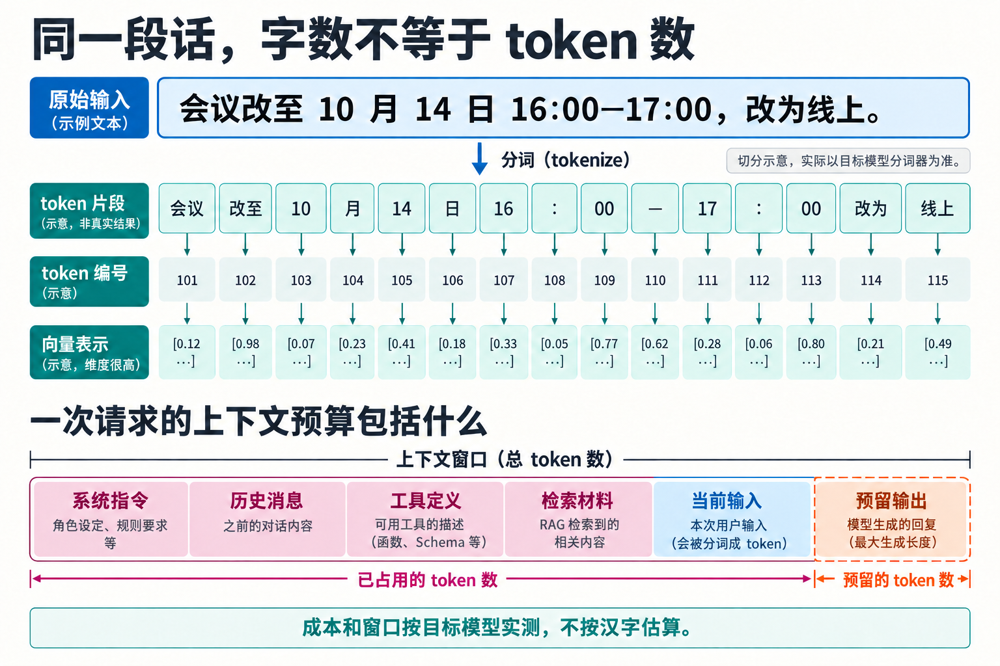
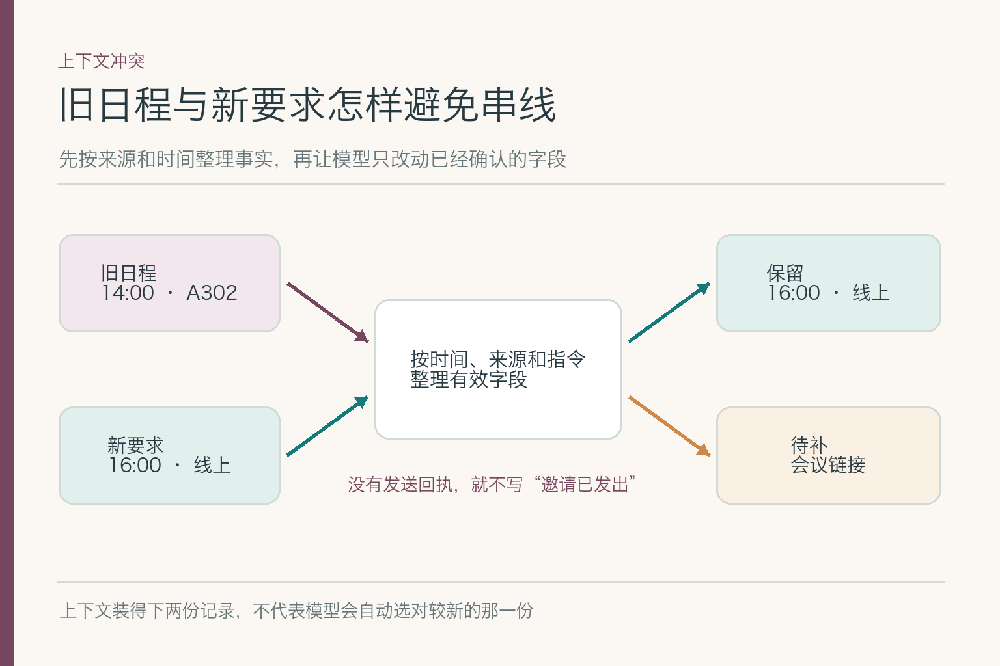
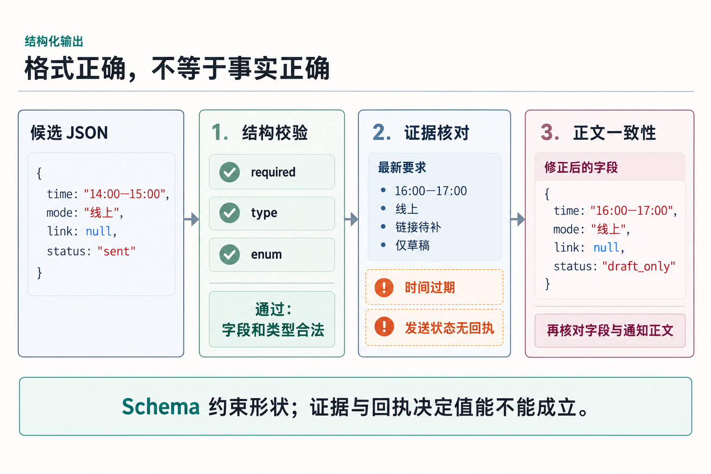
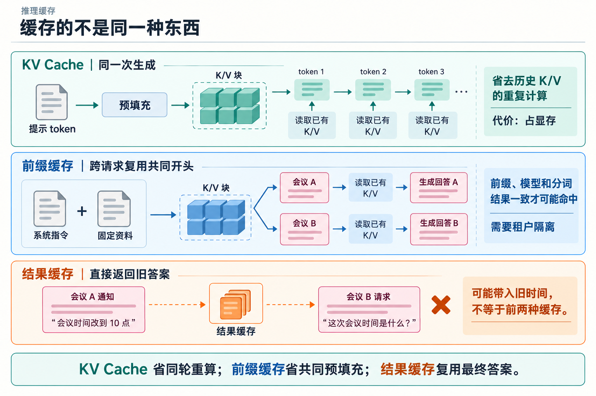
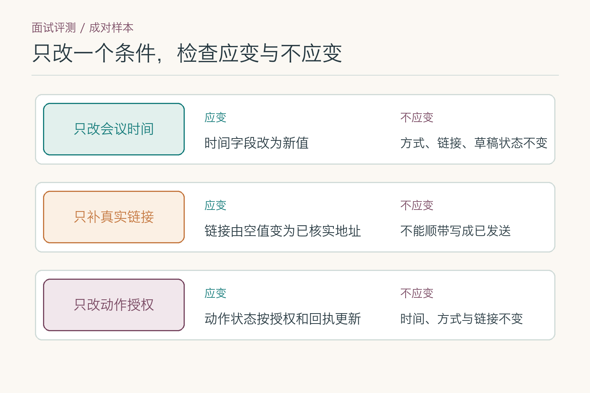

# 面试题：大语言模型从原理到验证怎么答

这十道题共用一道面试小案例：旧日程是**2026 年 10 月 14 日 14:00—15:00、A302**；用户刚说“改为当天 16:00—17:00、线上，链接还没生成；先写通知草稿，不发送，也不改日历”。候选模型写出的通知很流畅，却保留了旧地点，还声称“已发送”。

回答时沿着一条线展开：**机制是什么 → 它怎样影响案例 → 如何验证 → 出错后怎样处理**。术语要能解释现象，也要落到可执行的检查。

## 问题 1：为什么不能按字数估计模型输入成本？

### 原理

模型接收的不是“字数”，而是分词器切出的 `token`。分词器依据自己的词表把原文拆成子词、字符、标点等片段，再把它们转换成编号；编号经过嵌入层，才成为模型可计算的向量。词表和切分算法随模型而变，同一句话换一个模型、语言或写法，`token` 数都可能变化。时间、网址、代码和生僻名称尤其不能凭字数猜。

一次请求占用的上下文还包括系统指令、历史消息、工具定义、检索材料、当前输入和为输出预留的空间。成本评估应使用目标模型的分词器跑真实样本，统计中位数与高分位，而不是套用“一个汉字等于一个 token”。

### 答题点

先说明“原文 → token → 编号 → 向量”；再列出完整预算项；最后说清用目标分词器实测，并为长尾请求和输出留余量。

### 记忆点

> 字是人看的，`token` 才是模型算的。

**常见追问：** “`16:00—17:00` 占几个 token？”应回答“以目标模型实测为准”，时间是否正确则另用字段校验。

**失分点：** 把 `token` 固定解释成一个汉字或一个英文单词。

## 问题 2：模型为什么能续写通知，却可能编造会议链接？

### 原理

自回归语言模型把一段文本的概率拆成连续条件概率：当前 `token` 的分布取决于此前已经出现的 `token`。模型输出一组分数（`logits`），解码器据此选出下一个 `token`，再把它接回上下文继续计算。因此，它很擅长写出“像通知”的下文，但训练目标首先要求续写合理，并不自带对当前日历的查询。

参数里保存的是从训练材料学到的语言和知识模式，不是今天这场会议的实时状态。指令微调可以让模型更愿意遵守“缺信息就追问”，却不会创造尚未生成的链接。若系统没有提供链接或工具回执，正确做法是留空、标注待补或追问。

### 答题点

说清逐 `token` 建模；区分语言合理与事实成立；把链接、发送状态等实时信息交给外部系统和证据核验。

### 记忆点

> 会续写，不等于看过日历。

**常见追问：** “温度调到零能避免编链接吗？”不能，最高概率候选也可能没有事实依据。

**失分点：** 把幻觉全部归因于随机采样。

## 问题 3：自注意力在这条通知里起什么作用？

### 原理

每个位置会生成查询（`Query`）、键（`Key`）和值（`Value`）。查询与各位置的键做缩放点积，经 `softmax` 得到权重，再对值加权汇总：`softmax(QKᵀ/√dₖ)V`。多头注意力让不同的头分别学习时间、主体、指代等关系；位置信息补充先后顺序；仅解码器模型还用因果掩码，阻止当前位置读取尚未生成的未来内容。

它能把“改为线上”与“这场会议”关联起来，也可能同时看到旧记录中的“A302”。注意力负责信息交互，不负责裁定哪份材料具有更高业务权威。版本标记、字段优先级和输出核验仍要由上下文组织与程序规则承担。

### 答题点

至少讲到 Q/K/V、缩放、`softmax`、多头和因果掩码；再说明注意力不是数据库查询，也不等于事实裁决。

### 记忆点

> 注意力决定怎样汇总，不决定谁是真相。

**常见追问：** “为什么旧地点仍会出现？”因为它仍在输入里，且没有被可靠降权或在输出后拦截。

**失分点：** 只说“模型会关注重点”，不解释计算与边界。

## 问题 4：长上下文装得下，为什么还会用错地点？

### 原理

上下文窗口只说明请求最多能容纳多少 `token`，不保证模型稳定找到、正确解释并采用每条信息。输入越长，旧值重复、记录冲突和位置变化越容易干扰判断。模型还可能把“最新用户要求”“历史资料”和“工具返回”当成同一层级的普通文本。

“中间信息更容易被忽略”是长上下文研究在特定任务和模型上的观察，不是放之四海而皆准的定律。工程上应把容量、检索到信息、按权威顺序使用信息分开测；对时间、方式、链接状态和允许动作，最好先整理成有来源和版本的字段。

### 答题点

区分“装得下、找得到、用得对”；说明冲突消解规则；用关键信息位于开头、中间、末尾的样本测试位置敏感性。

### 记忆点

> 桌子够大，不代表拿对了那张纸。

**常见追问：** “把旧对话摘要掉可以吗？”可以减长度，但数字、缺失状态和动作限制不能被摘要丢失。

**失分点：** 所有文本都在窗口内，却仍把问题解释成“超长截断”。

## 问题 5：温度、`Top-k`、`Top-p` 各控制什么？

### 原理

模型先为候选 `token` 产生 `logits`。温度会在 `softmax` 前缩放这些分数：温度低，分布通常更集中；温度高，候选之间的差距变小。`Top-k` 只保留分数最高的固定数量候选，`Top-p` 则从高到低累加概率，保留累计达到阈值的动态集合。具体服务如何组合这些参数，顺序和默认值可能不同。

这些参数控制“从哪些候选中选”和“输出波动多大”，不提供事实证据。低温度可以让通知更稳定，却可能稳定地复述旧地点；所以稳定性与事实正确率必须分别评估。

### 答题点

先区分分布缩放、固定名额和累计概率；再说明参数实现依服务而异；最后把字段正确率与多样性分开测。

### 记忆点

> 温度调平陡，`Top-k` 数名额，`Top-p` 看累计。

**常见追问：** “每次输出相同，能证明可靠吗？”不能，它可能每次都稳定写错。

**失分点：** 直接说“低温度提高事实准确率”。

## 问题 6：三种错答，怎样分别验证修法有效？

### 原理

主文已经辨过旧地点、虚构链接和假称发送三种错。面试里要再往前走一步：为每种错误设计**只改变一个条件**的回放。固定模型和提示，把旧日程从输入里移除；若 A302 随之消失，说明旧值干扰值得进一步查。固定其余材料，只把“链接尚未生成”改为“链接为已核实网址”；比较模型是准确引用、继续编造，还是仍写待补。最后固定通知正文，仅改变发送工具的回执状态，确认“已发送”这类动作句只能由真实回执触发。

对照只提供归因线索，不是一次实验就能宣布根因确定。还要在不同措辞、不同位置和多条样本上重放，分别统计过期值误用、缺项补猜与无回执动作宣称。针对性修法可以是版本标记、空值约束、动作状态闸门，但验收应针对各自错误类型，而非只看一条通知变好了。

### 答题点

先按错误类型设三组受控输入，再用同一判据回放；说明哪项变化能区分旧值干扰、缺项补猜与动作状态错误，最后给每类错误单独设验收线。

### 记忆点

> 三种错，三组对照，不能靠一句“别幻觉”。

**常见追问：** “移除旧日程后写对了，能认定注意力机制坏了吗？”不能。可能是输入组织、版本标记或位置敏感性造成；还要按同条件回放才能缩小范围。

**失分点：** 用一项整体正确率宣称三类错误都已修好，却没有分类型样本和回归记录。

## 问题 7：结构化输出格式正确，为什么还会写错通知？

### 原理

`JSON Schema` 可以约束必填字段、数据类型、枚举和嵌套结构；支持约束解码的服务还能在生成阶段排除不合法的结构。但“16:00—17:00”与旧时间“14:00—15:00”都是合法字符串，`draft_only` 与 `sent` 也可能都是枚举允许值。结构合法只解决机器能否读取，不解决值是否来自最新证据。

可靠链路至少有三道检查：先验结构，再比对字段与来源，最后确认渲染后的正文没有把字段改坏。还可让结果携带 `evidence_refs` 和动作状态，使“值从哪里来”能够追踪，而不是只有一份漂亮的 JSON。

### 答题点

用 `required`、`type`、`enum` 解释结构约束；明确其不验证时效和来源；补充字段—证据—正文一致性检查。

### 记忆点

> 格式负责能读，证据负责可信。

**常见追问：** “Schema 能阻止旧时间吗？”除非把业务约束显式编码并与最新输入比对，否则不能。

**失分点：** 把合法 JSON 当作正确答案。

## 问题 8：`KV Cache`、前缀缓存与结果缓存有什么区别？

### 原理

推理分为预填充（`prefill`）和解码（`decode`）。预填充一次处理已知提示，并在每层产生键和值；解码每生成一个新 `token`，只需计算新位置，再读取此前保存的键和值。`KV Cache` 因而减少同一轮生成中的重复计算，但会占用显存，而且新位置仍要与历史缓存做注意力计算。

前缀缓存把相同提示前缀对应的 KV 块跨请求复用，适合共同系统指令或固定资料；它要求模型、分词结果和前缀边界一致，还要做好租户隔离。结果缓存则直接返回旧答案，可能把上一场会议的时间带进来，不能与前两者混为一谈。

### 答题点

说明预填充与解码；比较同一请求复用、跨请求前缀复用和直接复用答案；补充显存、命中条件与隔离风险。

### 记忆点

> KV 省历史重算，前缀省共同开头，结果缓存直接拿旧答案。

**常见追问：** “有 KV Cache 就能并行生成整段吗？”不能，自回归依赖仍在。

**失分点：** 只谈命中率，不谈显存和数据隔离。

## 问题 9：怎样用最小变化测出模型有没有守住更新边界？

### 原理

普通测试会问“这封通知是否写对”，但不一定测出模型究竟遵循了哪条更新。可以从同一份基准输入构造相邻样本：只改会议时间，期望时间字段改变、线上方式与草稿状态不变；只补真实链接，期望链接从空值变为该地址，却不能顺手变成“已发送”；只改变“草稿”与“发送”的用户授权，期望动作状态随授权及真实回执变化。一次只改一个条件，才能看清模型是否把无关字段也带偏。

每对样本都保存原输入、期望变化、不应变化的字段和模型输出。除了单题正确率，还要统计**成对一致率**：两题各自都正确且只发生预期变化才算过。若只数每题平均，模型可能在基准题和变体题里分别犯不同错，仍得到看似不错的分数。严重的“无回执称已发送”单独设零容忍门槛，不能被文风得分冲淡。

*图中列的是测试判据，不是模型跑出的成绩。每一对样本还需记录原始输出与实际错误。*

### 答题点

先构造只改一个字段的成对样本，写明应变与不应变；再算单题和成对一致率，最后单列动作越界的失败数。

### 记忆点

> 改一个条件，看该变的变、不该变的不变。

**常见追问：** “两条通知各自都合法，成对测试还可能失败吗？”会。新时间题若顺手把未生成的链接补出来，单看格式合法却违反了不应变化的字段约束。

**失分点：** 只看平均正确率，不检查一处输入变化是否牵动了无关字段和动作状态。

## 问题 10：输入能并行处理，为什么通知仍要逐步生成？

### 原理

训练时，目标序列已经完整存在，通过因果掩码可同时计算多个位置的损失，这常被称为教师强制下的并行训练。推理时，预填充也能在每一层并行处理已知提示；但未知的第 `t+1` 个 `token` 必须等第 `t` 个产生并加入上下文，解码因此保留串行依赖。

输入很长主要增加预填充时间，输出很长则增加解码步数。连续批处理、推测解码等技术可以提高吞吐或减少等待，但没有改变自回归概率分解本身。性能分析应分别报告首个 `token` 延迟、后续生成速度和完整耗时。

### 答题点

区分训练、预填充与解码；解释输入长度和输出长度影响的阶段；说明优化吞吐不等于取消自回归依赖。

### 记忆点

> 已知输入可并行读，未知输出仍要接着写。

**常见追问：** “KV Cache 改变了什么？”它省历史重算，但没有让未来 token 提前出现。

**失分点：** 把“Transformer 可并行”说成“一次生成整段答案”。

## 面试前的最后一次自检

先不用术语讲一遍案例：模型把输入切成 `token`，依据上下文逐步生成；旧新记录冲突时要标清权威与版本；链接缺失时要留空；没有发送回执就不能写“已发送”。再把这条链翻译成注意力、采样、缓存、结构化输出与评测，术语才有落脚点。

面试官若追问“你怎么知道修好了”，不要只说效果不错。给出覆盖正常、冲突、缺值和补入真实链接的测试集，展示每个字段的预期值、禁止项与原始错误。**能指出哪一句没有依据、哪个字段用了旧值，比背出十个术语更有说服力。**

## 参考资料

- [SentencePiece：A simple and language independent subword tokenizer and detokenizer for Neural Text Processing](https://arxiv.org/abs/1808.06226)
- [Attention Is All You Need](https://arxiv.org/abs/1706.03762)
- [Lost in the Middle：How Language Models Use Long Contexts](https://arxiv.org/abs/2307.03172)
- [The Curious Case of Neural Text Degeneration](https://arxiv.org/abs/1904.09751)
- [JSON Schema 2020-12 规范](https://json-schema.org/draft/2020-12/json-schema-validation)
- [vLLM Automatic Prefix Caching](https://docs.vllm.ai/en/latest/design/prefix_caching/)
- [Efficient Memory Management for Large Language Model Serving with PagedAttention](https://arxiv.org/abs/2309.06180)
- [HELM：Holistic Evaluation of Language Models](https://arxiv.org/abs/2211.09110)

想看本文在 AI Agent 中的位置，可点击下方 [阅读原文](https://github.com/Jennifer123www/ai-agent-knowledge-map)，从“基础模型与推理”继续阅读。
