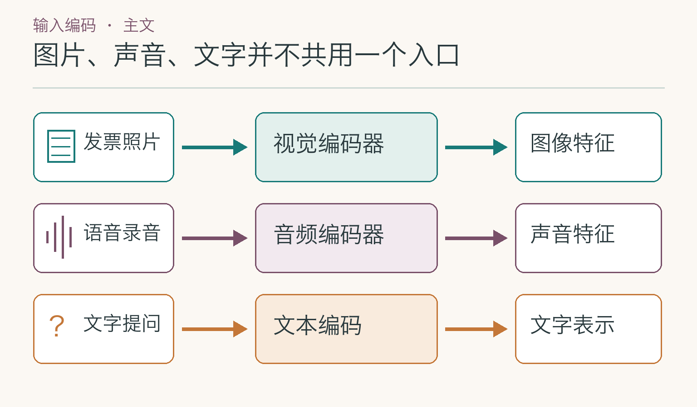
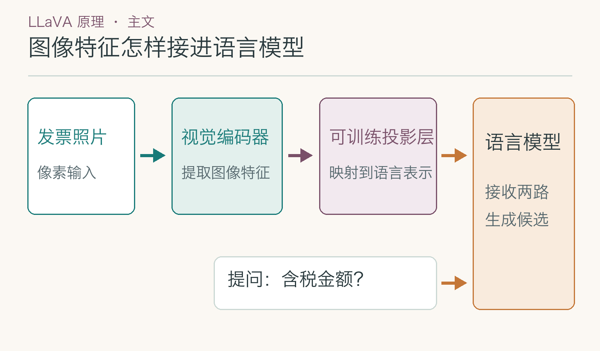
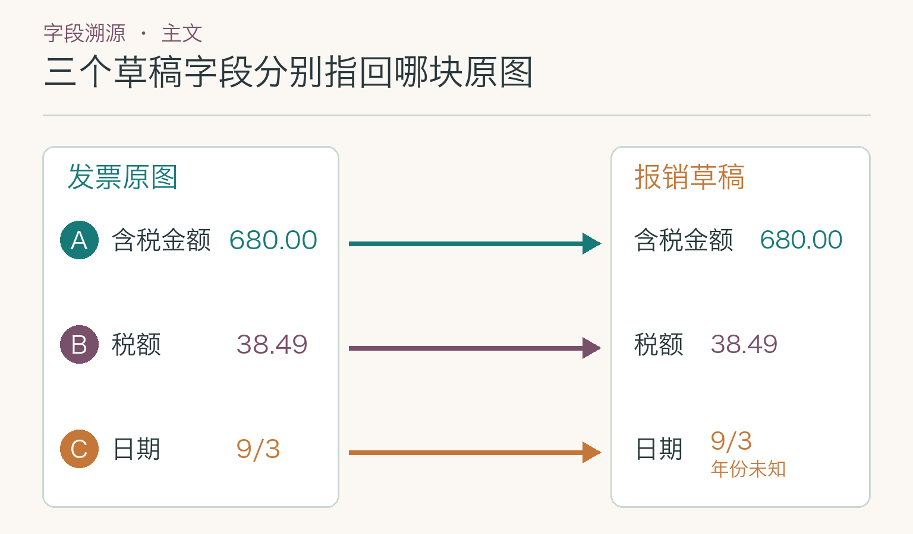
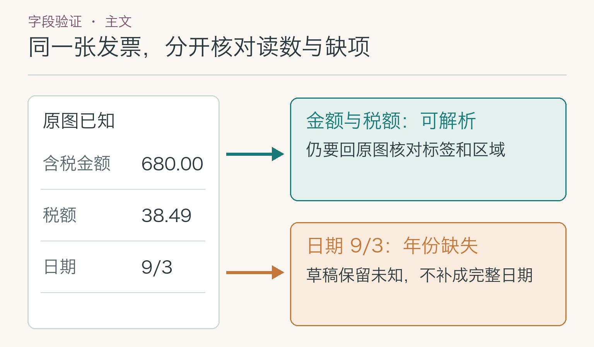

# 大话多模态模型：一张发票为什么会读错

员工上传一张酒店发票的照片：右上角有反光，含税金额栏能看见 `680.00`，税额栏是 `38.49`，日期写成 `9/3`，却没有标年份。目前也没有第二张更清晰的照片。员工要的是一份**可核对的字段草稿**，不是系统替他猜出完整日期，更不是直接提交报销。这个任务看着像“认字”，真正难的是把字、位置和字段关系一起读对。

发票照片先被转换成视觉特征，再与“请提取含税金额”这句文字一起处理。输出 `680.00` 并不表示任务完成：系统还得说明它在图片哪里、旁边的标签是什么、日期缺了哪一部分。**读字符、认字段、补业务事实，是三个不同环节。**音频和视频也属于多模态输入，但机制和证据单位不同；这篇只沿着发票照片往下走。

## 照片缩小后，模型还能看清什么

*图中对照三类输入各自的编码路径；本例只使用图片和文字，并非所有模型都支持音频输入。*

很多视觉编码器不能把手机拍的整张高清照片按原尺寸直接读进去。输入会先缩放或分成局部图，再变成一组视觉特征。有些编码器把图像切成小块处理；这些特征保留可供模型利用的线索，却不是一份能够随时放大的原图。若整页缩得太小，“含税金额”里的字、小数点和日期笔画会先糊成一团。此时继续调整提问语气，找不回已经丢失的像素。

补救办法通常是**整页图与局部图配合**：整页保留金额栏与周围版面的相对位置，局部图保留小字；每块局部图还得记住自己从整页哪里裁下。UReader 的论文正是为高分辨率文字图像设计按长宽比例裁切和裁块位置编码。它的实验也提示：只增加局部图而不给全局视图，容易丢掉整页关系；去掉裁块位置信息，局部图之间也不容易对上。这里借用的是处理思路，不表示本例已经使用 UReader 模型。

发票右上角的反光属于另一类问题：若原照片那块完全过曝，放大不过是在放大白斑。可以先要求补拍；若只有轻微模糊，再试旋转校正、局部裁切和重新识别。**缩图造成的信息损失与原图本来就没有的信息，不能用同一种办法处理。**

## 视觉特征怎样参与文字回答

*依据 [LLaVA 原论文第 4.1 节](https://arxiv.org/html/2304.08485#S4.SS1)改绘：视觉编码器、投影层与语言模型构成一种图文连接方式；省略训练细节。*

图片特征不能直接塞进只认识文字表示的语言模型。以原始 LLaVA 为例，视觉编码器从图像得到一串特征，**投影层把每项特征变成与语言模型词向量同宽的表示**；“请提取含税金额”则先被拆成文字 `token`（模型处理文字的基本片段）。两路信息接到一起后，模型按先前内容逐步生成答案。投影层解决“接口尺寸和表示怎样接上”的问题，不负责保证每个发票字段都读对。

这套连接还要训练。原始 LLaVA 先用图文对训练投影层，让视觉特征与文字表达建立联系；再用图文指令数据调整投影层和语言模型，让模型学会按问题回答。若训练样本以普通照片为主，中文发票小字和税额栏覆盖不足，模型可能会说出一段像样的解释，却把 `38.49` 归给错误标签。**会回答图片问题，不等于已经学会这一类单据的字段判定。**

LLaVA 也不是唯一结构。Flamingo 先把数量不定的视觉特征压成固定数量的表示，再让语言模型通过交叉注意力读取它们；Donut 则面向文档理解，从图片特征直接生成结构化文本，不先调用独立的 OCR 引擎。三条路线都得面对同一张发票上的小字、布局和缺项，但不能画成一个“所有模型都是这样”的统一内部电路。

## 数字认对了，为什么还会放错字段

`OCR`（光学字符识别）擅长给出字符及其所在的文字框。它可能把 `680.00`、`38.49` 都抄对，但只靠这两个字符串仍不知道谁属于“含税金额”、谁属于“税额”。视觉语言模型（`VLM`）可以结合文字、版面和问题来判断关系；它也可能在标签模糊时凭常见票据样式猜一个答案。两种结果要分开看：**字符正确率检验“读到什么”，字段归属检验“放到哪里”。**

这张票据至少有两条可试的路线。固定版式多、字符精度要求高时，可以让 OCR 提供文字和位置，再用版面规则或模型判断标签与数值的关系；版式变化多、问题开放时，可以直接使用视觉语言模型给候选字段。Donut 一类模型把文字读取与字段生成放在同一模型内，省去独立 OCR 环节，却也让单独追查“哪一步读错”变得更费工夫。选择路线时，应在本项目发票样本上比较字符、字段和定位三项，而非按模型名字排座次。

若输出只剩 `{"amount":680.00}`，审核人看不到它旁边究竟写着“含税金额”还是“税额”。候选字段最好同时携带原文、标签、原图区域和图像版本；结构化结果方便写草稿，**可核对的来源才方便纠错**。

## 整页和局部图，怎样保持同一位置

*整页上要同时找数字、相邻标签与栏目边界；局部放大不能割断它们的关系。*

图片上的字并不是按一行接一行排成纯文本。金额要和同一栏的标签、单位及表头配对；表格里的数还要找回行列标题。把整页 OCR 文字简单拼成长字符串，空间邻近关系容易消失；只给模型 `680.00` 的裁剪图，标签又可能被切掉。这个环节要同时保留两种东西：**足够清楚的局部细节，和它在整页中的位置。**

若系统裁出金额栏，必须记录裁剪框在原图中的坐标。局部图里高亮的数字，需要通过裁剪框的起点和缩放比例换算回原图；否则审核界面可能把 `680.00` 标到 `38.49` 上。这个坐标回映过程是可检查的计算，不该让语言模型凭一句“在右下角”代替。

多张照片又多一层身份问题。如果员工后来补拍一张特写，应把它标作这张发票的补拍，记录拍摄时间、文件版本和对应的原图区域。两张图读数冲突时，并排展示证据；没有证据证明它们是同一张票据时，不能把另一位员工的照片顺手拼进来。音频则要按时间戳和说话人回听，不能照搬图片坐标的做法。

## 读出的值，怎样回到原图核对

*`680.00`、`38.49` 与 `9/3` 各有自己的原文区域和字段关系；图中 A/B/C 是示意标记，不是实测坐标。*

把答案与图片区域对应起来，常叫证据定位（`grounding`）。普通视觉问答模型能回答“含税金额是 680 元”，不代表它天然能给出精确可靠的边界框。可以让 OCR 文字框、版面检测或专门定位模型提出区域，再检查该区域里有没有对应数字和标签。若区域只框住 `680.00` 却没框住“含税金额”，就应扩到同栏或回看整页，免得把相邻数字认错亲戚。

审核人看到的高亮位置还须绑定**同一张原图版本**。若上传后更换了照片，旧图上的位置和字段不能继续挂在新图名下。保留文件标识、图像尺寸、裁剪方式和识别结果，就能从草稿追到原文；发现错位时也能判断是识别错、标签配错，还是坐标换算错。

两次模型输出一致也不是免检通行证：它们可能都看了同一张模糊照片。更有效的复查是换证据角度，例如整页与局部图对照、字符框与字段关系分开核对。只有原图支持，字段才进入草稿；原图含糊，就把冲突留下来。

## `9/3` 没有年份，草稿怎样写

*图中按字段检查格式、原图区域和缺项，不以“整张识别成功”代替逐项核对。*

`680.00` 和 `38.49` 可以解析成金额，还要看各自是否对应“含税金额”“税额”标签。`9/3` 只能保留为原始日期文本；由于照片没有年份，草稿里应写 `date_raw: "9/3"`、`year: null`，并标“年份未知”。`null` 表示这一项没有可靠值，不代表 0 年。报销期限、重复报销等业务判断还要查制度和历史记录，不靠这张照片单独决定。

审核界面可以并列显示字段值、原文片段和高亮区域。“原文识别”与“规范化结果”分开存；将来若拿到可信的完整日期，再补年份，并记下新证据是哪一份。模型输出的“我有 95% 把握”（示意说法）未经校准，不能当成字段正确概率。关键字段看不清时，宁可留下待核对，也别用流畅的话术补完。

这一步只生成可核对的字段草稿。报销是否合规、能否提交，还要由制度核验和审批流程决定；照片上的文字不能自行变成操作指令。

## 怎样找出错误发生在哪一步

测试不要只放一张端正、清晰的发票。准备不同设备、反光程度、版式和裁切范围的样本；每张标注原始字符、字段归属、证据区域，以及本来就缺失的信息。再分别统计：字符没读出、数字读对却归错栏、区域标错、`9/3` 被无据补出年份。它们对应的修法分别可能是补拍或提高分辨率、改版面关系判断、修坐标回映、加强缺项约束。

同一批样本可比较整页缩图、整页加局部图、OCR 加规则、视觉语言模型直接抽取几条路线。对每条路线记录字段正确数、证据区域命中数、拒答是否恰当、耗时和费用；不同图像质量要分开算，不用一个总准确率掩盖反光票据的失败。若想按模型分数自动放行，还需检查高分样本在真实标注里是不是确实更少出错。

回到这张票据，如果 `680.00` 找不到“含税金额”的原图位置，系统要停在待核对；`9/3` 的年份仍为空。这样的草稿不显得神通广大，但审核人知道每项从哪里来、哪项还缺着，才敢继续往下办。

## 下期预告

发票上能读到的字段整理成草稿后，员工又问：“北京酒店最多报多少？”制度文件的标题却叫《差旅住宿费限额》，字面上没有“酒店最多报多少”这句话。下一篇看看：模型怎样把两种说法联系起来，找出该读的制度段落，又为什么不能只凭“意思差不多”就宣布找对了。

## 参考资料

- [Flamingo：a Visual Language Model for Few-Shot Learning](https://arxiv.org/abs/2204.14198)
- [LLaVA：Visual Instruction Tuning](https://arxiv.org/abs/2304.08485)
- [GPT-4V System Card](https://cdn.openai.com/papers/GPTV_System_Card.pdf)
- [Donut：OCR-free Document Understanding Transformer](https://arxiv.org/abs/2111.15664)
- [UReader：Universal OCR-free Visually-situated Language Understanding](https://arxiv.org/abs/2310.05126)
- [Grounding DINO：Marrying DINO with Grounded Pre-Training for Open-Set Object Detection](https://arxiv.org/abs/2303.05499)
- [On Calibration of Modern Neural Networks](https://arxiv.org/abs/1706.04599)

想看本文在 AI Agent 中的位置，可点击下方 [阅读原文](https://github.com/Jennifer123www/ai-agent-knowledge-map)，从“基础模型与推理”继续阅读。
