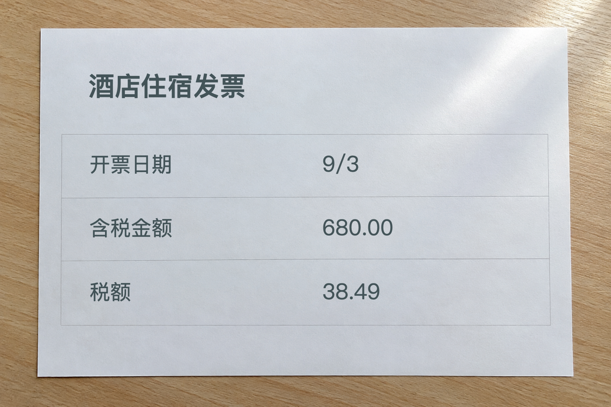
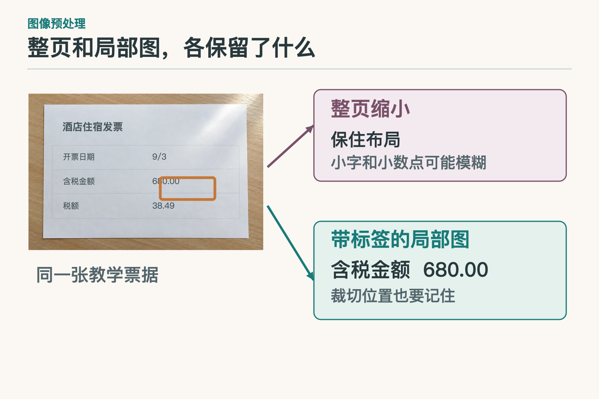
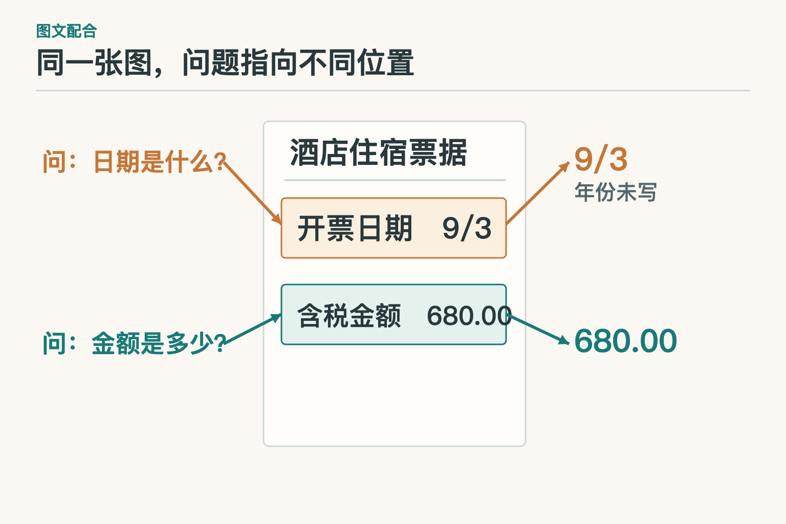
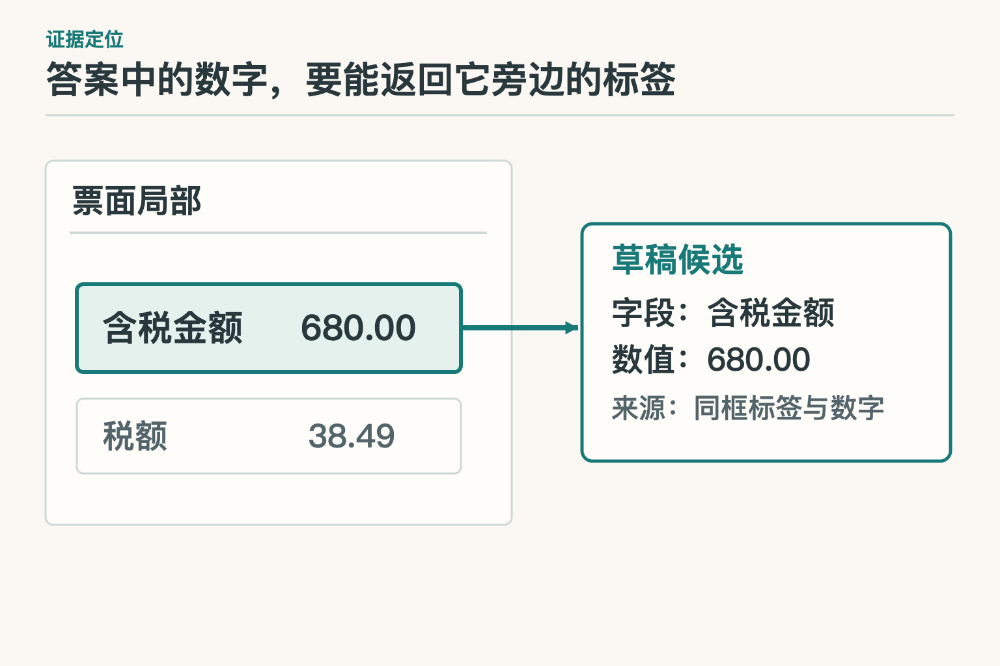

# 大话多模态模型—它怎样从图片里读出答案

先拿一张教学用的酒店发票照片做例子。右上角有反光，含税金额栏写着 `680.00`，税额栏写着 `38.49`；日期只有 `9/3`，票面上没有年份。员工想先整理一份字段草稿，交给审核人对照照片检查，暂时不提交报销。

*教学构造的场景复现图，不是真实发票或模型实测截图。为方便看清问题，只保留本文会用到的三个字段。*

如果把这三行内容直接打成文字发给语言模型，读者已经替它完成了最难的一步：认清字，并把字放回正确的行。照片不一样。模型得先从像素里找到字，还要弄清 `680.00` 是“含税金额”旁边的数，而不是从票面上随便挑出的一串数字。下面沿着这张照片走，但重点不是教人报销，而是看清**图像信息怎样进入并影响文字回答**。

## 一、模型接到照片时，看到的还不是“三个字段”

人看照片会同时看到字、行列和纸张的整体位置。视觉模型的入口却是像素。以原始 LLaVA 为例，视觉编码器从图像取得一组特征；可训练的投影层把这些特征转换成语言模型可以接收的表示。文字提问则被拆成 `token`——模型处理文字的片段。两路信息进入后续生成，模型才有机会回答“含税金额是多少”。

*依据 [LLaVA 原论文第 4.1 节和 Figure 1](https://arxiv.org/html/2304.08485#S4.SS1)改绘。图画的是原始 LLaVA 的一种接法，不代表所有多模态模型都采用同一结构。*

投影层像接头，不像扫描仪。它负责让图像特征进入语言模型，不会自动替票据标注“这块是税额”。原始 LLaVA 先用图文配对数据训练连接，再用图文指令数据训练模型怎样依据图片回答问题。训练让它学会利用视觉线索，却不保证它能读清每一张中文发票的小字。

再细看一点，视觉编码器交出的不是一条“发票内容摘要”，而是一串保留不同图像位置线索的特征。原始 LLaVA 用线性投影把它们变为与文字表示同宽的一串视觉表示，随后由语言模型结合提问生成答案。这里有两个容易混淆的步骤：**接通图像与文字表示**，以及**从图中找对具体栏目**。前一步成功，后一步仍可能失败。反过来说，若照片在进模型前就被压得看不见小数点，再精巧的连接层也无法恢复原本没有进入的细节。

“多模态”也不等于“给文字模型额外贴一张图”。照片和提问各有自己的编码方式，连接后还要在回答里用对彼此的信息。换成语音，前端要处理声音的时间序列；换成视频，还得面对多帧的先后关系。本文只拿照片讲透一种情况：**图片里有信息，和回答确实用到了那份信息，是两回事。**

## 二、原图有字，送进模型时却可能变糊

看开头的照片，先别急着讨论模型够不够聪明。若反光把某处笔画照得一片白，原照片里就没有可读的细节，放大只会得到更大的一片白。若原图上字是清楚的，只是在压缩整页后变小、变糊，保留局部图才可能救回小数点和细标签。这两种“没看清”，处理办法不同。

整页图告诉模型“这个数字大约在发票哪里”；局部图让它看清“数字旁边写的是什么”。如果只截 `680.00` 四周的一小块，读数也许更稳，“含税金额”却被裁掉了。这样一来，模型答出正确数字，也可能把它填进税额栏。裁图时因此要带上相邻标签，并记住局部图在原图的位置。

这不是凭空想象的补丁。UReader 研究过高分辨率文档进入低分辨率视觉编码器的问题：它按图像形状裁出局部区域，还保留整页缩图和裁块位置。论文的实验显示，局部细节、整页视角与位置信息各有用处。借到这张票上，就是别为了看清“680.00”，把它身边的栏目名弄丢了。至于用几块局部图、会增加多少计算，要按具体模型和票据样本测试。

裁图也有顺序上的讲究。可以先在整页上找到可能的金额区域，再裁出同时包含标签和数字的范围；若自动裁图把金额栏切成两半，后面的模型看见的仍是残图。拿一张清晰的原图和一张反光严重的原图各做一次这个过程，更容易判断问题出在拍摄、裁切，还是模型读图。只在同一张模糊照片上反复换提示词，很难分清是哪一步先把信息丢了。

## 三、同一张图，换一个问题，答案应来自另一块区域

照片不变，问“开票日期是什么”与问“含税金额是多少”，需要读的地方却不一样。前一个问题指向上方的 `9/3`，后一个指向金额栏的 `680.00`。视觉特征和文字提问能在模型中共同影响回答；但模型说出了数字，不等于它真的找对了那一行。

*图中箭头表示任务应采用的证据路径，不是对某个模型注意力权重的实测图。*

可以用一个很朴素的办法检查：把含税金额和税额放在相邻两行，再问两次。若模型每次都回 `680.00`，即使两个答案都很流畅，也有一问答错了。还有一种更隐蔽的错：它读到 `9/3`，接着根据当前日历或常见写法补出一个年份。**文字问题能引导找图，不会把照片里没有的字变出来。**

## 四、认出字符和填对栏目，是两道不同的题

光学字符识别（`OCR`）通常能给出识别文字及其位置。它可能找到 `680.00` 和 `38.49`，但如果把文字框按阅读顺序排成一长串，原来的行列关系会变弱。视觉语言模型（`VLM`）可以结合照片和问题直接提出字段答案；它也可能受常见票据样式影响，把模糊标签猜错。两者都不是“开箱即正确”的代名词。

若企业票据版式比较固定，可以先试 OCR 加版面规则：找同一行、同一栏的标签和数值；遇到版式差异大或规则写不完的情况，再比较视觉语言模型或文档专用模型。Donut 等文档模型甚至不先运行独立 OCR，而是从文档图像直接生成文本结果。少一道外部识别步骤，并不意味着错误更容易追查；要看它能否交出任务需要的原图依据。

这里最值得保留的不是一串模型名，而是问题的拆法：**字读错了吗？字读对了，却和错误的标签配到一起了吗？**前者查原图清晰度与识别结果，后者查版面和字段归属。只说“识别不准”，往往会把该补拍和该改字段匹配的两类问题混在一起。

还可以把两个错误故意分开做测试。第一组保持栏目位置不变，只降低图像清晰度，看 `680.00` 是否被读错；第二组保持字符清楚，把金额和税额的标签位置调换，看模型是否仍按旧版式填栏。前一组考读字，后一组考位置关系。若两组都只报一个“字段准确率”，即使分数变了，也不知道是视觉部分进步，还是版面判断碰巧更合适。

## 五、给审核人的，不该只有一个漂亮的数字

字段草稿若只剩 `{"amount":680.00}`，审核人不知道它从票面哪里来。更有用的草稿会保留候选值、相邻标签、照片版本和对应区域。点击“含税金额 680.00”，应能回到照片上同时看见这四个字和数字；只高亮 `680.00`，仍排除不了填反栏。

把答案指回视觉证据，常称为证据定位（`grounding`）。但不要因为模型会说“在右边”，就把这句话当成可靠坐标。位置可以来自 OCR 文字框、版面检测或专门的定位能力；局部图若经过裁剪、缩放甚至旋转，框还得按变换参数映回原图。照片一旦换版，旧坐标也不能继续使用。

这一步讲的是**回答怎样接受检查**，不是要求所有多模态模型必须自己画框。有的系统先由 OCR 提供框，再让模型判断字段；有的模型直接给出字段候选，定位另做。只要交付目标是“让人对着照片核对”，就需要在方案评测里单独检查位置能否找回，而不能只看最终数字对不对。

## 六、照片没写的年份，不是“识别置信度低”

票面日期只有 `9/3`。草稿可以保留原文 `date_raw: "9/3"`，把 `year` 留空。这里的留空不是模型能力不足，而是照片根本没有提供年份。哪怕模型说自己“九成把握”，它也不能凭把握把日期改成完整年月日。

另一种情况要区别开：票上本来印了年份，只是反光盖住了。那就请员工补拍、查看另一张清晰照片，或者让审核人处理。若后来从可信的订单材料得到年份，可以补进草稿，但来源应写订单，不能说“从这张发票读出”。同一个空字段，背后的原因可能是“原图缺项”，也可能是“可见但没读清”；补救动作因此不同。

## 七、怎样判断模型或裁图办法真的变好了

不要只拿一张整洁发票试成功。准备一组有标注的票据，至少分出清晰与反光、常见与陌生版式、整页与局部图。每张票分别标原文、字段归属、原图区域和原本就缺失的项目。然后再比较：字符是否读对、数字是否填对栏、区域是否找对、缺失年份是否被擅自补出。

找原因时，一次只改一类输入。例如同一张票先只换更清晰的金额局部图：数字恢复了，问题更可能在图像处理；再固定识别出的文字，只补标签和位置信息：字段归对了，问题更可能在版面关系。单张票只能提供线索，结论还得用更多标注样本复查。模型有时能写出一整段漂亮解释，但对这项任务，审核人更需要知道是哪一个字、哪一个框、哪一对字段出了问题。

如果准备用不同方案比一比，别让其中一个方案拿到高清局部图，另一个只拿缩小的整页，然后把结果归功于模型名字。先固定照片与输入处理，再换模型；要比较整页和裁图，就固定模型与提示。每组都报样本数，尤其把反光、陌生版式和原图缺项单列。这样得出的结论才可能指导下一步：补拍、改裁图、改字段规则，还是换一种模型。

这张照片里，`680.00` 是可见的，年份却不可见。多模态模型的本事，是把视觉线索和文字问题放到同一次回答里；要让答案可用，还得保住细节、找对位置，并承认图上没写的内容。下一篇，员工会拿着整理好的字段去问住宿限额：那时问题不再是“看清照片”，而是“在制度里找对那一段”。

## 参考资料

- [Visual Instruction Tuning（LLaVA）](https://arxiv.org/abs/2304.08485)
- [UReader：Universal OCR-free Visually-situated Language Understanding](https://arxiv.org/abs/2310.05126)
- [Flamingo：a Visual Language Model for Few-Shot Learning](https://arxiv.org/abs/2204.14198)
- [Donut：OCR-free Document Understanding Transformer](https://arxiv.org/abs/2111.15664)

想看本文在 AI Agent 中的位置，可点击下方 [阅读原文](https://github.com/Jennifer123www/ai-agent-knowledge-map)，从“基础模型与推理”继续阅读。
