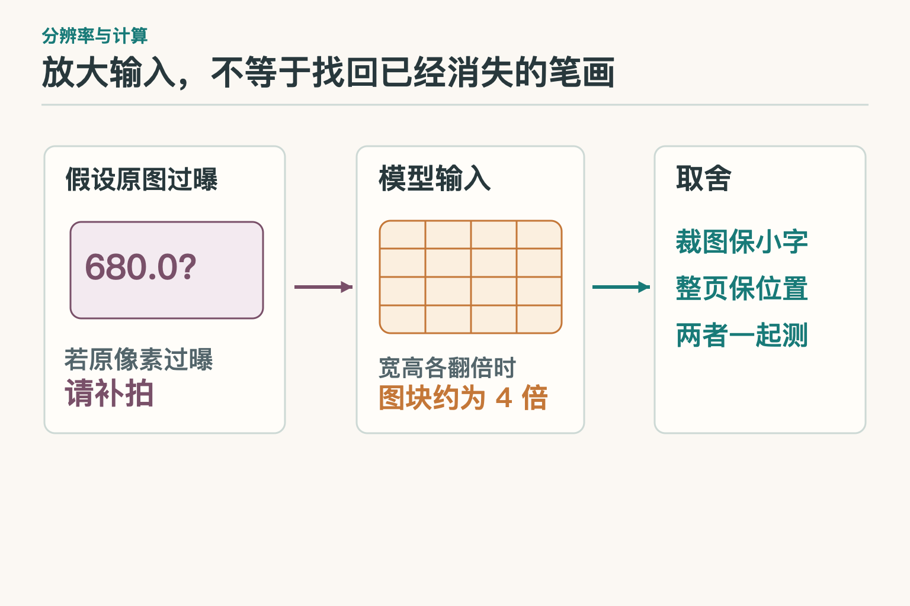
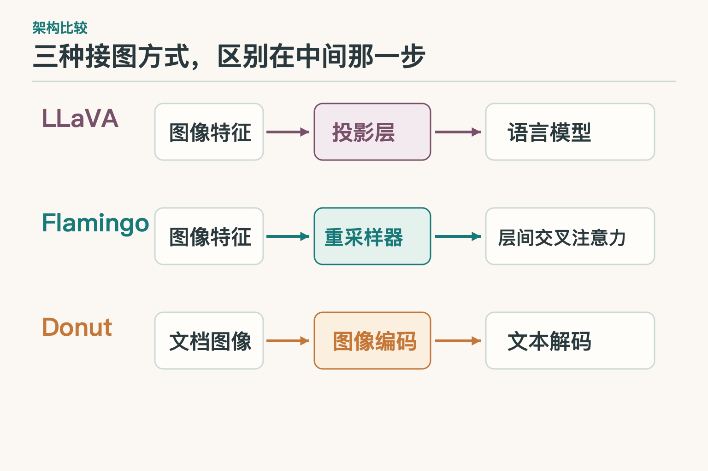
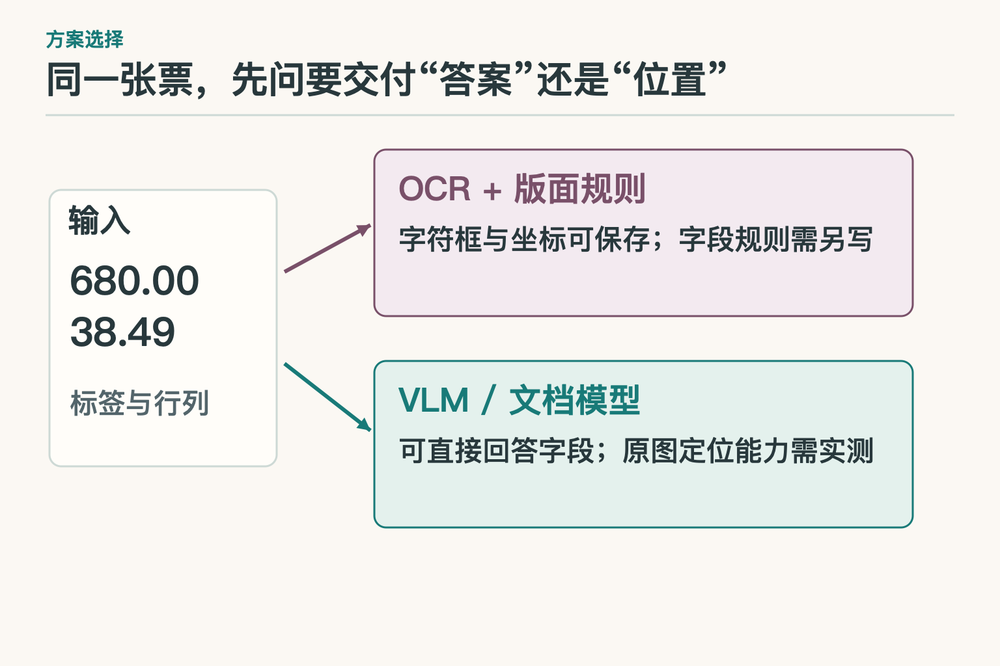
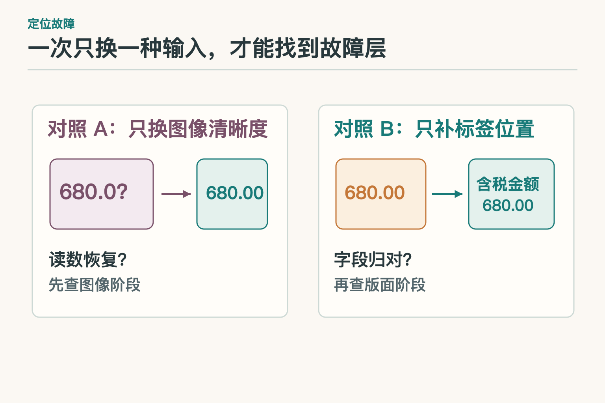
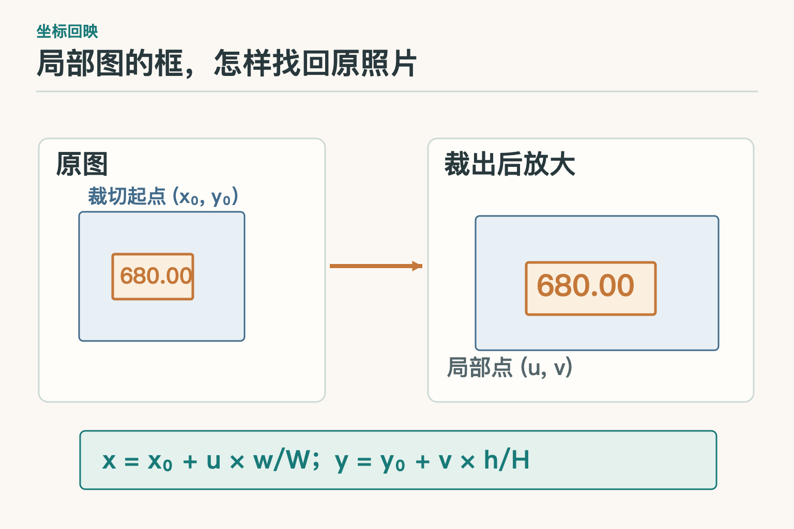
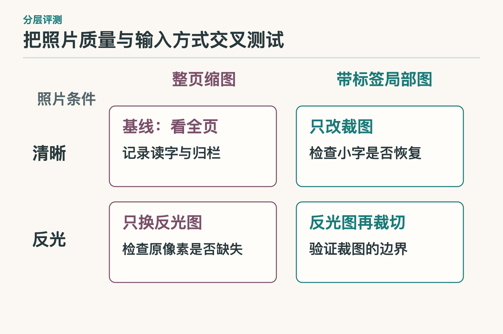

# 面试题：多模态模型怎样读图与定位证据

先约定同一道小案例：教学构造的酒店票据照片右上角有反光，含税金额为 `680.00`，税额为 `38.49`，开票日期只写了 `9/3`。目标不是自动报销，而是生成让审核人能对着照片检查的字段草稿。面试时不必背“多模态很强”之类的话；要能指出图片在哪一步变成模型可用的信息，错误又在哪一步产生。

## 问题 1：分辨率调高，为什么仍可能读不出小字？

### 原理

先查原照片，再查模型输入。原照片过曝到笔画消失，增加输入尺寸也无法补出像素；原照片有字，只是在整页缩小时糊掉，局部裁图才可能改善。对于固定大小图块的编码方式，图像宽高各扩大两倍、图块尺寸不变时，图块数量约变成四倍。这个数量关系说明计算负担可能上升，不等于服务报价一定翻四倍；许多模型还会压缩或重采样视觉表示。

UReader 的办法值得借鉴：保留整页缩图，又按形状裁出局部图，并给裁块加上位置线索。它要同时解决“看清小字”和“知道小字来自哪里”。如果只留下数字特写，模型读准了 `680.00`，却可能不知道旁边原本写着“含税金额”。

*图块数是固定切块尺寸下的近似关系；实际视觉 token 数、耗时和费用须按所用模型测量。*

### 答题点

1. 先区分拍摄时丢失与预处理时丢失；
2. 说明分辨率、图块数量、整页布局和局部细节的取舍；
3. 把裁图位置与标签一同保存，用清晰/反光样本实测。

### 记忆点

> 原图没拍到，放大没用；原图拍到了，再谈裁图。

**常见追问：** 原图清楚，裁图后反而填错栏？检查标签是否被裁掉，以及裁块位置有没有带入后续判断。

**失分点：** 把所有“看不清”都交给更大的模型，或把图块数量直接当作实际账单。

## 问题 2：LLaVA、Flamingo、Donut 的“接图”差在哪里？

### 原理

原始 LLaVA 先由视觉编码器取得图像特征，再经线性投影，把它们变为与语言模型文字表示相同维度的一串视觉表示。它在图文配对阶段固定视觉编码器和语言模型、训练投影层；随后固定视觉编码器，训练投影层与语言模型来回答图文指令。Flamingo 的路不同：用 Perceiver Resampler 整理视觉特征，并在语言模型层间加入交叉注意力，适合处理图文交错的输入。Donut 面向文档图像，由图像编码器接文本解码器，不先运行独立 OCR。

三者都能把图像信息带到文字输出，但“能回答字段”不等于“自然提供可审计的文字框”。这张票要求审核人定位 `680.00`，就得专门评测坐标、证据和字段归属；不能只凭架构图选冠军。

*依据三篇原始论文的架构说明简化改绘；省略了训练分支，不把某一种接图方式画成通用标准。*

### 答题点

1. 说清三条路径：投影接入、重采样加交叉注意力、文档编码—文本解码；
2. 区分架构能处理的输入与最终能否定位原图；
3. 用目标票据的文字、版面、坐标任务评测，而不是只报通用榜单。

### 记忆点

> LLaVA 投影，Flamingo 层间读图，Donut 解码文档。

**常见追问：** LLaVA 投影层是不是 OCR？不是。它变换图像特征的表示，不能单凭这一层得到准确文字框。

**失分点：** 把三种模型画成“图像编码器—语言模型”同一条流水线，抹掉真正的结构差别。

## 问题 3：选 OCR 加规则，还是直接用视觉语言模型？

### 原理

先写验收条件：两组数字各归各栏，`9/3` 不被补成年份，审核人还能找回票面区域。版式稳定、需要追查每个字符时，OCR 的文字框加同一行或同一栏的规则是一个明确起点；版式变化很大，可比较视觉语言模型（`VLM`）或 Donut 一类文档模型直接提取。OCR 可能读错小数点，VLM 可能猜错栏目，二者并没有天然的胜负关系。

测试要使用同一批清晰、反光和新版式票据，保持裁图方式一致，分别统计字符、字段和区域。若视觉模型给出正确数字却没有可靠位置，而任务要求点击字段返回原图，这仍是交付缺口；也可以让 OCR 负责文字框，模型处理难以写规则的字段关系。

### 答题点

1. 先定交付物：只有字段，还是字段加原图位置；
2. 用同样本比较 OCR+规则、VLM 和文档模型，记录中间结果；
3. 单列反光票与陌生版式的正确数、耗时和人工复核量。

### 记忆点

> 先定要交什么，再测谁交得出。

**常见追问：** OCR 和 VLM 能组合吗？可以：OCR 给字符和位置，VLM 帮忙判断关系，但组合后仍须验证定位与归栏。

**失分点：** 因为 VLM 更新，就默认它比文字框方案更准、更容易审计。

## 问题 4：怎么证明问题出在读字，而不是填栏？

### 原理

保存原图、模型实际收到的图、识别文字及框、字段候选，才有条件定位故障。若 `680.00` 被读成 `680.0?`，先看原照片是否有最后一位，再看缩图或裁图有没有丢笔画。若文字正确，却写进“税额”，就要查标签和行列关系，而不是继续提高照片分辨率。

做两组只改一个条件的对照。第一组固定字段匹配方式，只换更清晰的局部图；读数恢复，线索指向图像阶段。第二组固定已经读出的字符，只补相邻标签和位置；字段归对，线索指向版面阶段。一次只换一项，结论才不会被“模型也换了、裁图也换了”搅在一起。单张照片只能提示方向，还需在标注样本上重复。

### 答题点

1. 留下图像版本、文字框和字段结果；
2. 分别改变清晰度与版面信息，观察错误是否消失；
3. 在多张票上复验，并把错字与错栏分别计数。

### 记忆点

> 字没认出查图；字对栏错查位置。

**常见追问：** 数字与标签都对，日期却多出年份？这是缺项处理或生成阶段的问题，不是金额识别问题。

**失分点：** 只看最终 JSON，把三种错误统称“多模态识别差”。

## 问题 5：局部图的文字框怎样回到原照片？

### 原理

设原图从 `(x₀, y₀)` 起裁出宽 `w`、高 `h` 的区域，再缩放为 `W × H` 的模型输入图。局部图上的点 `(u, v)`，回到原图约为 `x = x₀ + u × w/W`、`y = y₀ + v × h/H`。文字框的两个角都要换算。这只覆盖“裁切后缩放”；若之前还旋转、透视矫正或补边，就要保存变换顺序并逆向映回。

算出位置后还不能收工。框落在 `680.00` 上，只证明找到了数字；还得检查“含税金额”标签是否在同一证据区域。上传者换了照片，旧图尺寸与坐标也不能继续复用。

*公式中的 `w、h` 是裁切区域在原图中的尺寸，`W、H` 是缩放后局部图的尺寸；图未画旋转与透视变换。*

### 答题点

1. 说清原图、裁图、模型输入图各自的坐标系；
2. 保存裁切起点、尺寸、缩放与旋转等变换；
3. 分开测框的位置误差和字段归属正确率。

### 记忆点

> 先把框找回去，再看框住的是哪一栏。

**常见追问：** 先旋转再裁切，能继续直接用上式吗？不能；按保存的变换逆序计算。

**失分点：** 把局部图坐标直接画到原图，或只保存“右下角”这样的文字描述。

## 问题 6：补拍特写到了，能直接覆盖原图结果吗？

### 原理

先确认是否同一张票。两张照片都读到 `680.00` 不足以证明同票；上传记录、可见的票号或商户、以及特写能否对应原图某一区域，才是更有用的线索。文件哈希能说明一份文件是否被替换，不能证明两份不同照片拍摄的是同一票据。若补拍照只露出金额，没有任何可核对的身份线索，应让人确认关联，或补拍整页。

就算确定同票，新照片与旧照片的读数若冲突，也不能按“后上传优先”静默覆盖。草稿要保留两张照片的版本、候选读数与区域，再由审核人确认。这个问题考的是多图信息如何保持对应，不是问模型一次最多能接收几张图。

### 答题点

1. 每张图记录文件标识、上传时间与声称的原图/特写关系；
2. 用票面稳定信息和区域对应关系确认同票；
3. 冲突时并列候选与来源，不自动覆盖。

### 记忆点

> 能放进同一次提问，不代表它们就是同一张票。

**常见追问：** 两张图金额一致，可以先合并吗？一致只是线索；还得核对票据身份和拍摄区域。

**失分点：** 用“后一张更清楚”代替同票性验证。

## 问题 7：模型说自己有九成把握，能补出 `9/3` 的年份吗？

### 原理

不能。口头信心、模型分数和在标注样本上的真实正确率不是一回事。若想让分数帮助决定哪些**可见字段**交给人工复核，需要在足量样本上做校准：把分数相近的票据放一组，看实际有多少读对，并分别检查金额、日期与反光照片。但校准只能帮助估计“有证据却可能读错”的风险，不能给原图本来没有的年份提供证据。

若另一份可信订单给出了完整日期，可以补年份，并把来源写成那份订单；若原图确有年份却被反光挡住，应补拍或人工查看。两种情况在草稿里都不应伪装成“模型从这张图读出了年份”。

### 答题点

1. 区分自述信心、预测分数与实际正确率；
2. 对可见字段按类别、图像质量做校准；
3. 原图缺项用空值和缺项状态，新增证据另记来源。

### 记忆点

> 看不准可以测分数；没写出来，分数也补不出字。

**常见追问：** 两个模型都猜同一年呢？若它们都只看同一张缺少年份的图，一致也没有增加证据。

**失分点：** 把“95% 把握”当成可填写缺失字段的凭据。

## 问题 8：照片质量与裁图方法，怎样拆开测效果？

### 原理

主文已经把错误拆为读字、归栏、定位和缺项。面试里还要说明怎样判断“裁图有效”是否只是在清晰照片上凑巧有效。固定模型、提示和票据集合，为同一票据准备清晰与反光的配对照片，再分别使用整页和带标签局部图，交叉成四组。每张照片在两种输入方式下都跑一遍，逐票比较，不让两组拿到不同难度的发票。

分别计算清晰组和反光组的裁图收益：`局部图正确率 − 整页正确率`。若反光组收益很小，清晰组收益大，可能是反光已抹掉原像素，裁图无力恢复；若反光组收益更大，则继续看恢复的是字符还是字段归属。只给一个总体提升值，会把两种原因搅在一起。这里的减法是实验口径，真正下结论仍要报告每组样本数和逐票的好转、变差数量。

*图示测试条件而非实测成绩；上线前需填入样本数、正确数、耗时和人工复核量。*

### 答题点

1. 设计同票配对的 2×2 测试，只改变照片质量或输入方式中的一项；
2. 在每个格子分别记录字符、字段与区域正确数及分母，缺项补猜单独计数；
3. 比较清晰组与反光组的裁图收益差，并看逐票好转和退化，别只报总平均；
4. 若局部图让字更清楚却丢了标签，应把“读字改善”和“归栏退化”同时报告，不能合成一句“效果更好”。

### 记忆点

> 同票配对、两因素交叉，才分得开照片和裁图的功劳。

**常见追问：** “反光图裁切后仍读不出金额，能说模型不行吗？”不能。先检查原像素是否保留笔画，再比较清晰局部图；输入里已经没有的细节不能靠模型大小证明出来。

**失分点：** 拿不同票据分别跑整页和局部图，然后把样本难度差误算成裁图效果。

## 面试前收个口

答这组题时，先从照片出发：像素是否仍有笔画，整页与局部图各保留什么，视觉信息怎样接上文字提问。再把输出拆成读数、归栏、定位和缺项四件事。面试官若追问“你怎么知道修好了”，就说清哪一组输入只改了什么条件、错误在哪层消失。公式和模型名是工具；能据此定位一张票究竟错在哪里，才是答案。

## 参考资料

- [Visual Instruction Tuning（LLaVA）](https://arxiv.org/abs/2304.08485)
- [Flamingo：a Visual Language Model for Few-Shot Learning](https://arxiv.org/abs/2204.14198)
- [Donut：OCR-free Document Understanding Transformer](https://arxiv.org/abs/2111.15664)
- [UReader：Universal OCR-free Visually-situated Language Understanding](https://arxiv.org/abs/2310.05126)
- [On Calibration of Modern Neural Networks](https://arxiv.org/abs/1706.04599)

想看本文在 AI Agent 中的位置，可点击下方 [阅读原文](https://github.com/Jennifer123www/ai-agent-knowledge-map)，从“基础模型与推理”继续阅读。
