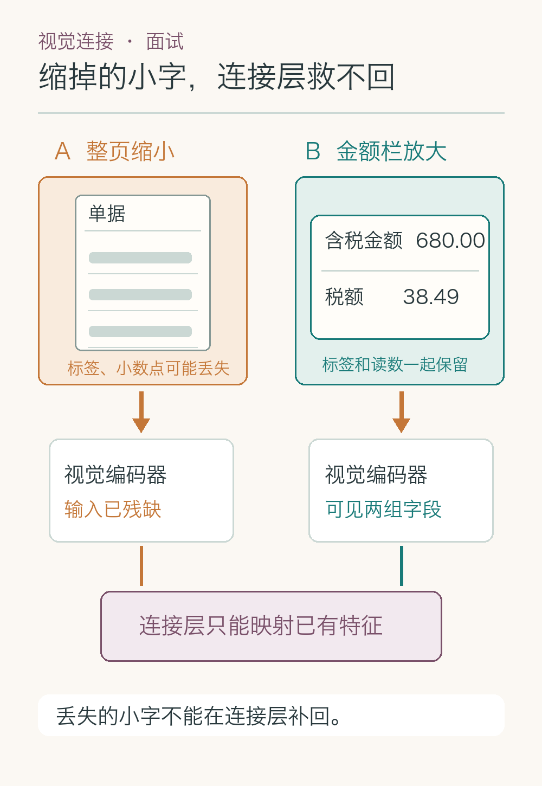
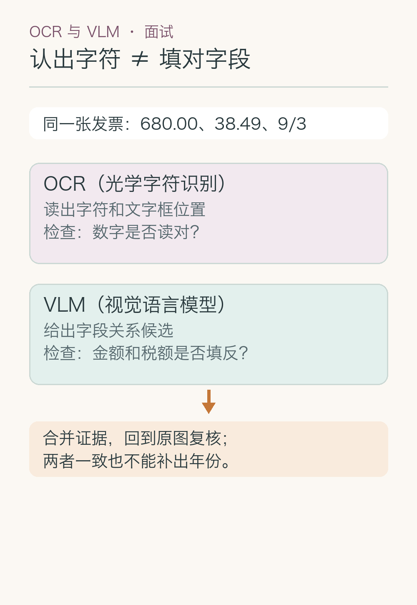
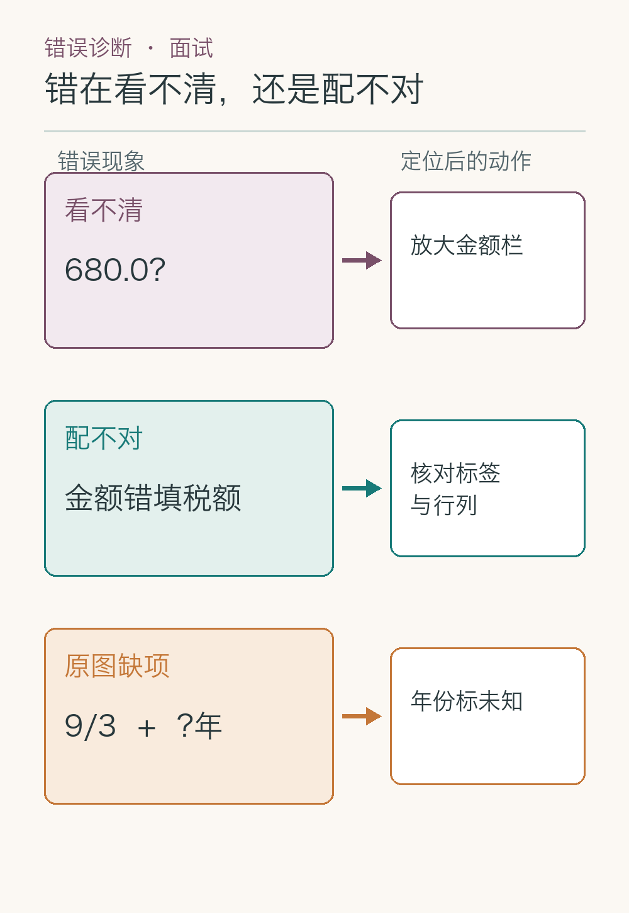
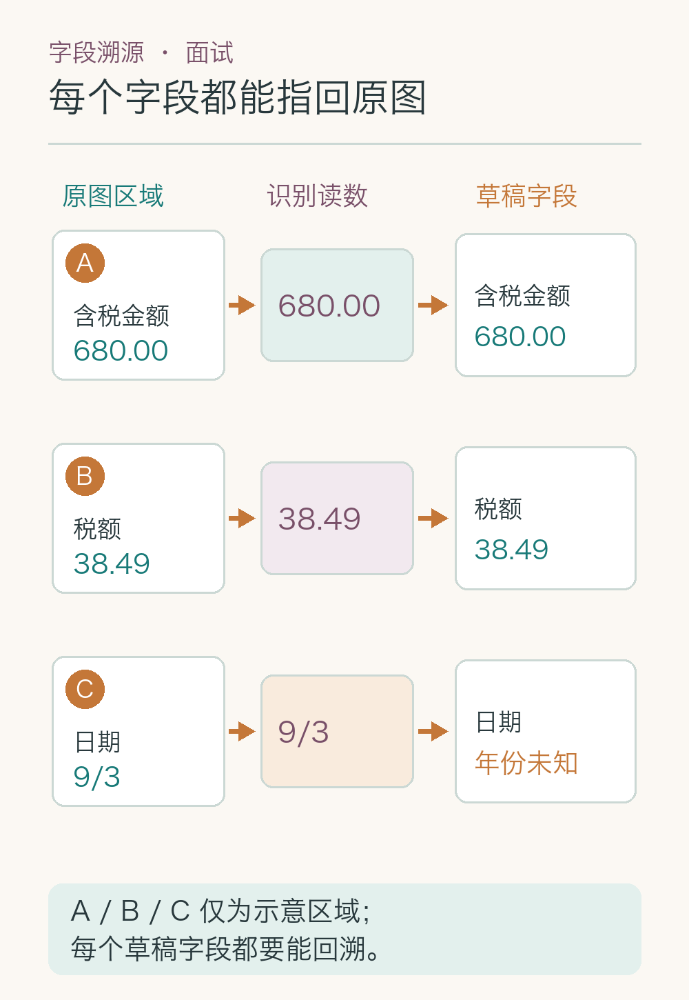
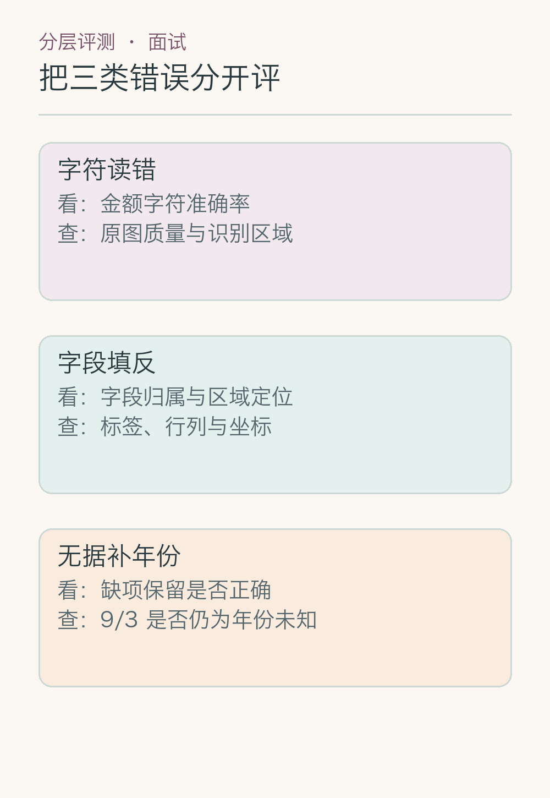

# 面试题：发票读对字为何还会填错字段

题目围绕一张酒店发票：照片右上角反光，`680.00` 是含税金额，`38.49` 是税额，日期只写 `9/3`，年份未知。目标是生成**带来源位置、保留缺项的字段草稿**，不替员工提交。面试官若继续追问，就得说清架构怎么接图像、错误在哪一层发生、验证实验怎么设计，不能只回答“让模型再看一遍”。

## 问题 1：裁块越多，发票小字就越清楚吗？

### 原理

若某视觉编码器把 `H × W` 的图像按 `p × p` 的非重叠小块处理，小块数大约是 `(H/p) × (W/p)`；忽略边界等额外处理后，图像长宽都变为两倍，小块数约增为四倍。这是理解**细节与计算量的取舍**用的简化关系，不是所有模型的实际计费公式。整页压小会抹掉发票小字；把整页切成更多局部图，又会增加输入量，并让“数字属于哪一栏”的整页线索分散。

UReader 的做法提供一个可讨论的解法：保留缩小的整页视图，再按原图长宽比例裁出局部图，并为裁块加入位置信息。面试时要把三个问题分开：小字是否在像素层还看得见、模型是否接收到足够的局部特征、裁块能否找回原图位置。原图右上角过曝则属于输入缺失，增加裁块无法恢复被白光盖住的字。

*整页缩小与局部放大是本例示意，不是论文实测图。视觉特征接入语言模型可对照 [LLaVA 第 4.1 节](https://arxiv.org/html/2304.08485#S4.SS1)；整页加裁块、记录裁块位置可对照 [UReader 第 3.1—3.2 节](https://arxiv.org/html/2310.05126)。局部放大也不保证一定识别正确。*

### 答题点

1. 先判断原图是否有足够可见笔画；过曝与缩图是两种不同故障；
2. 对采用固定小块的编码器，说明分辨率提高与视觉 `token`（图像特征的处理单元）数增加的关系；
3. 保留整页视图、局部图和裁块位置，避免“看清数字却找不到标签”；
4. 在固定样本上比较整页、整页加裁块的字段正确率、区域命中率和耗时。

### 记忆点

> 先看原图有无字，再看裁块留没留字，最后看位置能否接回去。

**常见追问：** 小块数翻四倍，费用一定翻四倍吗？不一定。预处理、特征压缩、模型架构和服务计费方式都可能改变实际关系；必须测具体系统。

**失分点：** 把“多切几块”当成万能药，既不记录裁块位置，也不检查原图是否过曝。

## 问题 2：LLaVA、Flamingo 与 Donut 怎样接图像？

### 原理

三者的**接口位置与输出目标不同**。原始 LLaVA 用视觉编码器得到特征，再用可训练的线性投影把它们变成与语言模型词向量同宽的表示，和文字指令一起参与生成。Flamingo 用重采样器把数量不定的视觉特征收成固定数量，再在语言模型层间加入交叉注意力读取图像。Donut 针对文档图像，以视觉编码器和文本解码器直接生成字段文本，不依赖独立 OCR 引擎先吐文字框。不要把这三种结构拼成一张“标准多模态模型”。

对这张发票，LLaVA 式通用图文问答便于询问“含税金额是什么”；Donut 式文档模型可直接按字段输出；Flamingo 的设计重点还包括交错图文和少样本输入。结构上的便利不等于在本项目发票上更准，尤其不能由“接了图像”推出“精确定位金额框”。

### 答题点

1. 说清输入表示：原图经视觉编码，而非“所有图片先转纯文本”；
2. 说清连接：投影、重采样加交叉注意力、文档编码器—解码器各解决什么；
3. 说清输出：通用问答与按字段生成，是否天然附带可审计坐标；
4. 回到票据样本，比较小字、中文标签、证据定位与成本，不按论文名次选型。

### 记忆点

> 先问图怎样接进来，再问答案怎样生成；接口不同，证据要求不变。

**常见追问：** 原始 LLaVA 的两阶段训练各更新什么？第一阶段冻结视觉编码器和语言模型，训练投影层；第二阶段继续冻结视觉编码器，训练投影层与语言模型。这是原始论文方案，不可套到所有版本。

**失分点：** 把 Flamingo 的交叉注意力画成原始 LLaVA 的投影层，或声称 Donut 会自动返回准确文字框。

## 问题 3：OCR、文档模型和通用 VLM 怎样选？

### 原理

面试官问“用哪个模型”，先写出验收条件：`680.00` 与 `38.49` 要分别落在正确字段，`9/3` 不能被补年份，审核人要能点击回原图。固定版式、字符精度和坐标审计优先，可从 OCR 加版面规则起步；版式变化大、字段关系复杂时，可比较通用 VLM 或专用文档模型。Donut 属于不调用独立 OCR 的路线，但“免 OCR”不等于免标注、免复核，也不等于一定能输出可靠文字框。

选型最好做一个小规模对照试验：同一组发票分别跑三条路线，按清晰/反光、常见/少见版式分层；记录字符正确、字段正确、证据可定位、缺项保留、耗时与费用。若只看生成结果像不像报销单，OCR 读错和字段配错会被混成一个“识别率”。

*图示 OCR 加规则与视觉语言模型两条候选路线；Donut 一类文档模型是第三种待测方案，不在图中假装已有本项目成绩。*

### 答题点

1. 先定义字段正确、缺项处理和证据位置的验收口径；
2. OCR 加规则适合版式稳定和逐字核对，开放版式再比较文档模型或 VLM；
3. 组合方案可让 OCR 提供文字框，VLM 负责难以靠固定规则判定的关系；
4. 同一测试集分层比较质量、时延和成本，关键字段错误要能归因。

### 记忆点

> 先定验收，再比路线；认字、归栏、定位分别计分。

**常见追问：** 三条路线在清晰票据上都满分，还测什么？加上反光、小字、陌生版式和缺少年份的样本，才看得出取舍。

**失分点：** 用“VLM 比 OCR 先进”替代数据，或只测生成语句是否通顺。

## 问题 4：数字读对却填错栏，怎样查是哪步错？

### 原理

把同一张发票分层排查。先比对原图与文字框：`680.00` 有没有被识别成 `680.0`？若字符错，检查反光、分辨率与小数点。字符没错，再看框与标签的二维关系：`680.00` 是否被接到“税额”那一行？若字段错，检查阅读顺序、表格单元格归属和是否裁掉了标签。字段也没错，却输出完整年份，则是**缺项处理或生成约束错误**，不能再归咎于 OCR。

可以做两个小试验：只放大金额栏，看字符是否恢复；保留字符结果不变，只补充原图位置与邻近标签，看字段是否恢复。前者指向视觉分辨率问题，后者指向布局关系问题。试验结论仍须在多张标注票据上复核，不能靠一张成功案例宣布找到了根因。

*缩图、字段错配、日期缺项是三种不同错误，应分别处理。*

### 答题点

1. 错字看像素与文字框；错栏看标签、坐标与阅读顺序；
2. 通过“局部放大”和“补版面信息”两个试验区分故障层；
3. `9/3` 被补年份单独记为无依据生成，不混入字符错误；
4. 每层保留输入和中间结果，才能复现而非凭最终答案猜原因。

### 记忆点

> 先问字是否读对，再问栏是否归对，最后问有没有无据补齐。

**常见追问：** 金额和税额都读对，但字段名丢了怎么办？回看同一行的标签与表头；若裁图不包含标签，必须取回更大区域。

**失分点：** 把“识别不准”当作唯一原因，换更大模型前连字符错还是归栏错都没查。

## 问题 5：局部框怎样准确映回原图？

### 原理

假设从原图左上角 `(x₀, y₀)` 裁出宽 `w`、高 `h` 的区域，再缩成模型输入的宽 `W`、高 `H`。局部图上的点 `(u, v)` 对应原图约为 `x = x₀ + u × w/W`、`y = y₀ + v × h/H`。边界框的两个角也要同样换算。这个式子只适用于裁切后单纯缩放；若还做旋转、透视矫正或补边，必须保存完整变换，不能硬套比例。

回到发票，模型在放大图里框住 `680.00` 后，还要检查映回的原图区域是否落在“含税金额”一栏。**定位正确与字段正确是两项不同判定**：框可能准确落在 `680.00` 上，生成结果却仍写成税额。原图文件版本、尺寸和变换参数缺一项，事后都可能无法重放。

*A / B / C 为示意区域，非实测坐标；正文的换算关系说明局部框如何回到原图，图中不提供具体比例。*

### 答题点

1. 统一坐标系：原图、裁图、模型输入图各有尺寸和起点；
2. 保存裁切、缩放及旋转等变换，边界框两角按同一变换回映；
3. 用已标注区域检查回映误差，再独立检查字段归属；
4. 原图替换或重新裁切后，旧坐标与旧字段结果必须失效。

### 记忆点

> 框在局部图里画，证据要回原图上认。

**常见追问：** 若图片先旋转再裁切，公式怎么改？保存旋转和裁切的变换次序，按逆序映回；不要只记缩放比。

**失分点：** 直接把模型输入图的 `(u, v)` 当原图坐标，或用“模型说在右边”冒充可审计定位。

## 问题 6：补拍照片怎样证明属于同一张发票？

### 原理

多图输入最容易犯的错不是不会编号，而是把不同来源的信息拼成一份“更完整”的票据。补拍图可能只覆盖金额栏，原图却有日期和抬头；两张图即使都出现 `680.00`，也不能据此认定同一张发票。应保留上传事件、文件标识、整页与局部区域的关联；能读到的发票号码、商户等稳定字段可辅助匹配，但反光遮挡时仍可能无法确认。

跨图合并之前，先问“这是同一对象的新增证据，还是另一对象？”可以把原图、补拍图及各自字段候选放在同一审核视图，让人确认关联。若两图金额冲突，保留冲突记录；不能按“后拍的较新”或“哪张更清楚”自动覆盖。Flamingo 等能接受交错图文的架构，也不会替业务系统证明两张照片的真实来源相同。

### 答题点

1. 给每张图独立文件 ID、上传时间和原图/补拍关系；
2. 先用票号、商户、版面局部等线索核实是否同票；
3. 字段候选保留来源图和区域，冲突时并列而非覆盖；
4. 同票性无法确认则暂停合并，请上传者或审核人确认。

### 记忆点

> 两张图能一起看，不代表它们本来就是同一张票。

**常见追问：** 只拍到金额栏，票号不在画面里呢？保留“关联未确认”，不能用金额相同替代身份证明；必要时要求重拍整页。

**失分点：** 把多图输入仅当上下文长度问题，不核对图片身份和版本。

## 问题 7：模型说“九成把握”，能自动填年份吗？

### 原理

不能。照片上的 `9/3` 缺少年份，模型即使自报很高把握，也没有补全年份的证据。模型自报的自然语言信心、候选词概率以及在标注数据上测得的真实正确率，不是同一个量。要把分数用于自动放行，先用带标签的发票做**校准**：例如把相近分数的样本放一组，看该组实际有多少字段正确；再按金额、日期、反光等类别分别检查。小数点看不清时，拒答或请求补拍可以算正确行为。

“不填年份”还有一个确定性条件：原图没给出年份，也没有可信补充材料。这种缺项不该被较高分数覆盖。面试回答可把两类处理分开：图像可读但模型不稳，走复查或人工；图像本身缺事实，保留空值并索要新证据。

### 答题点

1. 区分模型自报信心、算法分数与经样本验证的错误率；
2. 分字段、分图像质量校准，不能用清晰样本阈值放行反光票；
3. 对原图缺失事实设硬约束，`year: null` 不因分数变高而改写；
4. 记录拒答、补拍与人工复核的比例及漏放风险。

### 记忆点

> 分数衡量模型表现，原图才决定有没有年份。

**常见追问：** 两个模型都猜同一年，能否取一致意见？不能把共用模糊输入产生的一致猜测当成新证据。

**失分点：** 把“95% 把握”直接当作 95% 正确率，更把缺失事实当作低置信度识别问题。

## 问题 8：多模态票据评测怎样避免总分掩盖错误？

### 原理

先给每张测试票据标出原始字符、字段归属、证据区域和“不知道”的缺项标签，再看模型输出。字符错误率、字段准确率、区域定位和无据补全年份应分别统计。若用框评价定位，可以计算预测框与人工标注框的**交并比**：交集面积除以并集面积；但框准不代表字段名准。反过来，数值正确却框错，也不应算作“证据可复核”。

*图中展示分层错误类型，没有虚构测试成绩；每一层需有自己的标注与分母。*

### 答题点

1. 样本按清晰/反光、常见/新版式、单张/补拍、缺项/完整分层；
2. 每项给出正确数与样本数，不只报一个“识别准确率”；
3. 区域交并比、字段归属和缺项拒答分别算；
4. 同一批样本比较整页图、整页加裁块及不同识别路线的质量、耗时和成本。

### 记忆点

> 字、栏、框、缺项，四本账分开记。

**常见追问：** 反光票只收集到少量样本怎么办？先报告样本量和不确定性，针对高风险类别补样，别把少量成功外推到所有发票。

**失分点：** 拿通用图片问答榜单替代本项目发票，或把定位分数当成字段正确率。

## 问题 9：视觉服务太慢时怎样降级而不猜字段？

### 原理

降级要保留**可核对结果**，不是换一种办法编答案。先检测清晰度，明显过曝的图片直接请求补拍；版式稳定的票可先用 OCR 加规则给出字符与候选字段，只有冲突、陌生版式或关键字段不清时再调用更重的视觉模型。若服务超时，保留原图、已取得的中间结果与待处理状态，后续可重试或让人录入。不能让纯文本模型根据文件名和常见酒店价格补出 `680.00`。

成本优化还要防止“局部看省钱，总体更贵”：多次裁图调用、重试和人工复核都算进一张票的总费用。缓存若保存识别结果，键至少应区分原图内容、裁切参数和模型版本；替换照片后，旧缓存不能继续给出看似完整的草稿。

### 答题点

1. 输入质量门槛先拦截不可读图片，避免无效调用；
2. 固定版式走 OCR/规则，疑难字段走强模型或人工；
3. 比较单票总成本、时延和字段错误，不只看一次模型价格；
4. 超时与缓存失效时保留来源和待处理状态，绝不无证据填值。

### 记忆点

> 省调用可以，不能省掉原图和证据。

**常见追问：** 图片没变但模型版本变了，缓存能直接用吗？不能默认为等价；缓存键或失效策略要包含模型与处理配置。

**失分点：** 服务不可用就让文本模型猜发票，或只算模型单次调用费不算裁图重试和人工成本。

## 面试收束：给出能被追问的判定链

回答这组题时，按“图像是否可读 → 局部细节和整页关系是否保留 → 字符与字段各自是否正确 → 区域能否映回原图 → 缺项是否老实留空”推进。每一步都有对应的中间结果、错误类型和验证办法。这样答，面试官追问“为什么把金额填成税额”时，就能指出要查哪一层，而不是反复说“再核对一下”。

若题目转向点击提交、系统权限或通用提示注入，说明它们属于后续执行与治理环节即可；本组题的核心仍是**视觉信息如何变成可定位、可验证的字段候选**。

## 参考资料

- [Flamingo：a Visual Language Model for Few-Shot Learning](https://arxiv.org/abs/2204.14198)
- [LLaVA：Visual Instruction Tuning](https://arxiv.org/abs/2304.08485)
- [GPT-4V System Card](https://cdn.openai.com/papers/GPTV_System_Card.pdf)
- [Donut：OCR-free Document Understanding Transformer](https://arxiv.org/abs/2111.15664)
- [UReader：Universal OCR-free Visually-situated Language Understanding](https://arxiv.org/abs/2310.05126)
- [On Calibration of Modern Neural Networks](https://arxiv.org/abs/1706.04599)

想看本文在 AI Agent 中的位置，可点击下方 [阅读原文](https://github.com/Jennifer123www/ai-agent-knowledge-map)，从“基础模型与推理”继续阅读。
