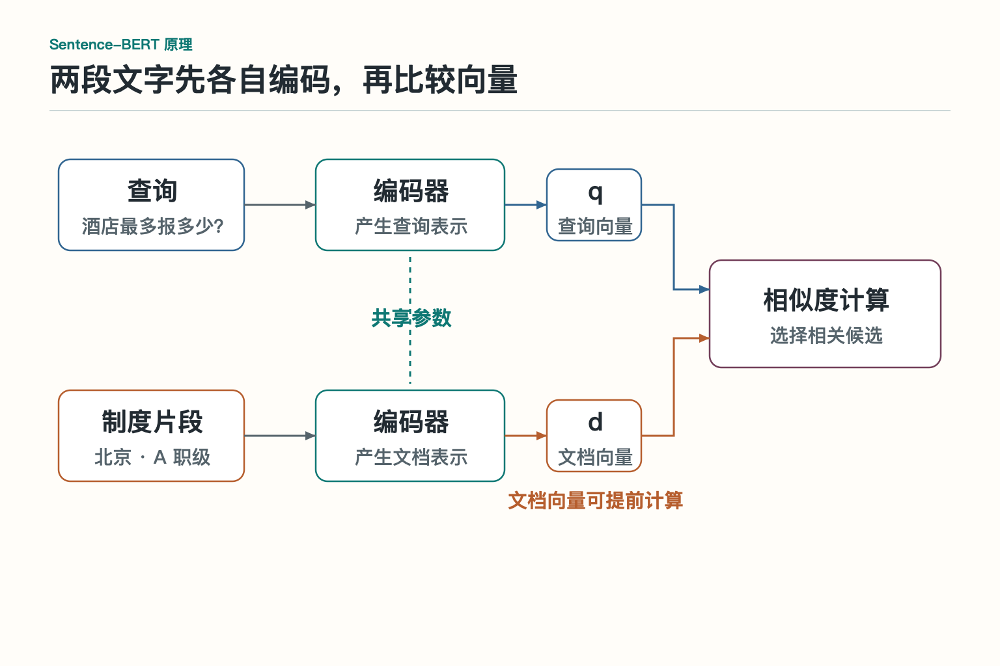
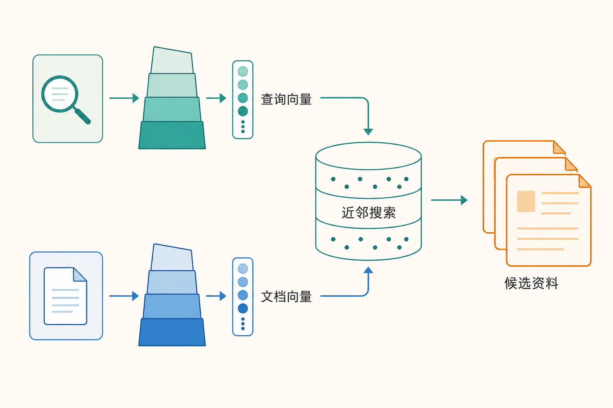
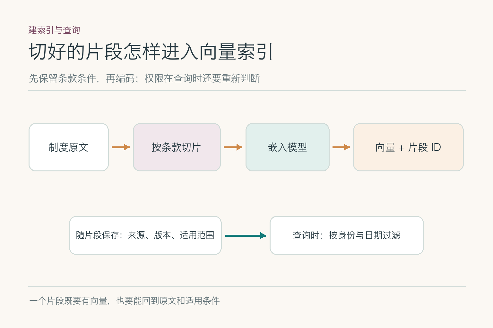
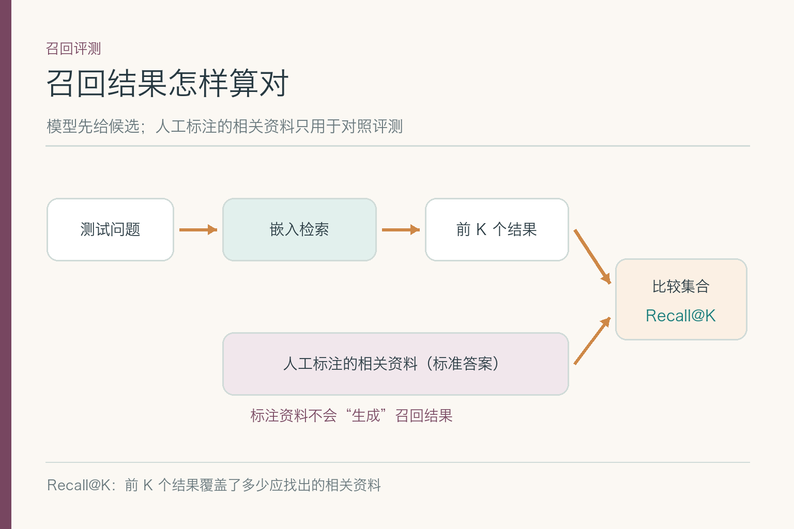

# 大话向量嵌入：同一个意思为何找不到

员工问：“北京出差住酒店，最多能报多少？”补充信息里写着：他是 A 职级，住宿日期为 2026 年 9 月 15 日。制度库中有一份《差旅住宿费限额》：旧版写 450 元，新版从 9 月 1 日起写 500 元。员工的票面金额是 480 元，但眼下只需要先找出可核对的制度条款，不作报销审批。**这些日期和金额是教学设定，不代表真实公司的制度。**

按字面找，“住酒店最多报多少”与“差旅住宿费限额”对不上；按意思找，450 元的旧版又可能排得很靠前。向量嵌入正好处在这道缝里：它让不同说法有机会相遇，同时也会把主题相似、条件不同的资料带进候选。我们沿着这次查询，看它算出了什么，哪里会丢信息，怎样知道错误发生在哪一步。

## 一、从一句问话到一串数字，模型保留了什么

嵌入模型（`embedding model`）接收文字，输出固定长度的向量。可以把向量想成一张由许多数字组成的“位置记录”，方便计算两段文字在模型空间里有多近；它不是把原句逐字压进一排格子。输入先按该模型的规则拆成 `token`（模型处理文字的片段），再经过编码网络，汇总成整个输入的表示。不同模型的汇总办法并不相同，不能把某一种实现当成通则。

*这幅二维示意只画出“住宿标准”与“差旅报销”在主题上可能靠近；实际向量通常不止两维，点的位置也不是这家公司的实测结果。*

问句与制度标题如果在训练中经常作为相关内容出现，模型可能把它们放近。图里的“产品故障”与住宿主题较远，当然容易排除。难的是两份都叫“住宿标准”的制度：旧版与新版主题几乎一样，几何距离不会自动告诉我们哪份在 9 月 15 日生效。**向量的位置来自训练目标，单个维度通常没有“北京”或“A 职级”这样的固定含义。**

## 二、它怎么学会“说法不同，仍是同一件事”

训练时可以给模型一组相关的问句与资料，再给不相关的资料。模型调整参数，让相关配对得分高，不相关配对得分低。以这道题为例，“酒店最多报多少”与“住宿费限额”是一组应靠近的表达；“打印机维修流程”很容易排开。原始研究中，Sentence-BERT 用成对或三元组训练，让句子向量适合直接比较；E5 等检索模型进一步使用大规模文本对和对比训练。它们说明的是训练思路，不保证已经学会这家公司的新旧制度。

真正考验模型的是旧版 450 元。它和新版 500 元的标题、城市、职级可能完全相同，只差生效时间与金额。若训练样本只教模型分开“住宿”和“打印机”，就算相似度计算毫无差错，它也可能把旧版排在前面。这样的相似但不适用的资料叫难负样本。把旧版、异地、不同职级的条款加入训练或评测，能看到模型是否注意到细小条件；但标注前必须确认它们确实不适用，不能把另一日期下的正确条款误标成错误。

还有一种很普通的失败：训练集中正式标题很多，员工的口语问法很少。模型懂“差旅住宿费”，未必懂“住酒店最多报多少”。这时先收集真实问法和对应条款，再比较模型，而不是看到一次没搜到就断言“向量不懂中文”。

## 三、问句和条款怎样在同一个空间相遇

*依据 [Sentence-BERT 原论文 Figure 2](https://arxiv.org/html/1908.10084) 的推理比较结构改绘；图中“查询编码器”和“文档编码器”是两条处理路径，不表示所有模型都使用两套不同参数。*

常见的双塔检索把问句与制度片段分别编码，得到查询向量 `q` 和文档向量 `d`，再比较两者。Sentence-BERT 的孪生结构共享编码器参数；DPR 则为问题和段落使用分别训练的编码器。两者实现不同，却都允许先计算并保存文档向量。员工发问时，只需为新问句算一次向量，再从已存的文档向量里找候选。

*文档向量可以预先计算；查询到来后再编码和比较。此图只画候选召回，不负责判定制度是否生效。*

这也是双塔能在大量资料中先“捞一批”的原因。不过两侧在编码时没有逐字对读：查询里的“北京、A 职级、9 月 15 日”与每条制度的条件，未必都能在一个向量分数里得到充分体现。有些模型还要求查询加 `query:`、文档加 `passage:` 等输入前缀；E5 原论文就采用这组前缀。接入别的模型时不能照抄它，须看所选模型的训练和输入说明。

## 四、分数高，到底说明了什么

假设检索返回旧版 0.84、新版 0.81。**这两个数字只是举例，不是运行模型得到的分数。**它们最多提示“按当前模型、输入和度量，旧版排得更近”，不能解释为旧版有 84% 概率正确。余弦相似度比较方向；点积还受向量长度影响。若两侧向量都归一化为单位长度，两者数值相同；没归一化时，换一种度量就可能换一套排名。

分数也不宜横跨模型使用。更换编码器、文本前缀或切分方式后，0.81 不再是同一把尺子的读数。对这次查询，先看正确的新版有没有进入前 `K` 个候选，再看旧版为何靠前。若旧版因语义相近被召回，可以按住宿日期与版本生效区间过滤；若新版压根没进候选，则要继续查输入、向量和索引。排序第一与适用日期，是两种不同判断。

## 五、把哪段制度送进模型，会改变结果

*片段与原文、版本和适用条件保持关联。图片展示一种建索引方法，不表示每家公司都要采用同样的切分长度。*

假如把整本差旅制度编码成一个向量，住宿、交通、餐补会混在一起；模型输入还可能超过长度上限而被截断。另一个极端是只存“上限 500 元”：数字留下了，北京、A 职级和生效日期却不见了。此时模型即使找回这四个字，也没法凭片段解释员工为什么适用。

这组资料更适合以完整条款为单位，连同章节标题保留“北京、A 职级、住宿日期范围、上限”。每个片段还要能返回原文、制度版本和生效区间。切分策略属于知识库建设；在这篇文章里，它的重要性很具体：**输入少了条件，向量就没有机会表示这些条件。**若新版从未入库，继续调相似度阈值也找不回来。

## 六、编号、日期和否定词，为什么容易失手

“住宿上限 500 元”和“住宿上限不超过 500 元”主题接近，含义却不完全一样；“制度 B-104”与“B-105”可能只差一位。许多嵌入模型首先擅长抓主题，并不保证把每个数字、编号或否定词都当成检索时的硬条件。我们可以固定句子，只替换一个关键字段，观察正确片段的名次是否明显变化。若换了职级仍排同一份资料，问题就不是员工问得不够礼貌。

对员工这次提问，应把“北京、A 职级、住宿日期”拆成可核对的条件：地区和职级来自已确认的业务数据，制度的适用范围来自原文及元数据。精确条款号可辅以字面检索；制度生效期靠明确日期比较。向量负责提出可能相关的候选，不能单凭相似分数给出报销结论。两路检索如何合并、候选如何重排，是后续模块要展开的事。

如果员工只问“住酒店最多报多少”，没有交代住宿日期，系统不应悄悄套用“今天”的制度：报销往往依据实际住宿时适用的版本。此时可以同时列出新旧条款及生效区间，请员工补日期；等日期明确后再判断哪份能用于这笔费用。缺少条件与模型没找到资料，是两类问题。

## 七、搜索很快时，可能又漏掉了什么

资料只有几十条时，逐条比较所有向量并不难；规模大了，系统常用近似最近邻索引（`ANN`）减少比较次数。它会把搜索引向可能有好结果的区域，而不是保证看遍所有片段。HNSW 用邻接图导航，IVF 先选若干分区再查；具体实现和参数会影响速度、内存与召回。

假设新版片段明明已入库，精确遍历全部向量时排第 3，近似索引却没返回。此时改写员工问题可能暂时碰巧奏效，根因却在索引搜索范围。拿同一批片段和问句，先跑精确搜索，再跑线上索引，记录新版是否都进入前 `K`。若精确搜索也找不到，要回查编码与片段；若只有近似搜索漏掉，才去看索引参数或过滤顺序。一次查询变快，不等于它仍找全。

## 八、换了模型，为什么不能只换查询侧

文档向量和查询向量必须按兼容的编码约定生成。即便新旧模型恰好输出相同维度，也不表示数字坐标能直接比较。若员工的问句用新模型编码，制度索引仍是旧模型算出的向量，排名可能失真；这与制度内容有没有更新是两件事。

迁移时先固定一份制度快照和评测问题，为文档建立新向量索引；查询按模型版本路由到对应索引。旧索引保留一段观察期，便于对照和回退。查询向量缓存也要带模型、输入前缀和预处理版本，否则切到新模型后还可能取到旧向量。真正上线前，用“北京 A 职级新版”和“旧版 450 元”这组容易混淆的资料回放，而不是只确认新索引能启动。

## 九、怎样知道这次改动真的找对了

*人工标注的相关条款是独立答案，不能由当前检索结果反过来充当标准答案。*

先为一组问题标出可接受的制度片段。这里至少要有口语问法、正式标题问法、旧版与新版、不同职级、精确编号、缺少日期几类。对 9 月 15 日这道题，若新版应当进入前五个候选，就检查 `Recall@5`；旧版也可能被召回，另记“把不适用条款排在前面”的次数。**召回率告诉我们正确材料有没有进门，不告诉我们最终回答是否引用了正确版本。**

有多份资料共同构成答案时，不能把其中一份进了前五就算全部找齐；反过来，日期缺失的题也不能硬标一份唯一正解。先写清每道题的相关性标准，再计算指标，团队之间的分数才有可比性。MTEB 等公开基准有助于初筛模型，但企业制度的版本和职级难题仍须自己标注。

评测时再把失败拆开：新版未入库；片段缺失生效日期；编码器把口语问法拉远；精确搜索有结果但近似索引漏了；正确候选在场却被后续环节选错。每一种都有不同修法。员工最终拿到的应是能追溯到原文与版本的候选条款；是否可报销，还要结合票据、身份与业务规则判断。向量模型的工作到这里就已经很有价值，不必让它替整套财务流程签字。

## 参考资料

- [Sentence-BERT：句子向量与双塔比较](https://arxiv.org/html/1908.10084)
- [Dense Passage Retrieval：问题与段落双编码](https://arxiv.org/html/2004.04906)
- [E5：对比训练与查询／段落前缀](https://arxiv.org/html/2212.03533)
- [MTEB：文本嵌入多任务评测](https://arxiv.org/abs/2210.07316)
- [Faiss 官方索引说明](https://github.com/facebookresearch/faiss/wiki/Faiss-indexes)

想继续看它在 AI Agent 知识体系中的位置，可点击下方 [阅读原文](https://github.com/Jennifer123www/ai-agent-knowledge-map)。
