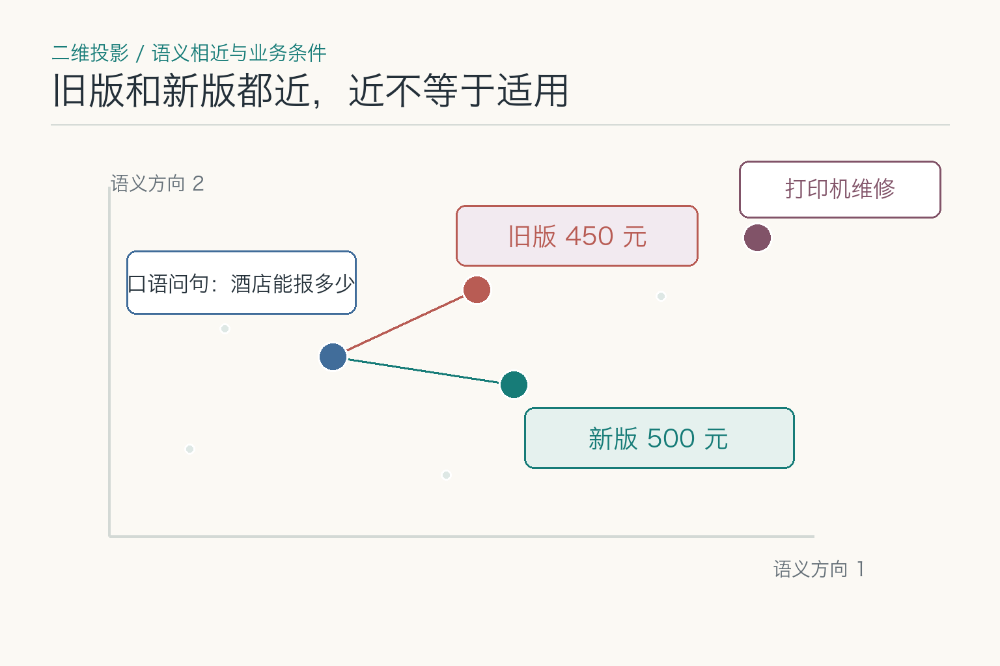
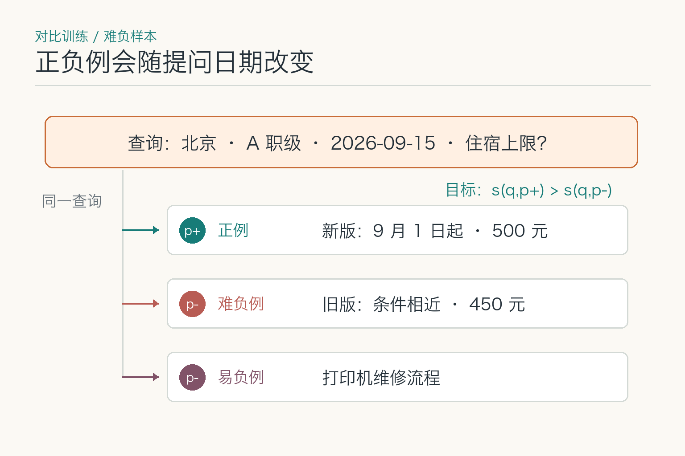
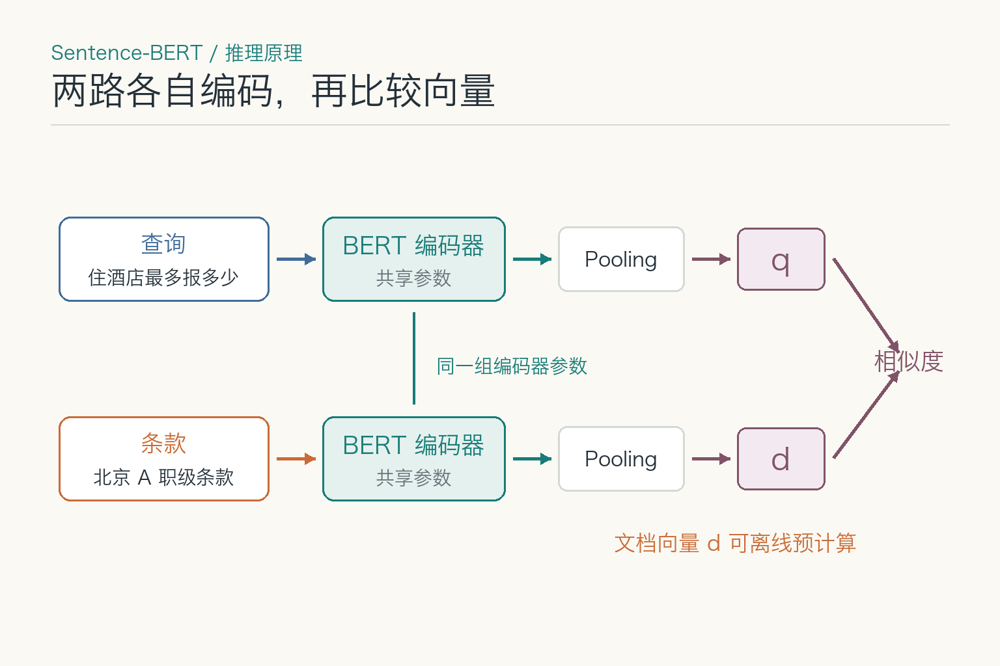
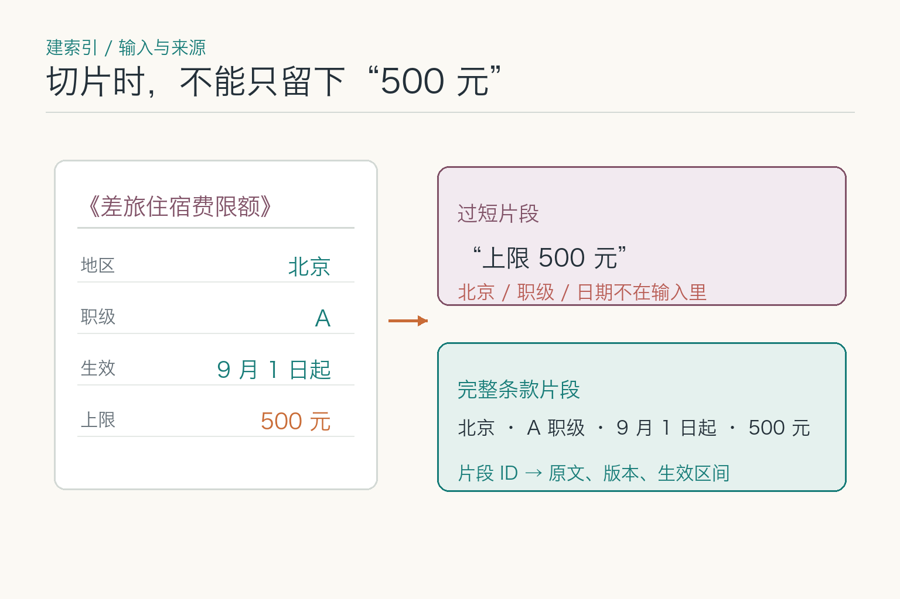
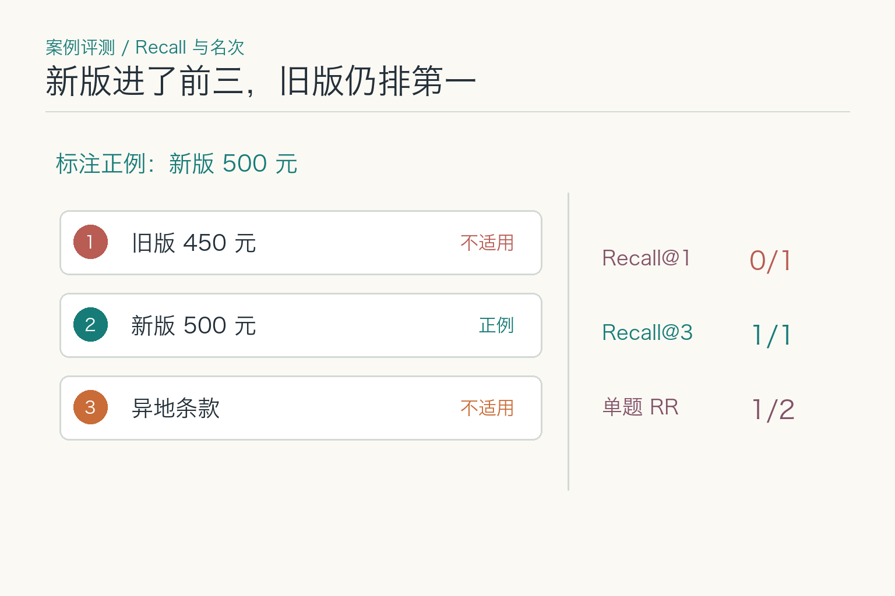

# 大话向量嵌入：同一个意思为何找不到

假设一位员工问：“北京出差住酒店，最多能报多少？”补充信息里写着：他是 A 职级，住宿日期为 2026 年 9 月 15 日。制度库中有一份《差旅住宿费限额》：旧版写 450 元，新版从 9 月 1 日起写 500 元。员工的票面金额是 480 元，但眼下只需要先找出可核对的制度条款，不作报销审批。

如果只搜字面，“住酒店最多报多少”和“差旅住宿费限额”很难碰上；如果只看意思，写着 450 元的旧版又可能排在前面。向量嵌入能帮忙找出换了说法的条款，但搜到“住宿费”并不等于找到了 9 月 15 日该用的版本。我们就拿这次查询往下捋一遍：它是怎么找到相关条款的，又为什么会把旧版一起找出来。

## 一、从一句问话到一串数字，模型保留了什么

嵌入模型（`embedding model`）把一段文字变成一串固定长度的数字。可以把这串数字想成文字在一张“语义地图”上的位置：两段话可以比较远近，但不能反过来从某个数字读回原句。文字会先按模型的规则拆成 `token`（模型处理文字的片段），再经过编码网络，最后汇总成整段话的表示。不同模型的汇总办法不一样。

*这里的远近只是画给你看的，旧版、新版都可能靠近同一个问句。真正该用哪一版，得按住宿日期去查制度。*

模型平时见过“问住宿上限”和“差旅住宿费限额”这样的搭配，就会倾向于把它们放在一起；“打印机维修”说的不是一回事，通常不会和住宿制度排在一起。真正麻烦的是旧版和新版：标题差不多，讲的也是同一件事，单凭这点远近，判断不出 9 月 15 日该看哪一份。向量里也没有一个数字专门写着“北京”，另一个数字专门写着“A 职级”，所以这些条件还是得回到原始资料里一项项核对。

## 二、模型怎样把不同说法拉到一起

训练时，通常会把相关的问句和资料放在一起，再放入不相关的资料，让模型学着把前者拉近、把后者推远。比如“酒店最多报多少”和“住宿费限额”应该靠近，“打印机维修流程”则应该离开。Sentence-BERT 用成对或三元组训练句子向量；E5 等检索模型也采用大规模文本对和对比训练。这些研究说明了模型怎样训练，却不能替公司直接读懂一份刚发布的制度。

真正容易出错的是旧版 450 元。它和新版 500 元可能有相同的标题、城市和职级，区别只在生效时间和金额。先看查询里有没有带上日期：如果编码器只收到“住酒店最多报多少”，9 月 15 日还留在业务表单里，模型自然不知道旧版该被排除。可以把已经确认的日期写进查询，也可以在检索时按生效区间过滤；别让模型替我们猜表单里没有写出来的条件。

*这里把新版当作正例，把主题接近但不适用的旧版当作难负例；打印机流程与问题无关，作为易负例。*

日期已经写进查询，旧版却还是排在前面，这时才轮到训练样本接受检查。样本如果只教模型区分“住宿”和“打印机”，没有教它辨认生效日期，模型就可能把新旧两版都当成同样相关。对 9 月 15 日这次查询来说，旧版是主题很近、但实际不适用的难负样本；换成 8 月的住宿日期，它又会变成正确答案。因此，训练和评测都要把日期、地区、职级一起写进标签，不能简单地把“旧版”一律标成错误。

还有一种常见情况：训练资料里全是正式标题，员工的口语问法却很少。模型熟悉“差旅住宿费”，不一定马上联想到“住酒店最多报多少”。遇到这种情况，应先收集真实问法和对应条款，再比较模型效果；不能因为一次没搜到，就说“向量不懂中文”。

## 三、问句和条款怎样在同一个空间相遇

*图按 [Sentence-BERT 原论文 Figure 2](https://arxiv.org/pdf/1908.10084) 的推理流程重绘：问句和条款分别编码，再汇总成向量比较；文档向量可以提前算好。*

常见的双塔检索把问句与制度片段分别编码，得到查询向量 `q` 和文档向量 `d`，再比较两者。图按 Sentence-BERT 的孪生结构绘制：两条路径共用编码器参数，并非两套各自训练的模型。DPR 则为问题和段落使用分别训练的编码器。实现不同，但都可以提前计算并保存文档向量；员工发问时，再计算查询向量并寻找候选。

这也是双塔能在大量资料中先“捞一批”的原因。不过两侧在编码时没有逐字对读：查询里的“北京、A 职级、9 月 15 日”与每条制度的条件，未必都能在一个向量分数里得到充分体现。有些模型还要求查询加 `query:`、文档加 `passage:` 等输入前缀；E5 原论文就采用这组前缀。接入别的模型时不能照抄它，须看所选模型的训练和输入说明。

## 四、分数高，到底说明了什么

假设系统把旧版排在 0.84，新版排在 0.81。这里的数字可以先理解成“这段问话和条款有多接近”的分数，不是旧版有 84% 的概率正确。系统怎样算“接近”，常见有两种办法：一种只看两个向量的方向像不像，叫**余弦相似度**；另一种把对应数字相乘再相加，叫**点积**，还会受到向量长度影响。向量都先缩放到同样长度时，两种算法排出的顺序可能一致；不做这一步，换个算法，名次就可能变化。

所以，0.81 只能在同一套模型、输入格式和计算方法里比较。换了编码器、文本前缀或切分方式，它就不是原来那把尺子。实际排查时，先问新版有没有进入前 `K` 个候选，再看旧版为什么排在前面。旧版只是因为说法相近才被找出来，可以按住宿日期和制度生效区间过滤；如果新版根本没有进候选，就要回头检查输入、向量和索引。排在第一，只说明它更像这句话，不代表它就是适用版本。

## 五、把哪段制度送进模型，会改变结果

*示意条款保留北京、A 职级、9 月 1 日起和 500 元；片段 ID 仍能找到原文、版本与适用范围。*

假如把整本差旅制度编码成一个向量，住宿、交通、餐补会混在一起；模型输入还可能超过长度上限而被截断。另一个极端是只存“上限 500 元”：数字留下了，北京、A 职级和生效日期却不见了。此时模型即使找回这四个字，也没法凭片段解释员工为什么适用。

这组资料更适合以完整条款为单位，连同章节标题保留“北京、A 职级、住宿日期范围、上限”。每个片段还要能返回原文、制度版本和生效区间。切分策略属于知识库建设；在这篇文章里，它的重要性很具体：**输入少了条件，向量就没有机会表示这些条件。**若新版从未入库，继续调相似度阈值也找不回来。

## 六、编号、日期和否定词，为什么容易失手

“住宿上限 500 元”和“住宿上限不超过 500 元”主题接近，含义却不完全一样；“制度 B-104”与“B-105”可能只差一位。许多嵌入模型首先擅长抓主题，并不保证把每个数字、编号或否定词都当成检索时的硬条件。我们可以固定句子，只替换一个关键字段，观察正确片段的名次是否明显变化。若换了职级，结果还是同一份资料，问题就不在员工怎么提问，而在检索没有把职级当成有效条件。

对员工这次提问，应把“北京、A 职级、住宿日期”拆成可核对的条件：地区和职级来自已确认的业务数据，制度的适用范围来自原文及元数据。精确条款号可辅以字面检索；制度生效期靠明确日期比较。向量检索只能先把可能相关的条款找出来，不能拿一个相似度分数直接决定能不能报销。两路检索如何合并、候选如何重排，是后续模块要展开的事。

如果员工只问“住酒店最多报多少”，没有交代住宿日期，系统不应悄悄套用“今天”的制度：报销往往依据实际住宿时适用的版本。此时可以同时列出新旧条款及生效区间，请员工补日期；等日期明确后再判断哪份能用于这笔费用。缺少条件与模型没找到资料，是两类问题。

## 七、搜索很快时，可能又漏掉了什么

资料只有几十条时，挨个比较并不费事；资料一多，再这样查就会越来越慢。于是系统会先猜一个范围，只在“看起来可能相关”的地方找，这类办法叫近似最近邻（`ANN`）搜索。它像在图书馆先走到相近的书架，而不是把每本书都翻一遍：速度快了，却不能保证每次都找到最合适的那本。HNSW 是沿着相邻节点一步步走，IVF 是先把资料分成几堆，再挑几堆细查。怎么分堆、查几堆，都会影响结果。

假设新版条款已经入库。把问句和所有条款逐一比较时，它能排到第 3 名；换成线上那套快速搜索，却连它的影子都没有。这说明问题不一定出在模型，也可能是搜索时只查了一个过小的范围。改写问句或许能碰巧把新版带回来，但不能代替排查。

排查可以这样做：用同一个问句、同一批资料，先跑一次“全部比较”，再跑线上索引，分别记录新版有没有进入前 `K` 个结果（`K` 就是系统准备返回的候选数量）。两边都找不到，说明要回头检查片段和向量；全部比较能找到、线上索引找不到，才去调整索引参数或过滤顺序。搜索变快了，只能说明少算了一些，不能说明资料已经找全。

## 八、换了模型，为什么不能只换查询侧

把制度变成向量，可以理解成把资料放进一张“语义地图”；员工的问题也要按同一套地图来定位。换了嵌入模型，就像换了一张地图。即使新旧模型输出的数字数量一样，也不能把两张地图上的坐标直接叠在一起比较。若问句用新模型编码，制度索引却还是旧模型生成的向量，排名就可能失真；这和制度文件有没有更新，是两回事。

升级模型时，先留一份固定的制度快照和测试问题，用新模型把所有制度重新编码，建一套新的向量索引。查询进来后，要根据模型版本送到对应的索引，不能新旧两套混着查。旧索引可以暂时保留，用来对照结果，必要时也能退回去。查询向量的缓存还要记下模型版本、输入前缀和预处理方式，不然模型已经换了，程序却可能拿出以前留下的向量。

上线前，别只确认“新索引能启动”。要拿“北京 A 职级、9 月 15 日适用的新版”和“旧版 450 元”这类容易混淆的制度做回放，看看新模型是否真的把该用的版本排在前面。

## 九、怎样知道这次改动真的找对了

*教学排序：旧版第 1、新版第 2；按当前住宿日期标注新版为唯一正例，所以 `Recall@1 = 0`、`Recall@3 = 1`，首个正例名次为 2。*

先为一组问题标出可接受的制度片段。这里至少要有口语问法、正式标题问法、旧版与新版、不同职级、精确编号、缺少日期几类。图里只有新版一份正例，它排在前三名里，所以 `Recall@3 = 1/1`。但旧版排在它前面；只看召回率会误以为没有问题，还得另看正确条款的名次和错误旧版的前排比例。**召回率只回答“该找的材料进候选了吗”，不回答“排第一的是不是有效版本”。**

有多份资料共同构成答案时，不能把其中一份进了前五就算全部找齐；反过来，日期缺失的题也不能硬标一份唯一正解。先写清每道题的相关性标准，再计算指标，团队之间的分数才有可比性。MTEB 等公开基准有助于初筛模型，但企业制度的版本和职级难题仍须自己标注。

评测时再把失败拆开：新版未入库；片段缺失生效日期；编码器把口语问法拉远；精确搜索有结果但近似索引漏了；正确候选在场却被后续环节选错。每一种都有不同修法。员工最终拿到的应是能追溯到原文与版本的候选条款；是否可报销，还要结合票据、身份与业务规则另行判断。

## 参考资料

- [Sentence-BERT：句子向量与双塔比较](https://arxiv.org/html/1908.10084)
- [Dense Passage Retrieval：问题与段落双编码](https://arxiv.org/html/2004.04906)
- [E5：对比训练与查询／段落前缀](https://arxiv.org/html/2212.03533)
- [MTEB：文本嵌入多任务评测](https://arxiv.org/abs/2210.07316)
- [Faiss 官方索引说明](https://github.com/facebookresearch/faiss/wiki/Faiss-indexes)

想继续看它在 AI Agent 知识体系中的位置，可点击下方 [阅读原文](https://github.com/Jennifer123www/ai-agent-knowledge-map)。
