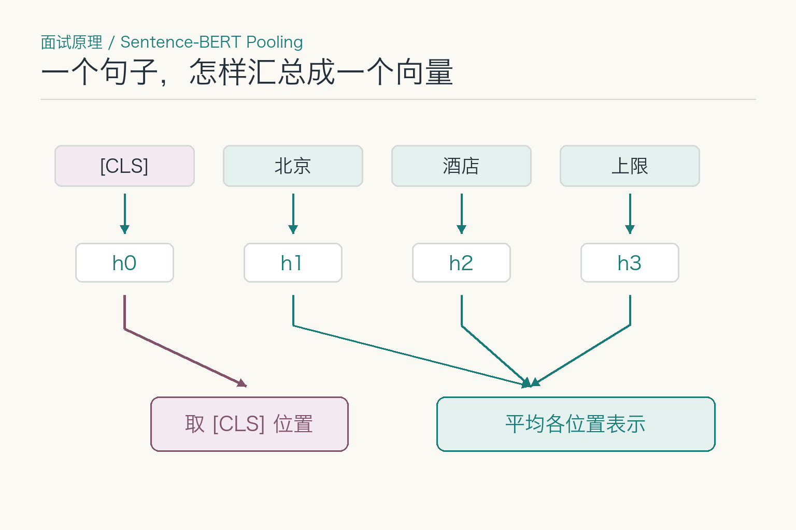
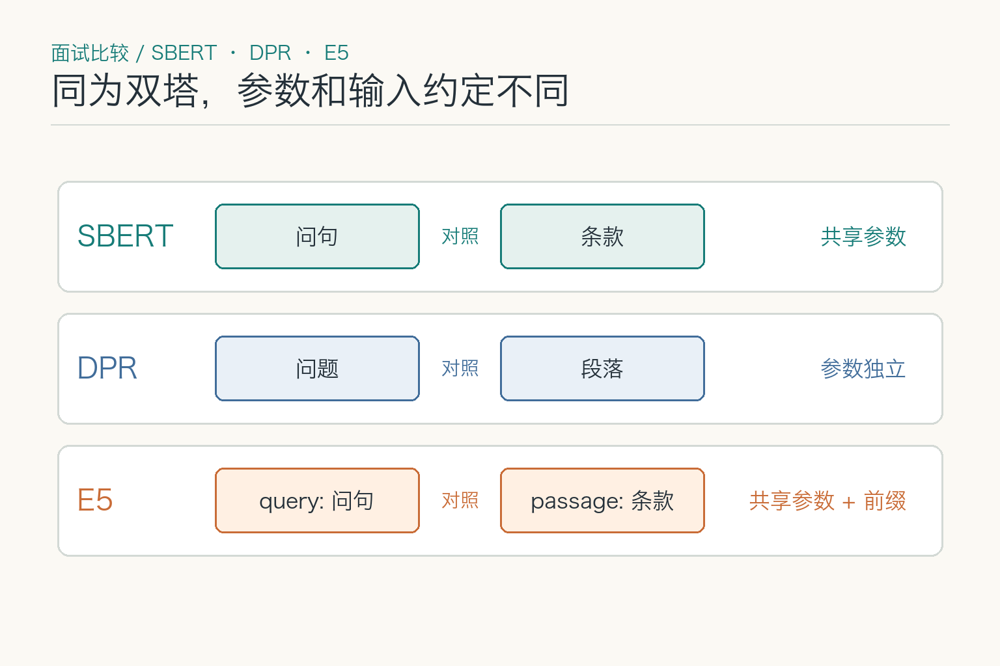
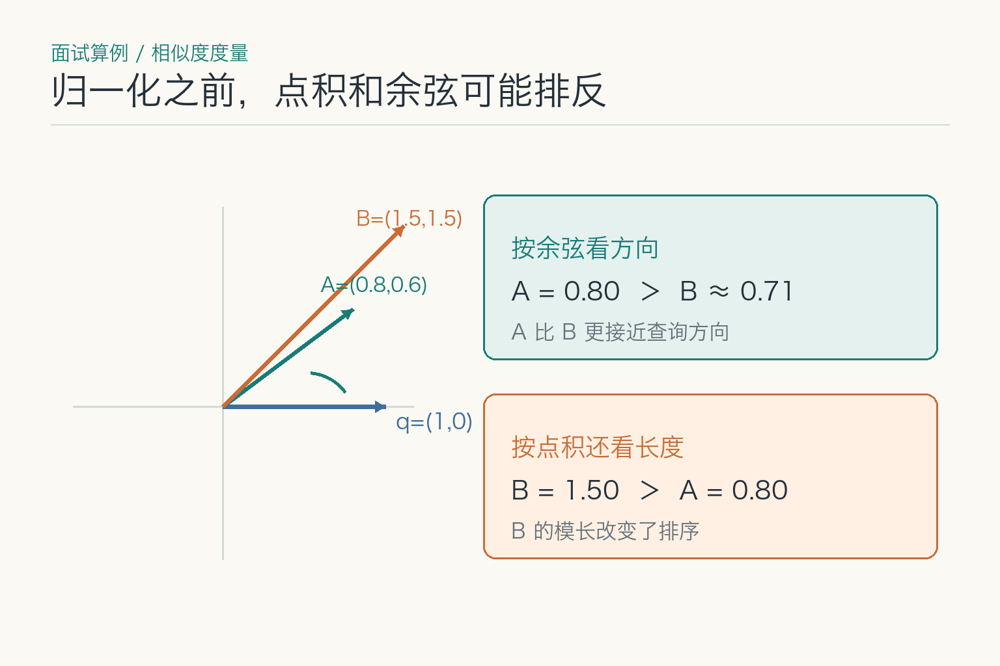
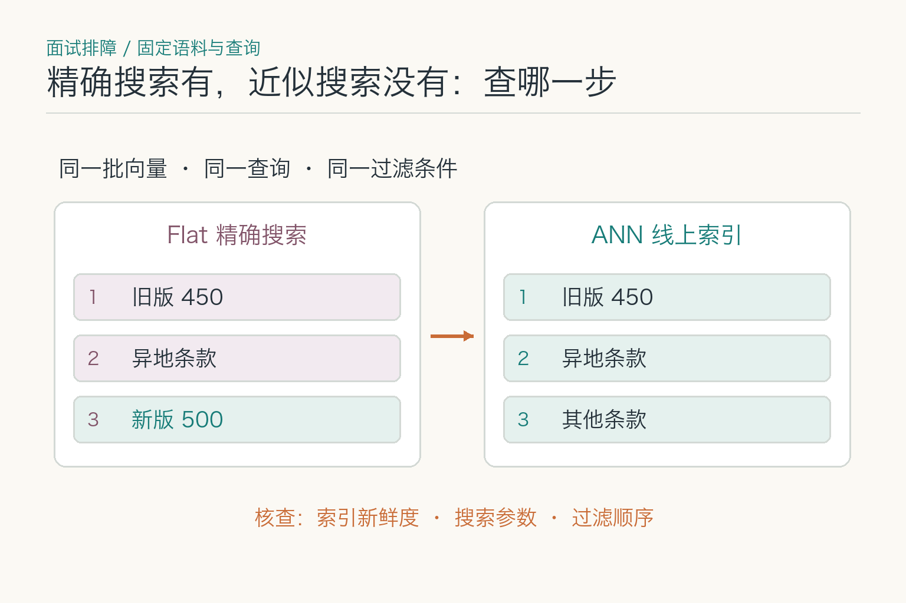

# 面试题：向量相似为何找错住宿条款

面试官给你一道练习题：员工问“北京出差住酒店，最多能报多少”，身份是 A 职级，住宿日期为 2026 年 9 月 15 日。知识库有旧版上限 450 元，以及 9 月 1 日生效的新版上限 500 元，正式标题都是《差旅住宿费限额》。票面金额是 480 元，但本题只要求找出可核对的制度条款，暂不判断整笔报销能否通过。

这九题都围绕嵌入模型和向量召回展开：问句、条款怎样变成可以比较的表示，分数什么时候值得信，正确条款没进候选时又该从哪里查。面试时要分清一件事：排在第一不等于制度就适用，检索出了问题也不一定是模型本身的问题。

## 问题 1：直接取普通 BERT 的输出，能当好句向量吗？

### 原理

编码器会为各输入位置生成表示，但检索需要一条问句对应一个可比较的固定长度向量。常见做法是取特殊位置的输出或对各位置做平均汇总（`pooling`）。**拿到向量不等于它适合语义检索**：如果训练时从未要求“相关问句与资料靠近”，模型输出的距离未必能给住宿条款排出有用顺序。Sentence-BERT 的论文比较了不同汇总方式，并用成对、三元组训练让句向量适合相似度计算；这不是说所有后续模型都只能用它的平均汇总方法。

*依据 [Sentence-BERT 原论文第 3 节](https://arxiv.org/pdf/1908.10084) 的汇总方法改绘；取 `[CLS]` 和平均各位置表示是两种可选方法，图中的中文切分仅用于读图。*

### 答题点

1. 交代输入经过编码器后怎样汇总为固定长度向量；
2. 区分“能算出向量”和“相关资料在空间里靠近”；
3. 固定同一批制度，比较未针对检索训练的表示与检索模型的候选排名。

### 记忆点

> 先问向量怎么来，再问它是按什么目标学会远近的。

**常见追问：** “维度里第 17 个数字代表‘北京’吗？”通常不能逐维这样解释；测试“北京”是否被保留，要替换地区后看排名变化。

**失分点：** 把编码器最后一层的任意向量当成现成的高质量检索模型。

## 问题 2：旧版 450 元该怎样成为训练难例？

### 原理

对比训练给定查询 `q`、相关条款 `p+` 和若干不相关条款 `p-`，使 `q` 与 `p+` 的得分相对更高。旧版与新版几乎同题，能迫使模型学习“生效日期”这样的区别，比拿打印机手册当负样本更有挑战。但**旧版不是永远的负样本**：若住宿日期在新版生效前，它可能正是正确证据。DPR 和 E5 的研究都讨论了负样本的选取；困难反例有用的前提，是相关性标签本身可信。

题库中应把查询日期写清，把两版制度的生效区间写清，还要确认日期真的进入了编码输入或过滤条件。如果业务表单有日期、模型输入却只有“住酒店最多报多少”，旧版排前不能全怪训练。若员工本来就没提供日期，也不能机械把旧版标成错，再用这份标签训练模型。还要防止从当前模型的前排结果直接挖“负样本”：它们可能只是未被标注的另一份正确材料。

### 答题点

1. 先定义当前查询下的正例与负例，再谈难度；
2. 核对日期等条件是否进入编码输入或过滤逻辑，再用同主题的旧版、异地、不同职级条款作候选难例；
3. 人工核对时间与适用范围，避免假负样本；
4. 用独立难例集看训练后是否真的改善。

### 记忆点

> 难例难在只差一个条件，标签也必须跟着条件走。

**常见追问：** “越难的负例越好吗？”不一定。把可适用条款错标为负例，会教模型远离正确答案。

**失分点：** 把“旧版”当成不依赖住宿日期的永久错误标签。

## 问题 3：Sentence-BERT、DPR 和 E5 的双塔输入一样吗？

### 原理

双塔的共同点是问句和文档先各自编码，得到 `q` 与 `d`，再用可拆开的相似度函数比较。文档向量因此可以预先计算。Sentence-BERT 的孪生结构共享参数；DPR 原论文给问题与段落分别训练编码器，再用点积打分。E5 则使用共享编码器，并用 `query:`、`passage:` 前缀区分两侧输入。它们都能画成两条箭头，却不能据此认定参数、前缀和汇总方式相同。

*对照 [Sentence-BERT](https://arxiv.org/pdf/1908.10084)、[DPR](https://arxiv.org/pdf/2004.04906) 与 [E5](https://arxiv.org/pdf/2212.03533)：前者的孪生结构共享参数，DPR 两侧参数独立，E5 共享参数并区分 `query:` / `passage:` 前缀。*

### 答题点

1. 说明两侧独立编码为何允许预计算制度向量；
2. 分清共享参数、独立参数和同模型不同前缀三种做法；
3. 对员工问句与制度片段分别使用模型规定的输入格式；
4. 保存模型、前缀和预处理版本，便于复现排名。

### 记忆点

> 两路都能出向量，不代表两路可以随意交换写法。

**常见追问：** “把 E5 的 `passage:` 写到查询前会报错吗？”通常仍能得到合法向量，但偏离训练时的输入约定，应拿固定语料做对照测试。

**失分点：** 看到两侧向量维度相同，就认定编码器和输入前缀可以互换。

## 问题 4：余弦、点积和欧氏距离，什么时候排出同样的名次？

### 原理

点积是两个向量对应分量乘积之和；余弦相似度是点积除以双方长度，比较方向；欧氏距离量的是两点间直线距离。若查询与所有候选都归一化为单位长度，余弦等于点积，而且平方欧氏距离等于 `2 - 2 × 点积`，于是三者对同一查询的排序等价。**条件是两侧都按同一规则归一化**；漏掉文档侧或新旧索引混用，结论就不成立。

*教学算例：`q=(1,0)`，`A=(0.8,0.6)`，`B=(1.5,1.5)`。余弦使 A 靠前，未归一化点积使 B 靠前；把三者都变成单位向量后，点积、余弦和欧氏距离的排名才一致。*

### 答题点

1. 先核对训练时使用的分数函数和模型推荐的推理配置；
2. 明确归一化发生在查询侧、文档侧还是两侧；
3. 用同一候选集比较三种排序，再决定索引度量；
4. 阈值需在新配置上重定，0.8 不是“八成正确”。

### 记忆点

> 先看向量是否单位长度，再谈几种距离能否换着用。

**常见追问：** “只有查询向量归一化，点积排名会变吗？”对固定查询，统一乘一个常数不会改变点积排名；但它并不会消除候选文档模长造成的排序差异。

**失分点：** 背出余弦公式，却不说明归一化和模型训练口径。

## 问题 5：向量维度增加一倍，检索就会更准吗？

### 原理

维度决定每个向量有多少数值，不直接决定模型学到了哪些语义区别。容量可能增加，存储和计算成本也会上升。假设有 100 万个片段、每个 768 维、每维用 4 字节浮点数，仅原始向量约需 `100万 × 768 × 4 ≈ 3.07 GB`；还没算索引结构、片段 ID、副本和缓存。若改成 1536 维，原始向量空间约翻倍，但旧版与新版能否分开仍取决于训练目标和输入条件。

有些模型支持截短向量或压缩表示，但不能对任意模型随手截一半就宣称质量不变。查询与文档须使用相同的有效维度和配套处理，最后用这组制度难例验证排名。选型时把质量、索引大小和查询延迟一起报告。

### 答题点

1. 用 `数量 × 维度 × 每维字节数` 算原始向量下限；
2. 区分表示质量与容量，不能按维度猜准确率；
3. 同时比较难例召回、存储、时延和更新开销。

### 记忆点

> 维度先影响向量有多大，质量还得靠题来测。

**常见追问：** “能只截短文档向量吗？”不能与未截短的查询向量直接比较；须看模型是否提供兼容的降维方案。

**失分点：** 把维度翻倍说成“理解能力翻倍”，或把 3.07 GB 当作完整索引总量。

## 问题 6：新版没进候选，是切分害的，还是模型害的？

### 原理

先确认新版原文确已进入知识库，再看送给编码器的到底是哪段文字。整本制度超过输入上限可能被截断，标题与生效日期可能留在片段外；过短的片段若只剩“上限 500 元”，模型无法从输入里得知北京与 A 职级。**这是表示的输入缺失，不是相似度公式算错。**分段策略的完整设计属于知识库主题，此处只追它怎样改变嵌入模型实际读到的内容。

*三种输入对应三种诊断：截断会漏金额，只取“500 元”会漏适用条件；检查时先把真正送进编码器的文字打印出来。*

### 答题点

1. 对照原文与实际模型输入，检查截断、标题丢失、片段版本；
2. 固定模型和索引，只比较不同输入粒度下新版的名次；
3. 若任何片段都不含完整条件，先修数据，再谈模型；
4. 别用任意重叠长度掩盖字段缺失。

### 记忆点

> 先确认模型看见了哪段话，再评价它有没有看懂。

**常见追问：** “片段越短越好吗？”不一定；短到只剩金额时，适用条件同样被切掉。

**失分点：** 只看新版文件存在，就认定新版的有效条款一定已被正确编码。

## 问题 7：怎样区分嵌入模型退化与近似索引漏召回？

### 原理

把片段、问句、归一化和度量固定，先对所有文档向量做精确搜索，得到一份基线。若新版在精确搜索里排第 3、线上近似索引却查不到，表示本身至少把它放进了候选范围，故障更像索引搜索参数、过滤顺序或索引未更新。若精确搜索也找不到，再查编码模型、输入前缀、片段和训练样本。Faiss 的 Flat 索引可用于精确对照，HNSW、IVF 等近似索引则要权衡速度与召回。

不要只看最后答对还是答错。若后续环节仍引用旧版，可能是正确候选已经找到了，只是没有被选中；这就不全是嵌入模型的问题。把前 `K` 个候选的 ID 和分数留下来，才能知道新版究竟在哪一步消失。

*教学排序里，精确搜索能在第 3 名找到新版，线上近似索引却没有。两侧使用同一批向量、查询与过滤条件，再查索引新鲜度、搜索参数和过滤顺序。*

### 答题点

1. 冻结同一语料快照和查询编码；
2. 先跑精确搜索，再跑线上近似索引；
3. 比较正确条款的名次、候选 ID 和过滤结果；
4. 分别处理“没编码”“表示排远”“索引漏查”。

### 记忆点

> 精确搜索也没有，先查输入和表示；只有近似搜索没有，再查索引。

**常见追问：** “把搜索范围调大就一定解决吗？”不一定。片段没入库或编码错了，扩大近似搜索范围也找不回正确内容。

**失分点：** 最终回答错，就直接给嵌入模型换版本。

## 问题 8：升级嵌入模型，能只重算查询向量吗？

### 原理

不同模型的向量坐标通常不兼容；就算输出维度相同，旧文档向量也未必能与新查询向量正确比较。升级应以固定语料快照重算文档向量，建立新索引，再让新查询进入新索引。服务路由、查询向量缓存、归一化和输入前缀，都必须与模型版本一起切换。旧索引保留一段时间供对照和回退，但不能让一次请求随机落到两个空间。

这道题的回放样本不能只问“住宿费是多少”。至少包括 9 月 1 日前后的住宿日期、北京与异地、A 职级与其他职级，以及旧版与新版并存的情况。若新模型平均分提高，却把 9 月 15 日的新版排到旧版后面，不能只凭总分批准切流。

### 答题点

1. 重算文档向量，绑定模型、前缀、度量、片段与索引版本；
2. 双索引并行，用同一批难题比较召回、时延和成本；
3. 灰度切换时检查缓存键和查询路由；
4. 保留旧索引与回退步骤，避免新旧向量交叉。

### 记忆点

> 新模型配新索引；同维度不等于同坐标系。

**常见追问：** “能训练映射把旧向量搬过来吗？”可以研究，但要证明映射后在难例上不退化；通常重编码更容易核对。

**失分点：** 只看 API 返回的维度一致，就认为旧索引可以原样沿用。

## 问题 9：新旧两天的查询，`Recall@K` 怎样汇总？

### 原理

主文已经看过 9 月 15 日那一道题：新版排第二，因此它的 `Recall@1` 为 0。面试里更值得追问的是：若再加一张 8 月 20 日的住宿单，同一句“北京 A 职级住宿上限”会不会把旧版也算错？对 8 月题，旧版应是正例；对 9 月题，新版应是正例。正例随查询条件变化，不能给文档贴一个永久的“好／坏”标签。

假设教学排序中，8 月题的旧版排第一，9 月题的新版排第二。每题都只有一份正例，那么两题的 `Recall@1` 分别是 1 和 0，按题平均为 `0.5`；`Recall@3` 都是 1，平均为 1。这说明扩大候选窗口解决了“能否带进来”，却没有保证第一名能直接用于回答。若一题需要两份证据，先列出那题的两份正例再算召回，不能继续沿用“每题只有一个正例”的分母。

### 答题点

1. 每一道题先按日期、职级和地区独立标正例，旧版在历史题里可能变成正确答案；
2. 逐题算召回，再注明采用按题平均还是汇总全部正例的口径；正例数不同的题，两种汇总可能不一样；
3. 同时报告第一名是否可用，别让前 3 名的满分掩盖旧版仍压在新版前面的风险；
4. 将缺住宿日期的题单列为待澄清，不强行塞进只有一份正解的召回统计。

### 记忆点

> 日期换了，正例也会换；先逐题标，再汇总算。

**常见追问：** “两题的正例数不同，按题平均与汇总正例数会一样吗？”不一定。多正例题在整体汇总里权重更大，报告中必须写清口径。

**失分点：** 把旧版永久标负例，或只报一个跨日期均值却不说明每题的正例集合。

面试回答可以从员工的问题走一遍：问句和条款是否按同一模型约定编码；新版是否作为完整片段入库；精确搜索与近似搜索各能否找到它；旧版为何分数高；评测标签是否按住宿日期确定。走完这几步，才有依据说故障在表示、数据还是索引。**嵌入模型负责把可能有用的条款送进候选，不负责批准报销。**

## 参考资料

- [Sentence-BERT：汇总方式与句向量训练](https://arxiv.org/html/1908.10084)
- [DPR：双编码、点积与负样本](https://arxiv.org/html/2004.04906)
- [E5：对比训练和查询／段落前缀](https://arxiv.org/html/2212.03533)
- [MTEB：文本嵌入评测任务](https://arxiv.org/abs/2210.07316)
- [Faiss 官方索引说明](https://github.com/facebookresearch/faiss/wiki/Faiss-indexes)

想看本文在 AI Agent 知识体系中的位置，可点击下方 [阅读原文](https://github.com/Jennifer123www/ai-agent-knowledge-map)。
