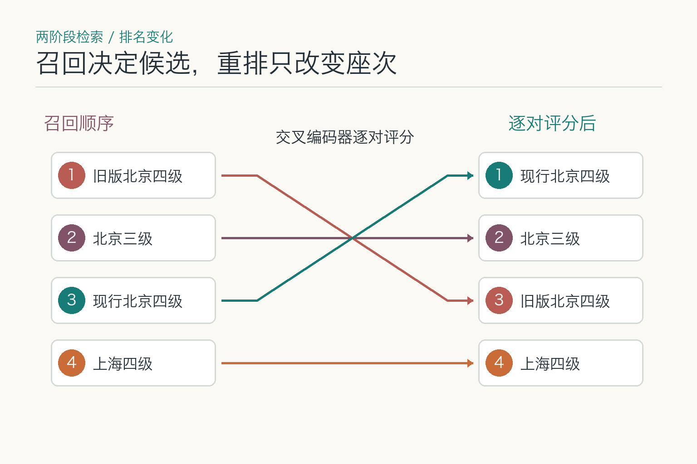
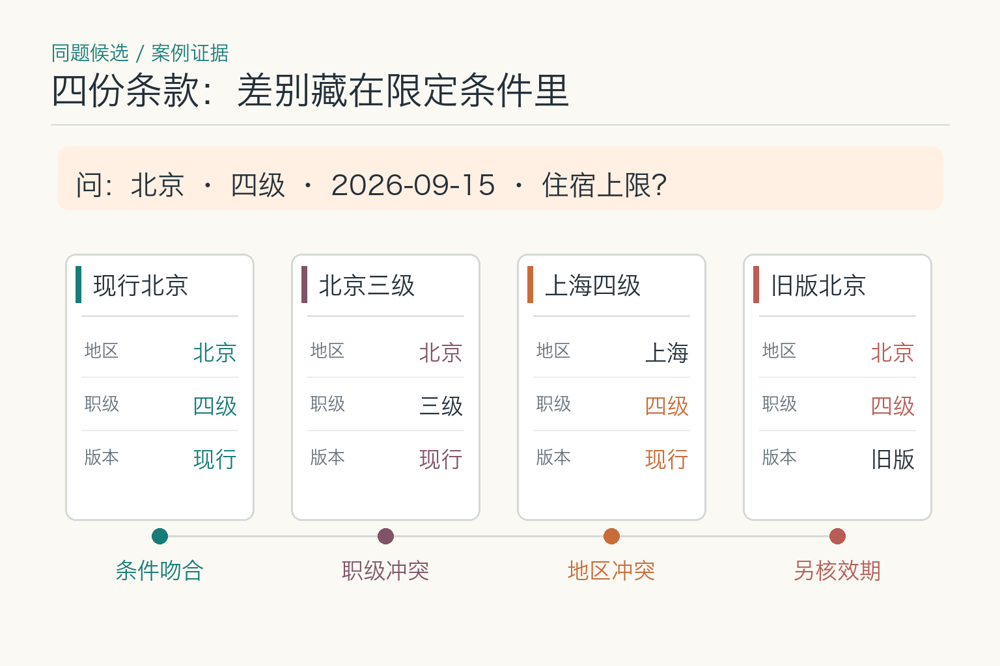
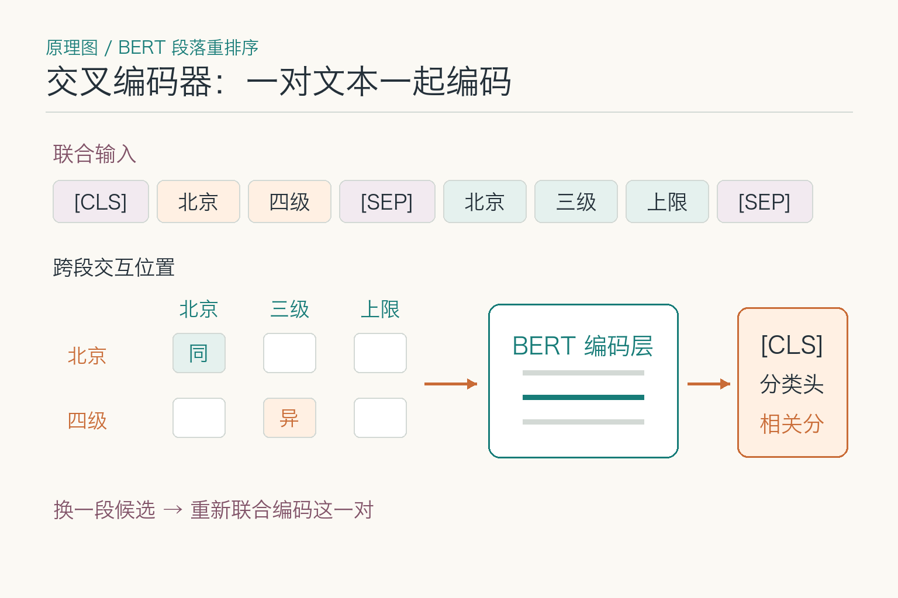
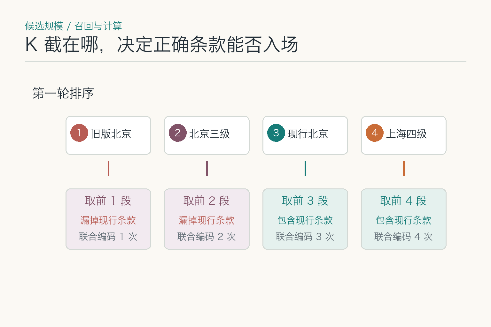
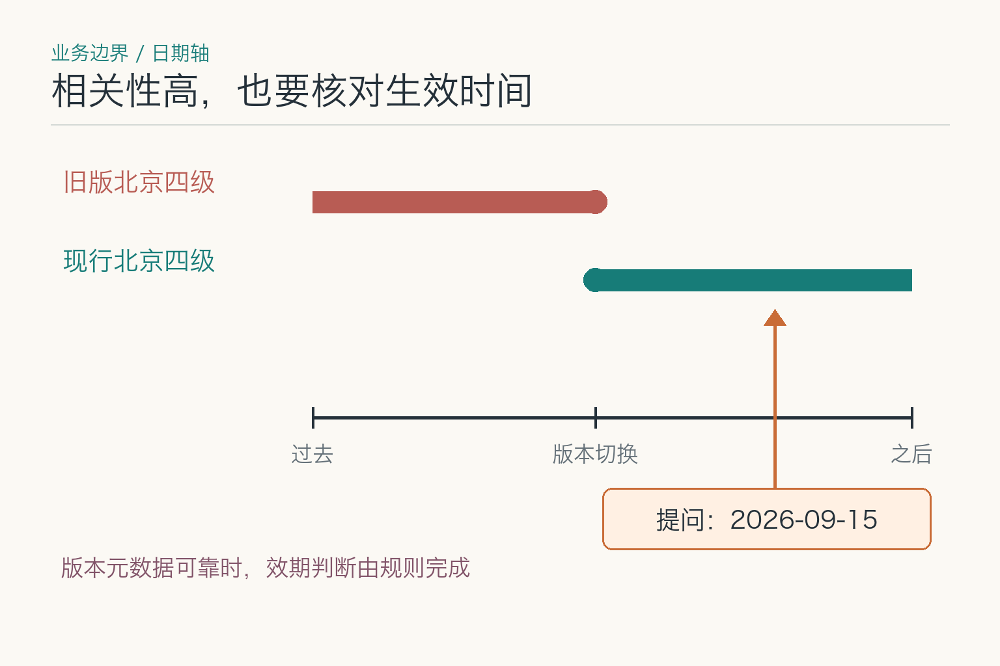

# 大话重排序：相似条款谁该排前面

2026 年 9 月 15 日，一名北京四级员工问“出差每晚最多能报多少”。第一轮搜索找来五十段含“住宿”的资料：北京四级现行条款、北京三级条款、上海四级条款，还有去年的北京四级标准。员工要先找到**适用条款及其限制条件**，不是让模型审批报销；只凭“住宿”这个共同主题，资料顺序还排不准。

重排序模型（`reranker`）接过这批候选，把提问与每一段一起读，再调整阅读顺序。它能把“北京四级”排到“上海四级”前面；但它不能独自确认条款仍然生效、员工有权查看，也不能补出没进候选的文件。

## 主题都相近，为什么还要逐段比较

向量嵌入通常把查询和文档分别编码，便于提前计算文档向量并快速搜索。这种“双塔”结构效率高，但查询和文档在编码阶段没有逐词互动。两段话只要主题接近，就可能拿到较高相似度，细小但关键的限定条件容易被忽略。

重排序只处理已经召回的少量候选，因此可以使用计算更重的方法。典型交叉编码器会把“查询 + 候选段落”一起输入 Transformer，让问题中的“北京”“四级员工”“每晚上限”直接与段落中的对应 token 交互，再输出相关性分数。

两阶段检索由此形成：第一阶段要快，宁愿多找一些；第二阶段要细，宁愿花更多计算挑少量证据。若第一阶段完全没召回正确资料，重排序也无米下锅；若第二阶段不够准，噪声会继续进入生成上下文。

## 正确条款进入候选后，排序器做哪一步

*排名是用这四份教学候选演示的；旧版条款是否生效，仍要另查版本记录。*

进入排序器前，系统必须按员工身份限制可见资料。旧版条款仍可能留在后台候选里，用于回答历史问题或做离线对照；问的是 2026 年 9 月 15 日时，就要根据生效日期确认哪份才适用。若版本元数据可靠，能在排序前过滤的就先过滤，省下计算。图中保留旧版，是为了看清排序变化，不表示旧版通过了效期检查。

对留下的“问题—候选段落”，重排序器逐对打分。它交出的是分数和相对顺序，不是报销结论。权限不能等模型打完分才决定，制度是否生效也要由版本规则独立判断。

排序后不一定简单取前五。系统还会考虑证据多样性：三个相邻段落可能都讲同一件事，全部塞进上下文只会重复；有些问题需要同时拿到“标准”和“例外条款”，应覆盖不同证据角色。最终证据要附上文档、章节、页码和版本。

生成模型根据这些证据回答，并引用具体位置。若答案里出现的关键数字没有任何证据支持，系统应拒绝或重新检索。重排序改善“模型看到什么”，并不替代“模型是否忠实使用了看到的内容”。

## 交叉编码器怎样核对“北京”和“四级”

先看同题下的四类候选：现行北京四级与问题中的地区、职级吻合；北京三级和上海四级各差一项；旧版北京四级虽然文字很像，还要另查生效日期。这三种差异不能混作同一种“不相关”。

交叉编码器的做法，是把查询和其中一段候选接成同一条输入，交给编码器计算，再从分类位置读出这对文本的相关分数。换一段候选，就重新算一次。论文里的 BERT 重排序器采用的正是这种逐对处理。

*依据 Nogueira 与 Cho 的 BERT 段落重排序论文第 2 节改绘。中间的小格表示查询与段落中的词可在联合编码时交互，不是模型实测的注意力权重。*

双塔模型可以提前算好每份文档的向量，查询到来时做一次近邻搜索。交叉编码器则要针对每个“查询—候选”组合重新计算。五十个候选就要进行五十次联合判断，无法把完整文档表示长期预存复用。

联合阅读让模型能捕捉细粒度匹配。例如候选 A 讲“北京一级至三级员工标准”，候选 B 讲“北京四级员工标准”，两段主题几乎一样，但只有 B 满足当前条件。交叉编码器能直接比较限定词与句子关系，通常比单纯向量距离更敏锐。

代价是延迟和算力。候选越多、段落越长，计算越重。因此系统要在召回覆盖与精排成本之间选候选数量，并对段落长度、批处理、模型大小和超时进行控制。重排序不是免费的质量按钮。

## 模型是怎样学会“谁该在前面”的

排序训练常见三种思路。Pointwise 把每个查询与候选单独看待，预测相关等级或分数；Pairwise 给模型一对候选，学习哪个应该更靠前；Listwise 直接考虑整个候选列表与目标顺序。三者的训练信号、实现复杂度和与排名指标的贴合程度不同。

Pointwise 数据容易构造，但单独分数未必形成最好的相对顺序。Pairwise 更直接学习偏好，例如“现行北京四级条款应排在去年条款之前”，却会产生大量候选对。Listwise 更接近真实排序目标，但标注与训练成本更高。工程中常从点式或成对训练开始，再通过真实列表评测决定是否增加复杂度。

标注也不应只分“相关、不相关”。一段资料可能完全回答问题，另一段只提供背景，第三段主题相似但因年份不适用。分级相关性能让 NDCG 等指标更有意义，也帮助模型学习证据层次。对多跳问题，还需标注多份资料是否共同构成完整答案。

强模型可以为小型重排序器生成或筛选训练信号，这是一种蒸馏路线。它能降低线上成本，但教师偏差会被学生继承。应混合人工标注、点击去偏信号和线上难例，并用独立测试集评价，而不是拿教师自己的答案证明学生学得好。

还有一种常见失误是训练分布与线上候选不一致。若训练负样本随机且简单，线上却全是向量召回出的相似段落，模型会措手不及。训练候选应尽量来自真实召回器和真实过滤流程，使它学会处理将来真正会见到的那批“难兄难弟”。

列表排序还会遇到位置偏差。用大语言模型一次阅读十个候选并给顺序时，靠前位置可能天然更受关注，调换输入顺序后结果可能变化。可以随机轮换、分组比较或采用成对淘汰，并用一致性测试检查。对重要任务，不应只跑一次就把顺序当定论。

跨编码模型的输入长度也有限。候选段落太长时，简单截断尾部可能恰好丢掉例外条款。可先按结构切分、保留标题与关键句，或使用滑窗后聚合分数。压缩候选时要记录采用的文本版本，否则评测里排的是完整段落，线上排的是被截断片段，两边结果无法解释。

重排序只是在当前候选中选优。若知识库缺文档或问题需要外部实时数据，分数再漂亮也不能制造证据。系统应记录低覆盖与低分情况，再决定是否扩大检索或明确拒答。

## 候选太多或段落太长会怎样

候选太少，正确资料可能在精排前就被截掉；候选太多，时延上升，尾部噪声也增加。合适的数量取决于语料规模、第一阶段召回率、查询难度、重排序模型和延迟预算，不能照抄一个固定 K。

*沿用上面的四份教学候选：现行北京条款在第一轮的第三位。K 取 1 或 2 时，重排序器根本看不到它。*

评测时可以画出候选数量与 `Recall`、`NDCG`、延迟和成本的曲线。举个示意数值：若候选从 50 增到 100 只提升极少召回，却让重排序时延翻倍，就不划算。对复杂问题可动态扩大候选，对精确编号查询可缩小候选甚至跳过语义精排。

候选数量还会受过滤顺序影响。先做权限和生效日期过滤能减少无效计算，但若元数据错误，也可能提前删掉正确文档。过滤策略需要单独测试，并记录每一步剩下多少候选。

## 排名第一为什么仍可能不能用

不同重排序器的分数含义不完全一样。BERT 段落重排序论文用二分类头估计“这段是否相关”的概率；有些模型则直接输出未经概率校准的分数。即使看到 0.92，也不能读成“制度有 92% 的概率有效”，更不能读成“答案有 92% 的概率正确”。它只对应训练时定义的相关性任务，换领域或换模型还可能变动。

更不能用相关性覆盖硬规则。已废止政策即使最相关也不能作为现行依据，无权限文档也不能因为分数高就展示。来源可靠性、发布时间、适用组织和法律效力应由确定性规则或独立策略处理。

需要拒答时，可以综合观察最高分、前几名分差、证据覆盖和生成引用，而不是迷信单一数字。阈值要在标注集上校准，并持续看线上空结果、错误引用和人工纠正。

## 过滤规则与模型分数怎样分工

*切换点表示两个版本的交接，实际生效日应以制度记录为准。*

身份、租户和访问权限先由系统限制。问的是现行制度还是过去某一天的制度，决定了该留哪个版本；日期明确且元数据可靠时，可在召回或重排序前做效期过滤。排序后再做去重、证据角色覆盖和上下文预算控制。不能把“历史版本一律删掉”写成固定规则，否则连查询历史制度都答不了。

回到 2026 年 9 月 15 日这次提问，系统应先限定所属组织和可见制度，再核对当日有效版本。若排序第一的段落只给出标准，第二段包含“旺季可上浮”的例外，两者可能都要保留。只取第一名，答案看似明确，却缺了关键条件。

排序还能结合多样性约束，避免相邻重复片段占满位置。也可根据来源质量或业务优先级做有限融合，但每种加权都要可解释、可测试。把十个分数随手加起来，会得到一个看似精密、实际没人知道为何如此的排序汤。

## 排序器超时，原顺序还能不能用

重排序服务可能超时、限流或返回异常。只读问答可以退回第一阶段排序，同时减少自动结论、展示来源并提示结果可能较粗；高风险决策若依赖精排区分细小条件，则应停止自动处理或转人工。

回退需要提前评测。团队应知道“无重排序”时哪些任务仍达标，哪些任务明显退化。缓存可用于重复查询，但缓存键必须包含查询、身份范围、候选版本、排序模型和策略版本，不能把甲用户有权看到的结果端给乙用户。

服务恢复后，不要盲目重放所有任务。对只读请求可重新查询，对已经产生业务动作的任务要先读取权威状态，避免因为重试而重复提交。重排序本身通常无副作用，但它所在的链路可能最终触发动作。

## 怎样检验它是否真正分清相似条款

评测集需要对“查询—候选”标注相关等级。二元标注可以区分相关与不相关，分级标注还能表示“完全回答、部分相关、主题相近但不适用”。MRR 关注第一个相关结果的位置，NDCG 能考虑多个结果及分级相关性，Precision@K 反映前 K 个中有多少真正相关。

排序指标要与最终任务一起看。NDCG 提升不一定带来答案正确率提升，可能因为生成模型仍忽略证据；反过来，最终答案暂时没变，也可能是测试集太简单。还要记录重排序耗时、候选数量、批处理效率和失败回退率。

难负样本尤其重要。它们与问题主题相似，却因地区、时间、角色或否定条件不适用。若评测只有一眼就能分开的正负样本，模型很容易拿高分，上线却在真正相似的制度之间翻车。

回到北京四级员工的问题，旧版和无权限条款应先由硬规则剔除；在剩余相似候选里，排序器应把北京四级条款排到异地和不同职级条款前面。离线仍可用旧版作难例，检验模型是否被措辞误导，**但线上不能指望相关分数替代有效期判断**。

## 参考资料

- [Passage Re-ranking with BERT](https://arxiv.org/abs/1901.04085)
- [Sentence Transformers：Retrieve & Re-Rank](https://www.sbert.net/examples/applications/retrieve_rerank/README.html)
- [Learning to Rank for Information Retrieval](https://www.microsoft.com/en-us/research/publication/learning-to-rank-for-information-retrieval/)
- [BEIR：A Heterogeneous Benchmark for Zero-shot Evaluation](https://arxiv.org/abs/2104.08663)

想看本文在 AI Agent 中的位置，可点击下方 [阅读原文](https://github.com/Jennifer123www/ai-agent-knowledge-map)，从“基础模型与推理”继续阅读。
