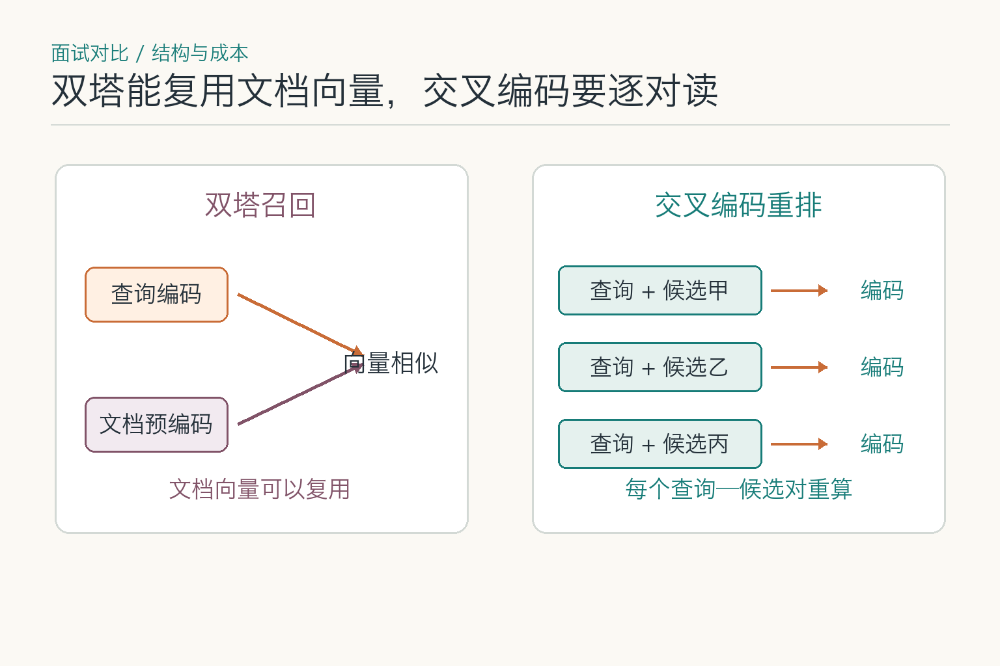
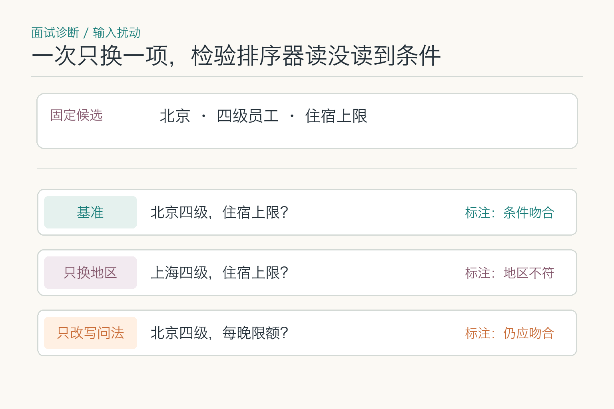
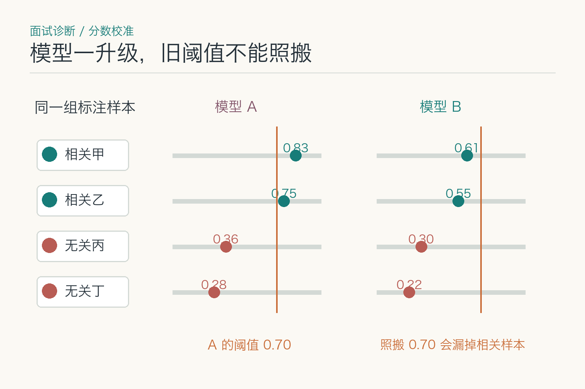
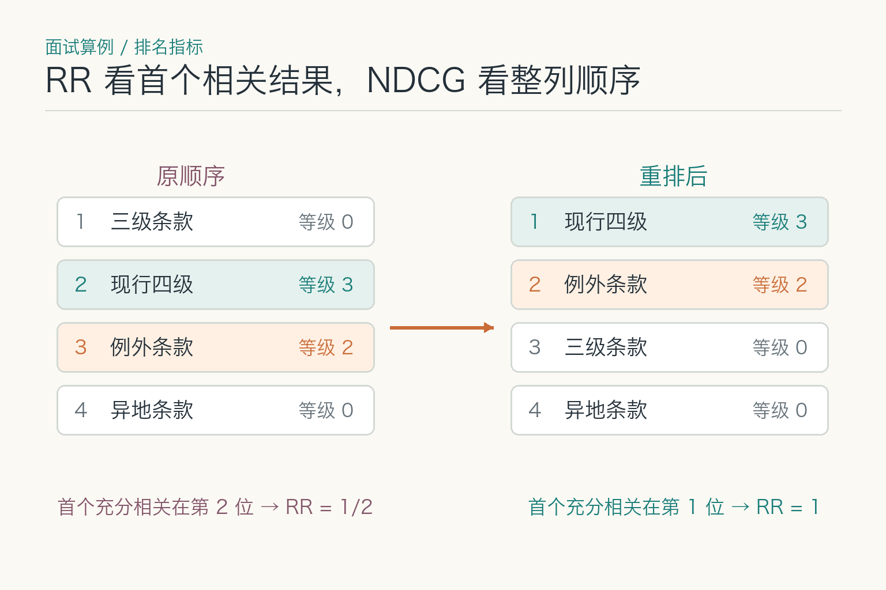
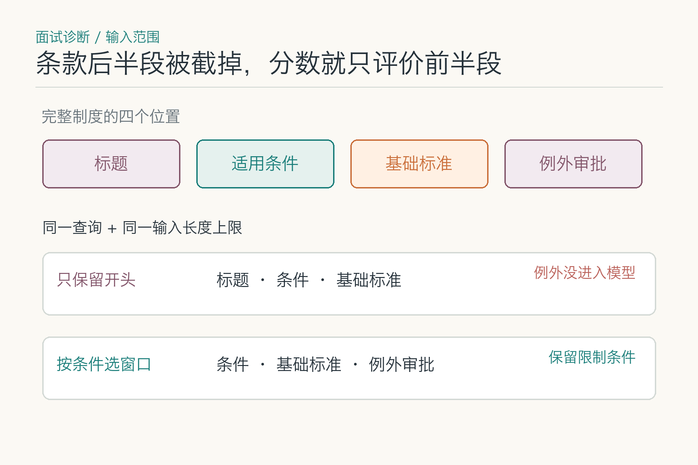

# 面试题：相似制度怎样排出先后

2026 年 9 月 15 日，北京四级员工问每晚住宿上限。候选里有现行北京四级条款、北京三级条款、上海四级条款和旧版北京四级条款。题目要解释的是**排序模型怎样比较这些近似材料**，以及它为何不能仅凭高分确认制度有效。

## 问题 1：召回模型与重排序模型有什么区别？

### 原理

第一轮召回从大量资料里找候选，追求覆盖和速度；重排序只对少量候选做更细的相对比较。北京四级条款必须先被召回，重排序器才有机会把它排到上海或三级条款之前。典型交叉编码器把问题和一段候选联合编码，代价是每个候选都要重新计算。

*图中三个候选只是计算方式的例子：双塔可复用文档向量，交叉编码器需要把每个查询—候选对重新送入模型。*

### 答题点

1. 召回看 Recall@K，重排序更关注 MRR、NDCG 和 Precision@K；
2. 双塔文档表示可预计算，交叉编码器通常需要逐对计算；
3. 召回漏掉正确资料，重排序无法补救；
4. 两阶段分别记录候选和分数，才能定位问题。

### 记忆点

> 召回负责进门，重排序负责排座位。

**常见追问：** 数据量很小还需要两阶段吗？未必。候选很少时可直接精排；是否引入召回层取决于语料规模、时延和成本。

**失分点：** 把重排序说成“再做一次向量搜索”，没有联合阅读和计算差异。

## 问题 2：注意力热图能证明排序器看对条件了吗？

### 原理

主文已经解释联合编码怎样打分。面试更值得追问：模型把“北京四级”排在前面，是否真的用到了“北京”和“四级”？注意力或词语高亮只能提示可能关注的位置，不能单独证明这些词决定了排序。可固定候选段落，只把查询的“北京”换成“上海”，观察相关分及名次是否按预期变化；再固定查询，只交换候选中的职级。两次都改变时，便无法知道是哪项条件起作用。

*图示受控测试的输入安排，不是某个模型的实测分数。判断时还要记录实际分数与候选次序。词语归因研究可参考 Jiang 等人的 BERT 重排序分析。*

### 答题点

1. 固定其余条件，分别扰动地区、职级、否定词和日期；
2. 除了分数变化，还看正确候选是否与难负样本交换名次；
3. 加入不相关词替换作为对照，避免把任何改写带来的波动都算作条件敏感；
4. 高亮图只能帮助定位检查点，结论仍需靠输入扰动和人工标注核验。

### 记忆点

> 看见高亮不等于看见理由；换一个条件，检查名次是否跟着变。

**常见追问：** 如果换“北京”为“上海”后分数没变，能断言模型没读地区吗？不能只凭一题断言。还要查段落是否同时包含两地、查询是否有其他等价线索，以及同类样本的整体表现。

**失分点：** 把一张注意力热图当作模型正确理解制度条件的证明，或在实验里一次改动多个条件。

## 问题 3：重排序候选数量怎样确定？

### 原理

候选数量是在召回覆盖与精排成本之间取平衡。太小会把正确文档截断在外，太大会增加延迟并引入更多相似噪声。最佳值依赖语料、查询难度、模型和服务预算。

### 答题点

1. 在标注集上画候选 K 与 Recall、NDCG、延迟曲线；
2. 观察边际收益，找到质量提升趋缓的位置；
3. 对精确实体查询缩小 K，对复杂宽泛问题动态扩大；
4. 记录过滤前后数量，避免元数据过滤误伤被误认为 K 太小。

### 记忆点

> K 不是祖传常数，要看召回曲线和时延预算。

**常见追问：** 候选从 50 增到 100，Recall 提升但最终答案不变怎么办？检查新增证据是否被排到可见位置、生成模型是否使用，以及评测问题是否需要这些证据。

**失分点：** 直接回答“通常取 20”或“通常取 100”，没有实验依据。

## 问题 4：重排序分数怎样设置阈值和做校准？

### 原理

有些重排序器输出未校准的分数；BERT 论文中的二分类头则输出训练任务下的相关概率。两种情况都不能把 0.9 直接当作“答案有九成把握正确”：标签定义的是文本相关，不是制度有效，更不是业务批准。阈值要用真实标注集观察误接与误拒代价；跨领域、语言或模型版本还要重新核对分数分布。

*分数是教学算例，不是某个模型的实测结果。两个版本的相对顺序相同，但模型 B 的分数整体偏低，直接沿用模型 A 的 0.70 阈值会漏掉相关样本。*

### 答题点

1. 先明确阈值用于过滤、拒答还是决定候选数量；
2. 用精确率召回率曲线选择符合风险偏好的工作点；
3. 对不同领域和语言分层检查分数漂移；
4. 阈值之外仍结合来源、覆盖和生成引用，不单点决策。

### 记忆点

> 排序分数先看相对位置，阈值必须用业务样本校准。

**常见追问：** 模型升级后可沿用旧阈值吗？不能默认沿用。分数分布会变，需重新校准并灰度观察。

**失分点：** 把 0.9 解释成九成可信，或全业务共享一个阈值。

## 问题 5：业务规则应该怎样与重排序结合？

### 原理

权限和租户范围由确定性策略限制，不能让相关性分数决定可见性。制度版本要按提问日期匹配：问 2026 年 9 月 15 日，就找当日生效条款；问去年，就不能把旧版一概删光。元数据可靠时可在精排前过滤不适用版本，排序后再做去重、多样性和上下文预算控制。

### 答题点

1. 无权限和已废止内容不能因相关性高而放行；
2. 元数据不完整时要标记和治理，不能默默当作当前有效；
3. 来源质量可作为独立特征或后处理规则，但要保留解释；
4. 多证据问题需兼顾相关性和覆盖，不只取最高分重复段落。

### 记忆点

> 硬规则决定能不能进，模型分数决定进来后排哪里。

**常见追问：** 先过滤还是先召回？取决于索引和过滤能力，但安全边界必须保证无权内容不会进入可见结果；性能优化不能改变授权语义。

**失分点：** 把权限也交给重排序模型打分，或者所有规则都硬编码进一个不可解释总分。

## 问题 6：怎样降低重排序延迟和成本？

### 原理

成本大致随候选数、文本长度和模型计算量增长。可从减少无效候选、批量推理、截断策略、小型模型、蒸馏和缓存入手，但每项优化都要验证排序质量。

### 答题点

1. 在召回层去重并做可靠过滤，减少输入数量；
2. 控制段落长度，保留标题和关键上下文而非整篇文档；
3. 使用批处理、小型交叉编码器或蒸馏排序器；
4. 对稳定语料的重复查询缓存，并把模型、权限和索引版本放进键。

### 记忆点

> 少排、短排、批量排，优化后仍要重新考试。

**常见追问：** 能否只让大模型对前十名重新排序？可以作为方案，但需比较专用模型在吞吐、稳定和成本上的表现，并控制列表位置偏差。

**失分点：** 只说“换小模型”，不检查候选重复与段落过长。

## 问题 7：重排序应该用哪些离线与线上指标？

### 原理

先约定“充分相关”的标注口径，再算倒数排名 RR。下图把能直接回答的现行四级条款标为等级 3、例外条款标为等级 2；若 RR 只把等级 3 算作充分相关，它在原顺序排第二，RR 是 `1/2`，升到第一就变成 `1`。对多道题的 RR 取平均才叫 MRR。NDCG 则能把等级 2 的辅助条款也纳入整列顺序；Precision@K 看前 K 个中有多少达到事先约定的相关等级。线上仍要核对答案引用、人工纠正、时延和回退率，不能只看离线排名。

*这里把“等级 3”作为充分相关，单题 RR 从 1/2 变成 1；等级 2 的例外条款也应纳入 NDCG 的整列评价。多题 RR 取平均才是 MRR。*

### 答题点

1. 标注完全相关、部分相关和不适用的难负样本；
2. 按查询主题、语言、长度和条件复杂度分层；
3. 固定召回候选比较排序器，避免上游变化混淆结果；
4. 最终检查答案引用和任务完成，建立端到端关联。

### 记忆点

> 排名指标看队伍，任务指标看比赛结果。

**常见追问：** 点击率能否作为相关性标签？可作为弱信号，但受展示位置、标题吸引力和用户习惯影响，需要去偏与人工标注补充。

**失分点：** 只报准确率，不说明排名位置、分级相关和候选来源。

## 问题 8：重排序服务失败时怎样降级？

### 原理

降级取决于任务风险。低风险问答可退回召回顺序并减少候选、标记不确定性；高风险判断若依赖细粒度条件，应停止自动结论。重试要有限，避免放大延迟和服务雪崩。

### 答题点

1. 设置超时、熔断和有限退避重试；
2. 提前评测无精排基线，明确哪些任务仍可服务；
3. 缓存结果包含查询、身份、索引和模型版本；
4. 记录降级事件，并在服务恢复后分析受影响样本。

### 记忆点

> 能安全粗排就粗排，不能分清条件就停。

**常见追问：** 是否可以切换备用重排序器？可以，但要验证分数、输入长度、语言和排序语义一致，阈值也需要独立配置。

**失分点：** 服务失败后直接跳过且不留标记，让下游误以为仍是高质量证据。

## 问题 9：长条款被截断时，排序器实际读到了什么？

### 原理

交叉编码器读到的是**送入模型的查询—段落对**，不一定是整份制度。以采用 `[CLS] 查询 [SEP] 段落 [SEP]` 的 BERT 式输入为例，若输入上限为 `L` 个 token，先扣去查询和三个特殊标记，剩下的才是段落预算。假设某配置 `L=512`、查询占 40 个 token，段落至多还剩 469 个；具体上限、分词与截断方向要以实际模型和推理代码为准。若“旺季上浮须审批”的例外藏在尾部，简单保留开头会让模型根本没见过例外。

*同一制度被送入模型的文本范围不同，排序分数便不能解释为对全文的判断。图中窗口是教学示意，不代表所有重排序器都使用 512 个 token。*

### 答题点

1. 记录模型版本、分词器、最大长度、查询长度、截断方向与最终输入片段；
2. 比较开头截断、保留标题及适用条件、按结构切窗等方案；
3. 窗口得分若要聚合为文档分数，事先定义聚合方法和证据位置，不临时挑最高分；
4. 用例外条款位于开头、中间和结尾的样本分层评测，并计入额外窗口的时延。

### 记忆点

> 先查模型读到了哪一段，再解释它为什么把文档排在前面。

**常见追问：** 把长条款切成三段后，只取最高分是否安全？未必。标准段落得分高，例外和限制却可能在另一段；还要考虑段落顺序、出处回映与多证据覆盖。

**失分点：** 把“原文里有例外”当作模型确实读到例外，或只增加输入上限却不核对真实截断和成本。

## 问题 10：重排序训练数据应该怎样构造？

### 原理

训练样本应模拟真实第一阶段召回结果，包含相关、部分相关和主题相近但条件不符的候选。若负样本太简单，模型只学会粗分主题；若点击日志未经去偏，会把原有排序位置当成相关性。

### 答题点

1. 从真实查询和召回前排挖掘难负样本，并人工核验高价值部分；
2. 对地区、时间、身份、否定和版本等易混条件重点覆盖；
3. 点击数据要处理位置偏差、展示偏差和未曝光候选；
4. 训练、验证和测试按查询或时间隔离，防止近重复泄漏。

### 记忆点

> 排序器要练的不是找不同，而是在一群相似项里挑对的。

**常见追问：** 能否让大模型自动标注相关性？可以辅助扩充，但需给出明确标准、抽样复核，并防止把教师模型偏好当作业务真值。

**失分点：** 用随机负样本刷出高分，上线却不会区分相邻制度和不同版本。

## 面试收束：重排序要同时回答三个“哪里”

收束这组题时，先固定那四段候选，检查排序器能否把现行北京四级条款排到其他三段前面；再调换候选输入顺序，查看名次是否异常漂移；最后将权限与有效期作为独立条件验证。这样能分开**模型相对排序**和**制度能否作为证据**两件事。

线上排障也沿这三个位置展开。先确认正确资料是否进入候选，再看是否被排序器压低，最后看生成模型是否忽略了前排证据。若正确资料根本没进来，应修召回或数据；若已经排第一却回答错误，继续调重排序只会越调越忙。

面对“是否值得加重排序”的系统设计题，可以提出消融实验：固定查询、语料与生成模型，对比无重排、专用交叉编码器和生成式重排的任务正确率、NDCG、P95 延迟与成本。只有收益超过复杂度和故障成本，才把新组件带进生产。

若采用生成式重排，还要测试候选顺序变化、一致性、输出解析和超时；若采用专用交叉编码器，要测试输入截断、批处理和语言覆盖。工具不同，验证清单也不能照抄。

最终要能回答：正确条款是否进入候选、被排到哪里、排序时读到哪段文本、超时后退回哪种顺序。若正确条款已排第一但生成仍引用旧版，就应检查答案生成与引用环节，别把排序器当成唯一故障点。

## 参考资料

- [Passage Re-ranking with BERT](https://arxiv.org/abs/1901.04085)
- [How Does BERT Rerank Passages? An Attribution Analysis with Information Bottlenecks](https://aclanthology.org/2021.blackboxnlp-1.39/)
- [Sentence Transformers：Retrieve & Re-Rank](https://www.sbert.net/examples/applications/retrieve_rerank/README.html)
- [BEIR：A Heterogeneous Benchmark for Zero-shot Evaluation](https://arxiv.org/abs/2104.08663)
- [Learning to Rank for Information Retrieval](https://www.microsoft.com/en-us/research/publication/learning-to-rank-for-information-retrieval/)

想看本文在 AI Agent 中的位置，可点击下方 [阅读原文](https://github.com/Jennifer123www/ai-agent-knowledge-map)，从“基础模型与推理”继续阅读。
