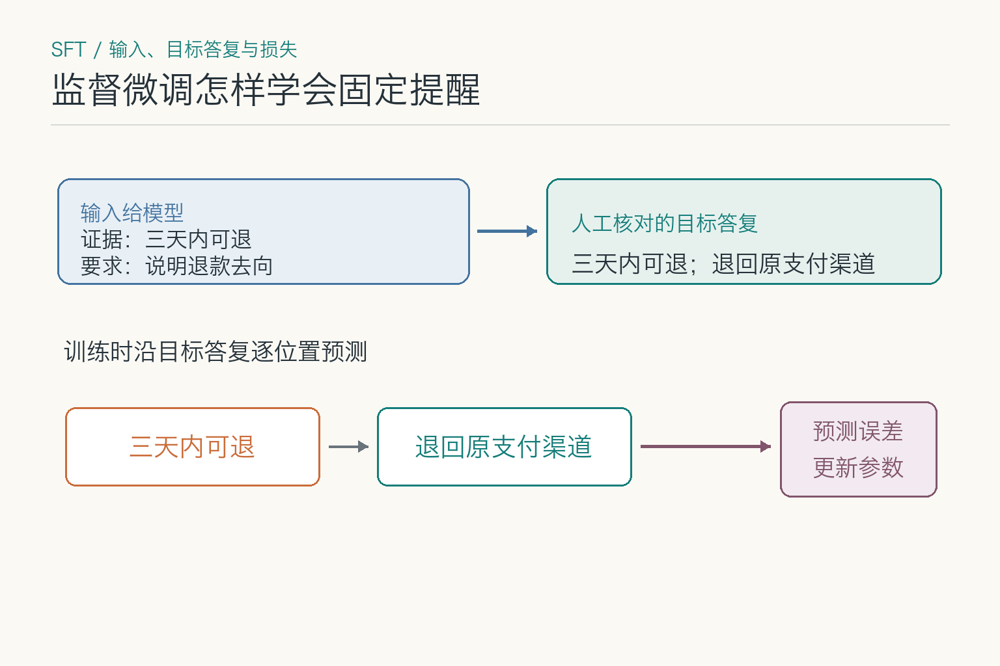
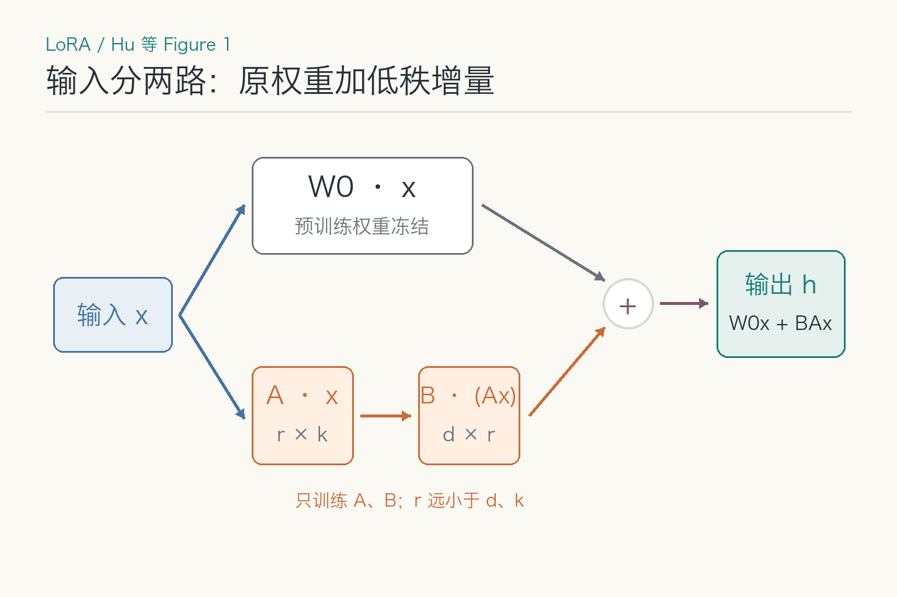
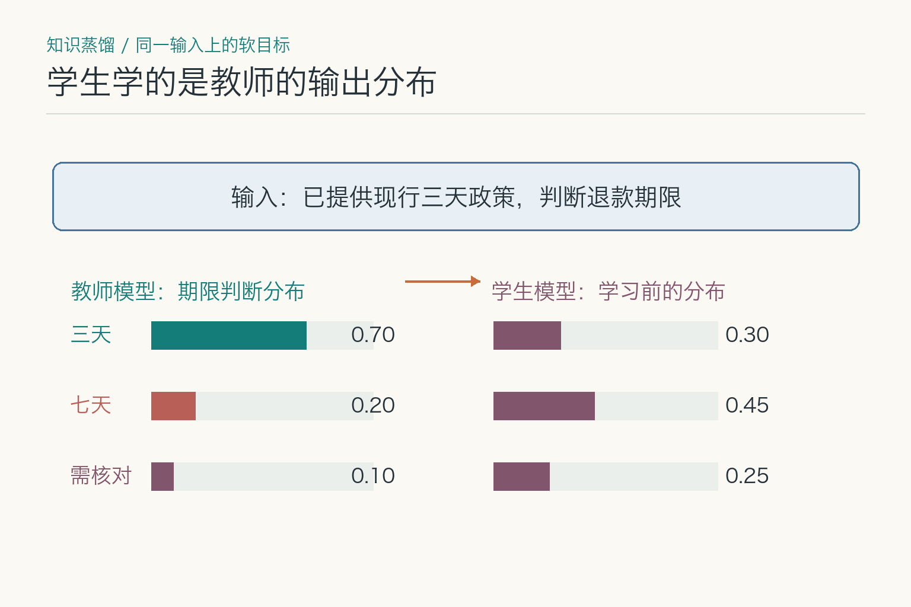
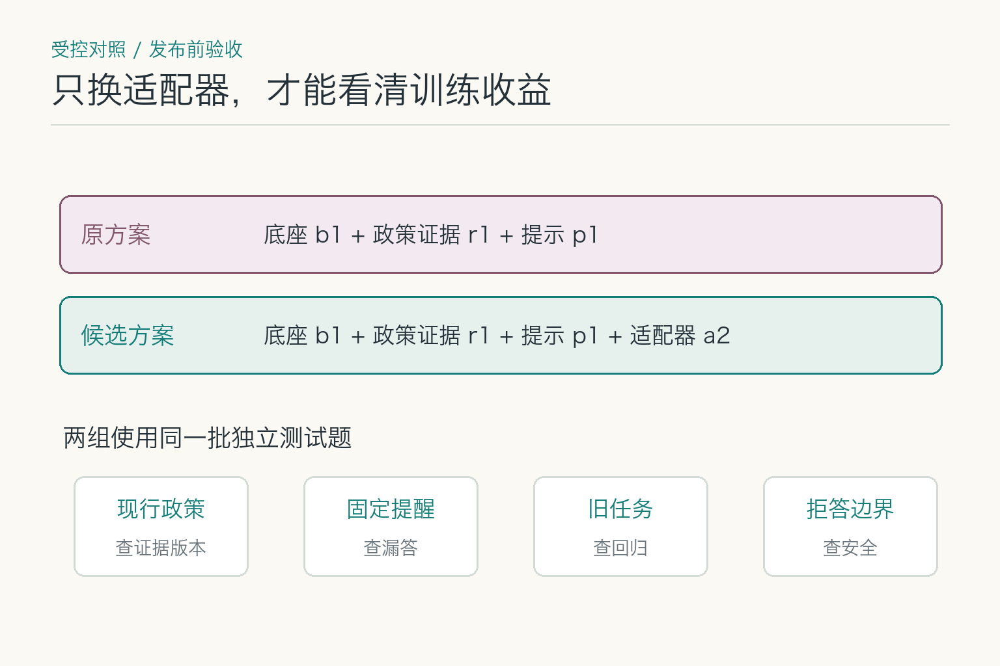

# 大话模型适配：旧政策答错了要微调吗

设想客服系统昨天还按“七天内可退”回复，今天某类订单的新政策已改成“三天内可退”。另一批答复虽然引用了新政策，却经常漏掉“退回原支付渠道”的固定提醒。前一种先查系统拿到的政策版本，后一种先查提醒是否写进提示和输出约束；两类故障都不能只凭一句“模型答错了”就决定去微调。

模型适配（`model adaptation`）指让通用模型更适合某项任务的方法。提示、外部证据和规则可以先改变输入或约束；监督微调（`SFT`）、低秩适配（`LoRA`）和蒸馏则涉及训练。训练不能自动给刚生效的政策补出可引用的原文。要不要动参数，得先知道问题究竟出在**证据、稳定行为，还是部署成本**。

## 答错旧政策与漏掉提醒，是同一种故障吗

*同是退款客服“答错”：旧政策被引用时，先查政策版本与检索证据；期限答对却漏提醒时，先查提示、模板和输出约束。两种情况都还没到直接训练这一步。*

这次退款案例里，旧政策仍被引用，应先查现行政策是否进入上下文、版本过滤是否生效。公司政策、库存和订单状态不断变化，把每次更新都训练进参数既慢又难追溯。至于回答漏掉固定提醒，先试示例、模板或结构化输出约束；若仍大批量反复失稳，再考虑训练。金额范围、权限等确定条件仍由程序校验。

缺稳定行为时，微调更有价值，例如固定分类体系、领域表达、特定风格或重复决策模式。缺低成本部署时，可以考虑蒸馏、量化或更小专用模型。一个问题可能同时包含几种缺口，应分层解决，而不是让微调背下全部制度、格式和权限。

判断病因需要失败样本。把错误按知识缺失、理解错误、格式错误、拒答错误、工具选择和执行错误分类，再看哪类占比最高。没有失败分类就直接训练，往往得到一个更自信地重复旧错误的新模型。

## 哪些问题改输入就够，哪些需要动参数

提示词适合明确任务、角色、约束、步骤和输出格式。少量示例能展示边界与风格，尤其适合分类和转换任务。提示调整快、易回滚，但上下文过长会增加成本，复杂规则也容易互相冲突。

检索增强把外部资料按需放进上下文，适合变化快、需要引用的知识。它的挑战在文档解析、召回、排序和证据使用，不能把检索质量问题归咎于基础模型。规则适合金额范围、字段类型、权限和业务状态等确定条件，优点是可解释、可测试。

三者经常配合：提示说明任务，检索提供事实，规则兜住硬边界。若这套组合已达到质量门槛，就没有必要为了显得“模型味更浓”而引入训练流水线。工程价值来自稳定交付，不来自训练日志有多热闹。

## 监督微调怎样改变回答习惯

监督微调，Supervised Fine-Tuning，简称 SFT，使用“输入—理想输出”样本继续训练模型，让它更倾向于产生目标行为。它可用于领域分类、专业格式、固定语气、特定工具选择方式和任务步骤。

*图示一种常见的指令微调做法：现行政策作为输入证据，目标答复既写期限也写退款去向；训练时对答复位置计算预测损失。图中的两段文字不是实际的 token 切分。参照 [InstructGPT 的监督示范训练](https://arxiv.org/pdf/2203.02155) 与 [LoRA 论文中的条件语言建模目标](https://arxiv.org/pdf/2106.09685)。*

训练样本必须代表真实任务，包含正常、边界、拒答和容易混淆的情况。若数据全是完美短问题，模型上线面对含糊输入就没有学过如何追问。若理想输出本身有错误或风格混乱，模型会认真继承这些毛病。

微调不是给模型装一个可靠数据库。模型可能记住训练事实，却不保证精确提取、及时更新或说明来源。需要频繁变化的知识仍应外置，训练更适合塑造稳定行为。两者边界分清，模型更新和知识更新才能各走各的发布节奏。

## `LoRA` 与 `QLoRA` 各省下什么

*依据 [LoRA 原论文 Figure 1 与第 4.1 节](https://arxiv.org/pdf/2106.09685) 改绘：同一输入分别经过冻结的 `W0` 和可训练的 `A、B`，两路输出相加，得到 `h = W0x + BAx`。*

全量微调会更新大量模型参数，训练和存储成本高。LoRA，Low-Rank Adaptation，中文常译作低秩适配，会冻结基础权重，只在指定层训练较小的低秩矩阵，形成一个增量适配器。部署时可加载适配器，也可在某些场景合并到基础模型。

QLoRA 进一步以低比特量化形式保存冻结的基础模型，同时训练 LoRA 适配器，降低显存门槛。它解决的是“怎样用较少资源训练”，并不自动解决数据质量、目标定义和评测。显存省下来，错误标签仍会原封不动地教给模型。

秩、目标层、学习率和训练轮次都会影响结果。适配器太小可能学不够，训练过度可能破坏通用能力。多任务、多租户使用多个适配器时，还要管理基础模型兼容、加载时延、显存占用和版本路由。

## 除了 `LoRA`，还有哪些适配办法

全量微调会更新全部或大部分模型参数，容量最大，资源和版本成本也最高。参数高效微调除了 LoRA，还有 Adapter、Prefix Tuning、Prompt Tuning 等路线。Adapter 在网络层间加入小型可训练模块；Prefix Tuning 学习可插入注意力计算的连续前缀；Prompt Tuning 则学习一组连续提示向量。它们都试图少改底座、多保存任务差异。

这些方法没有脱离任务的统一冠军。数据量、模型规模、是否需要多任务切换、部署框架支持和质量门槛都会影响选择。若推理平台不支持动态加载适配器，再漂亮的训练结果也可能难以上线。若一个服务同时加载几十个租户适配器，还要考虑显存驻留、切换抖动和请求路由。

偏好对齐也属于行为适配的一部分。团队可以收集成对偏好，训练奖励或直接优化模型更倾向于某类回答。但“用户更喜欢”不等于“答案更正确”，偏好数据可能奖励礼貌、长度或迎合。事实、安全和任务完成指标必须独立保留，不能让点赞率成为唯一老师。

## 什么时候值得把任务交给小模型

*为看清软目标，图把任务简化为“三天／七天／需核对”三类判断，数值均为教学构造。经典蒸馏让学生学习教师对各类的分布，而不只抄一个答案；参照 [Hinton 等人的蒸馏论文](https://arxiv.org/pdf/1503.02531)。*

知识蒸馏让较强的教师模型为较小的学生模型提供训练信号。信号可以是标签、答案、概率分布、偏好或经过筛选的过程示例。目标是让学生在特定任务上保留足够能力，同时降低推理成本和延迟。

蒸馏不是把教师完整复制一份。学生容量有限，通常会丢失长尾知识、复杂推理或跨领域泛化。若教师输出带偏差，学生还可能把偏差浓缩得更稳定。因此训练数据要混合真实标注、教师生成和难例，并对学生独立评测。

适合蒸馏的任务往往边界清楚、调用量大、输出可验证，例如分类、路由、信息抽取和短格式生成。对于需求频繁变化、样本稀少的复杂任务，维护学生模型的成本可能超过节省的调用费。

## 训练样本怎样覆盖政策变化与拒答

数据首先要合法可用，明确授权、隐私和保留范围。接着要去重、纠错、统一格式，并保留数据来源和版本。重复样本会让模型过度偏向某些表达，错误答案会被当作标准，敏感信息可能被模型记忆或在日志中泄露。

数据分布要贴近线上。除了成功案例，还应包含拒答、追问、工具失败和冲突证据。分类任务要关注长尾类别，生成任务要关注事实与格式，工具任务要包含参数不完整和权限不足。只收集“模型最会做的题”，评测看起来很好，上线像带着答案参加错考场。

训练集、验证集和测试集需要按来源与时间合理切分，避免近重复泄漏。若同一客户模板只是换了姓名就分别进入训练和测试，分数会虚高。高风险样本应有人复核，自动生成数据要标明教师模型和提示版本。

线上失败样本可以回流，但要先分清模型错误、证据错误和工具错误。若把旧政策召回造成的错答直接拿去微调，模型可能学会背诵一个暂时正确的结论；政策再改，又得重练。**只有稳定重复的行为问题，才适合做行为训练样本。**

## 固定话术学好了，旧能力会不会退化

模型在新任务上变好，可能在旧能力上退化，这常被称为灾难性遗忘。数据太窄、训练过久或学习率不合适，都可能让模型过度贴合新样本。一个学会公司口吻的模型，若突然不会处理普通指令，这份“企业文化”代价有点大。

缓解方法包括混入通用或旧任务数据、使用参数高效微调、控制训练强度，并建立覆盖原能力的回归集。对多个适配器，还要测试它们与基础模型版本、量化配置和推理框架的组合。

过拟合不只表现为测试分数下降。模型可能机械复述训练模板，对稍换措辞的问题失败；可能记住训练中的敏感片段；也可能在未知问题上过度自信。评测要加入改写、对抗、长尾和分布外样本。

安全评测也不能等到最后补。训练数据可能教会模型回答原本应拒绝的问题，或过度拒绝正常业务。退款客服的测试至少要包含正常退款、超时订单、无订单号、越权查询和政策更新后的追问；不能让固定提醒准确率上涨，掩盖拒答边界退化。

## 新适配版本怎样与旧版公平比较

*两组方案固定底座、政策证据与提示，只让候选方案增加适配器；再用同一批独立问题分开验收现行政策、固定提醒、旧任务和拒答边界。*

每个适配版本应绑定基础模型、数据集、训练代码、超参数、适配器文件、提示词和评测报告。没有这张清单，线上发现问题时很难判断是数据、训练、部署还是上下文变化。

发布前先做离线回归，包括目标任务、旧能力、安全、拒答、格式和成本。然后影子运行或小流量灰度，观察真实分布中的质量、延迟和资源。达到阈值再逐步放量，异常时可以切回旧适配器和旧基础模型。

退款客服可以准备两组互不混淆的回归题。一组把政策发布日期、订单类型和退款期限交叉组合，观察模型是否引用当前证据；另一组只固定提醒的表达，测试换一种用户问法后还会不会漏掉“原支付渠道”。前一组若失败，先查证据版本；后一组若在新旧政策下都失败，才更像训练要解决的稳定行为问题。两组都用同一批独立样本比较旧版、提示模板和新适配器，别让训练组挑容易的题，基线组挑难题。

实验管理要让变化可归因：一次只改变数据、超参数或基础模型中的少数因素，并保留对照版本；训练日志、随机种子和代码版本随产物保存。模型卡还应记录用途、非适用场景、数据概况、评测结果与已知限制。业务结束或许可到期后，适配器、缓存和副本也要按规则退役。

成本要算全：除了训练算力，还有清洗、标注、部署兼容和长期回归。若提示模板已达标，就不必为固定提醒维护训练流水线；若每天调用量很大，蒸馏后的专用小模型才可能逐步收回前期投入。回到退款客服，**旧政策错误先修可更新的证据，稳定话术长期失稳才考虑训练**。

## 参考资料

- [LoRA：Low-Rank Adaptation of Large Language Models](https://arxiv.org/abs/2106.09685)
- [QLoRA：Efficient Finetuning of Quantized LLMs](https://arxiv.org/abs/2305.14314)
- [InstructGPT：监督示范训练](https://arxiv.org/abs/2203.02155)
- [Hinton 等：知识蒸馏与软目标](https://arxiv.org/abs/1503.02531)
- [DistilBERT](https://arxiv.org/abs/1910.01108)
- [Hugging Face PEFT Documentation](https://huggingface.co/docs/peft/index)

想看本文在 AI Agent 中的位置，可点击下方 [阅读原文](https://github.com/Jennifer123www/ai-agent-knowledge-map)，从“基础模型与推理”继续阅读。
