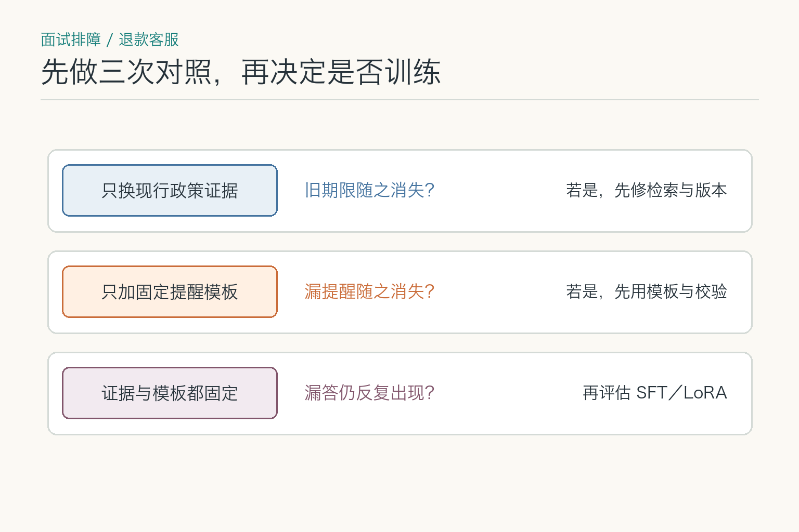
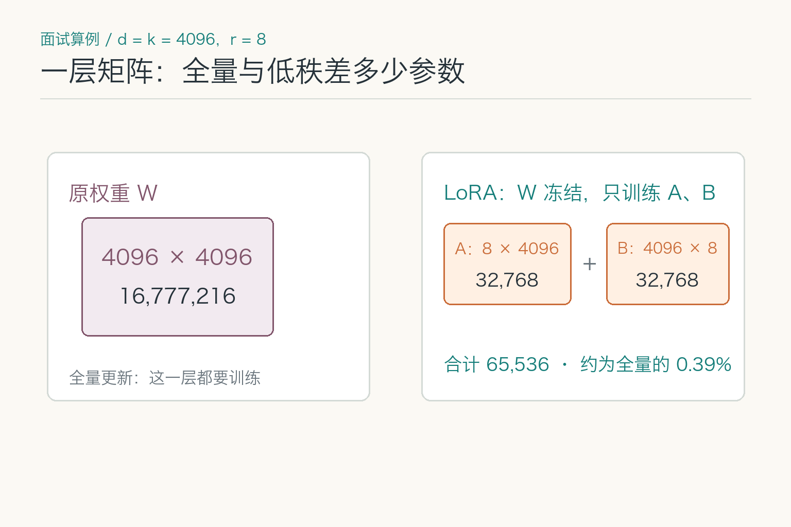
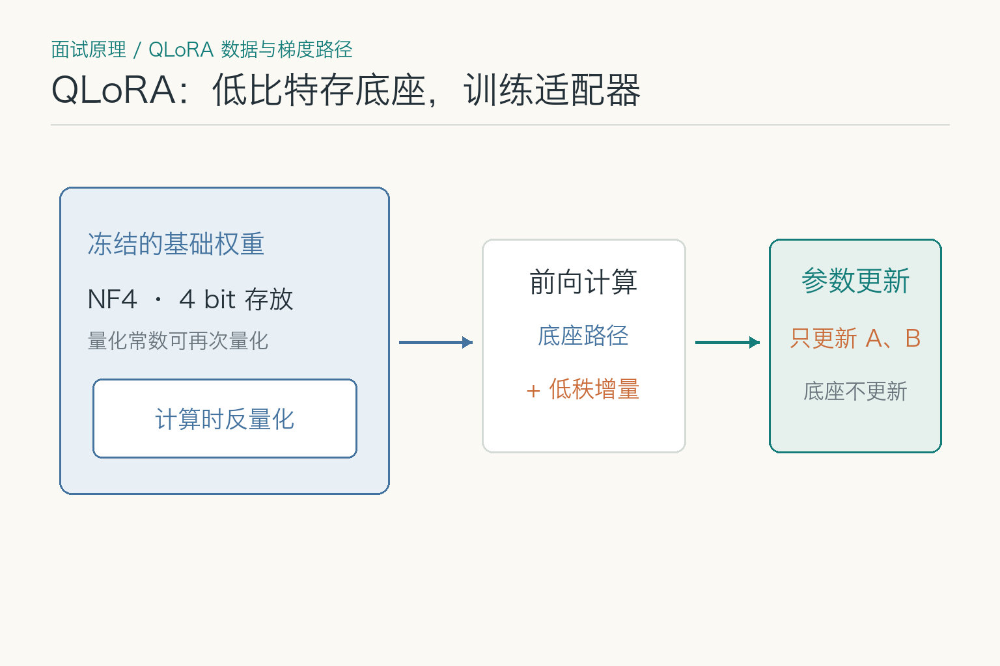
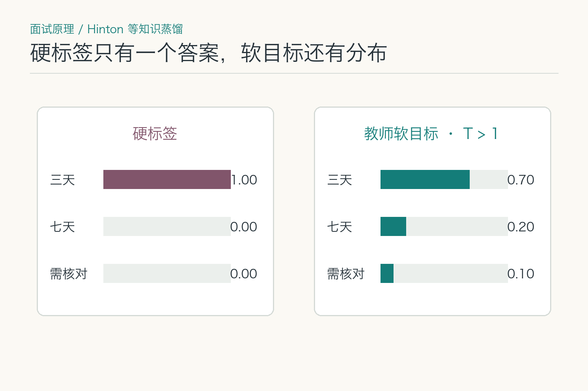
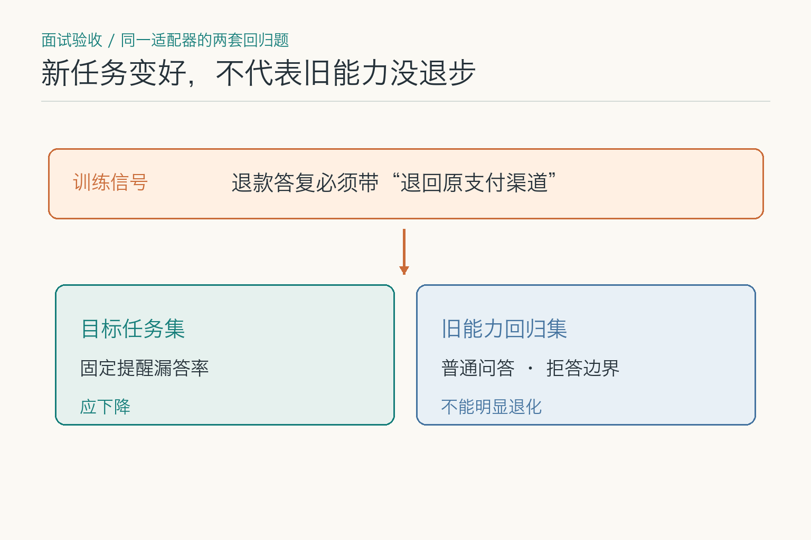
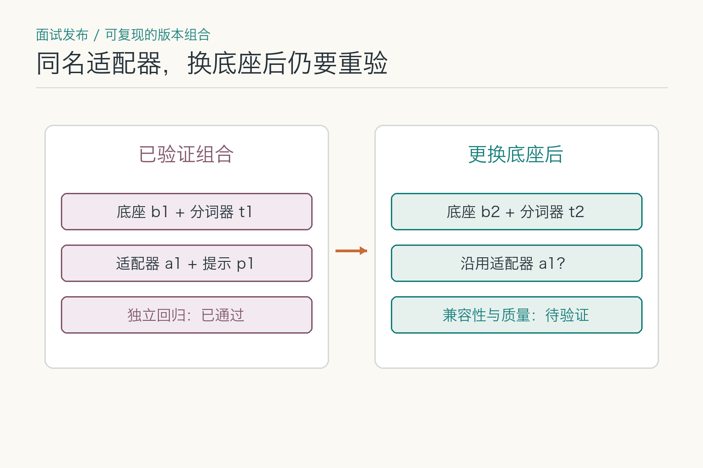

# 面试题：旧政策答错了该不该微调

退款客服昨天仍按“七天内可退”回答，今天的新政策却缩为“三天内可退”；另一条回答已经引用新政策，却漏掉“退回原支付渠道”的固定提醒。两种错误看上去都叫“答错”，前者先查动态证据，后者才可能涉及稳定行为适配。面试要讲清**何时不训练、训练改了什么、训练后如何验收**。

## 问题 1：怎样证明漏提醒是行为问题，而不是证据问题？

### 原理

不能看到“漏了固定提醒”就归因于模型没有学会。先固定同一批退款问题、同一底座与解码设置，逐次只改变一项：把新政策证据换对；在证据固定后加提醒模板；两者都固定后，才比较原模型与适配模型。这样能把**资料错误、任务说明不足、稳定行为缺口**分开。若换证据就纠正期限，却仍漏提醒；加模板后提醒也稳定出现，训练并没有得到新增任务收益。

*这是一组逐步隔离变量的教学实验，不是客服模型实测。每一步沿用同一批问题和推理配置，分别记录期限正确率与提醒完整率。*

### 答题点

1. 建立互不混淆的指标：期限是否符合证据、固定提醒是否出现、来源是否正确；
2. 用相同问题集与解码设置做逐步对照，记录每步新增收益；
3. 若政策证据错，先查资料版本；若模板已稳定解决漏答，保留简单方案；
4. 只有独立测试集上仍存在高频行为缺口，才评估训练的净收益。

### 记忆点

> 先换证据，再加模板，最后才问训练多带来了什么。

**常见追问：** 换证据与加模板后都变好，如何知道各自贡献？再做四组组合：旧/新证据 × 有/无模板，固定其他设置，查看交互效应；不能把两项同时改动后的提升全算到微调头上。

**失分点：** 只凭一条示例给故障贴标签，或同时更换检索、提示和模型后宣布“微调有效”。

## 问题 2：指令微调的损失算在哪些位置？

### 原理

常见的指令微调把政策证据和用户问题放在输入侧，把人工核对的答复放在目标侧。训练时模型在目标答复的每个位置预测下一个 token，再汇总这些位置的损失；输入侧的指令与政策文字通常只提供条件，不应被当作要原样复述的答案。具体哪些位置参与损失取决于数据模板与训练实现，必须查看标签掩码。若错误地对整段拼接文本都算损失，模型可能花大量容量复写提示或政策，而不是学会“答期限后补提醒”。

### 答题点

1. 明确 `input_ids`、目标 `labels` 与忽略位置，检查一个样本被拆开后的实际掩码；
2. 答复目标同时包含正确期限和固定提醒，但证据必须随政策版本更新；
3. 训练和推理的对话模板、特殊标记、结束标记要一致；
4. 以换问法、换政策证据的独立样本验收，不能只看训练损失下降。

### 记忆点

> 先看模型被要求预测哪段文字，再讨论它学到了什么。

**常见追问：** 损失下降而提醒仍常漏，是不是训练失败？先查目标答复里提醒占比、掩码是否覆盖该位置、线上是否使用同一模板，再看独立测试集。单一平均损失可能掩盖目标行为的失败。

**失分点：** 只说“喂问答数据”，却不知道训练样本的哪一段在产生梯度。

## 问题 3：LoRA 为什么能用较少参数完成适配？

### 原理

LoRA 冻结原权重，在指定线性层旁学习两个低秩矩阵，其乘积形成权重增量。假设任务所需更新具有较低内在秩，就能用远少于全量参数的增量近似有效变化。

*教学算例：若某一线性层 `d=k=4096`、秩 `r=8`，原矩阵有 `4096×4096=16,777,216` 个参数，LoRA 的 `A+B` 共 `65,536` 个，约为这一层的 `0.39%`；不是整个模型的实际训练占比。依据 [LoRA 第 4.1 节](https://arxiv.org/pdf/2106.09685)。*

### 答题点

1. 基础模型参数保持冻结，训练和保存的是低秩适配器；
2. 秩和目标层影响容量、显存与效果；
3. 适配器可按任务独立版本化，也可按部署需求合并；
4. 它减少可训练参数，不代表训练数据和回归测试可以减少。

### 记忆点

> 大底座不动，只训练一块小增量。

**常见追问：** 秩越高越好吗？不一定。容量提高也增加参数和过拟合风险，应通过目标任务与旧能力回归选择。

**失分点：** 把 LoRA 解释成模型量化，或声称它一定与全量微调效果相同。

## 问题 4：QLoRA 与 LoRA 的区别是什么？

### 原理

QLoRA 通常以低比特形式存放冻结的基础模型，并在计算过程中配合反量化，同时训练 LoRA 适配器。它进一步降低基础权重的显存占用，使较大模型能在有限硬件上适配。

*依据 [QLoRA 原论文第 3 节](https://arxiv.org/pdf/2305.14314)：冻结底座以 NF4 等低比特格式存放，计算时反量化，前向还要加上 LoRA 支路；训练更新 `A、B`，不更新底座。图中框面积不代表显存比例。*

### 答题点

1. LoRA 关注低秩增量，QLoRA 额外量化冻结底座；
2. 可训练适配器通常保持更适合训练的精度；
3. 显存收益不等于训练吞吐和最终质量必然更好；
4. 量化格式、推理框架和部署硬件需要兼容验证。

### 记忆点

> LoRA 少练参数，QLoRA 还把不练的底座压小。

**常见追问：** QLoRA 训练完部署时必须保持同样量化吗？不一定，可按部署策略加载或合并，但每种导出和量化组合都要重新验证质量与性能。

**失分点：** 只说“QLoRA 是 4 bit 的 LoRA”，没有冻结底座、计算路径和部署差异。

## 问题 5：退款样本怎样避免训练与测试泄漏？

### 原理

一张退款工单可被改写成十种问法。若其中九种在训练集、剩下一种在测试集，测试分数看似独立，实际可能只在考模型是否记住模板。更可靠的做法是按**原始工单或政策版本**分组，再划分训练、验证与测试；跨集合还要查语义近重复。政策生效前后的样本若引用不同期限，不能简单按文本相似度去重，而应保留时间、订单类型和证据快照，分别判断标签是否真的冲突。

### 答题点

1. 用工单标识、政策版本和客户会话把同源改写聚到同一集合；
2. 脱敏后再查近重复，保留必要的时间与适用条件，避免把新旧政策误合并；
3. 测试集单独保留政策更新后、措辞变化和缺证据样本；
4. 审计合成数据是否把测试题或参考答案带回训练提示。

### 记忆点

> 同一张工单换了问法，仍是同一道题。

**常见追问：** 按时间切分就一定不会泄漏吗？不一定。旧工单的改写可能在新日期重新入库，政策原文也可能被复制到训练示例里；还须查来源标识和内容近重复。

**失分点：** 只随机打散样本，不核对同源工单、政策版本和合成样本的复制链路。

## 问题 6：知识蒸馏适合什么场景，有什么风险？

### 原理

主文已讲教师与学生的分工，这里追问训练信号：硬标签只告诉学生“三天”是目标，教师输出的软分布还显示“七天”与“需核对”各有多大相对可能性。经典蒸馏会用温度 `T` 调整教师和学生的 `softmax` 分布；温度升高通常让非最高类别的相对信息更明显，再让学生匹配教师分布。温度与硬标签损失的权重是训练设计，不是业务事实的可信度。

*把退款期限简化成三类教学判断：硬标签只标“三天”，教师软目标还给“七天”“需核对”保留概率。数字为教学构造，不是客服模型实测；参照 [Hinton 等人的蒸馏论文第 2 节](https://arxiv.org/pdf/1503.02531)。*

### 答题点

1. 区分真实标签的硬目标与教师分布的软目标，不能把后者当作政策真值；
2. 温度和软/硬损失权重用验证集调，不直接照搬论文示例；
3. 在“政策刚变更”“证据缺失”等切片上看学生是否继承教师的旧偏差；
4. 若学生只需判断固定提醒是否齐全，不必蒸馏教师的全部开放式回答能力。

### 记忆点

> 软目标教相对区别；新政策仍要靠真实标签核对。

**常见追问：** 教师把旧政策判为高概率，学生是否也应模仿？不应盲目模仿。可降低这类样本的教师信号权重，或用经人工核对的真实标签覆盖，并单独测政策更新切片。

**失分点：** 把教师概率当成业务正确概率，或只谈压缩体积而不谈软目标误导。

## 问题 7：怎样发现和缓解灾难性遗忘？

### 原理

要分清两种退化。全量微调可能直接改变底座参数；LoRA 冻结底座，却在加载适配器时把增量加进模型计算，同样可能让普通问答或拒答边界变差。诊断时保留同一底座的“未加载适配器”版本，和“加载旧/新适配器”版本并排测试，才能区分底座升级、适配器行为以及提示变化的影响。

*训练只针对“退回原支付渠道”时，除了检查漏答率，还要单独回归普通问答与拒答边界；即使底座冻结，加载适配器后的行为也可能变化。*

### 答题点

1. 固定底座、提示、政策证据和测试题，只切换适配器加载状态；
2. 目标任务看漏提醒率，旧任务看正常退款与拒答边界，不合成一个平均分；
3. 如果只有新适配器退化，回查训练样本覆盖、目标层和训练强度；
4. 保留不加载适配器的回退通道，但切回后也要核对原任务是否仍达标。

### 记忆点

> 底座没改，不等于加载适配器后行为没改。

**常见追问：** 新适配器只在退款任务路由，旧能力回归还重要吗？重要。路由可能误判，退款任务本身也含普通问答和拒答；测试应覆盖路由命中与未命中的两侧。

**失分点：** 把“底座参数冻结”误读成“服务输出不可能退化”。

## 问题 8：为什么旧适配器不能直接挂到新底座？

### 原理

LoRA 的增量矩阵对应底座中特定层的形状和语义。底座升级后，层名或维度不同可能直接加载失败；即使形状相同，权重分布和分词器改变，也可能让原适配器的效果漂移。因此适配器包不只是一个文件，还要记录它训练时依赖的底座标识、分词器、目标层、秩、缩放配置和推理模板。发布时先做静态兼容检查，再跑同一批退款题的行为回归，最后才决定是否灰度。

*左侧的底座、分词器、适配器与提示是已验证组合；右侧更换底座后，即使适配器文件未变，也须重测接口兼容和回答质量。版本号是教学示意。*

### 答题点

1. 加载前核对层名、矩阵维度、目标模块、分词器和提示模板；
2. 对“旧底座＋旧适配器”“新底座＋旧适配器”分别做质量与资源测试；
3. 把底座与适配器的组合标识写入日志和缓存键，避免版本串用；
4. 若要回滚，切回经过验收的**整套组合**，而非只替换适配器文件。

### 记忆点

> 适配器认底座；形状能加载，还得重新考试。

**常见追问：** 结构和分词器完全相同，是否就可复用？只能说明接口可能兼容；参数值改变仍可能影响增量行为，须重新跑目标与旧能力回归。

**失分点：** 把“成功加载”当作“行为兼容”，或回滚时只切一个文件。

## 问题 9：多任务或多租户场景怎样管理适配器？

### 原理

多个 LoRA 或 Adapter 可以共享同一基础模型，但每个适配器都有适用任务、数据和底座版本。运行时要根据租户与任务路由，控制加载、显存、并发和隔离，并避免错误适配器串用。

### 答题点

1. 适配器清单绑定租户、任务、底座、分词器和评测版本；
2. 路由由身份和配置决定，不让模型自行选择敏感租户适配器；
3. 设计常驻、按需加载或合并策略，测量切换时延和显存；
4. 缓存、日志和回滚按适配器版本隔离，防止跨租户污染。

### 记忆点

> 共用底座可以，任务身份和适配器版本不能串门。

**常见追问：** 能否同时叠加多个 LoRA？部分框架支持组合，但效果不一定线性相加，适配器之间可能冲突，必须按组合做评测。

**失分点：** 只讨论节省存储，不讨论运行时路由、隔离和组合兼容。

## 问题 10：适配项目的收支临界点怎么算？

### 原理

主文已经讲过先比简单方案，面试进一步要给出能复算的决策式。设一年内有 `N` 次符合适配范围的调用，新方案每次比已达质量门槛的基线省 `ΔC` 元，新增的标注、训练、部署和维护成本合计 `F` 元，则**仅看直接费用**的回本条件是 `N×ΔC > F`。但若新方案在关键错误上更差，低成本不能抵消质量门槛；若只有部分请求会路由到适配器，`N` 应使用实际命中量而非全站调用量。

### 答题点

1. 先给旧版、新版设相同的质量、安全与尾部延迟门槛，不达标的不参加成本比较；
2. 计算实际命中调用量、每次成本差、一次性训练成本和持续维护成本；
3. 对调用量、模型价格和政策变更频率做敏感性分析，避免只用乐观值；
4. 用灰度验证真实命中率与单位成本，再更新回本预测。

### 记忆点

> 先过质量线，再算 `N×ΔC` 能否覆盖 `F`。

**常见追问：** 新模型单次便宜一半，能直接算回本吗？不能。还要纳入适配器加载、额外回归、失败重试、人工纠正及未命中请求仍走原模型的费用。

**失分点：** 用全站调用量充当适配器调用量，或用平均费用掩盖质量回退与维护成本。

## 面试收束：适配方案要交代四本账

这组题可用四项验收收束：①旧政策回答错误是否因外部证据过期；②固定提醒的漏答率是否在独立样本上下降；③原本会做的正常退款、拒答与安全任务是否退化；④适配器与底座、训练数据、推理配置能否一同版本化和回滚。**只有第二项主要检验行为训练的收益**，其余几项不能用一个微调分数代替。

如果面试官给出“客服模型经常回答旧政策”的场景，先指出这是动态知识与证据问题，优先修检索和版本过滤；若“政策找对了但总用错误话术”，再考虑提示或监督微调；若“调用量大且任务固定”，才进一步讨论蒸馏和小模型。这条诊断顺序比直接报出 LoRA 更重要。

训练完成后的验收应同时包含目标任务、旧任务、安全、格式、延迟和资源。灰度期间按适配器版本观察真实流量，并保留原模型对照。出现问题先判断是模型行为、推理配置还是上游数据变化，避免每次异常都重新训练。

最后给出退出条件：若高质量数据不足、简单方案已经达标、调用规模不足以回收成本，或部署平台无法稳定承载适配器，就应暂停训练路线。能判断“不值得微调”，往往比会背微调方法更像成熟工程师。

## 参考资料

- [LoRA：Low-Rank Adaptation of Large Language Models](https://arxiv.org/abs/2106.09685)
- [QLoRA：Efficient Finetuning of Quantized LLMs](https://arxiv.org/abs/2305.14314)
- [Hinton 等：知识蒸馏与软目标](https://arxiv.org/abs/1503.02531)
- [InstructGPT：监督微调与能力回归](https://arxiv.org/abs/2203.02155)
- [DistilBERT](https://arxiv.org/abs/1910.01108)
- [Hugging Face PEFT Documentation](https://huggingface.co/docs/peft/index)

想看本文在 AI Agent 中的位置，可点击下方 [阅读原文](https://github.com/Jennifer123www/ai-agent-knowledge-map)，从“基础模型与推理”继续阅读。
