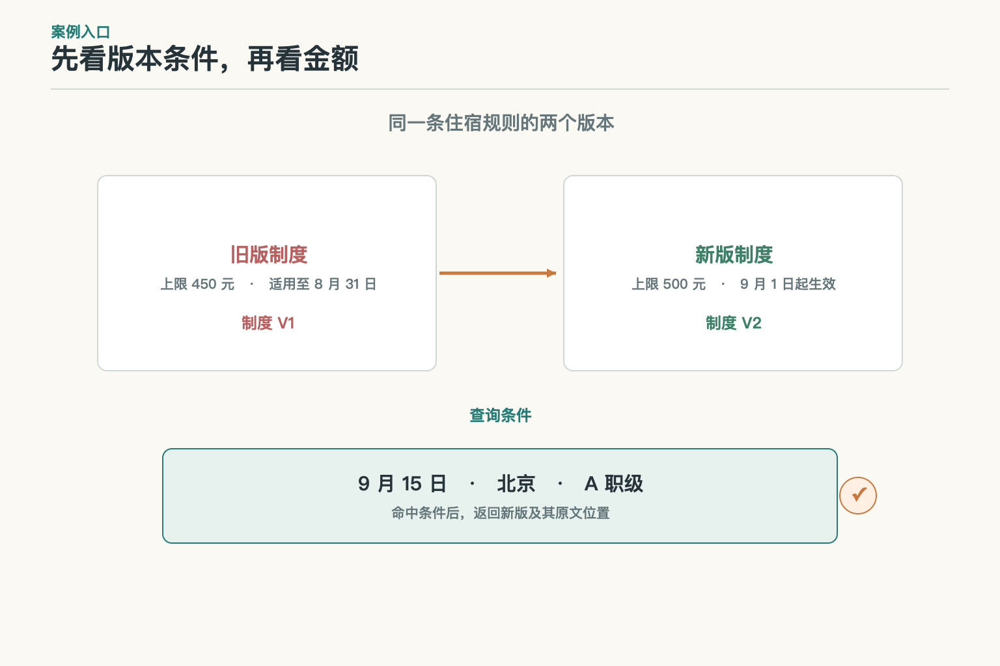

# 知识库：资料进库之后，谁保证它还管用

小林问：“9 月 15 日在北京住酒店，花了 480 元，我是 A 职级，能报吗？”手边有两份住宿制度：旧版上限 450 元，新版上限 500 元，注明从 9 月 1 日起生效。把两份 PDF 都放进系统，离回答还差几步。系统得先知道文件从哪里来、金额和适用条件有没有读对、新版是否已经生效，以及这份资料能不能给当前提问的人看。

这组练习制度只用于说明资料管理。它要回答的不是“哪句话和问题最像”，而是“哪份资料在这个日期、地区和职级下可以作为依据”。这就是知识库的工作起点。

## 一、放进系统的文件，还不算可用资料

文件夹解决的是保存问题。知识库还要能回答几个日常但重要的问题：这份材料由谁发布？谁负责维护？现在是什么状态？适用于什么时间和范围？解析结果能否对回原文？如果答案全靠文件名或上传时间猜，资料多起来后就会变成一间没有目录、还不许丢东西的仓库。

知识库管理的不是一个 PDF，而是一组互相关联的记录：原始文件、发布来源、责任人、适用条件、解析结果、版本状态和查找入口。它不一定非要装进某一种数据库。对象存储可以保存原件，关系数据库记录版本与权限，搜索索引负责查找；只要它们之间有稳定关联，出了问题能找到原文，就能构成一套知识资产管理。

拿小林的问题说，系统至少得把“北京”“A 职级”“9 月 15 日”和“住宿上限”这些条件与对应制度连起来。若资料只保存成一个名为“差旅制度最终版.pdf”的文件，所谓“最终”可能只是同事当时随手起的名字。文件名不能替制度说明效力。

## 二、先弄清这份材料是谁发的

正式制度、业务系统记录、群聊截图和同事转发的旧文件，可能写着相同的金额，来路却不一样。知识库要保存的不只是内容，还要有来源渠道、发布标识、确认状态和负责部门。之后有人问“500 元从哪来的”，系统才能指回正式发布的那版，而不是只回答“我在资料里看见过”。

资料可以分成已确认、待核和已撤回等状态。找不到正式来源的截图仍可留作调查线索，但不能悄悄升级成正式制度。确认材料也不是让模型看语气像不像公文，而是由可信的发布系统或有权限的人员给出状态。高置信度识别只说明机器较确定自己读到了什么，不能证明文件真的经过批准。

每份资料还要有明确的维护责任。制度到期谁更新？金额写错谁能撤回？遇到不同部门发来的冲突版本由谁确认？没有负责人的资料，刚入库时看起来挺齐全，过几个月就没人敢动。知识库不是把文件堆在一起就结束；它还得给“谁来维护”留出位置。

## 三、机器读出来的内容，得拿原件对一遍

一页 PDF 在人眼里有标题、表格、脚注和加粗的例外条件。解析程序可能把左右栏顺序读反，也可能把“仅 A 职级适用”丢到下一段。扫描件里的 `500` 还可能被识别成 `800`。字面上看着差不多，落到报销规则里可就不是小差别。

所以原件不能被解析文本替代。知识库应保存原文件，并让解析结果带着页码、区域或条款位置等定位信息。抽检时，维护人员能打开原页看“500 元”旁边究竟写的是北京还是上海，也能确认职级条件没有跟错行。页数、乱码、空白和表格结构可以先由程序筛；金额、生效日期和例外条款等关键内容要再抽样对照。

抽样别只挑排版最整齐的第一页。扫描页、跨页表格、脚注、附录和修订说明都可能藏着影响适用范围的内容。某一批解析如果把表格列对应错了，就先把这批资料标成不可用，再修解析或转人工检查。暂时查不到，比把错的条件送去回答要好处理得多。

状态也别只放一个 `active`。来源已确认、解析通过、索引已发布是不同环节；一个值很难说明卡在哪里。来源撤回是发布状态变化，解析超时是系统任务失败：前者要停止使用，后者可以修复后重试。分开记录，资料负责人和维护人员才不会互相等对方处理。

## 四、资料怎样变成可查、可回原文的记录

知识库通常会把一份资料整理成可查的记录，并建立索引。记录里可以保存原件编号、版本、来源位置、适用范围、权限和生效时间；索引则帮助后续环节快速找到候选材料。**索引是查找入口，不是原始依据。**

这几层得靠稳定编号连起来。比如新版住宿制度生成了多条可查记录，每条记录仍应知道自己来自哪份文件、哪一版和哪一页。小林看到“北京上限 500 元”时，审核人能顺着记录打开原页，查它是否真的适用于 A 职级、9 月 15 日。只有“来源：差旅制度”几个字，却点不开原条款，不能算追溯完成。

原件更新后，解析结果和索引可能还停在旧内容。如果界面显示“新版已上传”，查找时却仍拿到旧记录，系统就会前后说两套话。知识库需要记录一次资料版本经过了哪些处理、哪些派生记录已经更新，哪些还失败。这样上游可以明确报告“已收到，尚未可查”，不会把上传成功误当作整条资料链已经就绪。

## 五、发布时间和生效时间不能混为一个日期

旧版 450 元、新版 500 元，不能只比较数字或上传日期。制度在 9 月 1 日发布，不一定从 9 月 1 日生效；文件 9 月 5 日才补录，也不代表它 9 月 5 日才开始生效。通常至少要分清发布时间、业务生效时间、失效时间和系统入库时间。

小林的住宿发生在 9 月 15 日，题目又说明新版从 9 月 1 日起对之后的住宿生效，因此示例中应查新版。若他住在 8 月 20 日，答案还要看制度有没有追溯条款。系统不能拿“最近上传的文件”代替这个判断。地区、职级或部门也可能改变适用规则，它们应作为明确条件保存；缺了条件就提示无法确定，不能挑一份看起来更新的材料来凑答案。

历史版本仍有用。财务可能需要解释一笔旧支出当时为什么按 450 元审核。留档意味着可以回看，不代表旧版继续参与今天的问题。把历史可查与当前有效分别管理，才能同时照顾审计和现行查询。

## 六、谁能看到资料，权限得跟着它走

如果某份文件只允许财务查看，就不能先把全文交给模型，再用一句“请勿泄露”期待它处理权限。权限应从原件进入解析记录和索引；有人提问时，系统根据当前身份筛掉不允许访问的资料，然后才把可见材料交给后续环节。

从原文生成的摘要、缓存和其他派生记录，也可能包含原文里的受限信息。它们不能因为换了文件格式就变成公开资料。若一段摘要同时概括了公开制度和财务审批细则，应拆开处理，或按更严格的访问范围管理。查询结果页、引用链接和缓存也要检查权限，不能只守住索引查询这一个入口。

权限会随人员调岗而变化。昨天能看财务材料，今天未必还能看；按旧身份生成的缓存也不应一直复用。记录查询当时使用的身份、权限版本和资料版本，出了问题才查得到为什么某条材料进入了结果。

## 七、更新和撤回都要追到查找入口

新制度到来后，系统可以先登记原件和版本，完成解析，再对照关键字段。检查通过后才把对应记录切换为可查。解析失败时，旧版继续按它自己的有效条件管理；不能把新版标成已生效且可查，也不能因此把业务规则退回旧版。技术流水线的状态与制度规定的效力，是两件事。

撤回也不只是从文件夹删掉 PDF。原件可能已经产生解析记录、索引条目和缓存。撤回时要沿着来源编号找到这些记录，先阻止它们继续被查到，再逐项清理或标记失效。随后用测试问题确认旧内容已经不会返回；必要的审计记录可以说明何时由谁撤回，但不应继续保留可供回答的正文。

如果新版本处理到一半失败，知识库应能指出失败在哪一步、哪些记录仍可用。可重试的任务要避免重复生成多份“最新版”，失败也不能被界面包装成绿色的“已完成”。资料负责人看状态、数据维护人员查任务记录，才能分头处理，不必靠用户报告“它怎么还在引用旧文件”来发现问题。

## 八、怎样验收这批资料

验收知识库，不能只问它最后答对几道题。先抽查原件能否打开、来源有没有确认、关键字段有没有读准、版本条件是否完整、当前用户能否访问，以及查到的记录能否回到对应原文。新旧冲突、字段缺失、越权访问和刚发布的新版，都应放进样本里。

指标也要分开看：解析失败多少份，金额或例外条件错挂多少条，新版从发布到可查用了多久，撤回之后还残留多少条可见记录。每项都说明样本范围、分母和时间段。一个笼统的“知识库准确率 98%”既没告诉维护人员哪里坏了，也没告诉业务方这批资料能不能放心用。

比如抽查 40 条住宿金额，发现两条金额与职级条件错挂，结果应写成“2/40 条关系错误”，再按这批资料的风险决定是否阻止发布。更新时延也要从正式来源确认发布时间开始算，到目标版本真正可查为止；仅看后台任务显示成功，还不够。撤回检查则记录发起后多久所有派生内容都不可见。三种数字分别指向解析、同步和清理，修复时就能找到负责的环节。

质量不合格的资料需要明确状态和处理人。来源未确认就找发布责任人；页面解析错就修解析；更新延迟就看同步任务。知识库把问题分清楚，下一环才知道该等待、换来源还是交人工。这个范围先止于资料能否被管理、查找和追溯；怎样切分检索单元、怎样排序，留给后续模块说明。

## 参考资料

- [W3C PROV-O：描述资料、活动及派生关系的来源追溯模型](https://www.w3.org/TR/prov-o/)
- [Microsoft Learn：Azure AI Search 索引器概述](https://learn.microsoft.com/en-us/azure/search/search-indexer-overview)
- [Microsoft Learn：跟踪 Blob 变更与删除](https://learn.microsoft.com/en-us/azure/search/search-howto-index-changed-deleted-blobs)
- [AWS 文档：知识库数据源同步与摄取](https://docs.aws.amazon.com/bedrock/latest/userguide/kb-data-source-sync-ingest.html)

想看本文在 AI Agent 中的位置，可点击下方 [阅读原文](https://github.com/Jennifer123www/ai-agent-knowledge-map)，从“知识检索与检索增强生成”继续阅读。
