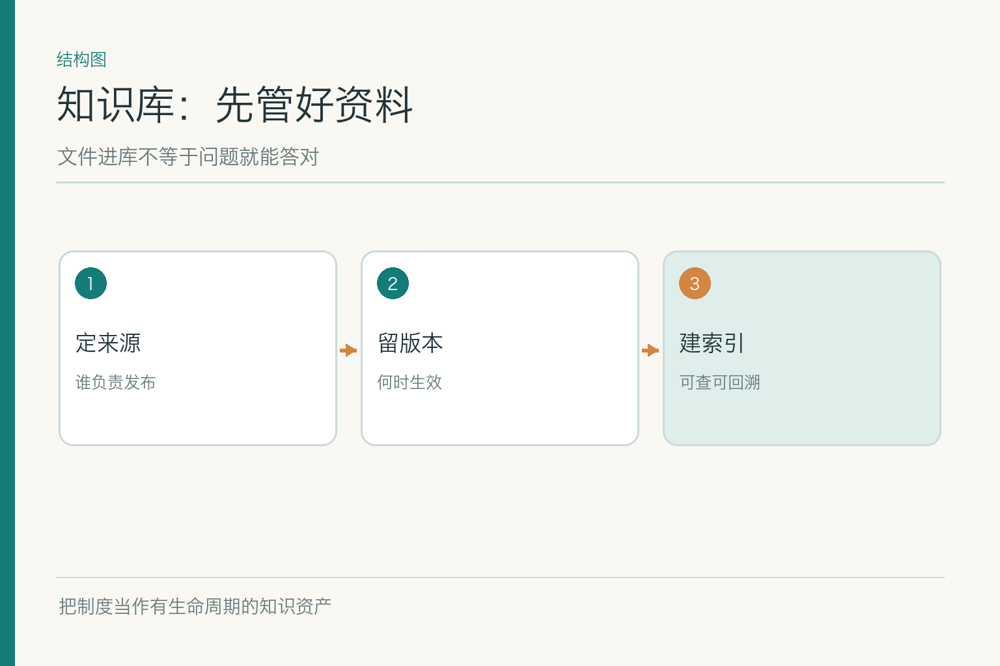
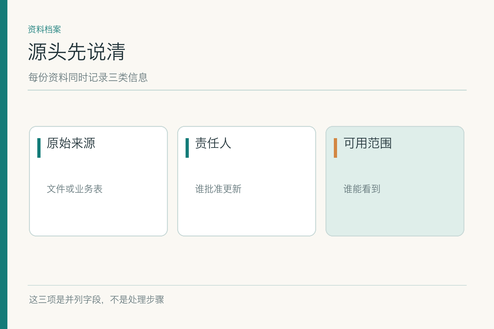
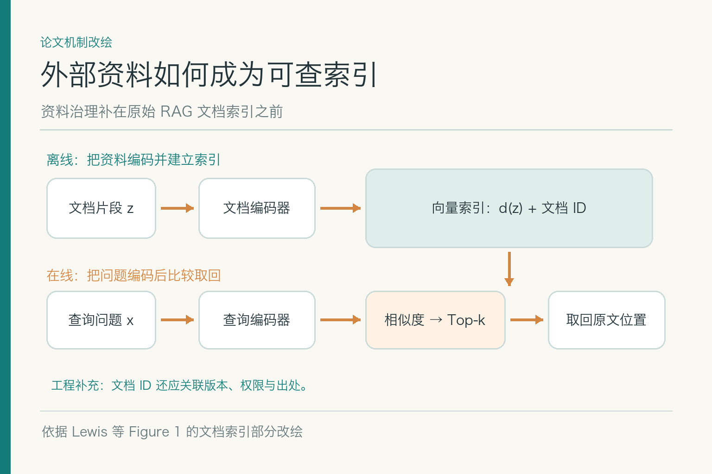
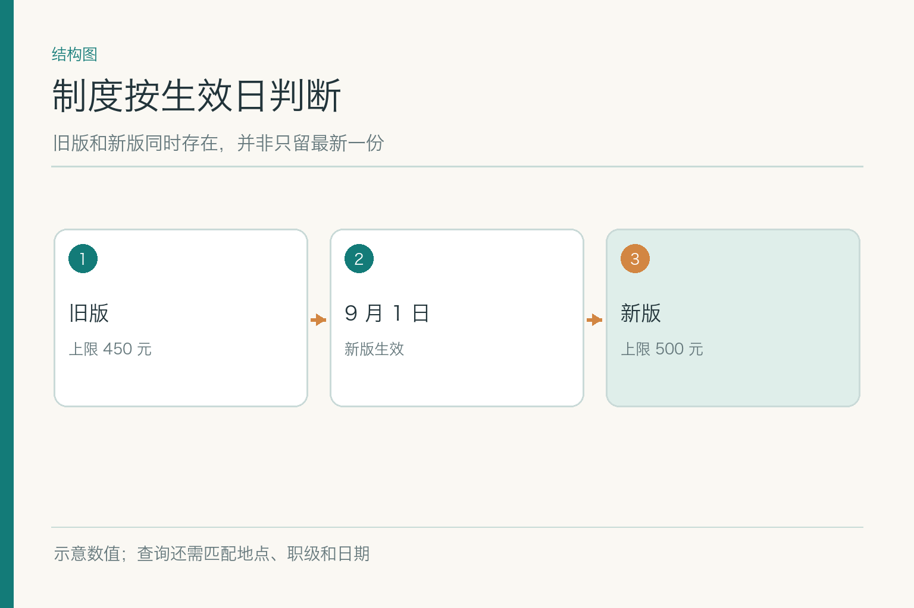
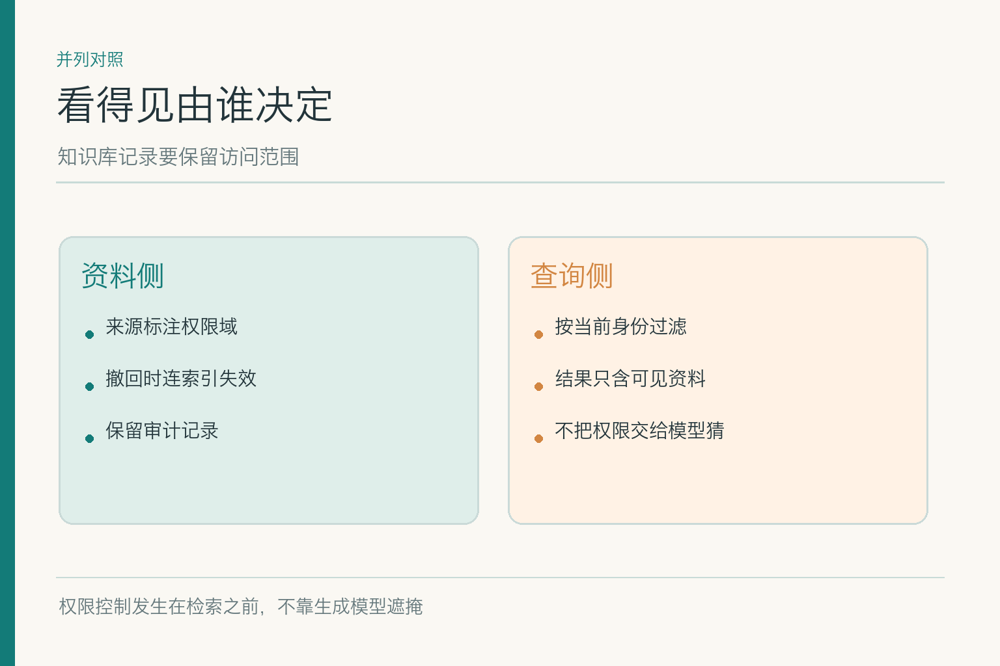
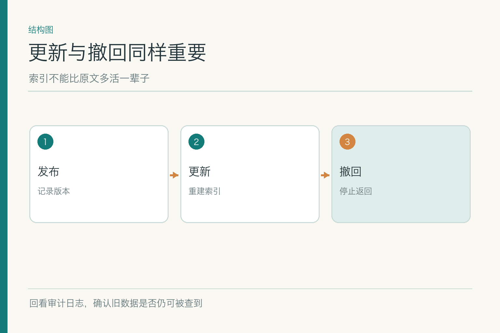

# 知识库：资料进库之后，谁保证它还管用

小林问助手：“9 月 15 日在北京住酒店，花了 480 元，我是 A 职级，能报吗？”练习用的旧制度写上限 450 元，新制度写 500 元、9 月 1 日起生效。金额、职级、地点和日期都是**虚构示例**。假设两个 PDF 都在文件夹里，甚至都已经上传到系统，助手仍可能抓到旧版。问题未必出在模型；资料入库时，可能没人记录哪版何时生效。

## 一、文件夹里有文件，还不等于有知识库

知识库是**可被管理、检索和追溯的资料集合**，不只是一个上传入口。最基本的记录要说清：原始文件在哪里、谁有权发布、当前状态是什么、哪天生效、谁能查看、解析后的内容如何回到原文。少了这些，十份制度混在一起，检索系统只能依靠文字相似度碰运气。

把 PDF 传上来是开始，不是验收。小林问“9 月 15 日”，系统必须知道旧版在当天是否仍适用；问“我能报吗”，还需确认职级与城市条件。一个“最新上传”的标签可能只是补录时间，绝不是制度生效时间。把两者混淆，机器回答得越快，错得越整齐。

本篇只谈资料资产。怎么切片、怎么做相似度、怎样写最后的回答，分别留给分段、检索和 RAG 子模块；知识库先把可供这些环节使用的原材料交付好。

资料也有不同保质期。公司章程可能多年少变，报销制度可能每季修订，员工部门和审批状态可能当天变化。知识库不应给所有来源套同一个“每晚更新一次”的时钟；更新策略要跟着资料责任人和业务时效走。否则系统表面有统一入口，背后却把慢变规则与快变状态混为一谈。

## 二、谁说这份制度是真的

同一份“北京住宿上限 500 元”可能出现在正式制度、部门群聊天、同事转发截图和旧报销单里。文字一样，**权威等级不一样**。入库时应给资料指定来源类型和责任人：正式发布的政策以发布渠道与批准记录为准；业务数据库里的审批状态以系统记录为准；聊天截图最多当发现线索，不能自动变成制度。

这不是让模型“猜哪个更像官方”。发布人、发布渠道、文件标识和状态应由可信系统提供，并由人工或受控流程确认。若只有截图、找不到原文，可以标成待核资料，查询时不用于给出肯定结论。把待核信息与正式制度放进同一个索引而不标状态，后面再好的排序模型也可能认真地把谣言排第一。

资料责任人还要能回答两个问题：这份文件的下一版由谁更新？发现错误由谁撤回？没有责任人的“共享知识”很容易变成谁也不敢删的历史遗迹。

## 三、机器读到的内容与原文相同吗

一页 PDF 在人眼里有标题、两列表格和脚注；解析器输出的文字可能先读右列、再读左列。若“仅 A 职级适用”被挪到另一条下面，知识库已经在入库时改写了事实。扫描件还可能把 500 识别成 800；表格跨页时，表头留在上一页，下一页只剩一排孤零零的数字。

知识库应保存**原件、解析文本和定位信息**三层材料。抽检时能拿解析结果与原页对照；解析失败可回到原件重做，而不是从一句已经失真的文本里推断原意。程序可以检查页数、空白率、异常字符和表格行列数；制度中的金额、例外、日期等关键字段仍值得人工抽样复核。

抽检不只选排版漂亮的前两页。应覆盖扫描页、跨页表格、脚注、附录和修订说明。若某批解析质量不合格，就先标记不可检索，别让它悄悄进入线上回答。知识库的失败最好早一点、响一点，别等员工拿错额度去报销时才发现。

可以把“解析验收”做成一张小清单：页数有没有少，条款编号有没有跳，关键金额有没有异常，表格标题能否跟到每一行，引用位置能否在原件里打开。自动检查负责发现大面积问题，人工抽检负责识别“每个字都在、意思却被读乱了”的问题。两者相互补位，不能因为 OCR 给出高置信度就跳过业务重要字段。

## 四、资料怎样变成可查的记录

*依据 Lewis 等 RAG 论文 Figure 1、§2.2 的外部文档索引部分改绘；版本、权限与出处关联是知识库工程扩展。*

原始的检索增强生成研究把外部文档索引作为模型参数以外的知识来源。工程上的知识库还要做更多准备：给每份资料一个稳定 ID，把解析后的内容连同标题、版本、来源位置、权限域和时间条件写入可查询记录，再建立供检索使用的索引。图里的索引是**查找入口**，不是权威原件。

小林的问题最终可能命中一段“北京住宿上限 500 元”。系统不仅要返回这句话，还应返回它属于哪个文件、哪一版、哪一条、哪里能打开原文。若索引只保留文本，不保存关联，回答里虽然能写“来源：差旅制度”，读者仍找不到相应条款。那叫有出处的样子，不叫可追溯。

这一步也解释为何资料更新不能只改文件。原文、解析记录、检索索引可能存放在不同地方；更新任意一处，都要知道另外两处是否已同步。否则页面显示新制度，检索命中的却仍是旧索引。

## 五、版本与生效日期是两回事

旧版上限 450 元，新版上限 500 元，并不意味着永远只取“500”。若小林住宿日期是 8 月 20 日、9 月才来问，新制度是否追溯适用要看**制度自己的规定**。示例暂设新规从 9 月 1 日起对之后住宿生效，因此 9 月 15 日查新版；这不是普遍的报销规则。

一条资料至少要区分发布时间、业务生效时间、失效时间和入库时间。发布时间告诉我们它何时被宣布，生效时间决定业务判断何时开始使用它，入库时间只说明系统何时收到。查询时应同时带上问题中的业务日期和查询当天的资料状态，不能用一个 `updated_at` 代替全部时间含义。

版本还可能并行：北京与上海不同，研发与销售不同，A 职级与 B 职级不同。资料记录要保存这些适用条件；判断不出来时保留冲突，不偷偷挑“看起来最新”的那份。

版本记录不宜直接覆盖旧文件。旧文件可能需要解释某笔历史费用当时为何按 450 元判断；可审计不等于继续让它参与今天的新问题。更稳的做法是保留历史版本的可回看性，同时按业务日期和状态决定它能否成为当前证据。这样“历史可查”与“当前有效”就不会互相打架。

## 六、权限不能等到回答时才遮住

如果制度库还存着仅财务可看的审批细则，普通知识问答不应先把全文检索出来，再命令模型“不要泄露”。模型已经拿到内容，后续日志、缓存或生成都可能扩大暴露。**访问范围应随资料进入索引，并在查询时按身份过滤**。权限不是文章标题旁的一枚小锁图标，而是可执行的条件。

分段、摘要和图谱节点由原文派生，也要继承或重新计算权限。财务文件被切成二十段以后，不能因为小段没有“机密”二字就变公开。若一条汇总综合了公开与受限来源，应按更严的访问范围处理，或把两类内容拆开。这里不能只看主文档的权限，还要看派生资产。

用户权限会变，资料权限也会变。小林调岗后，旧权限下构建的缓存不能继续替他回答内部制度。查询身份、权限过滤结果和索引版本都应进入审计记录，出问题时才能解释当时为什么返回那条证据。

## 七、更新与撤回如何到达索引

新制度发布后，流程需要把原件、解析记录与索引关联起来，确认索引已出现新版，并使旧版按业务规则失效。可以先建立新版本，再验证其检索结果，最后切换线上可见状态；如果解析失败，不应把“上传成功”误报成“知识已更新”。更新记录要能重试，重复处理同一文件也不应产生多份互相矛盾的“最新版”。

撤回更容易被忽略。源文件删了，向量索引可能还留着旧片段；摘要缓存和图谱关系也可能继续引用已撤销内容。应记录从原文到派生记录的关联，撤回时逐层失效，再用一个查询验证“不该出现的内容确实不再出现”。技术索引可回退到稳定版本，但**不能借回退重新启用已失效的制度**。

对于 9 月 15 日的示例问题，更新验收不是“新文件数量加一”，而是用带日期、地区和职级的测试问题查到正确版本，且旧版不会越过有效期过滤进入答案。

更新也可能是修正错字而非改规则。此时应说明哪些片段和引用发生变化，哪些只是格式调整；若正文的金额、适用条件或生效日期改了，则必须按业务变更重新验收。发布流水线记录“从哪个源版本产生了哪个索引版本”，比一个只有时间戳的“最后更新成功”更能帮人排查问题。

## 八、怎样知道知识库真的可用

验收可以从一小组有原文标注的问题开始：普通问法、旧新冲突、字段缺失、新版本刚发布、用户无权查看。逐项看资料是否齐全、解析是否保留关键条件、版本是否选对、权限是否守住、原文能否打开。**这些是资料层的检查**，不靠最后一句生成答案“看起来对”来替代。

还应监测更新延迟：制度从正式发布到索引可查相隔多久；记录有多少解析失败、待核未发布、撤回未传播。指标给出样本与分母，别只写一个“知识库覆盖率 98%”却不说覆盖哪些文件。抽查出问题时，保留资料 ID、版本和转换日志，让修复可重复。

知识库交给下一环的是一批可查、可过滤、可回原文的证据记录。至于哪段最相关、如何组织回答，那是后面的工作。资料地基稳，模型才有机会说对；地基松，换个更贵的模型也只是让错误多穿一件西装。

从维护角度看，这批记录还应有清晰的“不可用”状态。解析失败、来源撤回、权限待确认或更新不同步，都不该被压成一个空字符串送给检索器。把原因保存下来，下一环才能选择跳过、提示缺口或交人工，而不是把“没找到”误判为“制度里没有规定”。

## 参考资料

- [Lewis 等：Retrieval-Augmented Generation for Knowledge-Intensive NLP Tasks](https://arxiv.org/abs/2005.11401)
- [W3C：PROV-O，资料来源与派生关系模型](https://www.w3.org/TR/prov-o/)
- [Microsoft GraphRAG：从源文档到派生知识的默认数据流](https://microsoft.github.io/graphrag/index/default_dataflow/)

想看本文在 AI Agent 中的位置，可点击下方 [阅读原文](https://github.com/Jennifer123www/ai-agent-knowledge-map)，从“知识检索与检索增强生成”继续阅读。
