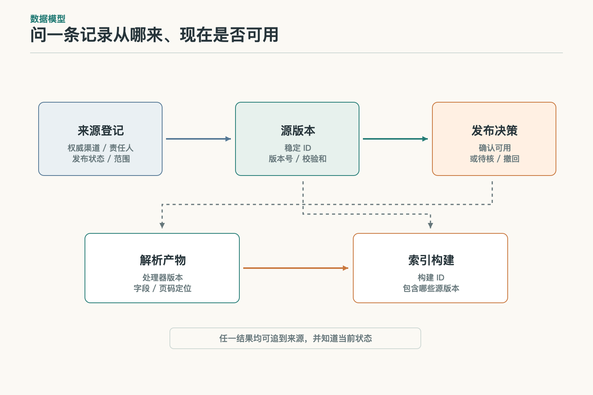
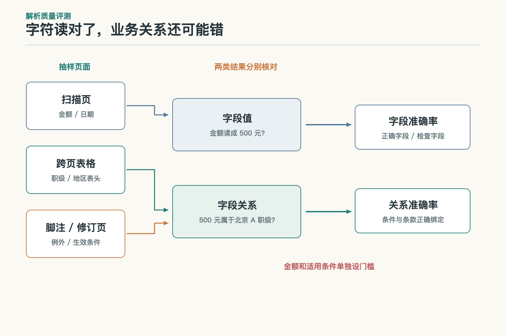
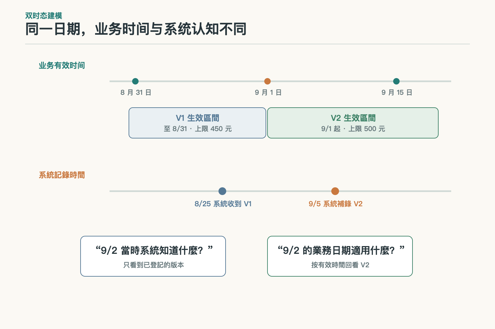
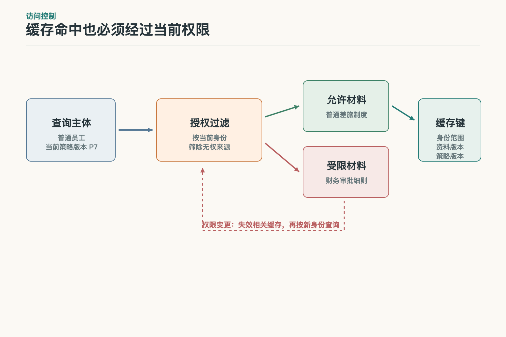
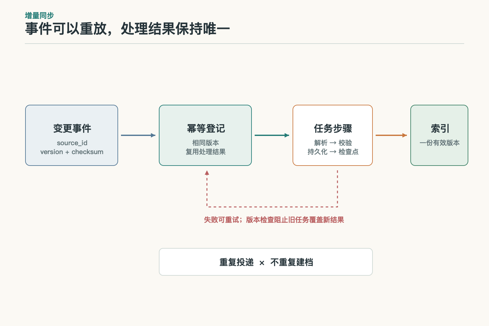
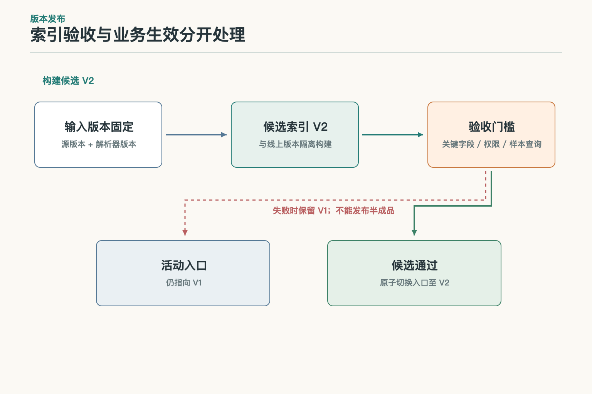
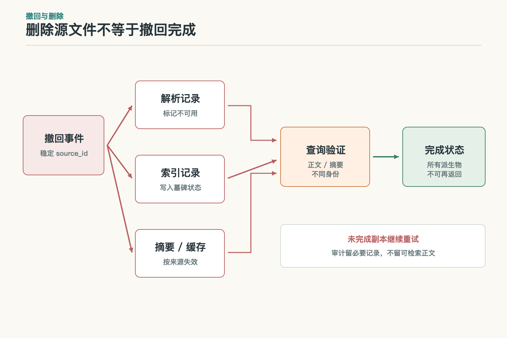

# 面试题：知识库怎样管好资料全生命周期

假设系统保存着两份住宿制度：旧版上限 450 元，新版上限 500 元，自 9 月 1 日起生效。员工在北京住店、职级 A、日期为 9 月 15 日，票面金额 480 元。面试官可能会从这组资料追问：怎么确认来源？解析错了怎么办？新版入库失败时是否切换？权限变了，旧缓存如何处理？下面不重复介绍知识库有哪些字段，而是看这些字段怎样支撑可恢复的工程过程。

## 问题 1：知识库的数据模型最少应有哪些对象？

### 原理

如果把原始文件、解析文本和索引记录都塞成同一条“文档”，版本更新就很难判断哪些是源、哪些是派生结果。更可维护的模型会分开保存来源对象、源版本、解析产物和索引构建版本，并用稳定标识建立关系。这样才能回答“这条可查内容来自哪份原件、经过哪次处理、当前是否可用”。

### 答题点

回答时可以从 `source_id` 开始：同一份制度的修订沿用稳定来源身份，每次内容变化产生新的 `source_version` 或校验和；解析任务记录工具版本与状态；索引构建记录它包含哪些解析产物。北京 A 职级的“500 元”这条记录应能回到新版文件中的页码或条款，而不是仅存一个搜索文本。状态、所有者、来源 URI、业务范围和时间字段也要与正文分开保存，便于独立更新和审计。

### 记忆点

> 原件定身份，版本记变化，派生物留回路。

**常见追问：** 向量数据库能不能直接作为完整知识库？它可以保存和查询向量记录，但资料审批、有效期、权限和来源关系通常还需要其他数据结构或服务。**失分点：** 列完数据库名称，却说不清搜索结果怎样回到经过确认的原文。

## 问题 2：同一条规则有多个来源时，怎样处理冲突？

### 原理

来源选择应由业务发布制度定义，而不是现场给每段文字算一个“可信分”。正式制度、已确认的业务主数据和聊天截图承担的角色不同；谁能发布、谁负责确认、冲突交给谁，应该在资料注册环节就确定。无法确认的记录保留冲突状态，避免它被当作普通可用资料参与回答。

### 答题点

先登记获准来源和责任主体，再为每次发布记录来源标识、版本、审批或确认状态。收到内容相同的转发件时，将其关联到正式来源，不能创建另一个同权威版本。若两份正式记录在有效期内都声称适用，记录冲突双方和待确认责任人；不能靠“最近更新”或文件标题里的“最终版”自动裁决。验证可用旧版、新版和无来源副本组成一组对照，检查系统是否只把符合治理条件的记录标为可用。

### 记忆点

> 先确认谁有发布权，再处理内容写了什么。

**常见追问：** 无法联系责任人时怎么办？把资料维持在待确认状态，并返回当前无法判断；检索到材料不等于获得了确认。**失分点：** 用语言流畅度、OCR 置信度或时间戳替代发布授权。

## 问题 3：怎样衡量文档解析质量，避免“字都在、条件错挂”？

### 原理

字符识别准确率只看字符是否读对，不足以发现表格列错位、脚注串行或限制条件挂到错误条款。解析验收要分字段值和字段关系：金额是不是 500、它是否仍与“北京”“A 职级”“9 月 1 日生效”保持关联。页面结构复杂度不同，抽样策略也不应只取随机的前几页。

### 答题点

将扫描页、双栏页、跨页表格、脚注和修订说明分层抽样；为金额、生效日期、适用对象等字段建立人工核准的参考结果。字段准确率可按“正确字段数 / 检查字段数”统计，关系准确率另看字段与条款、职级、地区的绑定是否正确。上线门槛由风险决定，高风险字段错一次就可能要拦批次；低风险排版差异可以走人工复核。失败样本应保留原页坐标、解析输出和处理器版本，便于重现与修复。

### 记忆点

> 不只看字认没认对，还要看它跟谁连在一起。

**常见追问：** OCR 总体准确率 99% 能否直接上线？不能，剩余 1% 若集中在金额和适用条件上，业务风险仍很高。**失分点：** 只报字符准确率，或者用最终问答准确率掩盖解析环节的问题。

## 问题 4：为什么有时需要同时保存业务有效时间和系统记录时间？

### 原理

业务有效时间回答“这条规则在现实业务中何时适用”；系统记录时间回答“系统何时知道这条信息”。它们不同步很常见：一份修订在 9 月 5 日补录，业务上却从 9 月 1 日生效。只保存一个 `updated_at`，就无法同时回答“现在认为 9 月 2 日适用哪版”和“9 月 3 日当时系统里有什么记录”。

### 答题点

建模时分别保存 `valid_from / valid_to` 与 `recorded_from / recorded_to`，并明确定义边界是闭区间还是半开区间。业务查询按住宿日期筛有效区间；审计查询还可以加“截至某个系统时间”。如果晚到的新版追溯生效，不能静默覆盖历史判断，而应形成一条新的系统记录并保留修订轨迹。涉及跨时区时间点时统一时区，只有日期的制度则不要凭空补具体时刻。

### 记忆点

> 一条时间管“当时适用”，另一条时间管“系统何时知道”。

**常见追问：** 新版追溯生效后，旧回答是否要改写？保留原回答当时依据的系统状态，并按业务规则决定是否重算；两种查询都要能解释。**失分点：** 把上传时间、发布时间和业务生效时间合成一个“最新日期”。

## 问题 5：权限如何传到索引、摘要和缓存？

### 原理

权限不能只挂在原始文件上。解析出的记录、摘要和可复用结果都可能保留原文信息，因此应携带访问范围或在生成时按更严格范围计算。查询端要根据当前身份执行访问检查，再把允许的材料交给后续处理；缓存若不区分用户或权限版本，就可能把先前可见的结果带给后来无权访问的人。

### 答题点

为派生记录保存来源权限或安全标签；请求时取得当前主体及策略版本，在返回任何资料前检查授权。缓存键至少包含影响结果的身份范围、资料版本和权限策略版本；权限撤销或组成员变化时使相关缓存失效。可以设计反例测试：同一查询分别以财务和普通员工身份执行，之后再撤销财务权限并重放，检查正文、摘要、引用和缓存是否都不再返回受限内容。

### 记忆点

> 权限跟着资料走，缓存也要认当前身份。

**常见追问：** 提示模型不要泄露能不能代替过滤？不能，模型已经接触资料，后续生成和缓存都可能暴露。**失分点：** 只验证主文件权限，没有测试摘要、缓存或引用页。

## 问题 6：增量同步怎样做到可重试且不重复？

### 原理

资料同步通常会重试；网络超时也可能让调用方不知道上次是否成功。若每次重跑都新建一份版本，索引中就会出现多个“当前制度”。需要用稳定来源标识、源版本或内容校验和区分真正变化与重复投递，并让处理任务具有幂等性。

### 答题点

一次同步记录来源版本、校验和、任务 ID 和处理阶段；同一版本重复到达时复用已有结果，不重复创建记录。只有校验和变化或权威版本号前进才触发重新解析和索引构建。检查点应在结果持久化后推进，失败任务可以从最后确认的阶段重试。并发更新要比较源版本，拒绝较旧任务覆盖新结果。系统可用重复事件、乱序到达、解析超时和写入成功但回执丢失等场景验证幂等性。

### 记忆点

> 重试可以重复发生，结果不能重复生长。

**常见追问：** 按文件名去重可以吗？文件改名后会重复，两个文件同名又可能被误合并；需要稳定来源 ID 配合版本或内容校验。**失分点：** 把“定时全量重建”当成唯一同步策略，也没说明失败后的恢复点。

## 问题 7：索引新版本怎样上线，避免半成品被查到？

### 原理

解析和索引构建可能部分成功。若直接在当前索引上逐条覆盖，查询期间就可能同时看到新旧版本，或者新文件只进了一半。可以为每次发布建立独立构建版本，验证完成后再把线上入口切换到它；切换点尽量原子化，失败时继续指向上一份可用构建。

### 答题点

记录本次输入源版本和处理器版本，构建隔离的候选索引；检查文档数量、关键字段、权限过滤和代表性查询。通过后切换别名或活动版本指针，并监控错误率与更新时间。验收失败就保留当前版本、标记候选构建失败并允许重试。回退技术索引只恢复到已批准且仍有效的资料集，不能让业务上已经撤回的规则重新生效。

### 记忆点

> 先建一套并验清，再切换线上入口。

**常见追问：** 新制度已经业务生效，但索引构建失败怎么办？展示更新尚未可查并走既定人工路径；不能谎称索引已更新，也不能擅自改变制度效力。**失分点：** 把技术回滚说成业务版本回滚。

## 问题 8：资料撤回后，怎样证明用户确实查不到了？

### 原理

删除事件必须沿来源到派生记录的关系传播。光删原文件并不能保证解析文本、搜索索引、摘要或缓存同步消失。撤回任务应留下可追踪状态，并能在失败时继续执行；审计需要的最少元数据与可供回答的正文内容应分开保存。

### 答题点

为来源登记撤回或删除事件，以稳定 ID 找出受影响的记录和缓存，先阻断新查询，再异步清理各副本。使用墓碑状态避免迟到的同步事件把已撤回版本重新建回来；清理重试保持幂等。验收不能只看删除 API 返回成功，应同时用原问题、近义问法和不同用户身份检查正文及摘要不再出现，并记录未完成的副本与处理时限。审计记录保留责任人、时间和版本关系，不保留不必要的可检索正文。

### 记忆点

> 删源只是发起撤回，查不到才算验收。

**常见追问：** 某个下游暂时不可用怎么办？先让该来源不可查询，记录未清理副本并持续重试；不能把删除标成完成。**失分点：** 只看原件消失，或在日志里留下完整正文作为“审计”。

## 参考资料

- [W3C PROV-O：来源与派生关系模型](https://www.w3.org/TR/prov-o/)
- [Microsoft Learn：Azure AI Search 索引器概述](https://learn.microsoft.com/en-us/azure/search/search-indexer-overview)
- [Microsoft Learn：跟踪 Blob 变更与删除](https://learn.microsoft.com/en-us/azure/search/search-howto-index-changed-deleted-blobs)
- [Microsoft Learn：Azure AI Search 安全裁剪](https://learn.microsoft.com/en-us/azure/search/search-security-trimming-for-azure-search)
- [AWS 文档：知识库数据源同步与摄取](https://docs.aws.amazon.com/bedrock/latest/userguide/kb-data-source-sync-ingest.html)

想看本文在 AI Agent 中的位置，可点击下方 [阅读原文](https://github.com/Jennifer123www/ai-agent-knowledge-map)，从“知识检索与检索增强生成”继续阅读。
