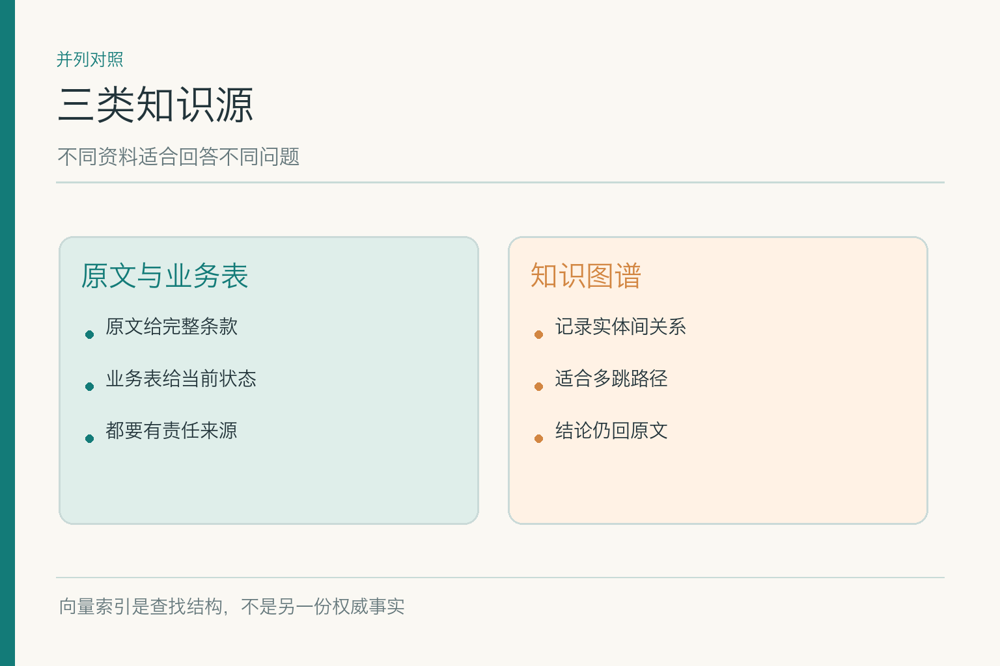
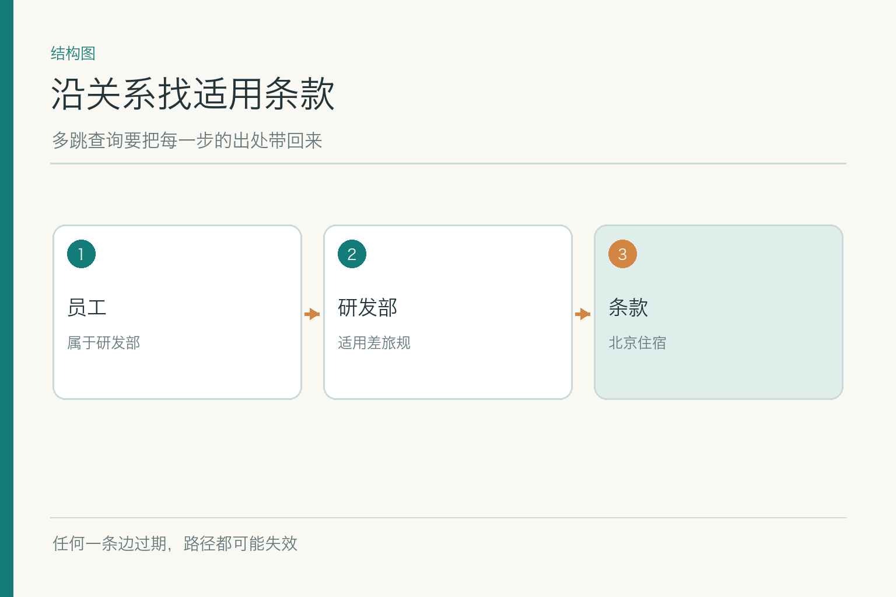
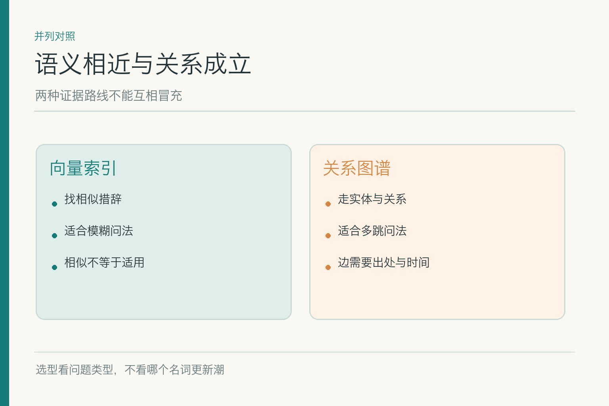

# 知识图谱：当问题需要跨过好几条关系

沿用一组**虚构的制度数据**：小林是研发部 A 职级员工，2026 年 9 月 15 日在北京住宿 480 元；旧版上限 450 元，新版自 9 月 1 日起上限 500 元。问题“能报吗”看似查一条数字，实际上要把“员工属于哪个部门”“该部门适用哪份制度”“北京是哪个地区档位”“住宿日期落在哪个有效期”连起来。文字检索能找到相似段落，但不一定替我们把每一段关系查对。

## 一、先看问题缺的是事实，还是连接线

如果问题是“差旅制度第七条写了什么”，直接打开原文最稳。若问“小林适用哪条住宿标准”，就要连接员工、部门、职级、地区、制度和条款。一个段落可能只有“北京上限 500 元”，另一个表格写“研发部按 A 职级标准”，身份系统又记录小林的部门。分开看都没错，连错一步，结论仍会错。

知识图谱擅长表达这种**实体与关系**。实体可以是员工、部门、城市、政策版本；关系可以是“属于”“适用”“位于”“修订自”。图中的一条边最好还带来源、有效期和确认状态。没有这些属性，图谱只是画得整齐的传闻网。

别把所有问题都硬拗成关系图。直接查一个金额时，业务数据库或制度原文可能更清楚。图谱的价值要用实际的多跳问题验证，而不是因为展示页面上的连线很漂亮。

一个好用的小测试是把问题写成“从谁出发，沿什么关系，最后要到哪里”。如果说不出中间的关系，只是想找一个段落，图谱大概不是第一选择。反过来，若用户问“哪些地区的 A 职级员工受 9 月修订影响”，关系路径就能帮忙枚举受影响对象，而单段语义相似检索未必容易覆盖全。

## 二、文档、业务表和图谱各放什么

制度原文负责说明规则和例外，业务表负责当前员工身份或报销状态，图谱负责保存已确认的连接方式。向量索引则主要帮助找语义相近的文字片段；它是查找结构，不是一份新的权威资料。四者可以协作，却不应在回答里混成“知识库说”。

例如“研发部员工”来自组织目录，“北京住宿 500 元”来自新版制度，“该制度对研发部 A 职级生效”来自制度适用范围。图谱可把这几条关联起来；最终展示给小林时，仍要能点开原文条款和必要的业务状态。**图上的路径帮助定位，原文与业务记录负责核实。**

资料还会相互冲突。组织目录记录小林已调部门，旧员工画像仍写研发部时，应按正式身份系统与业务发生日期核对；不能因为旧图上的边更短，就偏爱旧事实。关系强度不是权威等级。

## 三、一条关系怎样被写进图里

最简单的表示是“主语—关系—宾语”，例如“小林—属于—研发部”“北京—适用地区档位—一线城市”。但一条边若缺少来源，出了错就无法说明是从文件抽取的、业务系统同步的，还是模型猜出来的。工程上应记录来源文档 ID、页码或表格行、抽取方法、审核状态与有效时间。

同名实体也会制造麻烦。一个“华东区”可能是销售大区，也可能是差旅政策中的地区分组；两者名称相似，范围未必相同。建图时要有稳定实体 ID、类型和别名，遇到无法确定的映射先标“待确认”，不为了让图连通而强行合并。

图谱建立后也不是永久正确。部门调整、政策替换、城市档位变更都会使某些边失效。更新时不仅要增加新边，还要处理旧边的有效期，保留必要的审计轨迹。否则 9 月的新制度已经生效，图却仍沿着 8 月的“适用旧版”走。

建图流程里还要分清“从原文明确抽到的关系”和“根据多条资料推断出的关系”。前者也可能读错，后者的不确定性更大。可把推断边单独标记，记录参与推断的每份来源，并限制它自动进入高风险结论。图谱像一张路线图，但路线是否可通行，仍要看路况与日期。

## 四、GraphRAG 的论文在做什么

*依据 Edge 等《From Local to Global》Figure 1 改绘；具体条款回原文核对是本例的工程补充。*

GraphRAG 是把图结构用于检索增强生成的一类方法，不是一款神奇数据库。微软研究团队的代表性工作先从源文本抽取实体与关系，形成图，再把相关实体划成社区、写出社区摘要；面对“这一大批资料的主要争议是什么”之类**全局主题问题**，先在多个社区形成局部回答，再汇总。它瞄准的是普通片段检索难以覆盖的跨材料概括。

小林的报销题是相对局部的问题，并不天然需要完整的社区划分与摘要流水线。若我们只要从“员工→部门→制度→条款”走几步，再回原文核对，轻量关系查询可能已经足够。把论文中的全局摘要架构照搬进几十份制度，会带来抽取成本、索引维护和错误传播，却未必提高答案质量。

图上还多了一条“回原文”的支线。这不是把原论文每个节点机械复制，而是针对业务判断补上的验收：社区摘要适合归纳主题，但不能替代某条制度在某日对某人的效力证明。

论文里的社区摘要也会带来信息压缩损失。一段摘要说“北京住宿标准有所提高”，这能帮助回答制度变化趋势，却不足以回答“提高到多少、谁适用”。若把两类问题共用同一摘要当证据，就容易把概括能力误当精确判断能力。因此索引中最好保留从社区、实体关系到原始文本单元的回溯路径。

## 五、局部多跳与全局归纳怎么区分

局部多跳问题有明确对象和目标，如“小林这次住宿适用哪条规则”。系统从已核身份出发，沿部门、职级、地区、版本走到相关条款；每一步都保留出处。某条边缺失或冲突时，给出“无法确认适用部门”比跳过它更诚实。最终条款还要打开原文检查金额条件、例外和生效日期。

全局归纳问“这两年差旅制度变化的主要方向是什么”。答案可能散在多版政策和通知中，没有单条路径足以覆盖。社区摘要或分层归纳可帮助找到共同主题，但摘要本身可能遗漏少数例外；要引用具体结论，仍需追到原始段落。

两类问题的评测也不同。局部题看路径是否真实、节点是否适用、原文是否支持；全局题还要看主题覆盖、遗漏与摘要是否歪曲。把两种问题混进一个“命中率”里，模型可能靠答对简单条款题掩盖跨材料概括的缺陷。

## 六、图谱抽错一条边会怎样

假设模型从一张旧组织表里抽出“小林—属于—销售部”，并把它当成现状。查询会顺着销售制度一路走下去，条条关系看似齐全，却全部建立在一个过期身份上。与一般检索的“找错片段”不同，图谱错误会**沿路径传播**：后面的每一步可能都合法，但起点已经错了。

还有隐蔽的关系歧义：“适用”可能指发布时适用、查询时适用，也可能只对某个职级适用。若边的含义不写清，图谱会把条件折叠成一句泛泛的“部门适用制度”。处理办法是让关系类型有定义，并把职级、时间等条件作为可检查属性或中间节点保留。

自动抽取有助于扩大覆盖，但不能替代核验。高风险的政策边可以通过规则从结构化表生成，或由负责人审核；未经核实的边只能辅助查找。使用路径时记录走过哪些边、每条边依据什么，才能在错误发生后复盘。

## 七、什么时候根本不该建图

若业务问题大多是“找到这段原文”“查询订单状态”，全文检索或数据库查询既便宜又容易审计。建图前可以从一份问题集出发：其中有多少题需要跨实体或跨资料的明确关系？这些关系是否稳定？来源是否可靠？抽取与维护成本能否换来可衡量的改进？

图谱不该用于把缺失的证据伪装成有结构的结论。若部门与制度的对应关系从未发布，画出一条边不会使它真实。相反，应该把“当前无正式映射”变成系统能展示的结果。小林也许会嫌助手话多，但总比报销被退回后才知道“AI 帮我连的”强。

## 八、把每条边带回证据

关系查询给出一条路径时，应能回答：每个节点指的是哪位员工或哪版制度？每条边来自哪份文件或哪张表？记录在业务日期是否有效？原文与提取出的关系是否一致？W3C 的来源追溯模型提供了描述实体、活动及派生关系的通用语言；实际落地可从稳定 ID 与来源位置做起。

给员工展示时不必暴露内部图的所有细节，但关键断言要有可点开的依据。“按新版北京 A 职级标准，上限 500 元”应分别有身份、地区和条款证据。若某项证据受权限限制，不能泄露原文，也不能假装已经完成核验；可转给有权人员处理。

## 九、如何验收图谱不是漂亮的错图

先准备少量人工核准的实体、关系和多跳问题，再测试抽取正确率、同名实体消歧、关系有效期和来源链接。样本包括普通路径、旧新冲突、缺一条边、同名不同实体、新制度刚发布。答错时定位是抽错节点、连错边、路径遍历错，还是生成时忽略了条件。

系统层面再看总成本和维护频率。图谱的“召回更多关系”若导致大量无依据的路径，不能算收益。最稳的目标不是把所有资料画成图，而是让**需要关系的问题有关系可查，需要事实的结论有原文可核**。

评测报告还应把图谱与简单基线放在同一题集里比较。如果二十道问题只有两道真要多跳，图谱让那两道变好，却使其余十八道更慢、更难解释，就要考虑是否只在特定问法上启用。按需使用不等于能力不足，而是尊重资料形态和维护成本。

上线以后还应定期抽查新边与被撤回的边。图谱最容易在刚建好时显得完整，最难的是三个月后仍能解释每条关系为何存在。与其展示一个永远光鲜的节点总数，不如每周确认新增来源是否带来了待审核关系、过期关系是否真正退出线上路径。

## 参考资料

- [Edge 等：From Local to Global: A Graph RAG Approach to Query-Focused Summarization](https://arxiv.org/abs/2404.16130)
- [Microsoft GraphRAG：索引数据流](https://microsoft.github.io/graphrag/index/default_dataflow/)
- [W3C：PROV-O 来源追溯模型](https://www.w3.org/TR/prov-o/)

想看本文在 AI Agent 中的位置，可点击下方 [阅读原文](https://github.com/Jennifer123www/ai-agent-knowledge-map)，从“知识检索与检索增强生成”继续阅读。
