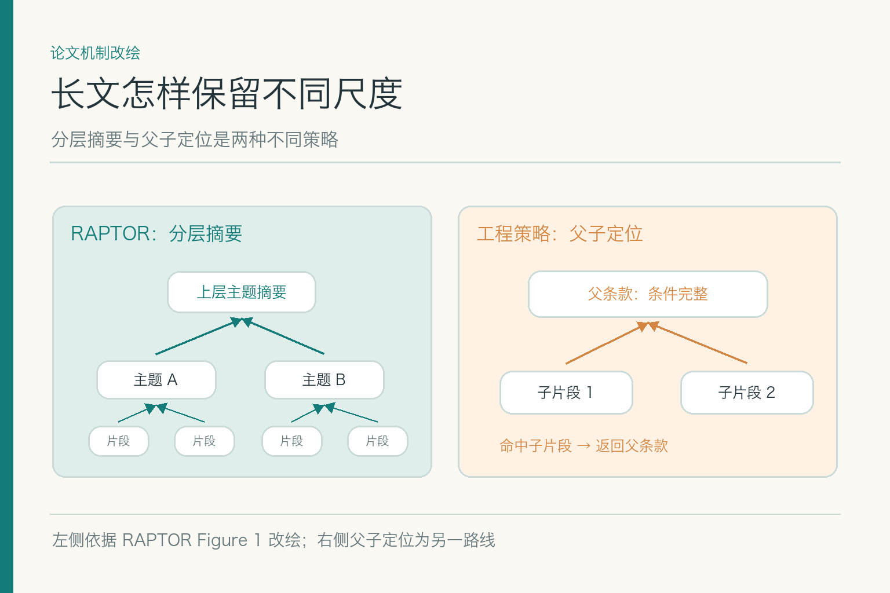

# 面试题：切文档时怎样保住条件和出处

## 问题 1：为何不能一律按固定字数切文档？

**原理：** 固定长度是便宜的基线，却不认识章节、表格、定义和例外。切点若落在主句与适用条件之间，片段看起来完整，语义却已改变。

**答题点：** ① 先识别文档结构与阅读顺序；② 尽量以完整条款或语义单元为边界；③ 条件、例外、表头要跟随被限定的正文；④ 用真实问法验证片段可理解、可定位。示例中“500 元”与“仅 A 职级”必须能一起被看到，或能从短片段可靠返回父条款。

**记忆点：** 切得方便，不等于切得有用。**常见追问：** 固定长度完全不能用吗？可作为简单资料的基线，但要测边界错误，必要时加结构规则。**失分点：** 只给一个固定字数和重叠比例，却没有文档类型与问题集。

回答最好展示一次具体切坏：原文写“北京上限 500 元，仅 A 职级，自 9 月 1 日起”，机器第一块只保留金额，第二块才留下职级和日期。若检索只返回第一块，模型会把局部信息扩展为普遍规则。修法是按条款边界切，或让短块能回到包含限制条件的父级；不是简单把 `Top-k` 从五调到十。

## 问题 2：父子分段与分层摘要有什么不同？

*左侧依据 RAPTOR Figure 1 改绘；右侧父子定位是另一种工程策略。*

**原理：** 父子分段通常用小片段做检索命中，返回更完整的父条款或章节；RAPTOR 则把短片段聚类、摘要，递归形成不同抽象尺度的树。这是两种不同设计，不能都叫“多层切块”。

**答题点：** ① 说明短片段好命中、长背景防断章取义；② 父子映射要指向稳定原文范围；③ 分层摘要适合跨段主题问题；④ 精确金额仍回叶子原文核验。示例中父子定位能把 500 元与 A 职级拉回同一条款；摘要可能省略这个限制。

**记忆点：** 父子回原文，分层多了摘要。**常见追问：** 何时需要 RAPTOR？长文、跨段概括较多且增量维护成本可接受时再评估。**失分点：** 把摘要节点当正式条款引用。

如果面试官追问两者何时会失败，可说父子方案的父级太大时，关键例外仍可能淹在长段里；分层摘要可能把少数例外或精确数字概括掉。两种策略都应记录从检索命中到最终原文的路径。对于“报销上限 500 元”这种需要精确数字的题，最后的证据应落回实际条款，而不是只引用摘要。

## 问题 3：跨页表格和脚注怎样切？

**原理：** 表格的含义依赖行列标题，脚注可能限定全表或某一行。仅保留单元格里的数字，会丢掉地区、职级或异常条件。

**答题点：** ① 解析阶段先恢复表格结构与阅读顺序；② 每个可检索记录保留表头、行名与单位；③ 跨页内容关联前页表头，脚注关联适用行列；④ 引用仍能回到原表格位置。示例里“500”孤零零出现时，不可当作北京 A 职级上限。

**记忆点：** 表格数字离开表头，往往就失了身份证。**常见追问：** 扫描表格识别不稳怎么办？保留原图与位置，关键数字人工核对；不合格资料先别进线上索引。**失分点：** 把 OCR 输出当成已核原文。

可补充一个跨页细节：第二页续表若没有重复表头，解析器必须把它与第一页的列名关联；否则“500”可能被解释成金额，也可能是公里数或住宿天数。脚注若对整张表有效，也不能只附在最后一行。片段可以简写为便于检索的句子，但原表格坐标、列名和脚注关系必须保留以供复核。

## 问题 4：元数据该放在文档级还是片段级？

**原理：** 文档级信息是来源，片段级信息是实际检索与引用时可用的条件。片段可以继承文档权限、版本和来源，再附加章节、页码、条款及适用范围。

**答题点：** ① 区分继承字段与片段独有字段；② 权限和生效期随派生记录流转；③ 记录原文位置和父级 ID；④ 对模型抽取的标签标明置信与审核状态，不与正式字段混淆。否则检索器即使找到 500 元，也可能不知道它只对 A 职级有效。

**记忆点：** 块要带着自己的出处和适用证件。**常见追问：** 元数据错误如何发现？对照原文和结构化主数据抽检，测过滤误判。**失分点：** 只把文件名复制到每块里。

面试中可把元数据分成三类：继承自原件的版本与权限，定位用的章节页码和偏移，以及解析或模型推断出的主题标签。前两类可以参与严格过滤，但仍要核实继承链；后一类可帮助召回，却不宜未经审核就决定谁有权看、制度何时生效。把三类都叫“标签”，会隐藏最关键的可靠性差别。

## 问题 5：块大小和重叠比例如何确定？

**原理：** 更小的块提高定位精度，却可能拆散条件；更大的块保留上下文，却增大索引、检索和阅读成本。重叠能缓解边界切断，也会增加重复候选。

**答题点：** ① 从资料类型与问法确定候选策略；② 用带原文标注的题集比较召回完整性；③ 同看索引量、时延、重复率和引用精度；④ 对冲突、例外、跨页情况单独复盘。不要把某个产品示例配置当行业通用最优值。

**记忆点：** 块长靠题目验证，不靠拍脑袋。**常见追问：** 一套知识库能用不同块长吗？可以按文档结构或查询类别分策略，但要记录版本并测整体影响。**失分点：** 只测“有无召回”，不测条件是否完整。

一个可执行实验是固定同一批制度和问题，分别构建固定长度、结构分段与父子分段索引，再看目标证据进入候选的比例、条件是否完整、引用是否精确、索引大小和查询时延。别在比较时同时换嵌入模型和排序器，否则分不清收益从哪来。对“旧版也很像”的题单独报结果，比只报总平均更有用。

## 问题 6：文档重切后，旧引用如何不漂移？

**原理：** 分段策略改变或制度修订会重排片段。若对外引用仅依赖数组下标，新旧文章可能跳到错误位置。

**答题点：** ① 用文档版本、章节路径、内容指纹与稳定原文位置关联片段；② 新版片段有独立 ID；③ 保留旧引用所指版本用于审计；④ 上线前检查引用可打开且内容未换。技术层面可映射稳定内容，但不能让旧版制度因为旧引用存在而重新参与新请求。

**记忆点：** 旧链接记住旧证据，新问题使用新版本。**常见追问：** 修订只改一行怎么办？尽量保留未变部分映射，变动部分建新版本并跑回归。**失分点：** 全部 ID 重置却不处理已发布引用。

具体可给文档级版本 ID，再给每个片段稳定的章节路径和内容指纹。改一行时，系统知道哪些片段沿用、哪些变更；旧文章引用仍指向旧版本原文，新查询只在业务有效版本里找。若技术索引回退，也不能把已失效的 450 元旧规重新当作当前适用资料，这是技术回退与业务效力的区别。

## 问题 7：分段坏了，在线上会看到什么症状？

**原理：** 分段错误通常表现为“找到了看似相关文字，却缺判断前提”，与完全召回失败不同。金额、职级、日期分别在不同块里时，答案可能反复过度概括。

**答题点：** ① 检查错误回答所用片段与原文；② 看限制词、表头、脚注是否被切走；③ 检查父级或相邻块能否补全；④ 在同类文档上做回归，而不是给单个问题手工加答案。示例中“北京 500 元适用于所有人”就是典型症状。

**记忆点：** 找到了半句话，也是一种没找到。**常见追问：** 如何区分解析错误和分段错误？先比较解析文本与原件，再看切点。**失分点：** 只调检索 Top-k 掩盖残缺片段。

定位时可抓取最终返回给模型的那块文字，和原文页并排看。如果原文有“A 职级”，解析文本没有，是解析问题；解析文本有，但被切进邻块，是分段问题；片段完整却被过滤掉，则再看元数据或检索条件。按这个顺序，能避免全团队围着一个“召回率下降”的报表各猜各的。

## 问题 8：分段应怎样独立评测？

**原理：** 最终问答正确率不能单独说明分段质量。要看目标证据能否以完整、可定位、可权限过滤的单元进入检索。

**答题点：** ① 建带目标条款与原文位置的题集；② 测目标片段覆盖和条件完整性；③ 检查页码、版本、权限与引用位置；④ 按普通、冲突、缺值、新增资料分桶报告样本与分母。若一个策略令 500 元更多次出现，却更常丢 A 职级，不能叫改进。

**记忆点：** 验块不是数块，而是看块能否支撑判断。**常见追问：** 召回器换了，分段评测还能复用吗？可以保留原文标注题集，分开测分段覆盖与检索表现。**失分点：** 只报平均块长与总块数。

建议把“证据单元完整性”作为人工标注项：读者不打开别的页，能否知道金额的地区、职级与日期限制？若不能，父级链接是否确实能补全？另把引用漂移和权限错误单列，不能让它们被一般召回指标掩盖。样本应包含结构复杂的表格和修订说明，别只抽最容易切的正文段落。

若面试官要你给出上线门槛，可以说先在选定资料范围内做到三件事：关键金额与限制条件在同一可回溯单元，引用能够打开到正确版本的原文位置，权限和生效期没有在派生片段里丢失。之后再比较不同块长和父子策略的速度与召回收益。门槛应由业务风险与标注样本确定，不能把某个示例百分比硬称行业标准。

样本更新也不可少。新制度的附录格式变了，旧题集可能完全测不出来；扫描件多了，解析错误会被误记作切分失败。把线上失败回收到标注集，并保留“原文—解析文本—片段—引用”的并排记录，回归时就能复现。这样分段不是一次性调参，而是随着资料形态变化持续维护。

还可以对每次策略变更做消融：只换切点，不同时换检索模型和生成提示。若正确条款进入候选的比例上升，却引用精度下降，就应检查是否把过大的父级当成最终引用。通过单变量比较，团队才知道具体改动带来了什么。

## 参考资料

- [Sarthi 等：RAPTOR](https://arxiv.org/abs/2401.18059)
- [Lewis 等：RAG 论文](https://arxiv.org/abs/2005.11401)

想看本文在 AI Agent 中的位置，可点击下方 [阅读原文](https://github.com/Jennifer123www/ai-agent-knowledge-map)，从“知识检索与检索增强生成”继续阅读。
