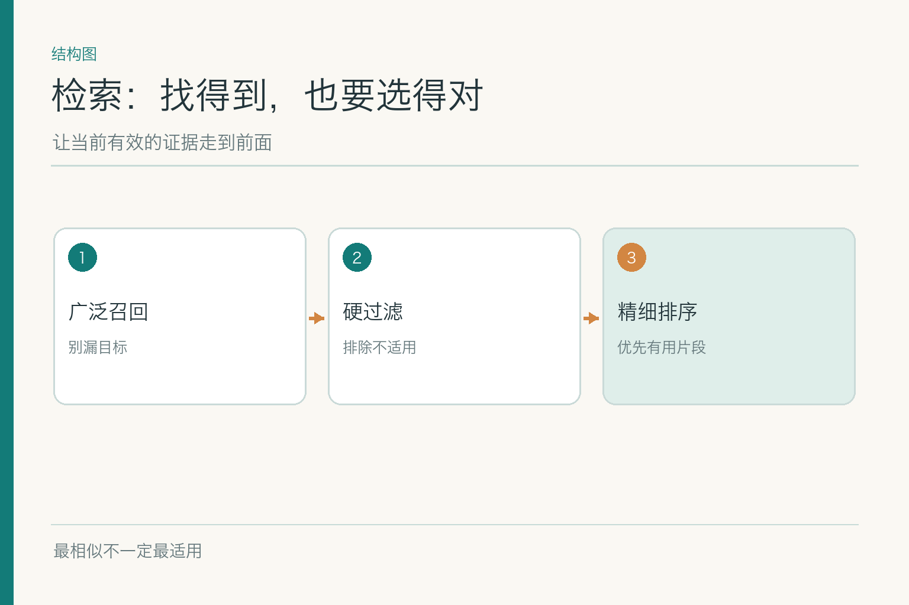
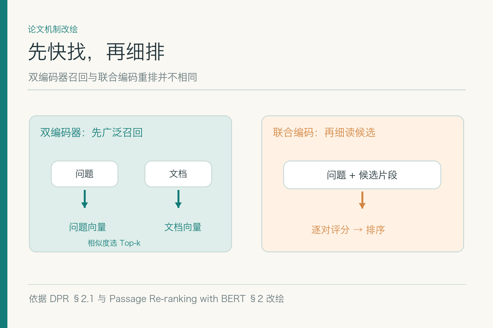

# 召回与重排序：找到相似句还不够

小林问“2026 年 9 月 15 日在北京住宿 480 元，A 职级能报吗？”虚构资料里旧版上限 450 元，新版自 9 月 1 日起上限 500 元。两条政策都含“北京”“住宿”“上限”，旧版可能与提问字面更像；检索若只按相似程度排序，第一名未必是该用的条款。金额、日期和制度全是示例，不代表真实单位政策。

## 一、相似不等于适用

搜索系统首先要找到可能有用的候选，这叫召回。召回过窄，正确条款根本进不了候选；召回太宽，模型收到大量旧版、异地、无权资料，反而更容易误读。即使一段文字与问题十分接近，它也可能只适用于 B 职级、另一地区或过去的日期。

因此检索链路至少分清三件事：**找得全、筛得合法、排得合适**。权限、地区、业务生效时间等是硬条件，不宜靠语义分数“加减分”决定；相似度才用于可用候选之间的相关性比较。小林若无权看财务审批细则，那段资料再像答案，也不应送进生成模型。

严格条件可能误杀正确结果，所以过滤字段的来源和取值必须可核。小林自称 A 职级却未通过身份系统核验时，不能悄悄以 A 职级筛成唯一答案；应先确认身份，或返回带条件的结果。

想象书店店员接到“找一本北京住宿的规定”。他先去相应书架，是召回；确认这本书仍在售、顾客有借阅权限，是过滤；在几本合格资料中挑最能回答问题的页，是排序。一本封面写满“北京住宿”的旧手册也许最像问题，却不该因此压过已经生效的新制度。这个比喻说明分工，不代表实际系统一定把每一步做成独立服务。

## 二、关键词与稠密向量分别擅长什么

关键词检索对制度编号、城市名、职级代码等精确文字敏感。员工记得“差旅办法第七条”，按编号找往往比猜语义更快。经典的 `BM25` 是基于词项匹配与统计权重的排序方法；它不“理解”同义改写，但抓专名和数字常有价值。

稠密检索把问题与资料编码成向量，比较其表示是否接近。员工说“住店费用”，制度写“住宿费”，向量方法可能比字面匹配更容易找出相关条款。DPR 论文使用问题编码器与段落编码器分别生成表示，再寻找近似候选；这是**找候选**，不是判断制度是否生效。

两条路线各有盲点。关键词可能漏近义问法；向量可能把“北京住宿旧标准”排在“北京住宿新标准”之前，因为两者语义太像。混合召回把各自候选合并，再由过滤和重排序处理；并非只要加两种算法，准确率就自动上升。

数据里若有大量编号、产品型号或人名，关键词的精确性往往非常重要；若用户常用口语、资料用正式词汇，向量召回更可能补足漏检。真正的差异应在同一批带标准证据的问题上看出来。不能拿关键词路径最擅长的编号题去证明它全面胜出，也不能拿十道同义词题去证明向量索引可以替代所有检索。

## 三、为什么先快找，再细排

*依据 DPR §2.1 与《Passage Re-ranking with BERT》§2 改绘；硬过滤是另加的工程约束。*

双编码器把问题和各文档片段分别编码，文档向量可预先计算。查询时只编码问题，再做近邻搜索，适合从大量资料中快速找一批候选。交叉或联合编码的重排序器则把问题与某条候选一起读，给这对文本打相关分，能看更细的词句关系，但若让它逐一读全库会太慢。

于是常见设计是“较便宜的召回保留足够候选，较贵的重排细看其中少数”。Nogueira 与 Cho 的工作展示了用 BERT 对候选段落重排序的思路。它仍只是在候选里改变顺序：**正确证据没进候选，重排序模型不能凭空找回来**。

对小林的问题，重排序也可能偏爱句子完整的旧版。因此适用性不能全部压给模型分数。先用正式的版本、权限和地区条件排除不合法候选，再比较其余内容；如果字段缺失或冲突，就保留不确定性而不是硬挑第一名。

双编码器与联合编码的取舍还受库规模影响。几百段资料逐条细读也许仍能接受；几十万段就需要先快速缩小范围。若召回阶段为了省时只留下极少候选，目标条款漏掉后，重排再精细也无从发挥。因此候选数是质量、延迟和成本共同决定的参数，要用分层评测而不是凭一个推荐值定死。

## 四、混合召回怎样合并候选

关键词结果和向量结果的分数未必能直接相加：一个分数来自词项统计，另一个来自向量距离，数值尺度不同。可以把两列候选按稳定 ID 去重，再用排序位置融合，或训练一个模型统一打分。哪种方法更好，要在自己的问题集上测；不能因为某个教程采用 `RRF`，就认为它适合所有制度资料。

合并后要检查候选多样性。十个结果若都来自同一条旧制度的重叠片段，看起来“召回了很多”，实际上没有覆盖新版、例外或有效期说明。可按文档、条款或版本去重，保留能共同支持判断的材料，同时避免把相互冲突的版本偷偷合并成一个“综合条款”。

日志要记录两条召回路径各找到了什么，候选如何合并、何时被过滤或排序。没有轨迹，错答后只能凭印象调参数。

混合路径还可以按问题类型触发。用户给出明确制度编号时，先用编号直查；“住店费怎么算”这样的口语问法，则让语义召回参与。路由并不意味着永远只选一条路，关键是记录选择依据，并在漏检样本上复盘。若复杂路由比简单混合方案只快一点，却更难解释错误，未必值得维护。

## 五、权限、时间与地区应怎样过滤

第一道是当前用户能否看这份资料；第二道是资料对问题中的业务日期、地点、职级是否适用。理想情况下这些条件在索引查询时就参与过滤，或在候选暴露给模型前由受控层执行；具体放在哪一步取决于索引能力，但**绝不能把无权文本先送入模型，再指望它闭嘴**。

过滤也需要处理空值。制度没有标生效日期，不能默认为“永远有效”；用户身份未知，不能默认为 A 职级。此时可以检索可能相关的公开条款，并把需要核实的条件写进结果；涉及权限的内容必须先确认授权。

版本过滤要用业务日期，而不是问问题的日期。小林今天问 8 月的一笔住宿，可能要看旧版；问 9 月 15 日则在示例设定下看新版。技术索引能够回退，但不能把已失效制度当成当前可用规则重新发布。

时间过滤还可能遇到制度追溯生效、临时通知与过渡期。此时不能只用一个“发布日期晚于住宿日期”判断。索引里的时间字段应能表达正式生效区间和例外；若规则解释仍有歧义，检索可以返回相关候选，业务判断必须暂停。把硬条件写成可审计的规则，才知道为什么某条被留下、另一条被排除。

## 六、排序和去重以后留下什么

重排序不宜只看文字相关性，还要检查候选是否能支持完整回答：主条款、例外、定义、时间说明有时分布在相邻段。少量候选应覆盖必要条件，而不是机械取前五条。若最相关的段落只有“北京 500 元”，但下一段写“仅 A 职级”，两段要一同保留，或取回其父条款。

去重也不是把相似文字全部删除。新旧版只改了上限数字，文本高度相似，却代表不同有效期；若按语义相似度“去掉重复”，恰好会删掉这道题最关键的差异。去重依据应包含稳定文档 ID、版本和条款位置。

这一步向生成层交付的是少量**合法、相关、条件完整、带出处**的证据。生成层如何措辞与拒答，另在 RAG 子模块讨论，不让检索器承担它不负责的任务。

不要误把排序分数解释成“答案正确的概率”。重排模型给的是针对查询与候选的匹配分数，具体数值通常不能跨查询直接比较。某个候选得分最高，只说明在这批可见候选中更符合排序目标；它没有替财务系统核对职级，也没有替制度责任人批准例外。对外展示时仍要看证据内容和有效性。

## 七、引用目标从哪里来

检索返回一段文字时，最好同时返回文档 ID、版本、页码、条款号及可访问链接。引用页面若只打开 PDF 首页，读者仍要自己翻几十页；若链接指向一个会随版本变化的路径，半年后可能打开另一份文件。稳定引用需要保留版本与原文位置。

片段如果由表格、OCR 或摘要派生，引用应回到相应原始位置，而不是把机器加工后的文字伪装成原文。对小林的额度，链接应带他能看的新版住宿条款；身份与审批状态另由有权业务系统提供，不可拿制度链接冒充所有事实的来源。

引用还要经过权限检查。能在内部日志里定位，不代表可以把原文地址发给所有用户；公开回答可说明来源类型与待核项，由有权人员查看受限内容。

## 八、检索应怎样分层评测

先为每个问题标注目标证据及适用条件。候选召回看正确条款是否进入较大候选集；重排序看它是否进入有限的前列；引用检查是否能定位、是否为正确版本。每一步都写明题数、分母、版本与检索参数。只报最终回答准确率，无法分辨“没找到”“找到但排后面”和“引用错了”。

题集要有普通问法、精确编号、同义改写、旧新冲突、权限边界、缺身份、新制度刚发布。若引入重排序后正确率上升，却把 95 分位时延拉到不可接受，仍需评估是否值得。索引不可用时可以降级到正式数据库查询、关键词检索或停答，但不能用无权或过期内容凑答案。

检索指标也要防止“多取候选就显得更好”的假象。候选召回率随候选数增加通常更容易上升，但生成模型读到的上下文有预算；塞入更多旧版与重复片段，最终答案反而可能变差。报告应同时给出候选规模、前列命中、最终证据质量和时延。数字离开这些条件，几乎无法指导真正的取舍。

## 参考资料

- [Karpukhin 等：Dense Passage Retrieval for Open-Domain Question Answering](https://arxiv.org/abs/2004.04906)
- [Nogueira 与 Cho：Passage Re-ranking with BERT](https://arxiv.org/abs/1901.04085)
- [Cormack 等：Reciprocal Rank Fusion](https://dl.acm.org/doi/10.1145/1571941.1572114)

想看本文在 AI Agent 中的位置，可点击下方 [阅读原文](https://github.com/Jennifer123www/ai-agent-knowledge-map)，从“知识检索与检索增强生成”继续阅读。
