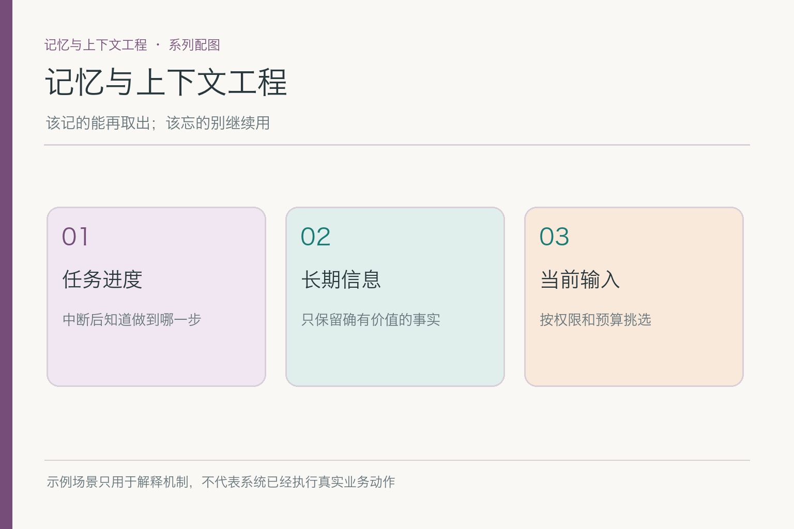
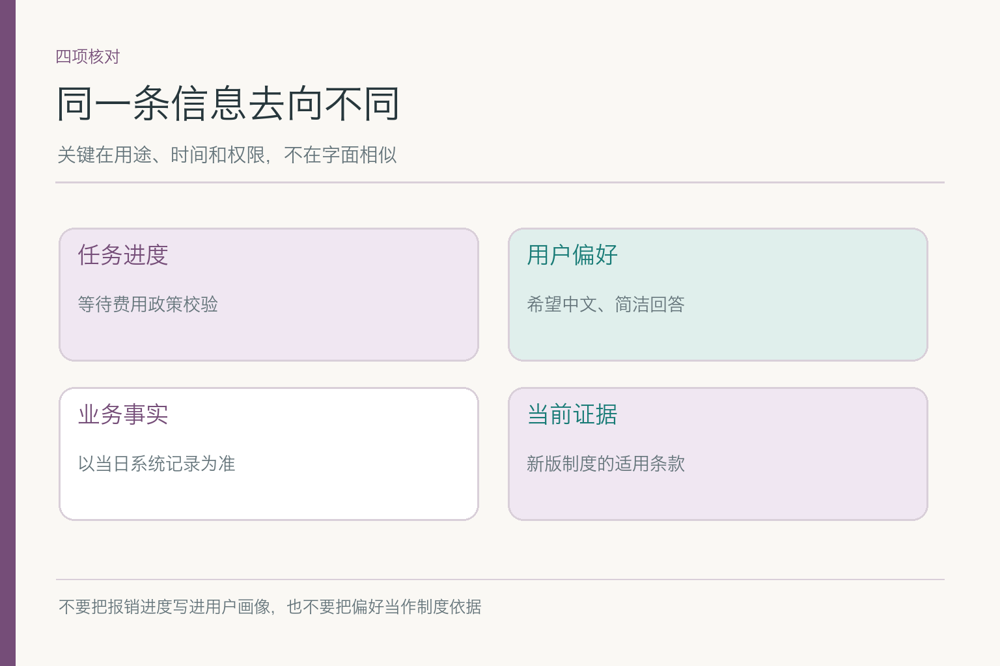
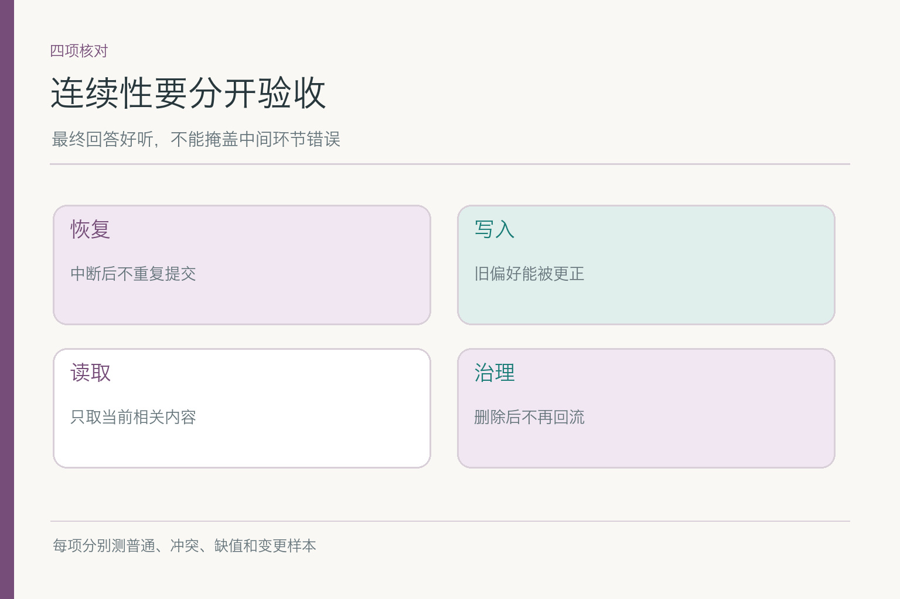

# 面试题：记忆与上下文工程怎样分层回答

所有题共用一个案例：小林上传住宿票据，系统识别了金额和日期，正在核对制度时页面关闭。第二天小林问进度，要求中文、先给结论；制度此时出现新版。**员工身份、票据真伪、适用条款和是否已提交均未核实。**回答时别把这些未知项悄悄说成已完成。示例中的报销流程与规则均为虚构。

## 问题 1：为什么不能把全部聊天历史直接当 Agent 记忆？

### 原理

聊天历史记录“发生过什么”，任务状态记录“进行到哪步”，长期记忆保存“以后仍值得用什么”，本轮上下文则是当前实际送入模型的材料。它们在保留时间、权限和可靠性上不同。全部塞进输入窗口，既占 `token`，也让过期进度与新版制度混在一起；`token` 是模型处理文本的单位，不等于一个字。

### 答题点

1. 先按**用途和生命周期**分开状态、历史、长期记忆与当前输入；
2. 解释“存储在外部”不等于“这一轮模型已经看见”，读取还要按身份和任务筛选；
3. 用小林案例指出旧制度与临时进度会如何污染答案；
4. 提出验收：同一问题分别用全量历史和筛选上下文，对比误用旧值与成本。

### 记忆点

> 历史供追溯，状态供恢复，记忆供复用，上下文供本轮判断。

### 常见追问

“窗口足够长，还要筛吗？”要。容量增加不等于位置、相关性和权限问题消失；还要测关键证据放在不同位置时的利用情况。

### 失分点

把数据库里的全部文本称为“模型记住了”，或把长期偏好当成强于本轮明确要求的指令。

## 问题 2：六个子模块应如何分工，谁来做最后决定？

### 原理

短期状态接住本次任务进度；记忆类型确定候选用途；写入更新决定有效记录；长期记忆供跨会话取回；上下文构造挑出本轮信息；治理约束所有环节的身份、保留和退出。模型能生成候选内容，不能单独决定业务提交、权限或制度生效。

### 答题点

1. 按**产生、保存、读取、使用**讲清交接，而不是只报六个术语；
2. 指出票据金额进任务状态，中文偏好可进入受控长期记忆，制度原文属于外部权威资料；
3. 把最终提交、身份校验、制度适用性留给业务规则和工具结果；
4. 各环节都留来源、版本和失败状态，避免一句生成文本遮住中间错误。

### 记忆点

> 状态记进度，记忆留价值，上下文做选择，治理定边界。

### 常见追问

“能否装一个记忆组件就解决全部？”组件可承担存储或检索，但不会替团队定义哪些信息该留、谁能读、旧值何时退、何时停止执行。

### 失分点

把知识库、用户画像和报销业务系统混成同一个事实来源。

## 问题 3：页面关闭后，小林回来时端到端怎样恢复？

### 原理

恢复要把可持久的任务状态与**外部动作真实结果**结合。只恢复聊天文字，可能重复提交；只读业务系统，又可能不知道票据识别已完成。系统应从安全位置继续，而非假设上次模型说“准备好了”便等于动作成功。

### 答题点

1. 用任务标识读取已确认节点、字段来源及“待校验／待确认”的状态；
2. 核对提交系统是否已有对应单据，不能盲目重做有副作用的调用；
3. 按今天的身份和制度版本重查可能变化的外部事实；
4. 对小林只报告已核实的进度，未知票据真伪和审批状态仍标未知。

### 记忆点

> 先查状态，再查外部结果，最后决定从哪步继续。

### 常见追问

“昨晚提交接口超时，如何答？”超时不是失败证明。先按业务幂等标识查实际结果；查不到时停在待核，不承诺已提交。

### 失分点

把“重试一下”当成任何中断的通用解法。幂等键、检查点粒度留到短期状态子模块详谈。

## 问题 4：什么时候根本不需要长期记忆？

### 原理

长期保存是有成本和风险的产品选择，不是 Agent 的定义条件。一次性报销任务只需能恢复的短期状态；制度实时查权威来源；只有确有跨会话价值、来源清楚且符合保存规则的偏好或经验，才可能进入长期记忆。

### 答题点

1. 区分“完成这次任务必需”和“以后任务还会反复用”；
2. 评估误记、过期、隐私、读取成本对收益的抵消；
3. 设计无长期记忆的基线，再看开启后是否真的改善任务；
4. 保留用户拒绝长期保存时仍可完成本次任务的路径。

### 记忆点

> 先有跨会话价值，再谈跨会话保存。

### 常见追问

“小林说这次用中文，要写入画像吗？”不能直接推断“以后都如此”；要看是本轮指令还是明确的长期偏好。

### 失分点

为了演示“个性化”，把金额、位置或一次性抱怨永久写进用户档案。

## 问题 5：新版制度与旧记忆冲突时，整体链路怎样裁决？

### 原理

用户记忆可以影响表达方式，不能替代制度和业务系统中的当前事实。旧制度的文本即使相似度高，也必须先过权限、适用人群和生效日期；如果票据日期或员工身份缺失，应继续核查或追问。

### 答题点

1. 明确“用户偏好”“制度条款”“业务状态”三种来源的不同权威性；
2. 对冲突先找元数据：版本、生效日、适用地区、用户身份；
3. 选择适用资料进入本轮输入，并标清“已核”与“未知”；
4. 输出有限结论，不从“可准备草稿”跳到“报销已批准”。

### 记忆点

> 偏好管表达，制度管规则，业务系统管结果。

### 常见追问

“取回了新版制度仍答错，怪谁？”先看检索是否给对候选、上下文是否保留条件、模型是否误用旧值；分环节定位，不笼统说幻觉。

### 失分点

因为长期记忆里写着旧上限，就让它覆盖今天的有效制度。

## 问题 6：治理为何不能放在生成回答之后补救？

### 原理

不该读取的信息一旦进入模型输入，回答末尾再加“注意隐私”已经太晚。身份和租户隔离应在检索前执行；数据是否可保存、保留多久、如何删除，也需要在写入时明确。治理横贯写入、读取、使用和退出。

### 答题点

1. 列清数据主体、租户、用途和任务权限四类边界；
2. 说明过滤发生在数据进入上下文之前，不能只依赖模型拒答；
3. 提出删除后主记录、索引、缓存不再回流的验收要求；
4. 审计记录操作与来源，但避免把敏感全文再次复制进日志。

### 记忆点

> 写时有门槛，读前有权限，退出能验证。

### 常见追问

“删除时备份怎么办？”不同部署和适用要求不同；不能给统一保留天数。回答应先说明备份是否参与线上读取，再给隔离、到期处理和审计策略。

### 失分点

只删除界面展示，索引与缓存依旧能取回。详细删除作业属于记忆治理子模块。

## 问题 7：怎样证明这套设计提升了连续性，而不是更会编？

### 原理

最终答案是否流畅，不能衡量状态恢复、记忆写入、资料选择和权限是否各自正确。要在相同任务集、身份、制度版本和模型条件下，比对开启与关闭记忆链路的结果，并分别统计失败类型。

### 答题点

1. 样本覆盖中断、冲突、缺值、新制度、偏好更正与删除；
2. 分别记录状态恢复正确率、旧值误用、无依据完成声明和越权返回；
3. 写清每项样本数、分母、输入条件、系统版本，别只给一个总分；
4. 人工核对关键断言是否真有票据、制度或业务结果支持。

### 记忆点

> 用变化样本打断幻觉，用分环节指标找到责任处。

### 常见追问

“开启记忆后用户更满意，但误报提交更多，算成功吗？”不能只看满意度；动作状态错误可能比文风收益严重。先按任务风险设停止条件。

### 失分点

把一条连续对话演示当成“跨会话长期记忆已验证”。

## 问题 8：一次回答同时用了旧制度和错的用户偏好，怎么排查？

### 原理

两个错误可能来自不同链路：旧制度可能是检索过滤或上下文排序问题；偏好错误可能是旧记忆未更新、跨用户读取或本轮指令被压住。先重建这次请求看到的**状态、取回记录与上下文版本**，再找分叉点。

### 答题点

1. 用任务和请求 ID 关联状态快照、记忆记录 ID、资料版本及输出；
2. 分别检查“取回错了”“送入错了”“模型用了不该用的”三处；
3. 对已知坏版本阻断读取或回退，不能只修改最终措辞；
4. 将这次冲突加入回归样本，并追查类似身份是否受影响。

### 记忆点

> 先重建输入，再定位分叉，最后改环节。

### 常见追问

“日志里要保存完整提示词吗？”未必。可保留受控的版本、引用和必要片段；敏感全文应按权限、保留与脱敏策略处理。

### 失分点

一听“回答错”就调模型温度，既不查旧制度，也不查记忆来源。

## 问题 9：新记忆策略怎样上线才可回退？

### 原理

上线变更可能涉及写入规则、检索权重、上下文顺序与治理策略。把所有开关同一天打开，即使指标下降也难知道是哪一处造成。先用固定样本比较，再分身份范围灰度，并给每个环节留关闭或回退路径。

*依据 [MemGPT](https://arxiv.org/abs/2310.08560) Figure 3 简化；图中的读取不等于越过权限。*

### 答题点

1. 先固定基线：无长期记忆、仅任务状态、完整方案分别表现怎样；
2. 记录写入规则、检索索引和上下文模板的组合版本；
3. 灰度观察旧值误用、越权、恢复失败、耗时与成本；
4. 触发停止条件时只回退有问题的能力，不能丢掉可恢复的任务状态。

### 记忆点

> 一次改一处，按风险放量，坏了能关门。

### 常见追问

“禁止长期记忆读取后，用户还能继续报销吗？”应该能；本次任务状态与当日权威制度仍可支撑后续核验，必要时请用户确认关键字段。

### 失分点

把“所有请求都接入了记忆库”当上线成功，却没有普通、冲突与删除后的回归数据。

这组总览题的共同答法是：先说清**哪个信息属于哪一层**，再说它如何进入当前请求，最后给出能查证的边界与评测。细到某个检查点怎么落盘、某条偏好怎么覆盖，去对应子模块练；在总览里把所有实现细节讲完，反而容易把职责讲乱。
面试官若继续追问，就沿着同一笔报销草稿展开，不临时换一套毫无关联的故事。

## 参考资料

- [MemGPT: Towards LLMs as Operating Systems](https://arxiv.org/abs/2310.08560)
- [Generative Agents: Interactive Simulacra of Human Behavior](https://arxiv.org/abs/2304.03442)
- [LangGraph：Thinking in LangGraph](https://docs.langchain.com/oss/javascript/langgraph/thinking-in-langgraph)
- [Anthropic：Effective Context Engineering for AI Agents](https://www.anthropic.com/engineering/effective-context-engineering-for-ai-agents)
- [NIST Privacy Framework](https://www.nist.gov/privacy-framework)

想看本文在 AI Agent 中的位置，可点击下方 [阅读原文](https://github.com/Jennifer123www/ai-agent-knowledge-map)，从“记忆与上下文工程”继续阅读。
