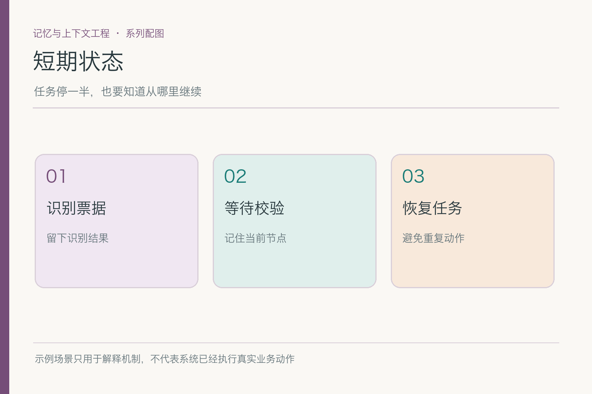
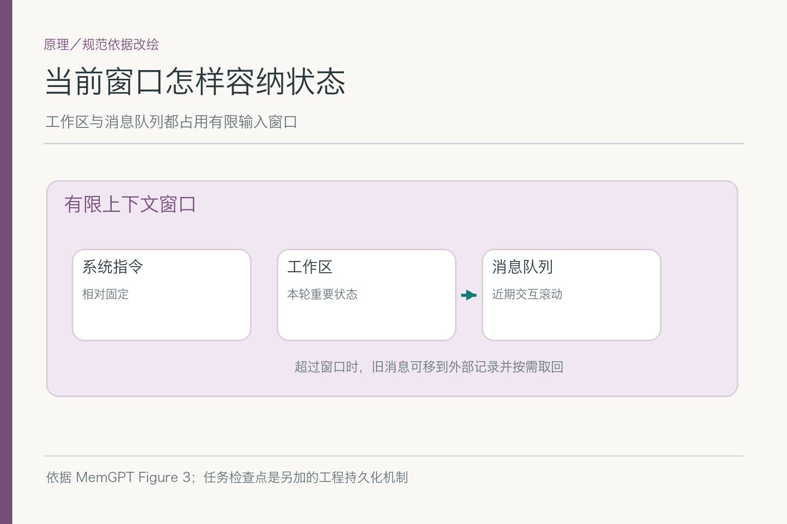
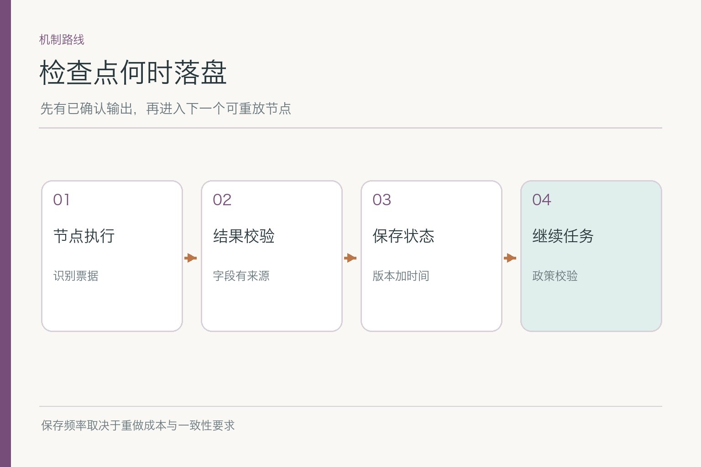
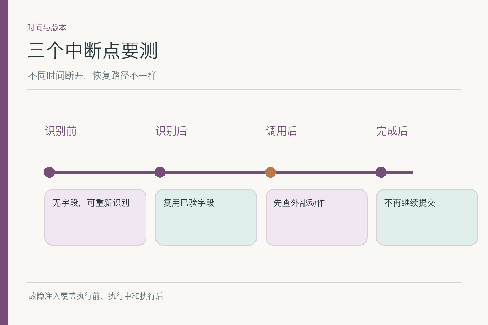

# 面试题：短期状态与中断恢复怎么答

共用案例：小林上传住宿票据，系统识别日期和金额后，尚未核对制度，也没有提交；浏览器关闭。第二天小林打开同一任务。追加一条故障变体：提交接口可能曾收到请求，但调用方超时，结果未知。回答时要区分**已识别、已核对、已提交**三种状态，不可互换。

## 问题 1：短期状态里应保存哪些字段，哪些不应保存？

### 原理

状态应足以让后续节点做正确决策，并能说明重要结果的来源。对于报销草稿，至少包含任务标识、当前节点、已核字段与原件引用、外部动作状态、版本和更新时间。可由原始数据稳定重算、且成本不高的内容，不必复制到每个检查点。

### 答题点

1. 把“金额候选值”“字段已人工核对”“制度符合”拆成不同字段；
2. 保存票据稳定引用与权限范围，不把原图反复塞进模型输入；
3. 用 `step=policy_check_pending` 表示位置，不能只写“处理中”；
4. 记录 `submission_status=not_started`，不因生成了草稿就改成成功。

若面试官给出一段“昨天已经帮您处理完”的聊天，应追问有没有票据字段、制度版本与业务回执。没有的话，这句话只能作为历史文本，不能反向填充状态。用这一步把状态模型和对话摘要分开，答题才算落地。

### 记忆点

> 状态要能继续，也要能解释为什么继续。

### 常见追问

“直接存整个聊天对象更省事吗？”恢复也许方便，但临时语气、过期资料和敏感内容会混入；最好保留结构化任务事实和必要历史引用。

### 失分点

只存模型最后一句回复，或用一个布尔值 `done` 包住识别、审批与提交。

## 问题 2：检查点应该在步骤前还是步骤后写？

### 原理

检查点用于在故障后找到已确认的恢复位置。写在步骤前，能证明准备执行，不能证明执行结果；写在结果校验后，才能安全从下一步开始。若步骤有外部副作用，还需要额外记录调用意图、请求标识和回执，单个本地快照不能保证与第三方系统同时成功。

### 答题点

1. 分清“开始尝试”“得到候选”“结果已校验”“外部系统已确认”；
2. 对票据识别，可在字段校验后保存结果，故障时复用；
3. 对提交动作，先准备稳定业务标识，再确认外部回执并更新状态；
4. 在两个保存点之间注入故障，说明预期恢复起点。

节点边界是较容易解释的检查点位置，但并非所有节点都一样安全。票据识别可以重算，创建单据可能不能重做。答题时若只说“每步都保存”，面试官会继续问：保存请求意图与保存外部结果之间断电，你依据什么判断成功？

### 记忆点

> 检查点标已知结果，不替外部回执作证。

### 常见追问

“每个 token 都保存一次是否最安全？”不需要。按节点成本、可重算性、副作用和允许的数据丢失范围选粒度；过密保存也带来写入开销。

### 失分点

把“持久化已发起请求”误讲成“业务系统已经处理成功”。

## 问题 3：提交接口超时，恢复时怎么避免重复单据？

### 原理

超时只说明调用方没拿到结果，不说明服务端没执行。恢复后要用业务键或幂等键查真实结果。若接口支持幂等，重复请求使用**同一操作键**；若不支持，应先查询，再决定是否人工核对或重试，不能靠模型提示词保证“不重复”。

### 答题点

1. 记录任务 ID、业务操作 ID 和调用尝试，不用新的随机 ID 重试同一操作；
2. 查询外部系统是否已经生成该报销单，核对金额与票据对应关系；
3. 结果仍不确定时保持 `pending_reconciliation`，不要展示“已提交”；
4. 对可以重试的读取与有副作用的写入使用不同策略。

例如外部系统最终查到一张单，但状态库仍写 `pending_reconciliation`，正确的后续是核对这张单的业务键、金额和票据，再补记结果；不是再发一次请求。若查出两张单，优先进入补偿与人工处理，而非让模型自动删其中一张。

### 记忆点

> 超时先查，确认才重放。

### 常见追问

“平台有自动重试，还需要管吗？”更需要。自动重试必须遵守接口的幂等契约、超时与重试窗口；不能把所有工具调用统一重试三次。

### 失分点

把 HTTP 请求失败日志当成业务失败证明，或把成功响应当成后续审批完成证明。

## 问题 4：两个设备同时修改同一任务，怎样避免状态回退？

### 原理

并发写入需要识别“基于哪个版本改的”。若电脑端把票据金额更正为新值，手机端还基于旧版本保存“下一步”，后写入者可能覆盖更正。可使用版本比较与重读合并；对不能自动合并的金额、动作状态，请用户或业务规则确认。

### 答题点

1. 每次状态更新携带版本号或类似条件，拒绝基于旧版本的覆盖；
2. 区分可合并的独立字段与相互排斥的当前值；
3. 冲突后重新读取权威状态，再决定重算、保留两者或请求确认；
4. 把并发冲突作为测试样本，而非仅测单设备顺序操作。

可现场画出时间线：电脑读 v3，手机读 v3；电脑保存金额更正得到 v4，手机基于 v3 保存进度。手机写入被拒绝后应重新读 v4，再判断它的进度更新还能否适用。这个例子比背“乐观锁”三个字更容易说明并发风险。

### 记忆点

> 先比版本，再改当前值。

### 常见追问

“最后写入者获胜可以吗？”对无关备注也许可行；对票据金额、审批动作或状态迁移则可能悄悄丢失事实，需更严格条件。

### 失分点

把两端聊天消息拼在一起，期待模型自行推断哪个字段最新。

## 问题 5：任务状态恢复时，外部资料版本变化怎么处理？

### 原理

检查点保存了任务位置，不会冻结外部制度。票据字段可在原件未变时复用；昨日制度检索结果若今天已失效，应重新查有效版本。这要求状态里留外部资料 ID、查询时间、版本或失效条件，而不是把旧结论写成永久有效。

### 答题点

1. 区分**可复用的本次结果**和需要重新查的外部事实；
2. 用资料版本、生效日、用户身份判断制度是否仍适用；
3. 若原票据被替换，连已识别字段也需重验；
4. 把“重新校验”写成明确节点，不隐式更新最终回答。

制度更新时，旧检查点的“待核对”状态仍有价值，因为它告诉系统下一步该做什么；旧检索结果却不再可靠。把两者分开，就能既减少无谓的票据重识别，又避免把昨天的制度片段复用成今天的结论。

### 记忆点

> 恢复节点不等于复用所有旧证据。

### 常见追问

“旧制度数据还在缓存里怎么办？”先按版本键和有效期失效，再从权威来源取回；缓存命中不能推翻制度生效条件。

### 失分点

以为检查点是全世界快照，恢复后直接拿昨日条款继续判定。

## 问题 6：短期状态什么时候归档或过期？

### 原理

短期状态服务于活动任务，但任务可能跨天等待用户补资料。应按任务状态与业务保留规则决定是否可继续、可只读或需清理；不能简单用“浏览器关了就删”或“永远留着”。归档后的历史不能被下一轮误读成仍可执行的当前节点。

### 答题点

1. 给活动、暂停、完成、撤销分别定义可执行转移；
2. 区分业务单据的法定或组织保留与 Agent 临时工作区；
3. 过期时清理临时引用和缓存，并让恢复请求得到可解释结果；
4. 重新开启任务时，旧检查点只供审阅，不自动继续执行写操作。

一个实用的状态转移测试是：任务已撤销后，再收到旧页面的“继续”按钮请求，系统应拒绝执行；若只是等待用户补资料，则允许在重验身份和资料后续跑。这两种任务可能都跨过一夜，却不能套同一条“超过一天清空”规则。

### 记忆点

> 能跨天恢复，不等于无限期可执行。

### 常见追问

“用户撤销后又打开原链接？”展示历史状态可以，但不要因为链接还能访问就重新提交；身份和撤销状态都要重验。

### 失分点

把过期设为单一固定天数，却不看任务状态和业务要求。

## 问题 7：流程升级后，旧检查点还能直接用吗？

### 原理

当代码把“政策校验”从一个步骤拆成两个步骤，旧检查点的字段含义可能变化。恢复器必须识别状态结构版本，执行受测迁移，或在无法安全迁移时停下请用户确认。把旧 `checked=true` 直接解释为新版“全部校验完成”，有误报风险。

### 答题点

1. 状态记录携带 schema 或流程版本，不能只看节点名称；
2. 迁移明确旧字段到新字段的映射，并记录是否有证据不足；
3. 对已产生外部动作的旧任务，先查真实回执，避免迁移后重放；
4. 在灰度发布中保留旧版本恢复样本和回退路径。

如果旧状态没有足够信息判断新版校验的第二个条件，就应保留“未核”而不是默认通过。迁移脚本的成功率不能只看解析是否完成，还要抽检语义是否保真：旧任务里究竟哪些字段仍有证据、哪些需要重新取得。

### 记忆点

> 旧状态先解释，再续跑。

### 常见追问

“字段缺失能填默认值吗？”只有默认值不会改变业务含义才行；“未提交”和“未知是否提交”就不能用同一个默认值。

### 失分点

版本升级后只测新建任务，不测跨版本恢复。

## 问题 8：怎样做短期状态的故障注入验收？

### 原理

恢复质量要在不同断点实测。故障放在票据识别前后、检查点写入前后、外部调用发出后和回执保存前后，得到的预期动作各不相同。每次测试都记录实际恢复节点、外部对象数量与用户可见状态，而不是只看“流程最后能跑完”。

### 答题点

1. 先固定一批票据样本和预期字段，再在节点边界两侧断开；
2. 统计重复单据、错误跳步、丢失更正和误报成功，分别给出分母；
3. 覆盖权限变化、两个设备并发和制度版本变化；
4. 修复后重放同一批故障样本，证明具体错误减少。

测试报告还要说明故障发生在调用前、调用中还是调用后。只报“恢复成功率 98%”没有分母、样本和动作类型，无法解释剩下的 2% 是否涉及重复提交。对有副作用的节点，应把重复外部对象数列成单独的安全指标。

### 记忆点

> 断在前后两侧，查真实动作数量。

### 常见追问

“恢复后答案正确，是否就通过？”未必。若外部系统产生两张单，或者别的用户看到了票据，即使文字正确也不能通过。

### 失分点

只演示一条无故障的连续会话，就宣称“支持持久化恢复”。

短期状态题最稳的收束，是说清**已确认结果、未知结果和可重放动作**三者的区别。遇到小林的报销，先查上次已到哪步，再查外部动作是否真的发生，最后才决定是否继续；这比背“检查点、幂等、持久化”三个名词更有说服力。

## 参考资料

- [MemGPT: Towards LLMs as Operating Systems](https://arxiv.org/abs/2310.08560)
- [LangGraph：Thinking in LangGraph](https://docs.langchain.com/oss/javascript/langgraph/thinking-in-langgraph)
- [LangChain：Deep Agents overview](https://docs.langchain.com/oss/javascript/deepagents/overview)

想看本文在 AI Agent 中的位置，可点击下方 [阅读原文](https://github.com/Jennifer123www/ai-agent-knowledge-map)，从“记忆与上下文工程”继续阅读。
