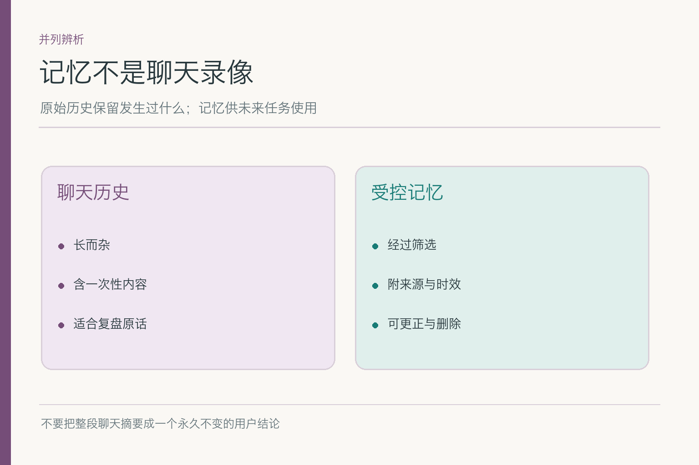

# 长期记忆：隔几天再聊，凭什么还能接上

小林几次明确说：“给我的说明请用中文，尽量简洁，先给结论。”几天后，他重新打开助手，请它起草一封报销进度邮件。这一轮只说了邮件的收件人和事实，没有重复表达习惯。助手若能按其已确认的偏好组织草稿，体验会连贯；若它凭一次偶然措辞认定小林“讨厌详细解释”，或者把别人的偏好用在小林身上，这份“记性”就成了麻烦。

长期记忆要解决的不是把聊天永远留住，而是：**从过去留下少量未来确有用的信息，到需要时再取回，并允许它过期、被更正或不被使用。**

## 一、聊天历史和长期记忆不是一份东西

历史消息适合回答“当时原话是什么”。它可能包含问候、草稿、一次性地址、错误猜测和后来被否定的说法。长期记忆则是一条经过筛选、附有来源和用途的可复用记录，例如“小林明确要求未来写作默认中文、先给结论”。一份聊天记录很长，一条有效记忆应该能说清**谁说的、何时说的、适用于什么任务**。

如果把完整历史都视作记忆，下一次起草邮件时就可能捞到“小林上次临时出差到上海”，随后把它写进新邮件。检索到相似文字并不证明它此刻有用。反过来，经过筛选的偏好也不一定覆盖所有情况：小林今天若说“请写一版详尽说明”，本轮的明确要求优先于旧的“尽量简洁”。

长期记忆也不是模型参数更新。把“中文、先给结论”保存在可管理的外部系统里，和重新训练语言模型是两种不同操作。前者可按用户、任务和时间读取，也相对容易更正与删除；后者不是为单个用户偏好准备的开关。

存一条记录时，最好能看出它究竟是**原话**、经确认的概括，还是系统推断。比如“小林在 9 月 3 日说以后默认中文”可以带原消息引用；“推测小林偏好中文”应标为未确认候选，不能在界面上看起来同样可信。读者看到的是一封顺畅邮件，后台却必须知道哪句风格要求有依据。

## 二、存在哪里，模型这一轮才能用到

跨会话信息通常保存在模型窗口外，按用户或组织范围组织。新请求进来时，系统先识别当前用户与任务，再查可能相关的记忆，过滤过期、越权或与本轮要求冲突的记录，最后把少量信息放进模型当前输入。**“外部库里有”不等于“模型会自动想起来”。**

在小林的例子里，起草一封邮件与表达偏好相关；若任务改为核对住宿票据金额，中文偏好最多影响说明方式，不能影响金额判断。按任务选择很重要：一条记忆可以被合法保存，却与眼前问题无关。把无关记录塞进上下文，只会占用 `token` 并制造错误联想；`token` 是模型处理文本的单位，不等于一个汉字。

可以把它想成借书：图书馆确实有许多书，但桌上不需要摊开全部。这里的“借”要落实成可追踪的检索动作：取回哪条记录、它的来源是什么、何时写入、为何与这次邮件有关。没有这些线索，助手即使答得恰好顺口，也很难解释偏好从哪来。

存储方式可以是按用户分区的键值记录，也可以在候选较多时建立搜索索引；**选型取决于记录规模和查询方式**。像“默认语言”这种已知字段，按键读取通常比在一大堆聊天片段里做相似度搜索更直接。若要找“以前遇过类似问题的经验”，检索才更有发挥空间。无论哪种方式，权限过滤都应先于把结果交给模型。

## 三、论文里的记忆流，能给我们什么启发

《Generative Agents》中的模拟智能体会把观察写成带时间的记录，再按当下情境检索；部分经历还会被整理为更高层的反思，并回到记忆流中，影响后续行动。下图保留了**观察—记录—检索—行动**和反思回写的关系。它展示的是一个研究架构，并不等于所有产品都应该自动把每次对话提炼成用户画像。

*依据 [Generative Agents](https://arxiv.org/abs/2304.03442) Figure 5 改绘；企业用户偏好写入仍要另设来源、权限和退出门槛。*

这幅图提醒我们，长期记忆的核心动作不只是“存”，还有**按当前情境取一个子集**。假设小林去年说过“邮件都写英文”，今年明确改为“常用中文”；只按语义相似度查到旧记录，不比较时间与有效性，就会反复给出过时风格。另一个常见错误是把反思直接当事实：模型总结“小林通常不看附件”，却找不到小林确认的原话，不应因此自动删掉这次邮件的附件说明。

## 四、哪条信息算相关，哪条应退出

相关性至少有三层：这是不是小林自己的记录；这是否关系到“起草进度邮件”；这条记录今天是否还有效。可把来源、创建和最近确认时间、适用任务、敏感级别与失效条件放在记录旁，而不只存一段文字。检索系统可以先找到候选，业务过滤再剔除不该用的，最后才由模型组织表达。

原论文的模拟场景会结合新近程度、重要性和相关性取回经历。把这个思路搬到企业产品时，不能照抄一个分数就放行：**权限与撤销状态必须是硬条件**，分数再高也不能越过。对小林的写作偏好，任务是否适用与用户是否仍认可，比“这条话语义上很像邮件”更关键。

如果候选记忆写着“喜欢简洁”，本轮请求却写“请给完整背景和步骤”，不需要先彻底删除旧偏好；在**本轮**按新要求写即可。若小林说“以后都请详细些”，则可能涉及长期记录的更新。两种变化处理不同，详细写入规则交给“记忆写入与更新”那篇。

还有一种冲突更严重：旧记忆与权威数据不一致。小林过去被告知某个报销额度，不代表今天制度仍是那个值。长期记忆可以让系统记得他**曾经问过**，不能成为当天制度的依据。查询最新制度，要回到知识库和业务系统；这是长期记忆与检索增强生成的分界线。

## 五、为什么“记得越多越好”常会适得其反

每条被保留的信息都可能在以后影响回答。若系统从一次聊天猜出“小林比较急躁”，这个判断既未确认，也可能带有偏见；若又把它做成长期标签，后续所有邮件都可能被不必要地改写。多记还意味着更多检索候选、更大的输入预算、更难处理的冲突和删除请求。

反过来，完全没有长期记忆也不是失败。若产品只处理一次性报销，用户愿意每次说明表达要求，可以不保存偏好；这会少一些个性化，也少一类污染和治理成本。是否值得保存，应拿真实任务集比较，而不是看演示中“它竟然还记得我”这一瞬间。

另一条边界是**跨用户隔离**。两位用户都叫小林，或两人在同一组织，仍不能凭姓名相似共享偏好。记忆检索范围应与身份和授权绑定；模型看到的名字只是文本，不是访问令牌。

还有“越记越旧”的问题。团队如果从不让用户查看已保存的偏好，记录就可能在几个月后悄悄失准。合理的产品应让用户知道系统记了什么、在什么范围生效，并能提出更正或退出。具体界面可以不同，但这些控制不能只藏在技术后台里。

## 六、怎样评测长期记忆带来的变化

先准备成对样本：一次明确表达偏好，隔几天再发相关任务；一次只提到某城市，后来发不相关任务；一次明确更正偏好；一次本轮临时例外；再加跨用户混淆和删除后的复问。每个样本预先标“应该取回哪条、不能取回哪条、最终怎样写”，用相同材料比较关闭与开启长期记忆。

指标不要只看“回复像不像认识老朋友”。要分别看明确偏好的适用率、旧偏好误用率、未经确认的推断入库率、跨用户泄漏次数，以及取回记录能否追溯。评测需要写清样本和分母；一条漂亮邮件不能证明整个系统的长期效果。若开启记忆后中文偏好命中更多，但错误读取他人偏好也增加，就不能称为净收益。

可以拿同一批邮件任务做小型对照：一组每次由用户重述表达要求；一组启用已确认的长期偏好。比较的不是“哪封更像真人”，而是用户是否少重复交代、事实字段有没有变化、旧偏好误用多少次、是否增加明显延迟。**个性化的收益和错误成本要放在同一张账上。**

## 七、出错后应先看哪一环

若助手没有用小林的中文偏好，先查这条记录是否存在、是否因权限或过期被过滤、是否检索到但未放进本轮输入、是否已进入输入却被本轮其它要求覆盖。每一步都有不同修法。盲目给模型加一句“请记住用户喜好”，既不解决存储，也不解决取回。

若助手坚持旧偏好，检查时间、有效标记、本轮指令以及缓存。若助手用上别人的偏好，优先查身份范围和检索过滤，必要时暂停记忆读取；不要把越权误用包装成“个性化不太准”。长期记忆真正好用，是因为它**可选择、可解释、可退出**，不是因为它永远在场。

排错时最好能看到一条简洁的因果链：本次任务是什么、检索查询采用了哪个用户范围、候选记录有哪些、哪条被过滤、最终哪条进入输入。若只能看到最终邮件文本，工程师往往会把检索遗漏、权限拒绝和模型忽视都误诊为“提示词不够强”，下一轮仍会重复同样的错。

## 八、把它放回 Agent 的位置

本次邮件草稿中，长期记忆只提供写作偏好；收件人是谁、报销做到哪一步、制度是否更新，仍需本轮输入、短期状态和权威数据。它可以让助手少问一句重复的问题，不能让助手跳过事实核查或替用户发信。最朴素的成功标准是：该用时用上，不该用时不冒头，错了能找到来源并改掉。

若小林问“你为什么写得这么简短”，系统至少应能回答“根据你此前明确保存的偏好”，并给出查看或更正入口；如果实际没有这条记录，就不要编一个听起来体贴的理由。

## 参考资料

- [Generative Agents: Interactive Simulacra of Human Behavior](https://arxiv.org/abs/2304.03442)
- [MemGPT: Towards LLMs as Operating Systems](https://arxiv.org/abs/2310.08560)
- [LangMem：Core Concepts](https://langchain-ai.github.io/langmem/concepts/conceptual_guide/)
- [Anthropic：Effective Context Engineering for AI Agents](https://www.anthropic.com/engineering/effective-context-engineering-for-ai-agents)

想看本文在 AI Agent 中的位置，可点击下方 [阅读原文](https://github.com/Jennifer123www/ai-agent-knowledge-map)，从“记忆与上下文工程”继续阅读。
