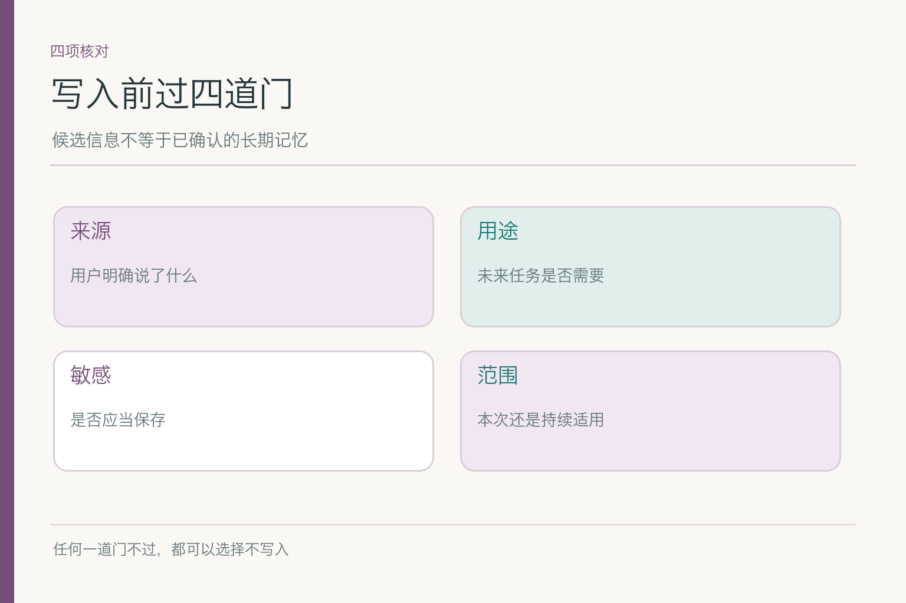
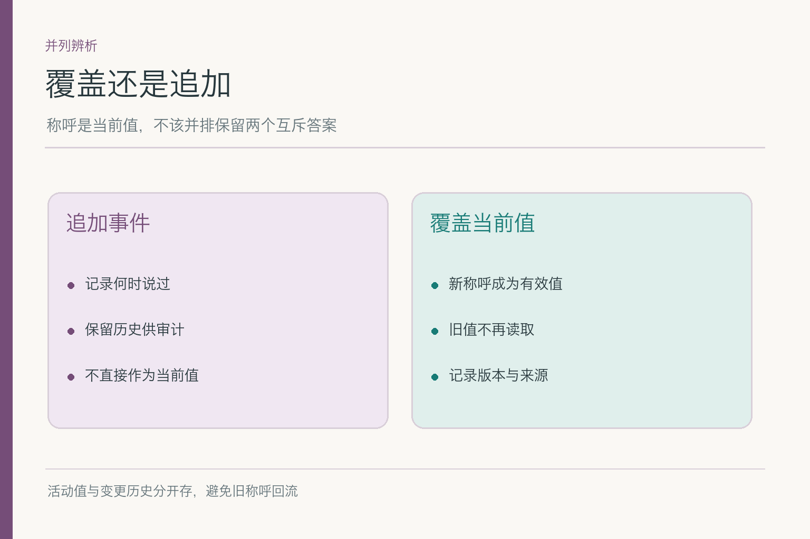
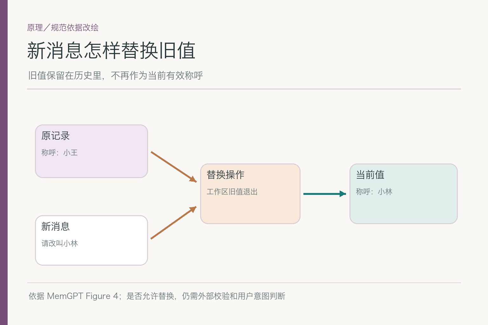
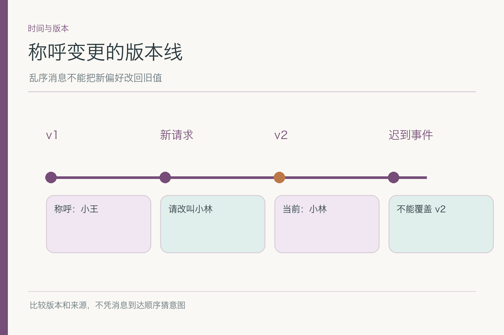
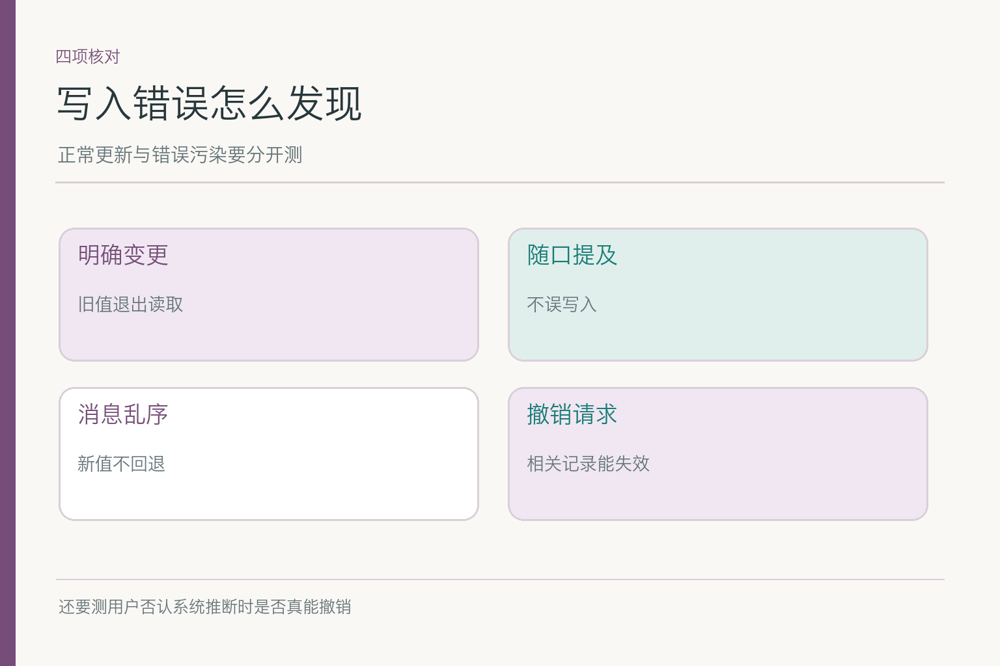

# 记忆写入与更新：新称呼来了，旧的怎么办

小林曾明确要求助手称呼他“小王”，系统据此保存了偏好。后来他说：“以后请叫我小林。”如果系统只把新句子追加到聊天历史，下次检索也许先捞出旧称呼；如果直接把所有历史抹掉，又失去变更的来源。更糟的是，某条自动摘要还写着“小王”，新值刚保存就被旧摘要覆盖。**写入不是存一行文本，而是维护‘现在什么值有效’。**

## 一、候选出现后，为什么不能立刻落库

模型可能从一句话提取“称呼：小林”，这只是**候选**。先看这句话是否来自当前用户，是否明确指未来默认，是否涉及其他人的名字，产品是否允许保存。比如“小林是我同事”显然不该覆盖用户称呼；“这次邮件称呼我小林”可能只限本次。听见“小林”两个字就更新画像，是把实体提取误当成用户授权。

一个可审阅的候选记录可包含：原消息引用、提取字段、建议作用域、模型信心、当前活动值及冲突原因。但“信心高”不是批准写入的理由。对于高影响信息，例如联系方式或权限范围，系统可能需要用户确认或从权威账户资料核验；对不必要或敏感的推断，选择**不写**更稳。

若用户只说“别这么叫我”，没有给新称呼，系统应先停用旧称呼，再问希望怎样称呼；不该自己猜一个。写入门槛不是让体验变得啰嗦，而是避免未来很多轮都沿用一个错误猜测。

还要防止把助手自己的上一轮回答当作用户证据。假如助手误叫“小林”，用户只是问“你刚才为什么叫我小林”，系统不能从这句疑问里再抽出一个“用户喜欢小林”的候选。谁提出了这个称呼、用户是确认还是质疑，必须回到原始对话角色和语气核对。

有时信息来自工具返回，而非用户原话。例如员工目录更新了姓名，系统可据此调整正式称呼；但这与用户在写作场景里喜欢的昵称可能是两项不同字段。**来源不同，决定权也不同。**员工目录可以证明账户姓名，未必能替用户决定邮件怎么称呼他；用户的一句话可以表达偏好，也未必能改正式账户资料。写入规则必须知道自己管理的是哪一种值。

## 二、追加事件与覆盖当前值是两件事

旧称呼“小王”曾经有效，这段历史可以保留供核对；但“现在应叫小林”需要成为新的活动值。实践中可把**变更事件**与**当前有效记录**分开：事件记下谁在何时提出什么，新记录指向今天该用哪个称呼。这样既能解释变化，也不会让检索时两条互斥称呼并列为“同样有效”。

写成两个并列偏好，如“小王”和“小林”都有效，会把裁决交给模型的随机措辞。这个问题与聊天摘要无关：即使模型很会理解中文，只要底层记录相互矛盾，下次读取仍可能出错。正确的数据关系应是旧值**已失效**、新值**当前有效**；如果要查看历史，走审计路径，不把历史当默认输入。

一条活动记录可以用稳定的键表示，比如 `user_id + preferred_name`，旁边带 `value`、`source`、`scope`、`version` 和 `valid_from`。这些英文只是示意字段：`source` 说明来源，`scope` 说明适用范围，`version` 帮助发现并发覆盖。真正实施时不必照抄字段名，但必须能表达“同一用户此刻只有一个活动称呼”和“历史事件另存”。

一个生活比喻：通讯录里保存了改名记录，并不等于拨号界面要随机显示两个名字。回到本例，系统可以记得曾用“小王”，但给小林写邮件时应使用今天有效的称呼。

## 三、原理图里的替换，不能省掉外部判断

MemGPT 论文用一段对话展示工作区信息被新消息更新：原有关系描述被后来的事实替换。下图借用**旧记录、新消息、替换、当前值**的方向，改成没有敏感关系内容的称呼例子。它说明更新不是只往末尾追加；但论文中的自动替换演示，不等于企业系统已经有来源校验和用户授权。

*依据 [MemGPT](https://arxiv.org/abs/2310.08560) Figure 4 改绘；是否允许替换，仍需外部校验与用户意图判断。*

对于小林，模型可以提出“把当前称呼从小王改为小林”，真正保存前应过规则：当前登录身份是否与记录主人一致，“以后”是否明确，旧值是否仍为刚读到的版本。图解的是信息方向，不是把安全判断交给一张箭头图。

一个可执行的更新顺序是：读取当前有效值与版本，检查新消息的身份和作用域，形成候选变更，校验后尝试写入新版本；成功再让读取端切到新值。若版本已变化，则返回冲突重新判断，不能悄悄覆盖。这个顺序没有规定必须用哪款数据库，但把“谁在何时基于什么更新”说清了。

## 四、消息乱序时，怎样不把新值改回旧值

小林先在手机端说“以后叫小林”，电脑端另一个旧页面仍保留“小王”。如果旧页面稍后发出一条缓存的更新请求，不能因为它到达得晚，就当成更“新”的意图。可以让每次更新带上基于的记录版本；旧版本写入失败后重新读取，必要时请用户确认。

版本控制不只是数据库技巧。它让我们能解释一次冲突：`v1` 是“小王”，小林发出明确变更后生成 `v2`；后来到达的旧消息若仍基于 `v1`，不可静默覆盖 `v2`。若两条新消息都表达不同的“以后默认”，还要比较来源时间、上下文和用户意图，不靠最新到达的包自动裁决。

本轮例外也要单独处理。小林说“这次会议纪要里叫我负责人”，只影响该文档，不能把长期称呼改成“负责人”；若他说“以后都叫我负责人”，那又是新的候选。**作用域是更新的一部分，不是写入后的备注。**

时间戳也不能单独承担真相裁判。客户端时钟可能不一致，离线消息可能晚到，后台任务可能重放旧事件。要把记录版本、用户确认和消息来源结合起来；对于互斥的长期偏好，冲突时可暂停自动写入并请小林确认。把模糊信息写成“最新版”，只是给未来留下更难发现的错。

## 五、写入失败与撤销怎样收场

更新可能只完成一半：主记录写成“小林”，搜索索引仍保留“小王”；或者主记录成功，缓存没有失效。稳妥做法是先确定单一活动值的权威来源，再让衍生索引和缓存按版本更新；如果传播没完成，旧副本至少不能继续作为活动值返回。用户问“为什么还叫我小王”，系统应该能定位是旧缓存、旧摘要，还是更新根本没有保存。

用户也可能说“我刚才说错了，先别记”。系统要允许撤销新候选或把活动值恢复到经确认的状态，而不是拿聊天历史里任何一个旧值直接回滚。撤销后的有效称呼若不确定，就避免主动称呼并追问；宁可少一个亲切开头，也不要连续叫错三次。

具体怎样删除索引、缓存和备份，属于记忆治理；这里关心的是写入操作应能报告**成功、失败或待核**，不能在一半成功时向用户保证“以后都记住了”。

如果用户再次发起同一条更改，服务端不该凭重复请求生成 `v3`、`v4`，还让时间线看起来像发生了多次新决定。用事件标识或请求幂等键识别重试：第一次成功后返回同一结果；若用户后来明确提出另一项变更，才生成新事件。这样排障时的事件数才接近真实用户意图，而不是网络重试次数。

如果索引更新需要排队，读取端可先以主记录的版本作为最终裁决：检索命中旧索引条目后，再检查它是否仍是活动版本。这样传播延迟期间，旧称呼也不会直接回到回复里。另一种做法是在写入成功后立即失效相关缓存。无论采用哪种，更新路径与读取路径要配合设计，而不能一个团队改主表、另一个团队继续相信旧索引。

## 六、审计要留下什么，避免再造一份泄露

记录变更时，至少应能回答：谁触发、基于哪条原始输入、旧版本是什么、新版本是什么、何时生效、哪个服务执行。这样小林质疑称呼时，团队可以找原因；也能发现是用户主动修改，还是模型从无关文本里误抽取。

不过审计日志不该变成另一份无限期保存的完整聊天。可记录必要引用、操作类型、版本与结果，敏感内容按组织策略保护和保留。若删除请求到来，日志能保留什么、多久留，取决于具体场景与要求；不要从“需要可审计”推导出“什么都永久存”。

对小林而言，审计还提供一个朴素的解释：“这条称呼是你在某天明确要求修改的”，或“这条只是系统候选，尚未保存”。如果系统说不清来源，用户便难以判断该纠正哪条记录。可解释并不需要把整段私聊公开给所有客服，显示必要时间、来源类型和更正入口即可。

## 七、怎样验证更新规则没有把记忆越改越乱

准备四类测试：明确说“以后改叫小林”；随口提到同事小林；两个设备先后修改；修改后立刻撤销。每类写出预期的**活动值、历史事件、检索可见结果**。再加一条更难的：“这封邮件叫我小林，但以后仍叫小王”，看系统能否区分本轮例外与长期默认。

统计时分开看误写入、未更新、旧值回流、撤销失败。只看“最终叫对几次”，会漏掉主记录正确而缓存错误的隐患。还应在新会话、不同设备和缓存命中时复问，确认 `v2` 真正成为唯一活动值。任何数字都应写明样本和分母，不能拿一条顺利演示当成功率。

再加“模型自信但用户否认”的反例。系统猜小林喜欢某昵称，用户明确说“我没这么说过”；此时应停止使用该候选、查清提取来源，并防止同一段旧摘要再次把它写回来。只测正向更改容易让系统擅长记住，却不擅长承认自己记错。

## 八、写入规则到底帮小林解决了什么

它让“小林”成为有来源、有作用域、可更正的当前称呼；旧值退到历史，不再和新值争抢。往后助手起草报销邮件时可用今天的称呼，却不会因为看到“同事小林”就把用户名字改掉。**记忆不是越积越厚的聊天摘录，而是一组会随新证据更新的有效信息。**

写入频率也要和用途相配。明确的称呼变更可以即时处理；需要综合多次反馈才能判断的偏好，则可先保留为候选，待用户确认或证据充分后再生效。过快会记错，过慢会让用户重复解释；适当的门槛比“永远自动记”或“完全不记”更容易被检验。

## 参考资料

- [MemGPT: Towards LLMs as Operating Systems](https://arxiv.org/abs/2310.08560)
- [LangMem：Core Concepts](https://langchain-ai.github.io/langmem/concepts/conceptual_guide/)
- [LangGraph：Thinking in LangGraph](https://docs.langchain.com/oss/javascript/langgraph/thinking-in-langgraph)

想看本文在 AI Agent 中的位置，可点击下方 [阅读原文](https://github.com/Jennifer123www/ai-agent-knowledge-map)，从“记忆与上下文工程”继续阅读。
