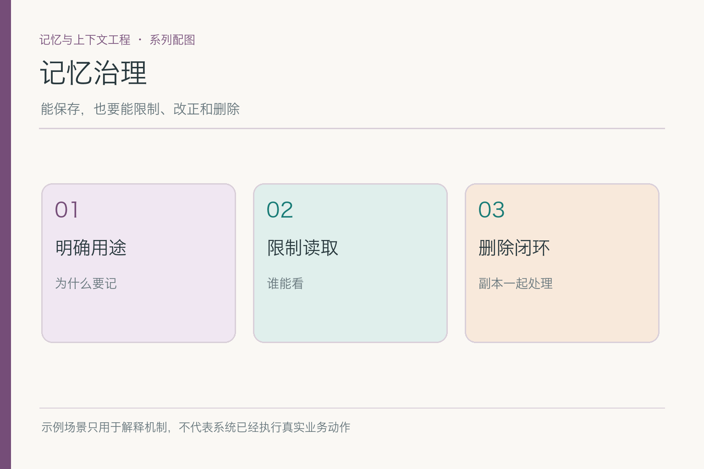
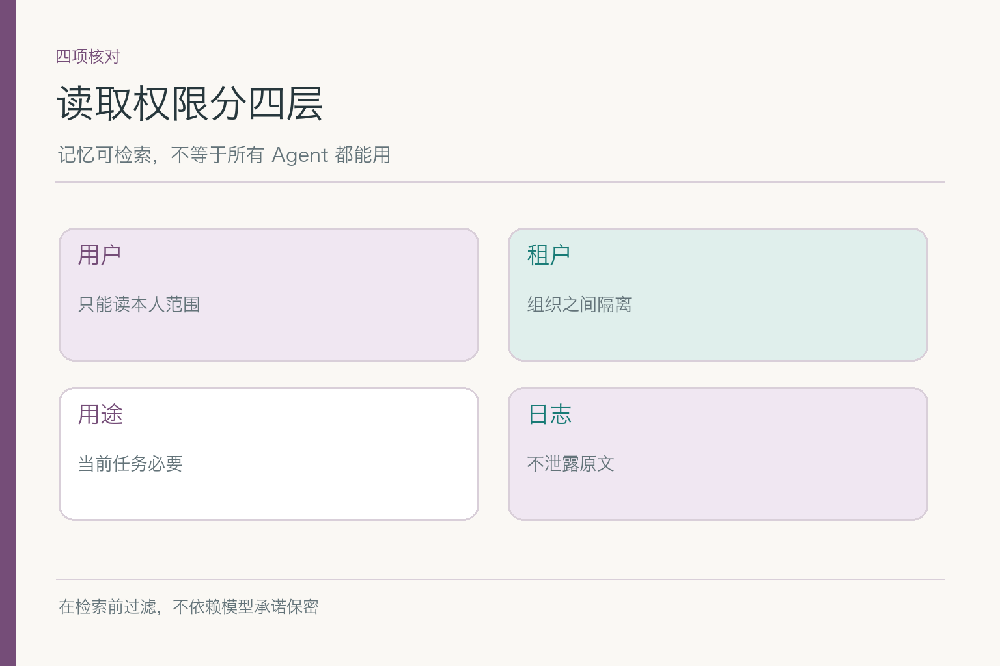
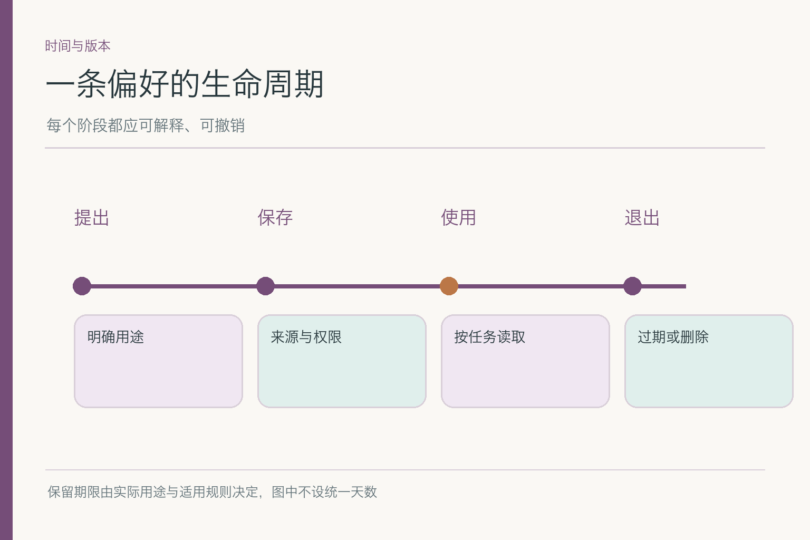
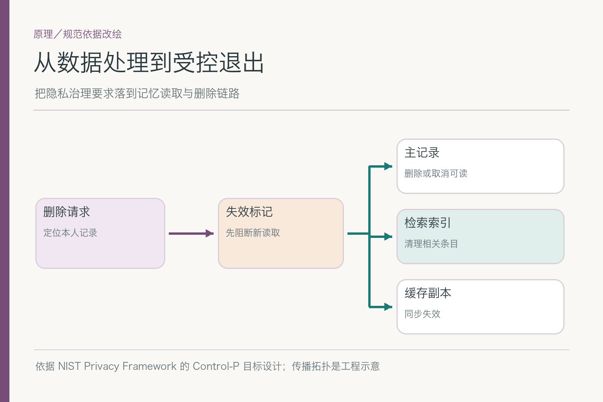
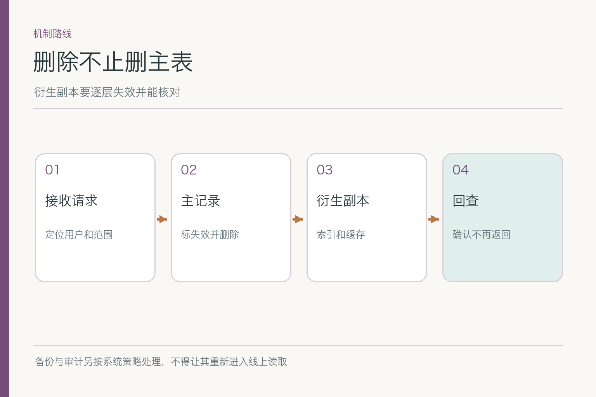
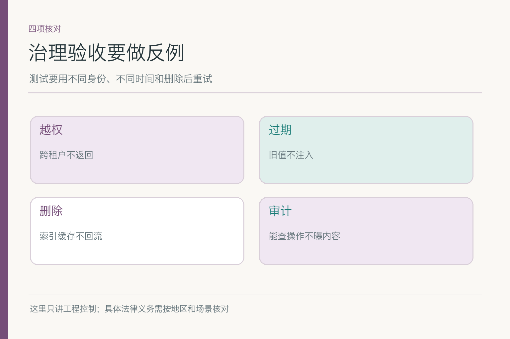

# 面试题：记忆删除怎样不留尾巴

共用案例：小林此前允许助手保存“写邮件默认中文、简洁、先给结论”。现在他在账户设置中删除这条偏好。主表处理成功后，检索索引、提示词缓存和一份旧备份里还有它；另有一位同部门同事可能通过相似查询误命中这条记录。请围绕这条偏好说清：什么时候算删除完成，怎样证明另一位用户看不到它。

## 问题 1：保存一条记忆前，如何界定用途和最小字段？

### 原理

保存目的决定字段、读取者、保留期与删除范围。小林的写作偏好用于起草草稿，不用于审批金额或身份校验。字段能少就少，但少到无法解释来源、作用域和失效状态也不行。最小化是让每个字段有明确用途，不是比赛谁的数据库列最少。

### 答题点

1. 定义用途：仅在小林起草写作内容时作为默认表达偏好；
2. 记录用户标识、偏好内容、来源、作用域、有效状态和必要版本；
3. 解释每个字段为何需要，完整私聊原文不能因“将来也许有用”全部保留；
4. 预设用户查看、更正和删除路径，别等投诉后再加。

### 记忆点

> 先回答为什么留，再决定留什么。

### 常见追问

“偏好看起来不敏感，可以随便用吗？”不能。是否敏感不是唯一判断；未经允许跨用途、跨用户使用仍可能带来错误和风险。

### 失分点

把所有聊天和摘要都叫作“长期记忆”，却说不出各自用途。

## 问题 2：同部门用户为何也不能直接检索小林的偏好？

### 原理

语义相似度不等于访问授权。同部门同事的写作问题可能与小林完全相似，但小林的偏好属于他的账户。租户隔离、主体身份和用途限制要进入候选过滤与读取校验，不能只在生成提示里写“不要泄露”。

### 答题点

1. 检索前以租户与用户作用域限制候选集合；
2. 索引条目带所属主体与活动状态，命中后再次校验；
3. 缓存键含权限边界，避免公共缓存串户；
4. 管理员和协作者有单独授权路径，按需限制内容。

若采用共享向量索引，要说清过滤是在候选生成前完成、在命中后再核验，还是两者兼有；不同实现对泄露面与性能影响不同。无论具体索引方案如何，最终返回给模型前必须再次检查身份与活动状态，而不能把“查询时带了过滤条件”当成永不失误的证明。

### 记忆点

> 先隔离，再相似；相似永远不发通行证。

### 常见追问

“已经在主库加了 `user_id` 条件，还会泄露吗？”可能。搜索索引、缓存、导出和日志若没跟上，读取链路仍可能串户。

### 失分点

只给一段让模型“别告诉别人”的提示词，不做访问控制。

## 问题 3：怎样给长期偏好设置生命周期？

### 原理

“长期”不等于永久。偏好会改变，账户会关闭，保存用途也可能不再存在。工程上应区分当前可用、待复核、已失效与待删除等状态；期限如何定，取决于产品承诺、组织政策和适用要求，而非一篇技术文章统一规定。

### 答题点

1. 给偏好定义创建、复核、失效和删除触发条件；
2. 读取端仅使用仍有效且符合本轮作用域的记录；
3. 小林当轮要求“写详细一点”时，当前指令覆盖旧默认，不一定立即改掉长期记录；
4. 用户能查看和更正当前生效偏好，避免后台静默积累。

### 记忆点

> 记忆能跨会话，不能跨时间不校验。

### 常见追问

“到期要立刻物理删除吗？”需要区分停止用于生成、主记录清退、备份和审计处理；具体时限看相关约束与系统能力。

### 失分点

把数据库里“还存在”当成业务上“仍有效”。

## 问题 4：用户点击删除，如何设计跨副本传播？

### 原理

主表、索引和缓存不是同一份东西。删除请求应先让记录不可继续用于生成，再向副本传播失效或删除事件。若异步消费者失败，读取端也要挡住落后的旧条目；否则界面显示已删，助手下一秒又照旧起草。

*图借鉴 [NIST Privacy Framework](https://www.nist.gov/privacy-framework/privacy-framework) 的生命周期治理思路，给出本案例的工程拓扑；不是该框架的原图。*

### 答题点

1. 核验删除者身份和目标记录范围，生成带版本的删除事件；
2. 主记录立即标记不可用，索引、缓存与摘要异步失效；
3. 消费者幂等处理、失败可重试，记录各副本处理状态；
4. 读取索引命中后再验活动版本，旧副本不能进入模型上下文。

### 记忆点

> 先停用，后传播；副本迟到也不能复活。

### 常见追问

“删除接口返回 200 算完成吗？”只说明请求被受理或某一步成功；应按产品承诺区分受理、停止使用和副本清理完成。

### 失分点

只 `DELETE` 主表一行，忽略缓存和索引。

## 问题 5：如何避免旧缓存重新把偏好送进提示词？

### 原理

有些系统缓存的是“检索结果”，有些缓存的是已经拼好的整段提示词。删除索引不代表组装好的上下文自动失效。需要追踪记录版本与缓存依赖，让命中缓存时也能发现偏好已被删除。

### 答题点

1. 缓存键或缓存条目保留依赖的记忆 ID 与版本；
2. 删除事件按 ID 失效相关缓存，命中时仍复核活动状态；
3. 若无法证明缓存安全，跳过缓存重新构造上下文；
4. 用“删除后立即起草一封新邮件”验证用户可见结果。

### 记忆点

> 删掉来源，不等于删掉来源的复印件。

### 常见追问

“缓存 TTL 很短可以不做失效吗？”看产品承诺与风险；即使短窗口，也可能在用户删除后的第一封邮件里暴露旧偏好。

### 失分点

只测数据库查询，不测已经构造好的提示词。

## 问题 6：备份里仍有旧记录，怎样处理恢复风险？

### 原理

备份用于灾难恢复，通常不支持逐条即时修改。要关心的是保留安排和恢复后的状态：若从删除前备份恢复，系统必须重新应用删除事件或采取其他措施，不能让小林的偏好再次成为活动值。具体备份周期与处理方式由产品要求决定。

### 答题点

1. 清点哪些备份包含该记录，明确保留和到期清退机制；
2. 删除事件或墓碑记录要能覆盖恢复后的旧版本；
3. 在隔离环境演练恢复并复问小林的写作请求；
4. 向用户说明什么状态已完成，避免过度承诺。

备份恢复的顺序也重要。如果恢复主表之后、重放删除事件之前就开放用户流量，旧偏好会短暂复活。可以让恢复环境先完成事件重放与版本校验，再对外服务；若做不到，至少在该期间停止使用无法确认状态的记忆。这是比“备份里有旧数据”更直接的运行风险。

### 记忆点

> 恢复系统时，也要恢复删除历史。

### 常见追问

“能不能立刻改写所有历史备份？”有的系统可以，有的代价极高；应说明约束、替代保护和恢复重放方案，不把一种实现说成唯一路径。

### 失分点

一句“备份不是线上数据”就结束，没有恢复演练。

## 问题 7：审计日志怎样兼顾可追溯与最小化？

### 原理

审计需要证明谁请求删除、何时受理、哪些副本完成、哪里失败；但日志不该复制完整偏好和私聊，让删除变成“从一处搬到另一处”。记录操作元数据与必要引用，并按角色限制访问；保留期限应遵循具体约束。

### 答题点

1. 记录请求者、目标 ID、版本、时间、操作类型和各节点结果；
2. 错误日志避免写入整段提示词和完整用户原文；
3. 排障人员按需访问，敏感内容脱敏或另设审批；
4. 支持向小林解释“已停止用于生成”与“后台清理仍在进行”的区别。

### 记忆点

> 留下操作证据，不留下第二份被删内容。

### 常见追问

“为了审计必须永久保存所有日志吗？”不能这么推断；具体保留要求要按适用政策确认，技术上应尽量减少不必要内容。

### 失分点

把完整提示词写进调试日志，又宣称主库删除就万事大吉。

## 问题 8：如何做治理专项评测，而不只测删除接口？

### 原理

治理目标是用户删除后不再被旧偏好影响，且其他用户从未看见它。接口成功率只能覆盖一小步。测试要贯穿主记录、索引、缓存、异步队列、备份恢复和跨租户读取，还要包含消费者失败与重复请求。

### 答题点

1. 删除前后在小林新会话里各发同样的邮件请求，检查是否仍自动套用偏好；
2. 注入索引延迟和队列失败，检验“立即停止使用”与最终清理；
3. 让另一用户做相似查询，确认没有跨账户命中；
4. 从旧备份恢复演练，确认删除事件能重新生效，逐项记录失败率。

### 记忆点

> 测用户是否仍被影响，而非只测数据库是否少一行。

### 常见追问

“如果小林当轮又要求‘请简洁’，算删除失败吗？”不算。当前明确指令可以改变这轮写法；测试要区分新请求与被删除的旧偏好。

### 失分点

只拿 HTTP 200 与主表空值当验收结果。

## 问题 9：怎样向用户准确表达删除状态？

### 原理

技术上可能有三个时刻：请求受理、旧偏好停止被读取、相关副本完成清理。用户界面的承诺应匹配真实状态。若后台传播需要时间，应说明可见影响已停止，并在失败时继续处理与通知；不能让“已删除”成为一个只反映按钮动画的词。

### 答题点

1. 区分受理、停止使用和副本清理完成；
2. 保证停止使用先于或同步于对用户的成功承诺；
3. 异步失败有告警、重试和可查询状态；
4. 对备份与日志边界作符合实际的说明，不讲无法验证的“所有痕迹瞬间消失”。

这个回答不用背法律术语。面试官更关心你有没有把**系统内部状态与用户听到的承诺**对齐。小林看不到数据库，他只会看到下一封邮件是否还沿用被删偏好；如果产品说“删除完成”，却让旧偏好继续影响输出，技术解释再漂亮也难以令人信服。

### 记忆点

> 界面说完成，读取端就不能装作没收到。

### 常见追问

“用户马上又要求保存同一偏好怎么办？”这是新的用户输入，按新的授权和写入门槛处理，不能把旧删除事件误解为永久禁止未来保存。

### 失分点

把异步传播说成瞬时强一致，却没有任何状态或失败处理。

## 参考资料

- [NIST Privacy Framework](https://www.nist.gov/privacy-framework/privacy-framework)
- [LangMem：长期记忆的概念与写入方式](https://langchain-ai.github.io/langmem/concepts/conceptual_guide/)
- [OWASP Top 10 for Large Language Model Applications 2025](https://owasp.org/www-project-top-10-for-large-language-model-applications/assets/PDF/OWASP-Top-10-for-LLMs-v2025.pdf)

想看本文在 AI Agent 中的位置，可点击下方 [阅读原文](https://github.com/Jennifer123www/ai-agent-knowledge-map)，从“记忆与上下文工程”继续阅读。
