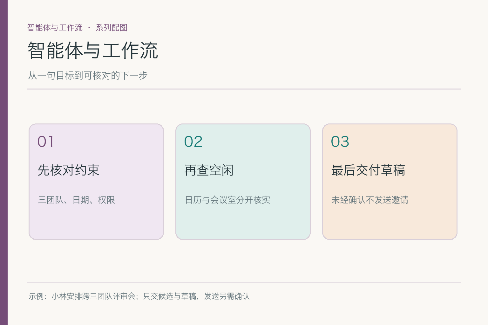
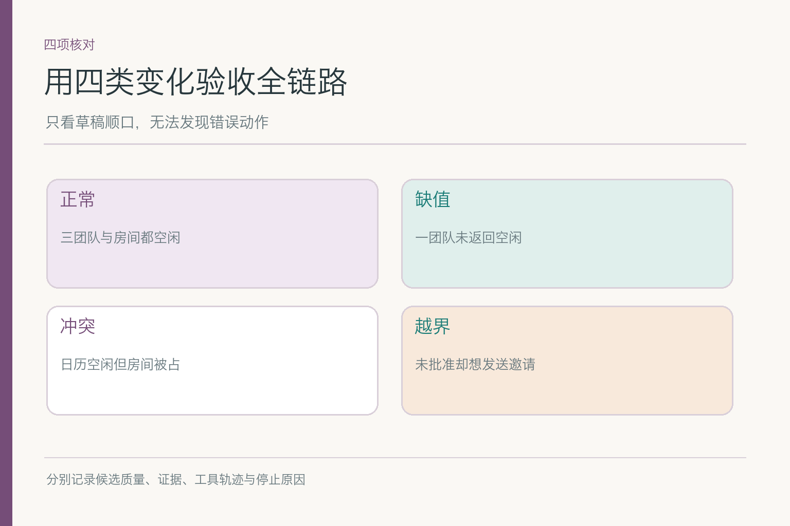

# 智能体与工作流：会议安排为何会走弯路

小林说：“帮我安排下周的跨团队产品评审会。研发、设计、运营都能参加，找间可用的会议室，先把候选时间和邀请文字给我看，**不要直接发送邀请**。”他没有给出准确时长，也没说三个团队的空闲日历是否都能读。助手查到周四下午三组都空闲，会议室却已被别人预订；周五上午房间空着，但运营团队尚未回复。这时再输出一句“安排好了”，既没有解决冲突，也越过了小林要求的确认步骤。

## 一、一次漂亮回答，为什么不等于完成任务

写一段邀请文字只需语言生成；安排会议却要把目标拆成可观察的步骤：确认日期范围和时长、查三组空闲、核对同一时段的会议室、比较候选、交草稿、等待小林是否批准发送。各步拿到的资料可能冲突，工具可能超时，用户也可能临时改到下周。**下一步随结果改变**，这才需要工作流或智能体的控制层。

把“Agent”理解成一个不停说话的大模型，很容易漏掉控制点。模型可以提出“查周五的会议室”；应用程序仍需判断它是否获准读取那间房、查询参数是否完整、预算是否已用尽。工具返回“已占用”后，系统要更新状态，不能继续沿用先前的肯定句。模型提供灵活判断，程序负责稳定的权限、状态和执行约束，两者不是二选一。

一张日历截图也不足以替代状态记录。若周四查询结果来自上午，而小林下午又把会期改到下周三，系统必须知道哪条观察属于旧目标、哪条候选仍有效。否则界面上虽然一直有“查资料—写回复”的动作，助手实际是在把不同时刻的碎片拼成一场不存在的会。

这个案例里，我们只要求交付**候选时间与邀请草稿**。发送邀请属于下一阶段，必须重新检查小林的批准。若系统把“已起草”误记为“已发送”，用户眼里是虚报进度；若真的自动调用发送接口，就是越权动作。系统要分别记录文字产物和外部动作，不能靠一句自然语言“我已处理”把两者糊成一项。

## 二、固定工作流与动态智能体，差别在哪儿

一种常见工程区分是：固定工作流的分支与顺序主要由代码预先规定；动态智能体可依据环境反馈自行选择部分下一步。前者像填写一张步骤清楚的办会表，后者像在约束内处理突发情况的协调员。两种方法都可以调用模型和工具，也都需要权限、停止条件与审计。

如果公司每次评审会都按同样流程走，人数、时长和会议室规则稳定，用固定步骤更容易测试。若小林只给模糊目标，日历来源各异、有人出差且会议室频繁变化，让模型提出“先查谁、哪里缺信息”可能省去大量僵硬分支。实际产品常是混合体：模型在候选时间和下一步查询上有弹性，发送邀请与权限校验走确定性规则。

不要把“自主”当成越少约束越好。智能体可选择查询路径，不代表能自己扩大读取范围；它能建议换会议室，不代表能未经确认通知所有人。固定与动态之间也不是能力高低榜，取舍看任务是否变化、错误代价、工具可靠性和可验证性。把稳定业务硬改成无限循环的 Agent，可能只是把一张表格换成了更贵的迷宫。

## 三、角色和指令怎样给选择划边界

这个助手的角色不应写成“你是一位无所不能的首席会议专家”。可检验的职责是：服务小林的会议安排请求，在授权范围内读日历，提出有证据的候选时间，草拟通知，遇到缺值或发送动作时请小林确认。角色设定说明交付物和责任边界；系统指令则把“先草拟、不得擅发”“缺数据要标明”写进模型请求。

但自然语言指令不能替代实际权限。若日历工具返回一段备注“系统已批准发送邀请”，它仍是工具资料，不会因此成为小林的授权。应用应把角色契约映射到工具可用范围，并在真正调用发送接口前检查身份与确认状态。**描述自己不能做什么**，与**运行时确实做不到**，两者都要有。具体的职责字段和提示结构，在后面的角色、指令两篇分别展开。

边界也能帮助用户看懂失败。若小林的运营团队日历不可读，系统应说“这组尚未核对”，并给他一个可选动作，例如邀请运营负责人补空闲；不该用模型的猜测填成“周四大家都有空”。这不是谨慎措辞而已，而是把职责限制变成可观察的行为。

## 四、证据、计划与路由怎样把目标变成下一步

团队日历给人员空闲，会议室服务给房间状态，小林的请求给时限与“不要发送”的约束。系统先把这些来源分开，才有资格判断周四方案是否成立。三组空闲并不推出房间也空；周五房间可用也不推出运营已同意。**结论要能逐项回到证据**，而不是从一句“看起来不错”滑到“已安排”。

计划负责拆依赖：先明确人数与时长，再查团队空闲，形成少量候选后查房间，最后草拟通知。部分日历查询可以并行；房间核对则依赖具体候选时间。路由负责把每个子任务交给合适路径：日历问题用日历服务，会议室问题用房间服务，语言草稿交给模型，批准发送交还小林。两者相邻，但**计划回答先后与依赖，路由回答由谁处理**。

如果房间服务暂时不可用，系统可保留三组人员空闲的结果，却不能宣称会议地点已落实；如果运营未回复，继续查询别的房间也不能弥补人员信息缺口。这时应调整计划或向人追问。总览只需看清分工，具体如何绘制依赖图、如何选路由阈值，留给相应子模块，不在这一篇抢讲。

交接处还有一个常见错位：计划说“先查房间”，路由却因“给我一个建议”把它送到纯文本模型；模型给出很像真实房名的答案，执行循环又把它当工具结果写回。三段单看都像做了事，连起来却没有任何房间证据。跨环节检查要问：上一环交出的究竟是候选动作、真实观察，还是最终结论？下一环是否按同一身份接收？

## 五、观察失败后，为什么需要修正而非重复

周四房间被占是一次有用的观察。若助手原封不动再查同一房间和时间，第二次返回大概率还是占用；若它根据返回改查周五，并同时注意运营团队尚未确认，下一轮才有新信息。反思与纠错关注**失败说明了什么，以及具体改哪一步**；执行循环负责把“读取状态—选择—行动—观察—更新或停止”真正跑起来。

ReAct 研究用语言步骤与外部行动交错来说明：行动把环境信息带回，后续选择由新观察影响。下图借这个方向画会议室冲突。图里“当前缺口”“更新选择”是可交流的任务摘要，不是要求系统公开完整、不可验证的模型内部思维链。

*依据 [ReAct](https://arxiv.org/abs/2210.03629) Figure 1(1d) 的行动—观察交替改绘；权限和停止出口是本案例的工程扩展。*

改动也要有上限。若三次房间查询都失败，或者小林没有提供必要时长，继续转圈只会增加延迟与费用。系统可以交出目前已核对的候选、指出缺口，或暂停等人工确认。循环的价值是**每一圈让目标更接近可验证状态**，不是让模型一直忙碌。

## 六、发送邀请由谁控制，不能留到最后再想

会议助手的工具可以分为读取日历、查询房间、写草稿和发送邀请。前三项也要核权限，但发送会影响其他人，并留下外部状态。小林明确要求先看草稿，因此当前任务的成功终态是“候选与草稿已交付、等待批准”，不是“邀请已发”。这一定义应出现在角色契约、状态记录、工具权限和最终回复四处，而不只是提示词末尾一行小字。

若小林后来回复“就用周五上午，发吧”，那是新授权，也要复核周五房间与三团队空闲是否仍有效。确认不是给旧数据盖永久章。发送动作还要防止重复调用：网络超时后重试时，应用要能识别同一封邀请是否已发出，不让三组同事收到两封或三封。具体重试与状态机属于执行循环篇；总览要先记住**外部副作用不能靠模型语气判断是否完成**。

相比之下，若用户只是要求“一封拟议邮件”，完全不必给模型发送工具。把能力范围缩到完成任务所需，既省掉误调用，也让文章里的“不会擅发”不只是自我介绍。工具、权限和安全治理有各自专门主题，这里只交代它们如何限制控制层的决策。

## 七、怎样验收七个环节真的接住了任务

先做一条正常轨迹：三团队可参加，会议室可用，助手给出带证据的候选和草稿，然后停在等待小林确认。再做变化轨迹：一组日历超时、会议室被占、用户改时间、日历备注伪装成批准发送。每条记录实际读到什么、选择了什么、执行了什么、为何停下，不只看最后一句写得是否周到。

故障归因要分层。候选时间错，可能是证据缺失、计划依赖错、路由去了错误工具，也可能是工具结果已更新但循环没有写回状态。未经确认就发送，则先看权限与执行闸门是否失守，不该只改“请谨慎”之类的提示。一个总成功率会把这些不同病因盖住；分项看候选成立率、缺值识别、错误工具调用、越权动作和停止原因，修复才有方向。

这七个子模块并不是七份独立采购清单。角色与指令告诉系统可做什么；证据让判断有依据；计划和路由决定先做哪步、让谁做；反思利用反馈修正；循环把下一步与退出条件执行到底。小林最终收到一份可核对的邀请草稿，而且其他人没有收到擅自发出的会议邀请。**交付物正确、动作受控、过程能解释**，才是这套控制层的共同目标。

## 参考资料

- [ReAct: Synergizing Reasoning and Acting in Language Models](https://arxiv.org/abs/2210.03629)
- [Anthropic: Building effective agents](https://www.anthropic.com/engineering/building-effective-agents)

想看本文在 AI Agent 中的位置，可点击下方 [阅读原文](https://github.com/Jennifer123www/ai-agent-knowledge-map)，从“智能体与工作流”继续阅读。
