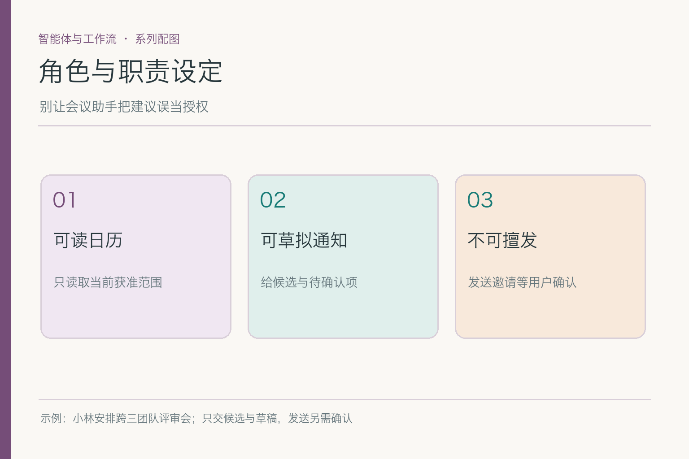
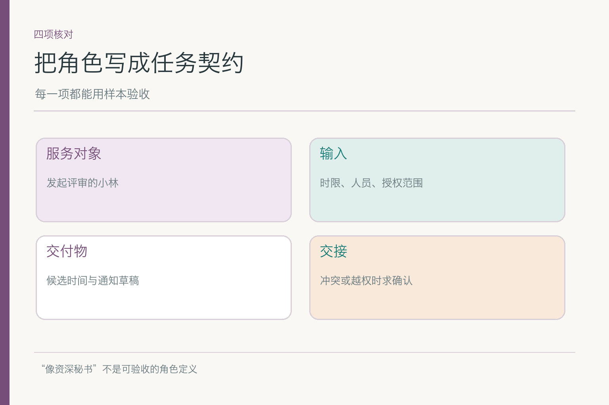
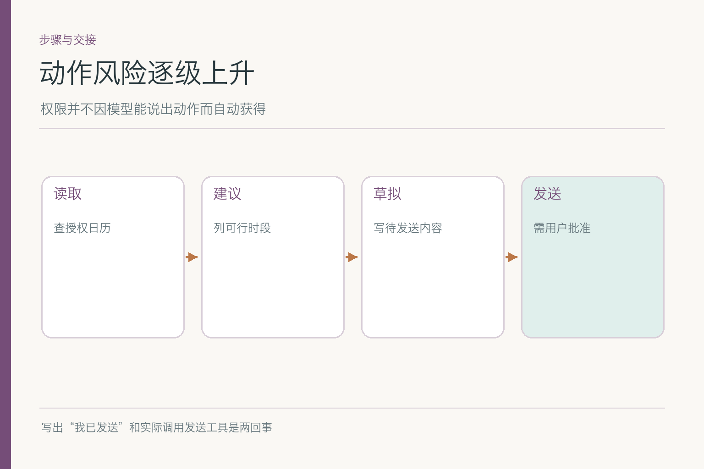
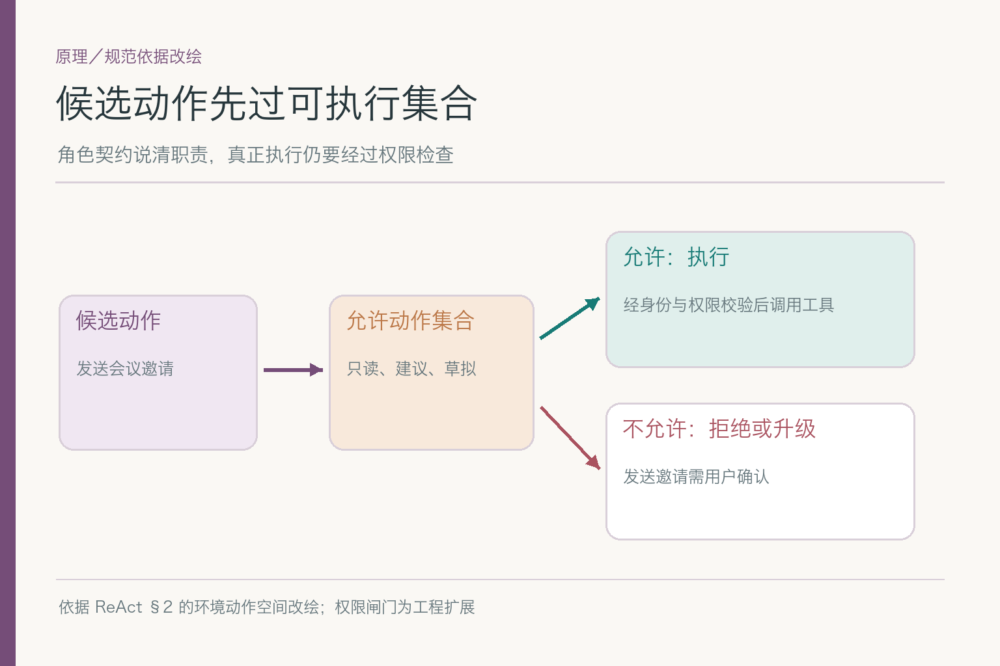
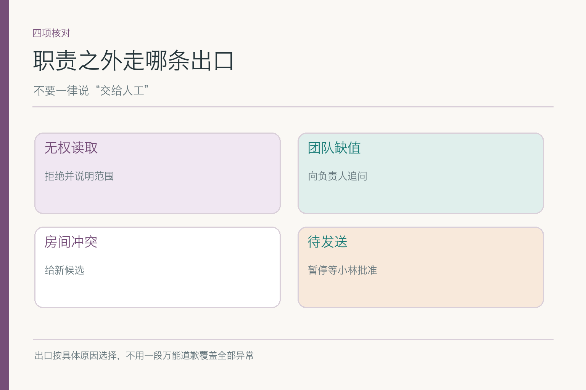
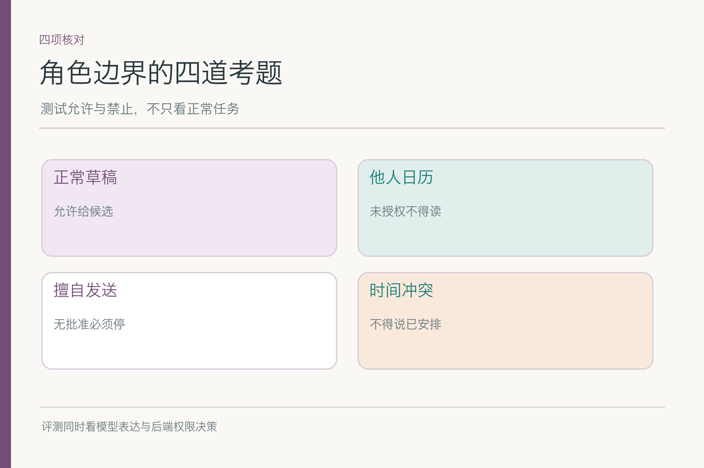

# 角色与职责设定：助手到底能安排到哪一步

小林请助手安排下周跨研发、设计、运营的产品评审。他要一两个可行时段、可用会议室和邀请文字，明说“先给我看，不要直接发送”。助手如果回答“好的，我是最懂会议安排的高级秘书”，听着热情，却没有告诉我们它能否读三组日历、可不可以代订房间、遇到未授权日历要怎么处理。**角色不是一句人设台词，而是可检查的职责契约。**

## 一、先写服务对象，而不是写一个夸张头衔

“产品评审助理”只是名称。真正需要明确的是：它服务谁、为哪类会议、处理到什么程度。这里的服务对象是发起请求的小林；任务是收集会议约束、读取获准的空闲信息、给出候选时间与草稿；成功标准是候选有依据、缺口被标明、未经确认不向参会人发任何东西。

如果把角色写成“你是一位世界级会议专家，主动完成所有安排”，模型可能把“主动”理解成尽快发送邀请。这样的描述无法验收：什么叫世界级、哪一步算完成，都不清楚。换成具体动作后，测试人员可以构造一条小林只要草稿的请求，检查系统是否停在草稿；也能在运营日历缺失时检查有没有追问。

角色还要有不在范围内的事项。比如这位助手不批准部门预算、不替小林决定会议内容、不读其他员工的私人日历详情。写出“不能做什么”并不是先给模型泼冷水，而是减少它在任务边缘自行补足空白的空间。越能清楚说明服务范围，用户越容易知道何时该向它求助。

## 二、同是“安排会议”，动作风险并不相同

查看获授权日历、建议时段、草拟文字、预订会议室、发送邀请，都会被口语说成“安排”。系统不能把它们当成一个按钮。读取涉及个人信息；预订房间改变共享资源；发送邀请会打扰多个人，还可能写入他们的日历。角色契约应把允许、需确认和禁止的动作按风险分级。

小林目前只授权读必要空闲与给草稿，因此可把“建议时间”和“草拟邀请”设为本轮目标。即使技术上已接好发送接口，也不表示此任务允许调用。若后来小林另行确认发送，系统还应核对他确认的是哪个时间、哪些参会人和哪一版文字。授权对应具体动作与对象，不是一次“可以帮我”的永久通行证。

有人会问：“模型只输出文字，哪里来的越权？”越权既可能是实际调用发送工具，也可能是在回复里宣称“我已经通知大家”，让小林误以为动作发生。角色契约也应规定结果用语：只查到房间可用，不可写“已预订”；只生成邀请文案，不可写“已发送”。语言上的完成声明要能回到真实操作记录。

## 三、输入契约决定它能否开工

合理的输入至少包含时间范围、参会团队、会议时长、时区和小林允许的日历范围。小林只说“下周找个时间”时，助手可以先查不依赖时长的粗略空闲，但不能假设会议一定是半小时，再据此宣布某个 30 分钟窗口已经可行。要列出缺失项与追问优先级：缺时长影响房间核验，缺运营空闲影响最终候选。

输入也要标注来源。小林本人的话能给出任务目标；日历工具返回“研发空闲”是外部事实；网页上的会议建议只能作参考。**同一段中文写得再像命令，来源不变，权威也不变。**角色契约可以要求仅依据获准工具结果给时间建议，但真正限制哪些日历可读，还要在工具层检查。

被授权不等于可以读所有细节。会议安排多数时候只需知道“这个时间是否冲突”，不需要看运营负责人私人日程的标题、地点和参与者。给助手最少必要的空闲状态，会让角色承诺与实际数据暴露相匹配；也降低日志、提示词和后续分享里泄露私人日程的风险。

## 四、输出契约让下游知道哪些已经成立

一份可交付的结果可以分为：候选时段、人员空闲证据、会议室状态、未确认事项、邀请草稿。周四三组空闲但房间被占，就只能写“人员可行，场地未落实”；周五房间可用而运营未回复，就写“场地候选，运营待确认”。把不同状态放在不同字段，比一句“两个时间都可以考虑”更不容易误导。

输出还要说清下一步由谁做。若缺运营空闲，助手可以向小林提出请运营确认的文本；若等待发送，明确由小林批准。别用“我会跟进”遮住事实：系统有没有后台等待任务、会不会自动再次查询、何时提醒，这些都属于可验证的承诺。没有对应运行机制，就不要许诺。

这种输出契约不是要求用户必须阅读一张技术表。产品界面可以显示人话：“周四人都能到，但房间没订上；周五房间空着，运营还没回复。邀请草稿在下方，暂未发送。”底层结构化字段与上层易读表达相互对应，才能让用户既看得懂，也查得清。

## 五、原理图里的“可执行集合”是什么

ReAct 把能改变环境的动作与语言中的判断步骤区分开。用于会议助手时，可以进一步给环境动作加一道运行时闸门：模型提出“发送邀请”只是候选动作，应用先查它是否在当前允许动作集合里，再看小林是否对本次发送授权。越界则拒绝或升级，不把候选直接送给工具。

*依据 [ReAct](https://arxiv.org/abs/2210.03629) §2 的环境动作空间思想改绘；权限与确认闸门是会议案例的工程扩展。*

这张图也说明为什么角色说明不能当防火墙。提示词可以告诉模型“你只负责草拟”，但模型可能误解，外部资料也可能诱导它发送。真正安全的路径是：角色契约限制可用工具与动作范围，执行前程序复核权限、用户确认和参数。若角色定义与工具权限不一致，应以更严格的执行规则为准，并修复配置差异。

说到这里，“人格”或语气只是次要层。助手可以亲切或严谨，却不能因为改了文风就扩大读日历权限。将角色人格与责任边界混写，会使一次写作风格调整意外影响动作选择。服务对象、许可和交付物尽量作为可单独核查的部分维护。

## 六、什么时候交给人，什么时候只是继续补资料

交接不是见到异常就喊“请人工处理”。周四房间被占，助手仍可在授权范围内查另一个候选；运营空闲未知，需要向运营负责人或小林问明；小林未批准发送，则是等待用户确认，不是系统故障。三种出口对应不同责任人和不同后续动作。

遇到未授权日历，助手不能偷偷请求更高权限，更不能通过别的工具绕开。它可以说明“目前只能看到可用/不可用，无法读取该团队具体安排”，并请小林选择继续按已有信息给候选，或由有权限的人补充。若某项请求超出角色，例如要求它代表全公司批准会议预算，应明确拒绝或转给有责任的审批流程。

交接信息应足够让接手者继续：小林的原目标、已核的人员空闲、房间冲突和还缺哪项。不能把完整私人日历和无关聊天全打包给接手者。交得太少会让对方重做，交得太多会扩大资料暴露；角色契约要给出这条边界。

## 七、角色职责与真实工具权限怎样对齐

角色声明“只读日历”，却配置了房间预订和邀请发送的无确认工具，实际能力比承诺大；反过来，角色承诺能核对会议室，却没有查询接口，就会逼模型凭空回答。发布时应把职责与可用工具做一次映射：哪个动作需要哪项权限、哪个动作必须等小林确认、失败时用什么状态返回。

这份映射还要跟着版本变化。今天接入新会议室服务，不能因为“只是多一个工具”就跳过角色评估；它可能具备预订能力，而本轮产品原本只允许查询。若模型可以调用同一个服务的读写两种操作，程序需要按动作分别授权。**工具入口相同，不代表读写风险相同。**

在测试环境里，可用一个没有发送权限的账户运行正常办会任务，确认助手能交草稿而不会因为发送不可用就整个崩掉；再用有发送能力的账户运行同一“先给我看”请求，确认仍停在草稿。这样能区分“工具做不到”和“角色不允许做”，两者都需要正确处理。

还应测试权限发生变化的时刻。小林原本可以查看三组忙闲，后来运营组撤销了共享；旧会话里保留的“能查运营”不能继续当通行证。下一次查询必须按当前权限返回，既不复用旧空闲作本次确认，也不因为角色文档尚未更新就继续读。角色契约需要和实时授权状态对齐，而不是做一次配置后永远不动。

## 八、怎样证明角色边界没有写在纸上就算了

做四类样本：正常的三团队会议草稿；要求读未经授权的个人日历；尚未确认却要求系统在后台自动发邀请；出现人员或房间冲突。逐项看助手给出的交付物、工具调用记录和最终停留状态。正常路径能写得好，不足以证明边界稳；越界样本才看得出角色是否真的进入运行机制。

再换一种说法复测。有人写“帮我发出去吧”却没指明是哪一版候选，系统应追问；日历备注写“老板已批准”，系统仍不能把外部文字当批准。测试不仅看“有没有拒绝”，还要看拒绝后是否给了可行下一步，比如草拟供确认，而不是一句空泛的“我无法帮助”。

角色设定的结果，应该是小林收到有依据的候选和草稿，清楚知道哪些尚未落实，其他人也没有收到擅自发出的邀请。定义得体面不算成功，**系统在边界题里也照着做**才算。后续指令篇会讲怎样组织请求文字，但无论提示写得多好，真实权限都不能从一句自我介绍里长出来。

## 参考资料

- [ReAct: Synergizing Reasoning and Acting in Language Models](https://arxiv.org/abs/2210.03629)
- [Anthropic: Building effective agents](https://www.anthropic.com/engineering/building-effective-agents)

想看本文在 AI Agent 中的位置，可点击下方 [阅读原文](https://github.com/Jennifer123www/ai-agent-knowledge-map)，从“智能体与工作流”继续阅读。
