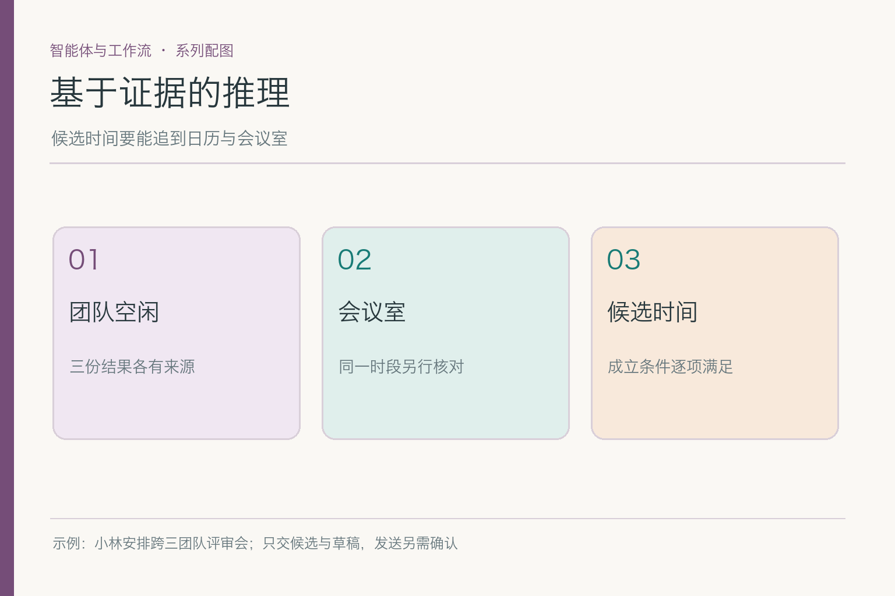
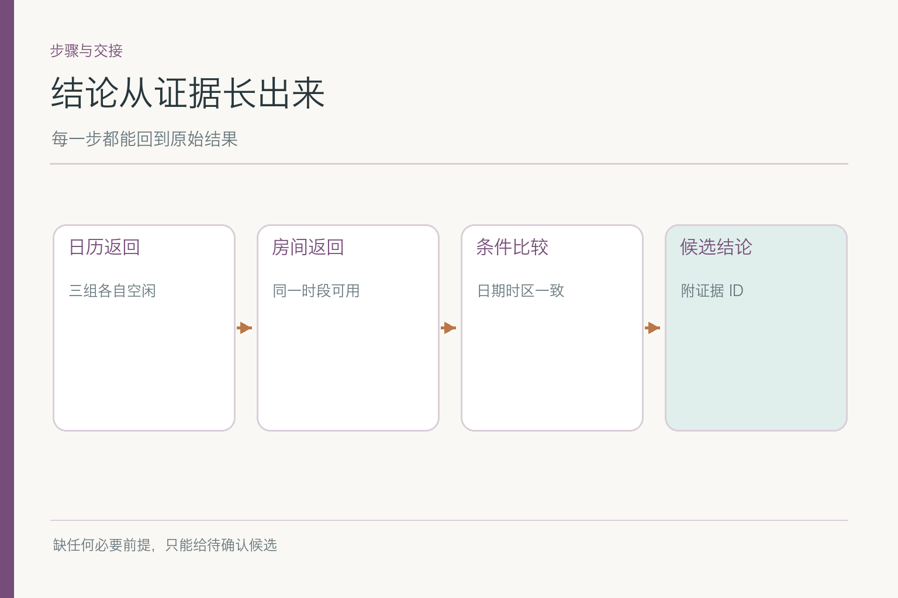
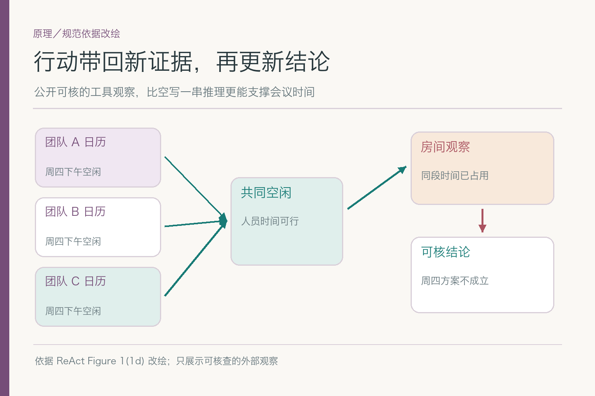
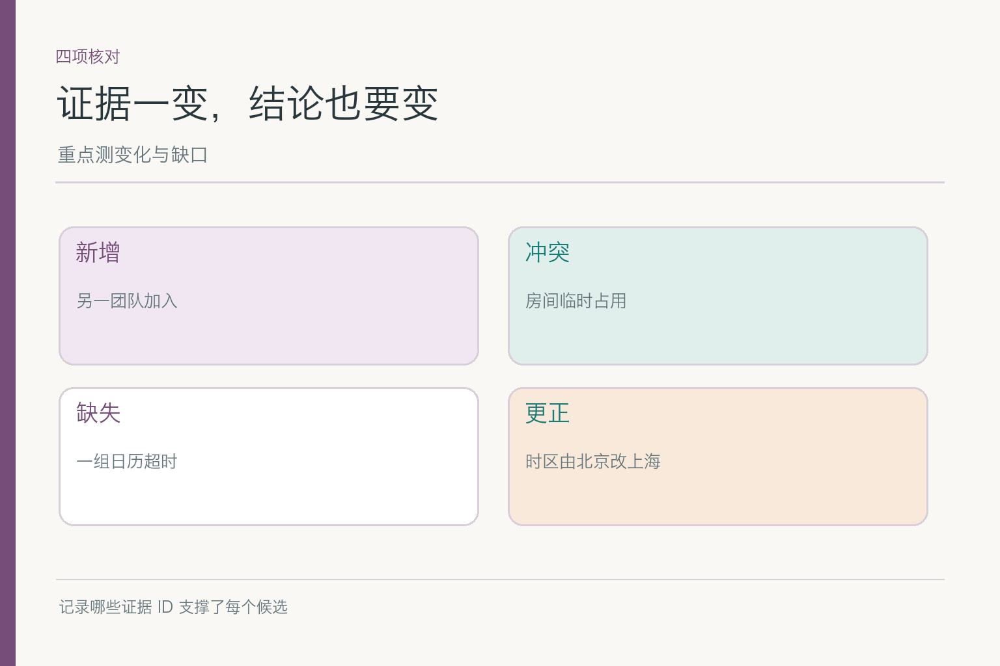

# 基于证据的推理：三组有空还不够开会

小林要安排下周研发、设计、运营三组都能参加的产品评审，先看候选和草稿，不发送邀请。助手查到三组日历在周四 15:00 都标“空闲”，于是准备写“周四会议已安排”。又查会议室，发现同一时段房间已被别人占用。周五 10:00 有房间，却还没拿到运营组的空闲结果。**周四缺场地，周五缺人员证据**，哪一个都不能直接说“安排好了”。

## 一、先把“我觉得可行”拆成可核的条件

会议候选成立至少要满足：时间在小林允许范围内、三组都有可参加依据、会议时长足够、时区一致、同段时间有可用房间。每项前提对应具体证据，任何一项未核都不能默认为真。人看一句“大家都有空”容易想当然；系统若不拆条件，也会把口语上的合理感误当业务事实。

证据还要带时间和来源 ID。研发日历周一返回的“周五空闲”，到了周四可能已被新会议占用；房间查询也可能只返回“当前可用”，并不保证保留。把证据 ID、查询时间和版本与候选时段关联，后来有人质疑时，才知道结论建立在什么快照上。

有人说可以让模型写一长串推理，证明它想得周全。长文本未必能证明事实：模型可能在里面反复断言“会议室应该有”，却没有任何房间工具返回。更稳的做法是让它给可核的中间产物：候选、每个成立条件、来源和未确认项。**可审阅的依据，不等于暴露或索取全部内部推理。**

## 二、外部观察怎样改变原来的判断

ReAct 的核心思想之一，是让模型的行动取得环境观察，再据此更新下一步。会议助手先查人员，得到“周四三组空闲”；再查房间，得到“周四房间已占”。后一个观察不是给前一个事实打脸，而是补上另一项独立条件：人员确实空闲，但会议地点不成立。

*依据 [ReAct](https://arxiv.org/abs/2210.03629) Figure 1(1d) 的行动—观察交替改绘；图上只展示可核查的外部观察。*

此时结论应从“周四可选”改成“周四人员可行，原会议室不可用；可尝试其他房间”。若系统继续按旧结论起草邀请，就说明它没有把新观察送回判断过程。问题不是“会不会思考”这么空泛，而是一次明确的数据更新漏掉了。

同一逻辑也适用于周五：房间空闲是正证据，运营未回复是缺证据。模型不能把“没看见冲突”推成“确认空闲”。这类推断错误往往比明显的报错更危险，因为最终句子可以写得很自然。

## 三、两份资料冲突时，不要用语气投票

假如运营日历显示周五 10:00 空闲，运营负责人刚在聊天里说那时有客户电话。两项来源冲突，不能挑措辞更肯定的一项。先检查各自时间、时区、身份和权限：聊天是负责人本人说的吗，日历更新时间是什么，客户电话是否已录入日历？必要时回问负责人，而不是把两条都塞给模型让它猜。

来源权威也要按问题区分。会议室服务最能说明房间是否被占，不能证明运营负责人是否能参加；负责人自己的回复能说明意向，却未必代表房间已预订。一个来源在自己的领域可信，不意味着它能回答其他领域的问题。周四的人员日历和房间返回并没有谁“覆盖”谁，而是共同决定候选是否成立。

如果冲突暂时无法消解，输出应保留冲突本身与影响：“周五房间可用，但运营空闲存在两份不一致信息，待确认。”小林至少知道为什么不能直接发送。把冲突藏成一个小概率的“模型不确定”，不如列出哪两条事实尚未对齐。

## 四、缺信息时，问题应该问到哪一步

小林没给会议时长，系统可以查大致空闲窗口，但不能把一个 30 分钟缝隙宣布为可容纳 90 分钟评审。运营日历权限不足时，也不能拿“往常周五上午他们都空”来补。追问应针对阻碍判断的缺口：会议计划多久？运营周五 10 点能否参加？是否有别的会议室可选？

追问不是任务失败。只要能保留已经核实的信息，它可能是最省成本的下一步。比如周四三组人员空闲这一事实仍有用，换房间即可；周五房间可用也有用，补运营反馈即可。把每个半成品标成“候选”，而不是“最终时间”，可以让用户在两条路径间做选择。

若被要求立刻给结果，可以给**有条件的建议**：“按目前记录，周四 15:00 适合人员但需另找房间；周五 10:00 有房间但需运营确认。”这比编一个“最优时段”更尊重事实。条件必须写在同一句推荐附近，不能藏在文章最后的小字里。

## 五、可验证的中间产物长什么样

一张简短的候选卡即可：时间、团队空闲状态、房间状态、来源 ID、查询时间、未确认项。它不需要把模型每个隐含联想都记录下来。若小林问“为什么推周五”，系统能答“房间服务显示可用，研发和设计日历空闲；运营还未确认”，而不是“模型综合考虑后认为周五较好”。

中间产物还要允许修正。运营后来确认周五不能参加，系统更新候选卡里该项状态，周五方案就应变成不可行；不必删除之前房间可用的证据，也不应把房间结果误改为“不可用”。分字段的事实关系让系统能准确定位变化，避免一次更正把所有结论搅乱。

这与展示“长链条自言自语”不同。后者可能包含未经验证的猜测，也不容易与工具结果一一对应；前者记录对用户和工程师有用的可复核事实。哪些字段能给用户看、哪些日志需要脱敏，再由产品与治理规则决定，不应为了看上去透明就公开私人日历全文。

## 六、时间、时区和版本如何影响同一句“空闲”

跨团队会议常有多个时区。一个工具用北京时间，另一个返回 UTC，模型若只看到“15:00”，就可能把不同瞬间当成同一时段。候选结论应先把时间统一到明确时区，再核对会议时长是否覆盖整个窗口。即使小林和三团队都在中国，也应在程序记录中保存时区，避免系统部署地点改变后发生隐蔽偏移。

版本同样重要。周四上午查到“周五空闲”，周五前又新增临时任务，旧查询仍在缓存里。系统不能只因旧证据曾经正确，就把它当成永远正确；关键动作前要按需要重新核对。若只是给草稿，可以标明“依据当前查询”；若准备发邀请，证据的时效要求通常更高。

这里不是要求每封草稿都做最昂贵的全量查询，而是按动作风险调证据新鲜度。建议阶段可以保留带时间戳的候选，提交外部动作前再核实核心条件。**事实有效期与动作代价要相配**，否则不是查得太慢，就是发得太错。

## 七、怎样表达不确定，而不是偷偷把它抹平

“运营未知”是数据状态；“运营 70% 会参加”是模型估计，除非有清楚的依据和可接受的校准方法，否则后者并不能替代前者。给小林的草稿可以把未知写成待确认项，邀请正文则暂时不写“全员确定参加”。自然语言要像事实字段一样守边界。

若模型对周四、周五排序，可以说明依据：周四人员齐但房间缺，周五房间齐但运营缺。优先哪个取决于小林是更容易换房间，还是更容易得到运营确认。系统可以给选择与影响，不必装作存在一个客观的“全局最优”。这类诚实的不确定，通常比一个自信的错误结论更方便人接手。

别把所有不确定都写成“可能不准确”。这种泛化免责声明没有信息量。要说哪项缺、谁能补、补完后结论会怎样改变。比如“请运营确认周五 10 点是否能参加；若不能，周五候选取消”，就能让下一步有明确目标。

## 八、把证据改一下，看看结论是否跟着变

准备四组可控制的输入：正常三组空闲且房间可用；周四房间被占；运营日历超时；运营后来更正周五不可参加。每组记录最终候选、支撑它的证据 ID、缺口与错误动作。若新证据进来结论仍不变，说明工具返回、状态更新或模型使用证据的某一环断了。

还可以做一个更刁钻、却很贴近工作现场的测试：先让运营组日历显示周五空闲，再补一条较新的请假记录。此时若助手仍沿用旧的空闲结果，说明它只会把资料堆在一起，不会处理资料的生效时间。测试记录里应写清两条资料各自的更新时间、覆盖范围和冲突处理结果，而不是只写“模型答错”。

另一个对照是把同一条房间返回换成“查询失败”。已占用表示当前候选不成立；查询失败只表示尚未查明。两者都不能立刻确认周四能开会，但下一步不同：前者换房间或时段，后者重试查询或告知待核。若模型对两种输入给出完全相同的确定结论，就暴露了它没分清**反证**与**缺证**。

最后让小林改变一个条件，例如把会议时长从一小时改成两小时。先前的一小时空档不能继续引用为完整证据，即使三团队都空闲。这样的测试能看出助手有没有把结论绑在它成立时的条件上。真正有用的“证据链”不是一串漂亮的引用编号，而是输入条件一变，哪些结论必须撤回都说得明白。

评价要分开：证据是否被读取，条件是否被正确应用，冲突是否被标明，缺值有没有被编造，引用能否回查。单看最后推荐了周五还是周四，可能碰巧答对，却漏掉模型引用了过期日历。再加入“工具返回格式改变”样本，检查字段解析是否把 `busy` 当成 `free`；这类错误不是多写一段推理就能修的。

小林最终要的不是一段看起来很会分析的文字，而是一两个**有证据、有条件、能继续办理**的会议候选。房间冲突就标冲突，运营未知就留待确认；只有资料真的补齐，结论才升级。基于证据的推理，就是让每个“可以”都找得到那个“凭什么”。

## 参考资料

- [ReAct: Synergizing Reasoning and Acting in Language Models](https://arxiv.org/abs/2210.03629)
- [Anthropic: Building effective agents](https://www.anthropic.com/engineering/building-effective-agents)

想看本文在 AI Agent 中的位置，可点击下方 [阅读原文](https://github.com/Jennifer123www/ai-agent-knowledge-map)，从“智能体与工作流”继续阅读。
