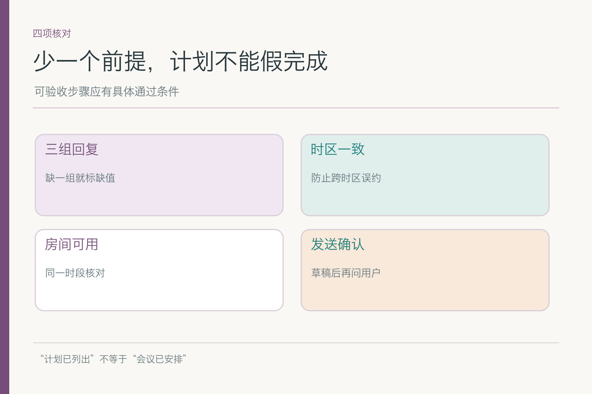
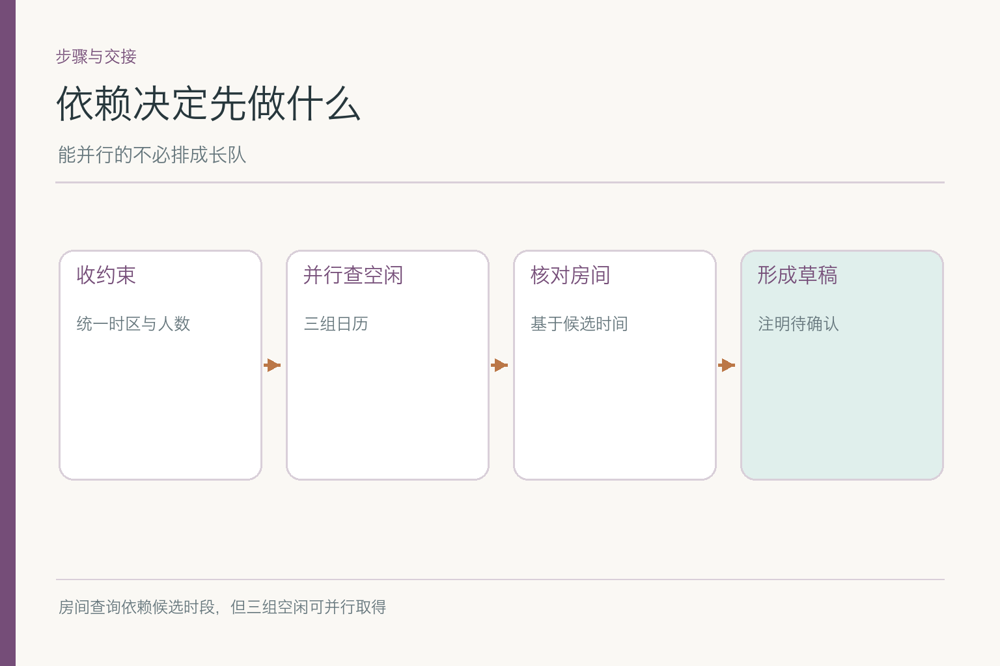
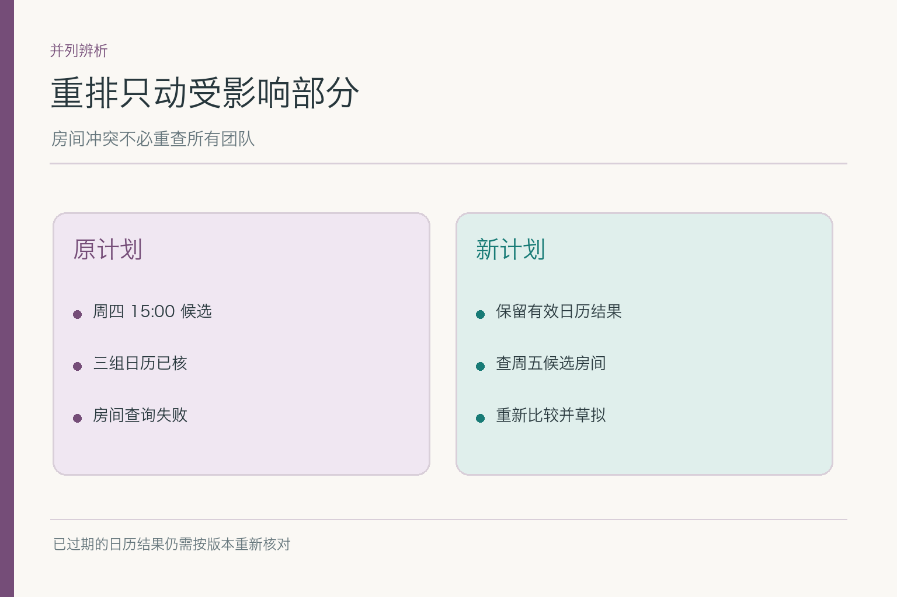

# 面试题：会议计划怎么拆、怎么改

共用案例：小林要下周跨研发、设计、运营的产品评审会候选时间、房间和邀请草稿，明确暂不发送。周四三组人员空闲但房间被占；周五房间可用但运营尚未确认。会议时长一开始也未说清。面对这些变化，计划必须知道哪一步先做、哪一步能并行、什么结果会使候选失效。

题目只讨论计划本身：怎样表达依赖、候选和重规划。具体工具由谁执行，运行状态如何重试，留给路由与执行循环回答。

## 问题 1：怎样把会议目标拆成合适粒度的子任务？

### 原理

子任务应有明确输入、可观察产物与失败出口。“查资料、写邮件”太粗，漏掉空闲与房间分别核验；拆成几十个微动作又让控制开销盖过任务本身。合适粒度通常对应一个能独立验收的业务事实或产物。

### 答题点

1. 收时间范围、时长、时区和参会团队；
2. 分别取得三组空闲并形成少量候选；
3. 按候选时段核房间，比较可行条件；
4. 交草稿与待确认项，发送不列为自动终点。

如果小林没有给时长，计划不能把“查到 30 分钟空档”直接算作可行。可把“补时长”设为一个前置步骤，或给临时候选并标假设；关键是知道该假设会影响后续哪一步。

### 记忆点

> 一步有输入、有产物、有失败去向。

### 常见追问

“越细越稳吗？”不是。过细会增加模型与工具调用、状态同步和错误传播；粒度应让失败可定位即可。

### 失分点

只背“任务分解”，却把实际待办写成三句无法验收的动词。

## 问题 2：如何画出正确的依赖关系？

### 原理

依赖图告诉系统哪一步必须等待哪项结果。确定时长先于判断空闲窗口是否足够；三组日历可以并行读取；有了少量候选才查对应房间；草稿要引用实际核对状态。箭头方向若错，会把“先写邀请再核时段”变成合理流程。

### 答题点

1. 先列每步产物与下游需要的字段；
2. 只在真实数据依赖处画箭头，不把全部步骤串成长链；
3. 三组日历查询可并行，但汇总候选需等必要结果；
4. 外部发送需另行批准，不是当前自动依赖的终点。

### 记忆点

> 箭头画数据前提，不画模型说话顺序。

### 常见追问

“运营日历超时，研发和设计结果作废吗？”不作废；可保留已核信息，候选状态降为待运营确认。

### 失分点

把“能并行”误写成“可以不等结果就宣布完成”。

## 问题 3：候选时间为什么可以作为搜索分支？

### 原理

多个时段各有不同缺口：周四缺房，周五缺运营确认。分支搜索允许同时保留候选，按硬约束与补证成本评价，再决定探索、回退或交给小林。ToT 的分支评价思想可作启发，但业务任务节点不等于论文里的语言 thought。

*依据 [Tree of Thoughts](https://arxiv.org/abs/2305.10601) Figure 1 的搜索结构改绘；会议时段是教学应用。*

### 答题点

1. 列出周四、周五两个明确候选，不先入为主只保留第一个；
2. 用人员、场地、时间偏好和缺口评估；
3. 硬约束未满足的候选不能因综合分高就称为已定；
4. 搜索有预算，到限可交带条件的候选。

### 记忆点

> 分支用于比较可能的路，不用于包装猜测。

### 常见追问

“所有会议都要做树搜索？”不用。若唯一时段明显可行，确定性流程更便宜；只有候选多且取舍复杂才值得展开。

### 失分点

把 ToT 名字贴在普通清单上，没有候选、评价与回退。

## 问题 4：计划怎样判断一个步骤可执行？

### 原理

子任务写得漂亮，不代表有工具、权限和参数。比如“查询全部员工私人日历”可能超出许可；“查会议室”缺少时段和人数；“自动发送”超出小林当前授权。可执行性检查应发生在执行前，失败时回到缺口或交接。

### 答题点

1. 每步要有必要参数，例如时段、时长、容量；
2. 工具或人工接手方真实可用，且在授权范围；
3. 产物能被下一步消费，如房间状态含具体时段；
4. 高风险动作需额外确认，不因写进计划就可执行。

若房间服务只允许查询而不允许预订，计划可以给“可用房间候选”，不能写“已订好房”。计划图里每个动词应能对应真实能力，做不到就改变交付方式，而不是寄希望于模型把未完成写得像完成。

### 记忆点

> 计划里的动词，要在权限和工具里找得到。

### 常见追问

“模型计划有步骤但没工具怎么办？”选择追问、人工处理或降级交候选，不能假装执行。

### 失分点

只评计划语言是否合理，不检可执行参数与权限。

## 问题 5：周四房间被占后，怎样局部重排？

### 原理

房间占用让周四“原房间”分支失败，不会抹去三组人员空闲。先问有无其他合适房间；若没有，再比较周五；若日历结果过期，则必须重核。局部重排的前提是识别哪些证据和步骤仍有效。

### 答题点

1. 保留人员空闲证据及其版本；
2. 房间冲突只使相关房间节点失效；
3. 查其他房间或转周五候选，不机械重跑全部日历；
4. 若日期、时长或人员变化，扩大重排范围。

“把计划全部推倒重来”虽然不容易漏旧状态，却浪费时间；“只改一个房间字段”又可能错过时效变化。面试时给出重新使用证据的条件，答案才完整。

### 记忆点

> 改动影响哪条依赖，就重排哪一段。

### 常见追问

“房间服务返回超时也换时间吗？”不一定。超时是技术失败，先看重试或降级；与明确被占是不同原因。

### 失分点

把所有失败都当成“另找一天”。

## 问题 6：计划和路由、执行循环的边界是什么？

### 原理

计划决定子任务与依赖，路由决定由哪个模型、工具或人处理某子任务；执行循环把每次动作与观察写入状态，直到停止。这三者在一次任务里相互连接，但不能互相替代。

### 答题点

1. “先拿人员空闲再核房间”是计划；
2. “人员空闲向日历服务查”是路由；
3. “查询返回后更新状态并决定下一圈”是循环；
4. 出错时按错误首次出现的位置修正。

例如规划正确写了“查房间”，路由却把这一步送给纯文本模型让它猜可用性，问题不在计划；若房间返回已占而下一轮仍写“可用”，是状态更新或判断问题。分边界能避免一看到最终答错就一齐重做三层。

### 记忆点

> 计划排依赖，路由选接手者，循环执行与回写。

### 常见追问

“能在同一次模型调用中同时做三件事吗？”实现可合并，但记录与评测仍应能区分三种失败。

### 失分点

把“先查日历”和“选日历工具”当成同一个设计决定。

## 问题 7：预算与停止条件怎样影响规划搜索？

### 原理

候选很多时，穷举所有房间和时段未必值得。可先筛人员交集，再查少数优先候选；找到满足硬条件的候选就可交付。缺运营确认时继续扫房间不一定带来有效进展，应停下追问。

### 答题点

1. 给工具次数、总耗时和用户等待设置预算；
2. 优先查最有可能满足全部约束的少量候选；
3. 无新信息或缺人确认时暂停，不无限搜索；
4. 到限交出已核证据与缺口，不伪称完成。

预算策略需与任务风险相配。只要给草稿，找到一两个有条件候选可能足够；若准备实际发邀请，就要更严格地复核所有硬条件。不能把“搜索越久越认真”当成统一规律。

### 记忆点

> 搜索要有收益判断，也要有交付出口。

### 常见追问

“固定最多两次查询是不是最好？”没有通用次数；用真实任务样本评测成功收益与成本曲线再设限。

### 失分点

计划永远写“直到找到最佳方案”，没有预算和终态。

## 问题 8：怎样评测规划，而不是只看最终草稿？

### 原理

最后有一封草稿，计划可能仍低效或越界。要看子任务是否可执行、依赖是否正确、是否重复做无关查询、遇到变化能否只重排受影响部分。最终答案和过程质量须分开记录。

### 答题点

1. 普通：所有条件齐全，步骤顺序和并行关系正确；
2. 缺值：时长或运营空闲缺失，能停下追问；
3. 变化：房间占用后能重排，而非引用旧可用结果；
4. 到限：预算耗尽时交候选与缺口，不继续调用工具。

报告可含无效依赖率、冗余查询数、局部重排成功率、任务耗时以及错误外部动作次数。若系统答对一个时段却查了三十间房，体验和成本都可能不合格；若它迅速给出一个没有运营确认的“确定时间”，则是质量不合格。

可以让候选人现场列出一张**步骤—前提—产物—失败出口**表。比如“查房间”需要明确时段、时长和人数；返回占用后，产物应是冲突信息及下一候选，而不是笼统的“房间查询完成”。若某一步没有可验收产物，或失败后不知道该回到哪个节点，这项规划评测就没通过。

接着把周四房间从“可用”改成“已占”，比较新旧两次轨迹。合格计划只撤回依赖该房间的结论，保留仍有效的三团队空闲记录，并按预算尝试其他房间或时间。若每次变化都从头查所有日历，说明缺少局部重排；若一项也不重查，可能又沿用了过期资料。评测要同时看修改范围和结果新鲜度。

最后给出执行上限，例如最多查询五个房间或两分钟内交付。计划必须在上限内优先核实最有希望的候选，到限后告诉小林哪些条件已经满足、哪些还未知。预算并不是让系统草率给出确定答案，而是迫使它在“继续搜索”和“带缺口交付”之间作出明确选择。

### 记忆点

> 看步骤是否必要、可做、可改、会停。

### 常见追问

“哪类失败应改计划，哪类改路由？”看计划是否要求正确的步骤与依赖；若要求正确但交错处理路径，再修路由。

### 失分点

只让裁判模型给最终邀请文字打分。

## 参考资料

- [Tree of Thoughts: Deliberate Problem Solving with Large Language Models](https://arxiv.org/abs/2305.10601)
- [Anthropic: Building effective agents](https://www.anthropic.com/engineering/building-effective-agents)

想看本文在 AI Agent 中的位置，可点击下方 [阅读原文](https://github.com/Jennifer123www/ai-agent-knowledge-map)，从“智能体与工作流”继续阅读。
