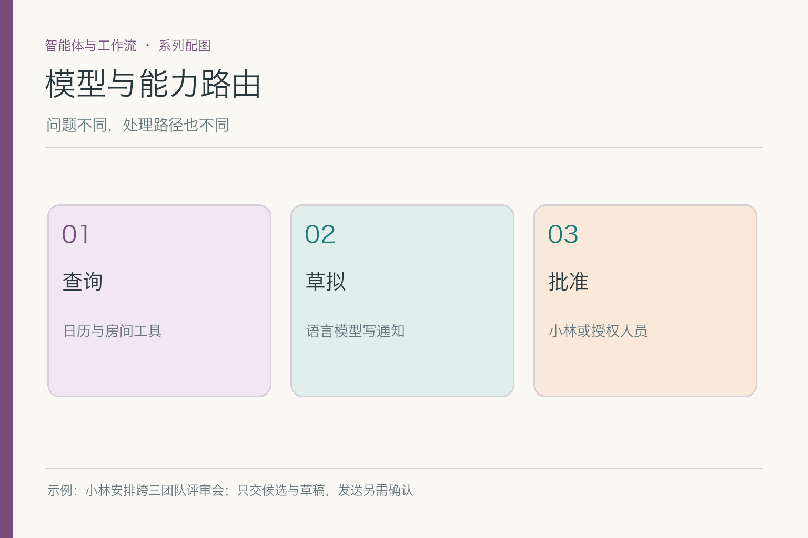
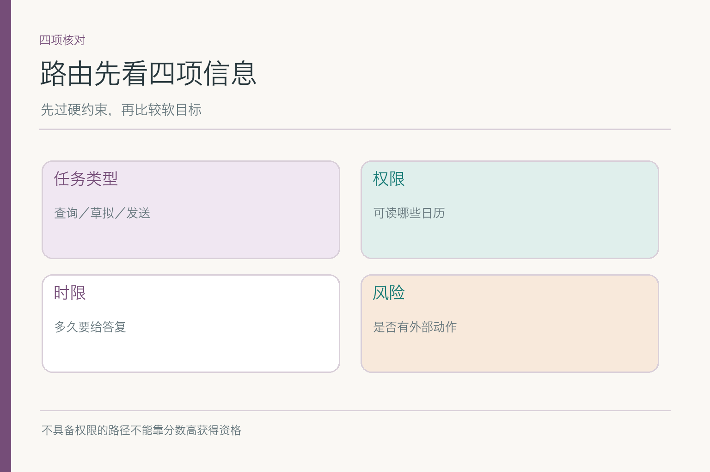
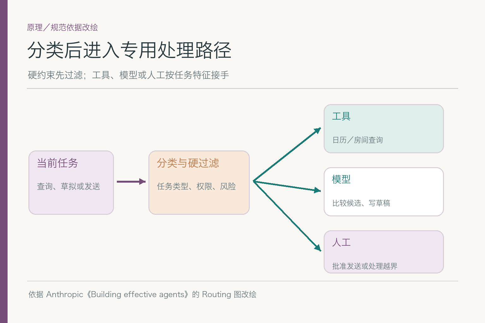
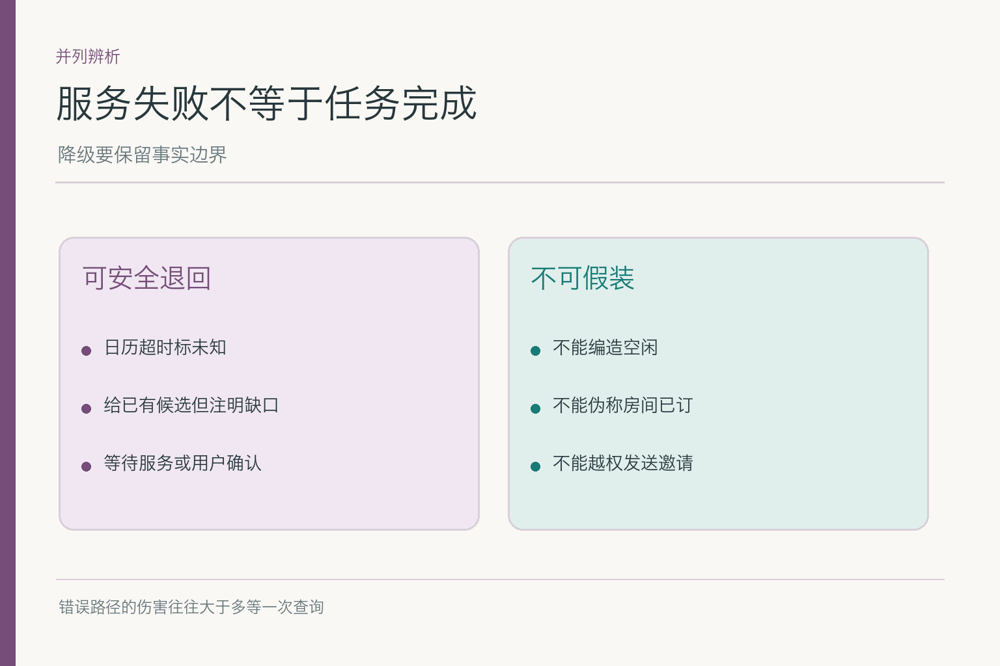
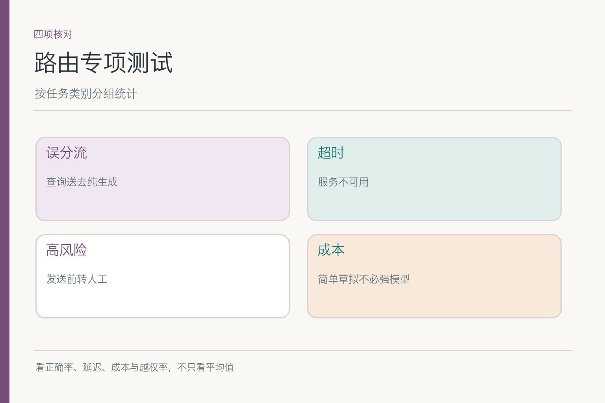

# 模型与能力路由：该查日历还是问人

小林要下周跨研发、设计、运营的评审会候选时间、可用会议室与邀请草稿，不让助手立即发送。系统现在有四类处理路径：日历服务、房间服务、语言模型和等待小林确认。它需要查“运营周五是否空闲”时若选择语言模型猜测，即使写得流畅也没有事实依据；需要写草稿时若一味去查更多房间，则又把时间花错了地方。**路由决定这一步由谁做，做错路径常比选错措辞更糟。**

## 一、为什么“所有问题都问最强模型”不划算

模型擅长理解小林模糊的要求、归纳候选和起草文字；日历服务掌握实时忙闲，房间服务掌握可订状态，负责批准的人掌握最终授权。让模型直接回答“周五运营有空吗”，不管模型多强，都不如读获准的真实日历。反过来，让房间 API 写一封体面的邀请，也不是它的职责。

一条请求可以连续经过多条路径，而非只选一个“最厉害的 Agent”。小林说“找时间”，先把自然语言解释成时段与人数；“查空闲”走工具；“比较候选”可用模型或规则；“发邀请”走人工确认加发送服务。路由的单位通常是**当前步骤**，不是给整个任务贴上一个永久标签。

这也提醒我们不要把“路由”写成随便换模型。若分流前没有明确任务类别、权限与失败出口，换来换去只会让结果不可解释。路由的价值是让每个问题找到最合适的处理方式，并在错误路径被选中时能发现和纠正。

## 二、路由器先看哪些输入特征

至少看任务类型、资料时效、动作风险、当前权限和用户等待时间。查询人员空闲要求实时外部事实；起草邀请是语言生成；发送邀请是影响他人的外部动作。相同一句“安排会议”，拆出的步骤不同，路由特征也不同。模型不应在缺少身份和权限上下文时自行判断能读谁的日历。

有些特征是硬约束：小林未授权发送，发送路径就不能成为候选；运营私人日历无访问权，换另一款模型也不能绕过。其他特征是取舍：复杂草稿是否值得用更强模型，多少延迟可接受，查多少候选房间比较合算。**硬约束先过滤，质量、成本和时延后比较。**

假设会议助手可以读运营组的“忙／闲”，却不能读事件标题，路由必须选择返回最少必要信息的查询接口，而不是为了“理解更充分”去读完整详情。若多个工具都可完成查询，才比较稳定性与耗时；无权路径不参加排序。

## 三、规则分流与模型分类，各适合哪一段

像“发送必须确认”“只读获准日历”“房间查询要有时段”这类条件，适合明确的程序规则。请求写得模糊，例如“小林想找下周大家比较方便的一天”，可以由模型或分类器识别意图与缺失参数，再生成候选子任务。把一切都丢给模型分类，会让硬许可变得软；把所有自然语言变成巨大的规则表，又难以维护。

Anthropic 的路由工作流示意是：先分类输入，再导向专用处理路径。下图借这一结构，给会议任务补上权限硬过滤与失败回退。分类器可以是规则、轻量模型或更强模型；关键不是名称，而是它能否在当前任务分布里可靠地区分查询、草拟与批准。

*依据 [Anthropic: Building effective agents](https://www.anthropic.com/engineering/building-effective-agents) 的 Routing 工作流结构改绘；风险闸门和回退路径是会议案例补充。*

一个可解释路由结果不必公开模型全部内心步骤，但应记录选了哪条路径、因什么规则排除其他路径、工具失败后怎么退回。例如“运营空闲未知 → 获准的日历查询”；若无权查询，则“询问小林或运营负责人”，不能悄悄换到另一个未经授权的数据源。

## 四、候选路径怎样比较质量、时延与成本

对于“请把候选时间整理成一句话”，一个较快的模型也许足够；对于多个时区、人员冲突和房间例外，可能需要更强的语言处理或更多证据核对。路由时可先问任务风险和可验证性，再谈模型价格。会写漂亮句子不等于会正确判断空闲，不能用生成质量掩盖工具缺失。

成本也不能只看一次模型调用。错误路由可能引发反复重试、重复查询，甚至人工纠错。一条看似便宜的路径，若让小林来回确认三次，端到端可能更慢更贵。评估应把用户等待时间、工具成本、模型消耗和最终结果一并算进去。

有些问题根本不需要模型。例如房间服务明确返回 `occupied`，路由不必再请高成本模型“推理是否占用”；程序直接标不可用即可。又如小林要求“这封邀请写得简洁一点”，只涉及措辞，没必要重新查询全部三组日历，除非已到发送前复核点或原数据已过期。

## 五、错误路由会留下哪些可观察的后果

最明显的是把实时查询送给纯文本生成，结果编出“运营有空”；另一类是把草稿请求送去发送工具，产生外部副作用。还有较隐蔽的一类：周四房间已占，系统只反复让模型重写推荐理由，没有再查新房间或承认缺口。文本越流畅，错误路径越可能被掩盖。

排查时看路由输入、选择结果和实际工具轨迹。若“查询房间”的步骤被送到日历服务，是分类或路由表错误；若正确去了房间服务却收到占用，而最终仍说已订，故障在下游证据利用或状态更新。**先找这一步究竟走了哪条路**，比先调模型温度更有针对性。

误路由也可能是过度保守：所有请求一律转人工，虽然挡住了擅发，却让“给一份草稿”这种低风险任务也排队半天。好的路由既要拦高风险错路，也要让安全任务正常前进。把“人工确认”用在发送门口，而不是铺在每一个句号后面。

## 六、服务不可用时，退到哪里才算负责

运营日历服务超时，系统可以说明空闲未知、保留已有证据、稍后再查或请负责人确认；不能让模型按历史习惯推测运营有空。房间服务失效时，可以列人员可行的候选，但明确“场地未核”；若用户急需草稿，草稿可写成待确认版本。降级是**缩小确定结论的范围**，不是伪装成服务正常。

回退路径也要看风险。写邀请文字的强模型暂时不可用，可以用较轻模型起草，再经过同样的事实校验；发送工具异常时，不能切换到另一个未经审批的“备用发送 API”绕过确认。系统应告诉小林“草稿已备好，但未发送”，而不是“正在处理”却在后台无尽重试。

工具服务恢复后，重新查询前要检查旧候选是否仍适用，别拿十分钟前的房间空闲直接继续。若小林改了时间，回退后的重试也要接收新约束。降级和恢复都应尊重当前任务状态，而不是按最初那一句请求机械重放。

## 七、什么时候必须把路径交给人

小林明确要求先看草稿，发送前自然要他批准。运营空闲若权限不足，可以请负责人补信息；多份日历来源冲突且无法核实，也可能需要有人决断。人工节点不只是“模型不够强”的兜底，还承接责任、许可与用户选择。

交给人时要附已完成的工作：周四人员空闲但房间被占、周五房间可用但运营未知，且尚未发邀请。若只甩一句“请人工处理”，小林或运营还得从头查；若把私人日历详情全传过去，又扩大了资料范围。交接内容应足够继续任务，也只含当前任务需要的信息。

人工回复后，系统不能把“批准换时段”误读成“批准发送邀请”。路由到人工也要明确等待的是什么：确认空闲、选择候选、同意发文，三者不是一个按钮。不同批准对象可关联不同任务状态和版本，避免人答了一个问题，系统执行了另一个动作。

## 八、怎样知道路由策略真的比以前好

准备按类别分开的样本：正常空闲查询、复杂冲突比较、简单措辞修改、发送前确认、工具超时、权限不足。对每一类标出正确路径和可接受退路，然后记录误分流、过度转人工、响应时间、成本及越权尝试。不能只报“平均响应速度提升”，而让少量发送请求走错路。

测试中可以刻意放入两条外表相似的请求：“把邀请写得更礼貌”和“把邀请发给大家”。前者走文字生成即可，后者触及发送权限，必须进入确认路径。若路由器只盯着“邀请”这个词，两条会被送到同一处理器；若它只盯着句子长短，问题更大。样本要覆盖这种**措辞接近、动作风险不同**的情况。

服务故障也要分开考。日历接口超时，不能顺手让模型根据上周规律猜空闲；可以报告暂不可核、稍后重试，或让小林直接向负责人确认。模型生成服务超时，则不必丢掉已经核对的空闲与房间事实，可以保留结构化候选，稍后再生成邀请措辞。两类故障的退路不同，正好检验路由有没有认清每条路径负责什么。

上线比较时别只看“省了多少模型费用”。假如轻量分类器让十次简单改写都很快，却把一次“请先别发”误判成发送意图，那么费用上的节省没有意义。应分别给低风险文本任务和高风险动作设验收门槛；后者的误路由即使很少，也不能被平均成本掩盖。小林需要的是省事，不是让系统在最关键的那一步赌运气。

对同一组任务，可比较“固定路径”“规则加分类”“全部交模型选择”的实际效果；但要固定工具能力与输入分布，别让某方案刚好拿到更简单的会议。若路由器在“查询”与“草拟”之间混淆，修分类特征；若分类对了却工具返回慢，修服务或回退，不该只调大模型。

路由的好结果，是小林的空闲问题走到了真实日历，房间问题走到了房间服务，草稿走到了语言生成，发送停在他本人确认处。不同路走得清楚，错路能识别、退路能解释，比“什么都交给最强模型”更可靠，也通常更省心。

## 参考资料

- [Anthropic: Building effective agents](https://www.anthropic.com/engineering/building-effective-agents)
- [Anthropic: Writing effective tools for agents](https://www.anthropic.com/engineering/writing-tools-for-agents)

想看本文在 AI Agent 中的位置，可点击下方 [阅读原文](https://github.com/Jennifer123www/ai-agent-knowledge-map)，从“智能体与工作流”继续阅读。
