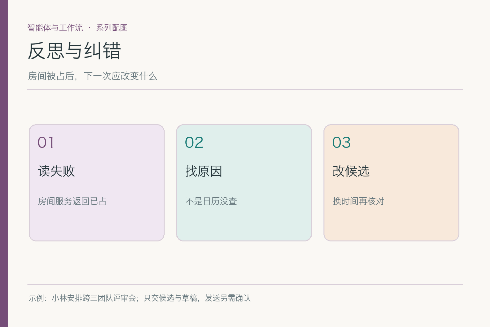
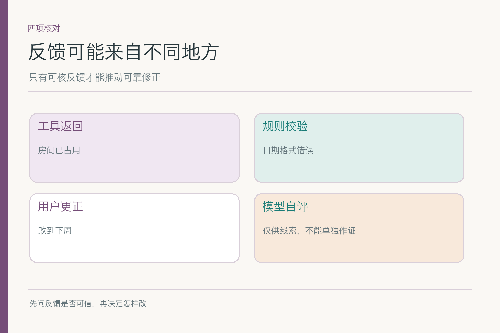
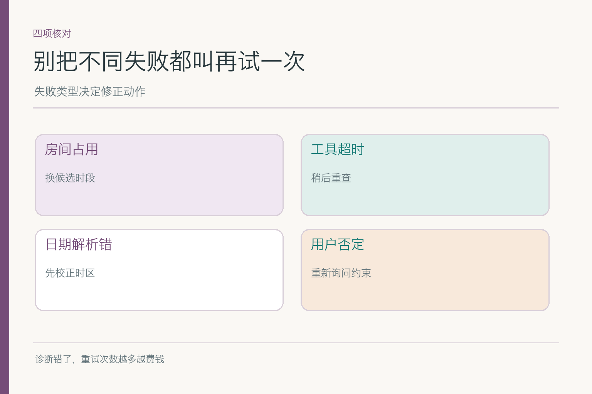
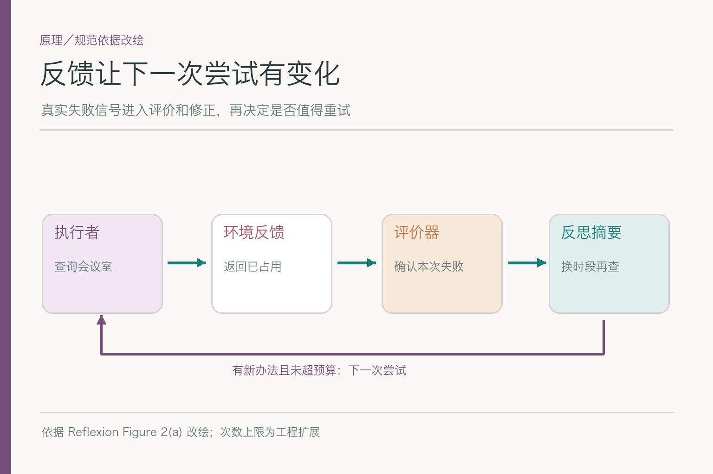
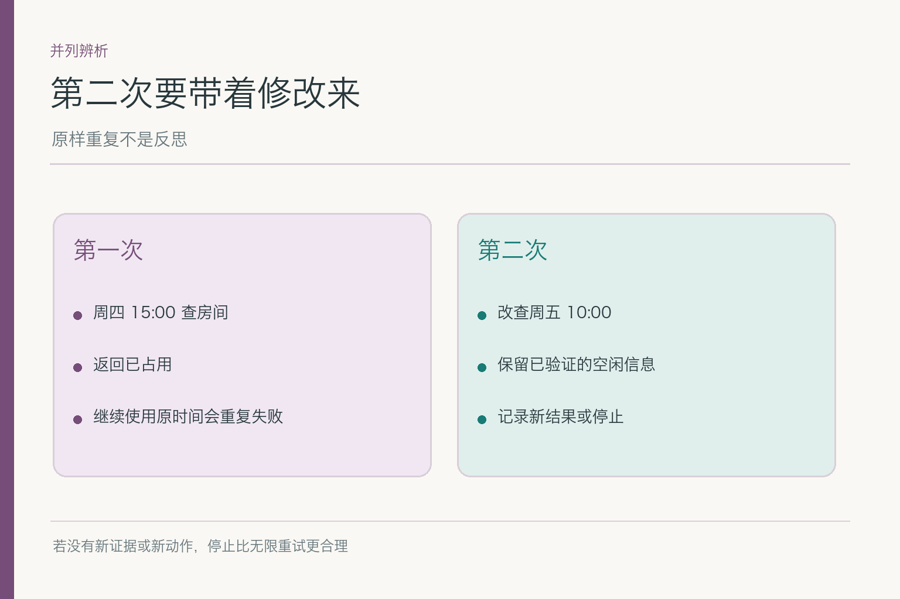
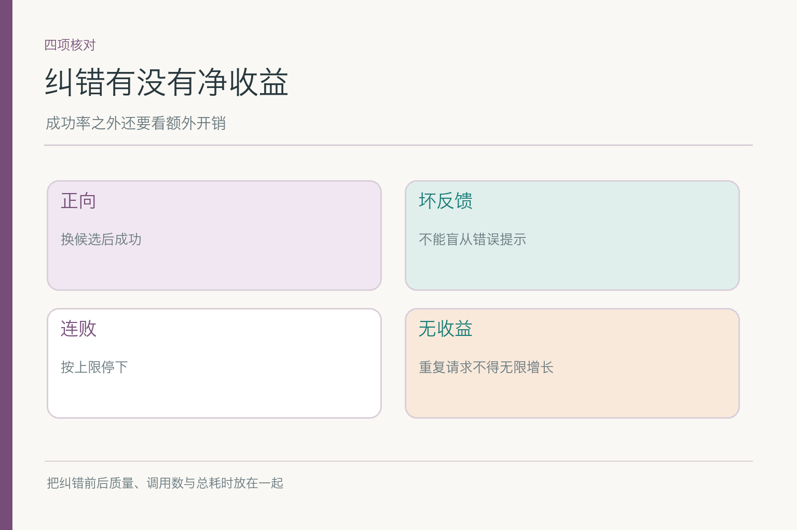

# 面试题：反思怎样带来有用的第二次尝试

共用案例：小林要安排下周三团队评审会，先拿候选时间和邀请草稿，不发送。周四 15:00 人员都空闲，房间 A 返回已占；周五 10:00 有房间，但运营未确认。助手第一次把周四 A 当作可用而失败。它现在该做什么，取决于失败来源、仍有效的证据和重试成本。

题目要追踪第二次尝试到底改变了什么：换证据、换候选还是修参数，并用新结果判断改动是否有效。只写“重新思考”不算修正。

## 问题 1：什么信号足以触发反思？

### 原理

反思需要有反馈：工具返回、规则校验、用户纠正或受控评价。房间服务明确返回 `occupied`，已足以否定“周四 A 可用”。模型自己说“我似乎做得不错”并不是同等强度的反馈，也不能覆盖工具事实。

### 答题点

1. 区分明确占用、超时、参数错误和用户更正；
2. 记录反馈来源、事件 ID、时间与影响的具体前提；
3. 真实外部结果优先于无依据自评；
4. 无新信号时避免无限自我复读。

如果房间服务只是超时，不能立刻得出“房间已占”；如果小林改成下周三，这是新约束，不只是上一轮答案的一条评分。反思起点是反馈的含义，不是文本里出现“失败”两个字。

### 记忆点

> 先问反馈从哪来、否定了什么。

### 常见追问

“模型自评完全没用吗？”可作发现格式、措辞问题的辅助线索，关键事实与动作仍需外部核对。

### 失分点

让模型自己夸自己，再据此判断任务已完成。

## 问题 2：怎样给第一次失败做正确归因？

### 原理

同样没有拿到房间，原因可能是已占、服务超时、时区错或人数参数缺失。原因不同，修正不同。若把所有失败都归咎于“计划不够周全”，系统会反复换时段，掩盖一个可修的参数错误。

### 答题点

1. 看实际请求参数与工具返回，而非只读最终文字；
2. 明确失败类型：业务冲突、技术故障、输入缺口；
3. 找到仍有效的证据，例如三团队周四空闲；
4. 只修受影响的前提，不无故重做全部日历。

周四 A 被占后，适当方向是查 B 房间或换时间；若查询实际发到了 UTC 15:00，先修时区再判断 A 是否真的被占。能说出“这个反馈否定了哪一个字段”，比笼统说“我们进行反思”更有说服力。

### 记忆点

> 定位坏的是房、时间、参数，还是服务。

### 常见追问

“只有一句模糊工具错误消息怎么办？”保留未知，补查状态或让工具接口返回可分类错误，不要擅自推断。

### 失分点

任何错误都用同一句“请模型重新思考”。

## 问题 3：Reflexion 里的反思产物是什么？

### 原理

Reflexion 的架构将执行轨迹交给评价器，再把反馈转换成语言形式的教训，用来影响下一次尝试。它与重新训练模型权重不同，也不保证评价器一定正确。会议案例里，一条有用的反思摘要要指出失败原因和下一动作。

*依据 [Reflexion](https://arxiv.org/abs/2303.11366) Figure 2(a) 改绘；会议室返回和次数上限是应用条件。*

### 答题点

1. 提取失败事实：A 房间周四已占；
2. 保留未被否定的三组空闲证据；
3. 写出可执行修正：同段查 B 房间；
4. 若无合适房间，转周五并标运营未确认。

一句“以后要更认真”没有可执行内容。可审阅的反思条目应包含失败事件、仍成立的前提、改变的参数和下一次的成功判据。面试回答可以直接给出这四项，不必复述论文全文。

### 记忆点

> 教训能改变下一步，才叫有用。

### 常见追问

“Reflexion 一定要长期记忆吗？”论文机制使用经验记忆；产品里是否跨任务保留取决于时效、权限与治理，会议室占用不宜永久记住。

### 失分点

把 Reflexion 说成“让模型再问自己一遍”。

## 问题 4：怎样证明第二次尝试不是原样重来？

### 原理

比较前后请求、条件与目标。明确占用时再查同一房间同一时段没有信息增益；超时时有限重试同参数可能合理；日期解析错时需先修参数。重试是否有价值，与反馈类型有关。

### 答题点

1. 记录第一次的时段、房间、返回与失败原因；
2. 第二次指出变化字段，例如房间 A 改 B；
3. 预测新尝试能解决哪一项缺口；
4. 若完全无变化且没有服务恢复证据，选择停下。

周五房间空着但运营未知时，继续查同一房间也没意义；应把下一次尝试交给获准日历查询或人确认。这说明“修正”有时是换问题，不一定是把原工具再调用一次。

### 记忆点

> 重试前，说得出哪里变了。

### 常见追问

“接口超时后可以立刻重发预订请求吗？”写操作可能已成功但回包丢失，先查状态并用幂等标识，不能盲目再预订。

### 失分点

把重试次数增加当成纠错能力提升。

## 问题 5：没有可靠外部反馈时还能反思吗？

### 原理

模型自评可能帮助发现明显格式问题，但无法凭空确认运营空闲或会议室状态。若反馈缺失，下一步应获得可核证据、标未知或问人，而不是自我评价几轮后宣布周五可行。

### 答题点

1. 区分可以自检的格式与必须外部验证的事实；
2. 评价器输出要有判据和来源，不只给“不错”；
3. 无可靠反馈时暂停确定结论；
4. 对不确定原因保留多种可能，不凭语言流畅度选一个。

若房间服务失败且没有备用渠道，系统可给“人员空闲但场地待核”的候选。它没完成全部安排，却没有因此编一个房间。这种诚实的部分交付，优于三轮“反思”后生成一句更坚定的错误。

### 记忆点

> 没证据，反思不能把未知磨成已知。

### 常见追问

“能让另一个模型当裁判吗？”可检查一致性或格式，但对实时房间事实仍需工具或有权限的人。

### 失分点

多个模型彼此附和，就当有了客观反馈。

## 问题 6：反思的重试上限与停止条件怎么定？

### 原理

反馈驱动的尝试有收益递减。明确占用不对同一参数重试；超时可有限次数；缺运营确认则等待人。停止规则应结合失败类型、成本、延迟和外部动作风险，而不是笼统设“永远反思三次”。

### 答题点

1. 为不同错误设不同的再试条件；
2. 记录累计次数和耗时，无进展就停止；
3. 高风险写动作先查是否已完成，避免重复副作用；
4. 到限交出现有证据与待确认项。

若查遍两间可用会议室都被占，再追加十次不同措辞的查询，通常不会增加可行方案。此时把周四人员可行、房间缺失以及周五运营待确认交给小林，比继续耗费预算更贴近用户目标。

### 记忆点

> 有新信息再试，没进展就交棒。

### 常见追问

“反思越多效果越好吗？”不。应看纠错收益减去额外时延、成本与新错误。

### 失分点

只给轮数上限，不说每类反馈何时值得再试。

## 问题 7：一次失败经验该不该长期保存？

### 原理

“周四 A 房间已占”是时效很短的任务事实；“明确占用不做同参数无意义重试”更像可复用的程序规则。把前者写进长期用户画像会污染未来任务。反思产物的保存范围由用途、时效和来源决定，不因名字叫“经验”就永久保留。

### 答题点

1. 当前任务内保存失败事件与修正，用于本轮继续；
2. 可复用操作规则通过评测后沉淀到受控流程；
3. 一次工具返回不自动升级为用户偏好；
4. 日志记录必要字段并脱敏，按治理策略过期。

### 记忆点

> 经验留得住机制，留不住过期房间。

### 常见追问

“论文不是强调 memory 吗？”说明研究设置与产品数据治理不同；可以用任务记忆或受控经验库，不等于保存所有原始轨迹。

### 失分点

把每次反思全文写进长期画像，既过期又难删。

## 问题 8：如何量化反思的净收益？

### 原理

不能只看修正后最终成功多少，还要看额外模型调用、工具请求、耗时与副作用。对同一组故障样本比较启用与不启用反思的轨迹，并按错误类型分开统计，才能知道哪类反馈值得处理。

### 答题点

1. 房间占用后换候选能否提高可行率；
2. 超时后是否有限重试而非无限循环；
3. 错误评价器是否诱导错误结论；
4. 对无收益尝试是否及时停止。

报告修正成功率、平均新增调用、额外时延、重复请求率和错误动作率。若简单会议也被强制反思两轮，质量不变却明显变慢，这种“更深思熟虑”对用户没有价值。若反思减少了错误完成声明，就应保留它在相关场景的使用。

比较时要确保两组拿到**同一份初始证据**。如果启用反思的一组恰好查到了新的房间，而对照组没有查房间，就不能把全部提升都归给反思。可以固定第一次失败轨迹，再比较是否识别“房间 A 已占”、是否选择有意义的新动作、是否真的得到新反馈。这样才能评价纠错步骤本身。

除了成功率，还应标记“错误修正”。例如评价器误称周四已可用，助手据此推翻房间服务的占用结果，这会让反思比不反思更坏。又如服务只是超时，助手却把它解释为已占，放弃了本来可重试的候选。把反馈真实性、归因正确率和下一步动作分开，才能找到反思失效的具体位置。

停止条件也应有测试样本：同一权限错误连续出现两次，系统应停下说明无权访问；更换房间后得到明确可用证据，就不必为了“多反思一次”继续调用；达到预算仍无完整候选，则交付缺口而非编一个确定时段。面试里能把**何时不再反思**说清，往往比会描述成功重试更重要。

### 记忆点

> 看修正后的结果，也看为它多付了什么。

### 常见追问

“最终答对但评价器说错，算成功吗？”最终结果对，但机制仍有风险；记录评价误差，避免换样本后放大。

### 失分点

只展示一条成功纠错示范，不给失败样本和分母。

## 参考资料

- [Reflexion: Language Agents with Verbal Reinforcement Learning](https://arxiv.org/abs/2303.11366)
- [Anthropic: Building effective agents](https://www.anthropic.com/engineering/building-effective-agents)

想看本文在 AI Agent 中的位置，可点击下方 [阅读原文](https://github.com/Jennifer123www/ai-agent-knowledge-map)，从“智能体与工作流”继续阅读。
