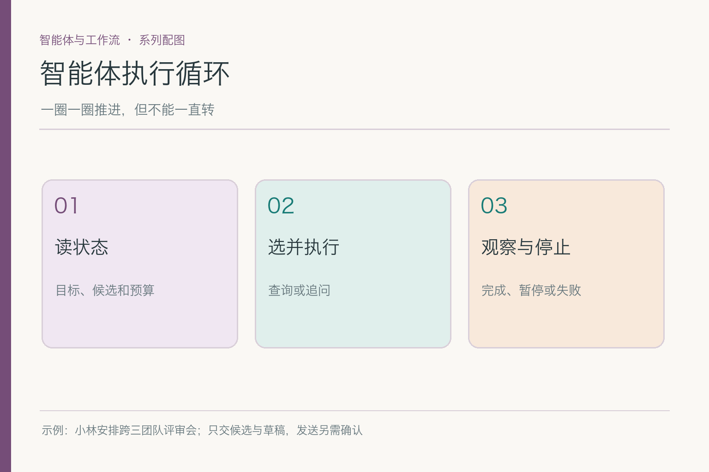
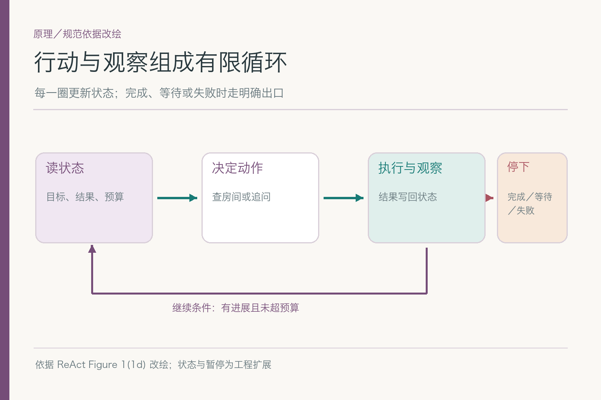
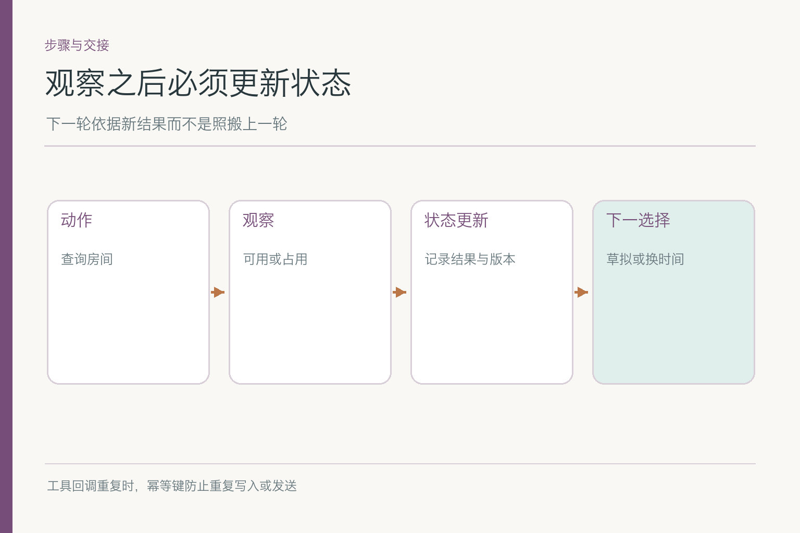

# 面试题：智能体循环怎样安全结束

共用案例：小林要跨三团队评审会的候选与邀请草稿，不批准直接发送。周四三组空闲但房间被占；周五房间可用而运营未确认。后台可能收到迟到的房间结果、重复工具回调，或小林在等待时改期。这些变化决定循环是不是受控。

## 问题 1：Agent Loop 一圈的最小结构是什么？

### 原理

一圈要读取当前状态，选择下一动作，执行获准动作，取得观察，写回状态，再判断继续或退出。ReAct 展示行动与观察交替的研究结构；工程里还需权限、预算、状态版本和明确终态，不是只在流程图上画个回环箭头。

*依据 [ReAct](https://arxiv.org/abs/2210.03629) Figure 1(1d) 改绘；持久化状态和暂停出口是应用扩展。*

### 答题点

1. 周四候选进入状态，标房间尚未核；
2. 选择查房间并过权限与参数校验；
3. 返回已占后写回冲突，不沿用旧可行结论；
4. 决定换候选、追问或停止，并记录原因。

回答别把“思考”当成可直接改变外部世界的动作。模型可以提出查 B 房间，应用负责调工具；工具返回“已占”是真实观察，下一圈必须看见它。若旧状态不更新，Agent 只是同一圈的复读机。

### 记忆点

> 读、选、做、看、记、停，缺一环就失控。

### 常见追问

“一定要每步调用模型吗？”不一定。规则能决定的转移由程序处理，模型用于模糊选择与文字生成。

### 失分点

只讲“模型会不断自主思考”，不说观察如何进入状态。

## 问题 2：任务状态至少应存哪些字段？

### 原理

状态是应用可核的数据，不等于聊天全文。要让循环恢复，至少保留目标约束、候选与来源、各项工具观察、当前等待对象、预算、已执行动作 ID 和版本。若只存一段摘要，旧建议可能与已核事实混淆。

### 答题点

1. 目标：三团队、下周、先给草稿不发送；
2. 候选：周四人员可行但房间冲突、周五运营未知；
3. 进度：当前步骤、等待谁、重试次数与截止时间；
4. 追踪：工具请求 ID、来源时间、状态版本和动作结果。

长日历正文可留在受控存储，状态里放引用；下一轮模型上下文只选需要的字段。要特别区分“建议发邀请”和“邀请已发”，否则用户会被系统自己的文字误导。

### 记忆点

> 存进度与证据，不存一锅对话粥。

### 常见追问

“状态要放进提示词吗？”按本轮需要选择相关字段；持久化状态不必原封不动塞进模型窗口。

### 失分点

认为聊天记录足以代替结构化运行状态。

## 问题 3：工具回包到达后怎样保证写对状态？

### 原理

观察必须关联发出的请求和当时任务版本。周四 A 房间的返回不能写到周五 B 房间；小林改期后迟到的旧查询不能把新任务拉回周四。事件驱动更新可用请求 ID、版本和明确转移规则降低串写。

### 答题点

1. 查询发出时记录目标时段、房间与任务版本；
2. 回包先匹配请求 ID 和目标对象；
3. 对可用、占用、超时、拒绝走不同转移；
4. 旧版本或重复回包不覆盖当前状态。

一个常见错法是服务先返回周四占用，后返回上一轮缓存的“可用”，系统按到达顺序取最后一条。正确做法要按请求版本与数据有效性判断，不让网络慢快替业务事实排序。

### 记忆点

> 回包认得请求，状态认得版本。

### 常见追问

“工具返回 200 就可以当成功吗？”还要看业务状态字段，200 可能只是请求成功受理，并非房间可用或已预订。

### 失分点

任何回包都直接覆盖当前候选。

## 问题 4：重试与幂等怎样区分读操作和写操作？

### 原理

只读查询超时可有限重试；发送邀请或预订房间会改变外部世界，超时不代表动作没发生。必须用动作 ID、幂等键或查询最终状态，避免网络重传造成重复发送、重复预订。

### 答题点

1. 区分明确占用、技术超时与权限拒绝；
2. 读操作按错误类型与预算有限重试；
3. 写操作先核先前是否成功，再按同一幂等标识重试；
4. 重复回调不重复扣费、写状态或触发下游动作。

小林本轮尚未批准发送，所以重试发送根本不该进入候选。若下一轮他真的批准，发送工具超时也不能立刻再发一封；先查该动作 ID 是否已产生邀请。**先辨别外部副作用，再决定能否重放。**

### 记忆点

> 查可以有限再问，发之前先查有没有发过。

### 常见追问

“全靠模型记住不要重复行吗？”不行。幂等和重复事件去重是运行时职责。

### 失分点

把所有工具失败都设为自动重试三次。

## 问题 5：预算与无进展检测怎样防止死循环？

### 原理

只有最大轮数还不够。系统可能十轮都查同一间已占房间；也可能两轮已经取得可用候选，却因为“还没找到最佳”继续搜索。预算应覆盖轮数、工具调用、时间和费用，并检测状态有没有实质变化。

### 答题点

1. 每轮写入已尝试动作与结果，防同参数无意义重复；
2. 设全任务预算和每类工具的局部预算；
3. 连续无新证据、无新候选时暂停；
4. 找到符合交付要求的草稿就结束，不追求不存在的绝对最优。

周五运营未知时，再查十间房间不能补人员证据。无进展检测若只看“每轮有新的工具调用”，会把忙碌误认为有效推进；要看未解决条件是否减少、候选是否更可行。

### 记忆点

> 圈数有限，进展更要能看见。

### 常见追问

“统一设最多五轮可行吗？”可作兜底，但应按任务类型与服务延迟设置，不能代替无进展判断。

### 失分点

只限制 token，不限制工具、时长和无效重复。

## 问题 6：人工确认如何暂停，再从正确位置恢复？

### 原理

小林要求先看候选与草稿，系统在交付后进入“等待批准”，而非后台继续发送。状态需记录等待对象、被批准的具体候选与版本、过期条件。收到用户事件后先核是否仍是同一版，再复核会变化的房间与人员事实。

### 答题点

1. 暂停时持久化候选、草稿、来源与未发送状态；
2. 批准事件绑定小林身份与草稿版本；
3. 版本变化或“可以”所指不明时重新确认；
4. 恢复后先核关键事实，不能拿两天前的房间结果直接发。

等待不需要一个模型进程一直在线。任务可安静地保存在状态库，由小林回复或到期事件唤醒；这能避免为“等人回消息”持续消耗模型费用。若小林拒绝，进入关闭或重新草拟，不偷换成批准。

### 记忆点

> 暂停存住版本，恢复先核前提。

### 常见追问

“用户批准时间但没批准邀请正文怎么办？”按具体批准范围处理，必要时分开确认；不能把一项同意扩成所有动作。

### 失分点

看到一句“可以”，就发送最新系统猜测的任何候选。

## 问题 7：完成、等待、到限与失败为何不能用一个状态？

### 原理

本轮成功是有依据的候选与草稿交付，未发送；等待可能是缺小林批准；到限表示预算耗尽但仍有部分结果；失败可能是关键服务不可用。混成“结束”，用户与下一次唤醒都不知道该做什么。

### 答题点

1. 完成：草稿和候选符合本轮要求；
2. 等待：记录具体待确认人、对象和期限；
3. 到限：交出可信部分与缺口，防后台无限尝试；
4. 失败：说明技术原因与安全退路，不虚构完成。

模型说“会议已经安排好”不能设置完成态。程序还要检查是否真有证据、草稿是否存在、发送动作是否符合小林要求。对这场会，**未发送**本身就是正确完成状态的一部分。

### 记忆点

> 停下有四种原因，用户应知道是哪一种。

### 常见追问

“等待批准也是成功吗？”本轮草稿交付可以完成；后续发送子任务另处于等待。定义要与产品交付边界一致。

### 失分点

把所有停止都显示成“任务已完成”。

## 问题 8：如何用运行轨迹而非末句验收循环？

### 原理

最终邀请草稿可能碰巧正确，但中间反复查同一房间、读取越权资料或尝试发送。需要查看每轮状态、选择、权限、工具观察和终止原因。轨迹才能揭示重复回调、旧结果覆盖与无进展循环。

### 答题点

1. 正常：有限步交候选与草稿，不发送；
2. 超时：受控重试或安全退出，状态不误报可用；
3. 重复回调：只处理一次，不重复触发下游；
4. 用户改期：旧周四回包不能覆盖新的周三目标。

分开统计平均轮数、无进展重复、错误状态转移、重复副作用和错误终止。若最终文字说“未发送”，但轨迹有一次发送工具调用，不能算成功；若状态说“等待运营”，后台却每分钟无限查询房间，同样不是受控循环。

验收样本里应包含**迟到回包**：小林把会议改到下周三后，先前周四房间的查询才返回“空闲”。如果系统把这个结果写进当前版本，再生成下周三的邀请，表面上每个字段都有值，实际上时段对不上。轨迹需要保留请求发出时的状态版本和候选 ID；不匹配的新回包只能归档或触发重新核查。

另一组样本模拟恢复：助手已经给小林发出确认请求，进程随后重启。恢复后应从“等待小林”继续，而不是再查一遍房间后自动发送。若批准针对旧候选，期间房间状态已过期，还要重新核实或要求重新确认。暂停与恢复不是把循环挂起再开机这么简单，确认对象和事实版本都必须对应。

最后用同一套轨迹区分四个终态。`completed` 表示已交付被要求的候选与草稿；`waiting` 表示缺运营确认或等小林回复；`budget_exhausted` 表示资源到限并附剩余缺口；`failed` 表示无法继续的错误。把四种情况都塞进“任务结束”，前端和后续任务就不知道该展示结果、提醒用户还是安排重试。

### 记忆点

> 看每一圈做了什么，再看最后一句说了什么。

### 常见追问

“日志是不是越全越好？”保留必要动作、状态和来源，个人日历内容按权限脱敏，不为评测复制全部隐私。

### 失分点

只看答案文字，不看真实工具轨迹。

## 参考资料

- [ReAct: Synergizing Reasoning and Acting in Language Models](https://arxiv.org/abs/2210.03629)
- [Anthropic: Building effective agents](https://www.anthropic.com/engineering/building-effective-agents)

想看本文在 AI Agent 中的位置，可点击下方 [阅读原文](https://github.com/Jennifer123www/ai-agent-knowledge-map)，从“智能体与工作流”继续阅读。
