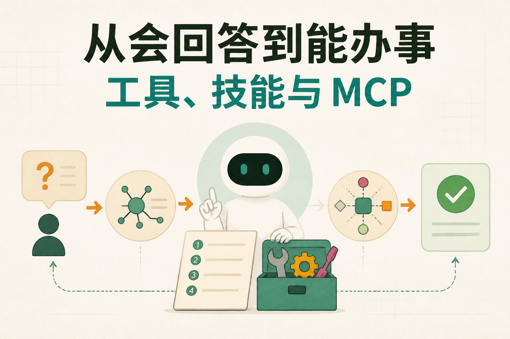
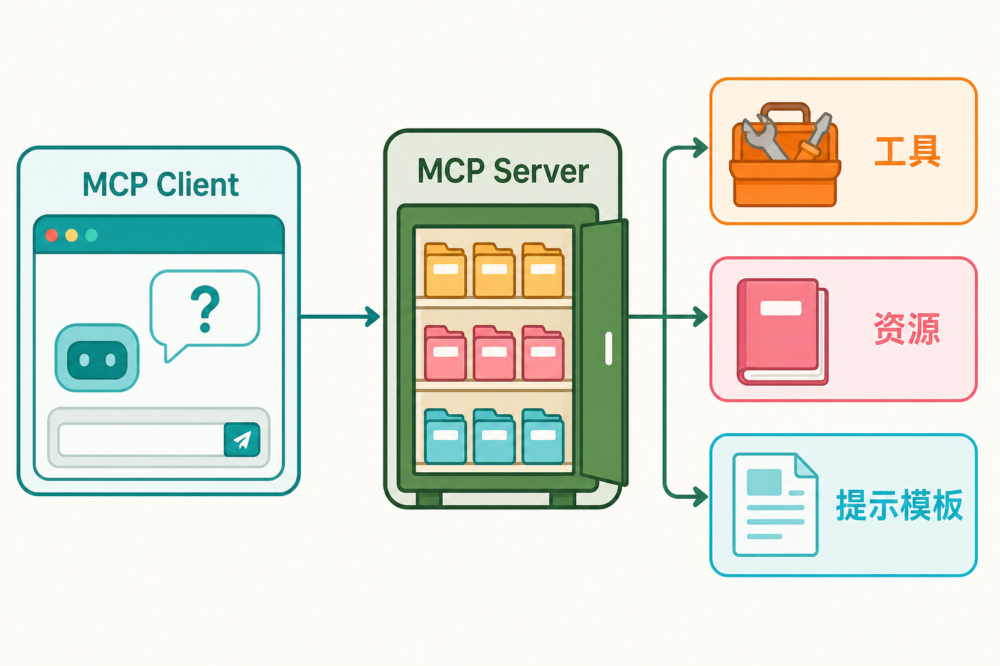

# 从会回答到能办事：工具、技能与 MCP

大语言模型擅长理解和表达。用户说“帮我处理退款”，模型可以判断大意，也能列出步骤。真正把退款办成，还要读取订单、核对规则、确认金额、获得授权、提交动作，再查询最终状态。

这中间不是多接一个 API 就结束了。Agent 需要一整层能力扩展：Skill 组织做事方法，Tool 定义具体动作，执行通道把动作落到 API、代码或浏览器，MCP 提供共同连接规则，Client/Server 与三类对象把能力说清楚，连接器负责适配具体系统。

这篇只画全景，不展开每个零件的内部结构。后续六组子模块文章会分别下钻。

## 六个子模块分别站在哪里

**技能（Skill）**回答“这类事情通常怎样做完”。它把适用条件、步骤、资料、工具和验收标准组织成可复用方法。

**工具调用（Tool Calling）**回答“模型怎样把一个明确动作交给程序”。模型给出工具与参数，执行器检查后真正运行，再把结果送回任务。

**API、代码与浏览器执行**回答“动作最终走哪条路”。稳定业务接口优先 API，开放计算进入沙箱，没有接口或必须依赖页面时才使用浏览器。

**模型上下文协议（MCP）**回答“不同 AI 应用和能力提供方怎样用共同语言连接”。它统一连接和发现方式，不替业务系统发权限。

**MCP Host、Client、Server 与三类能力**回答“连接中的角色和对象是什么”。Tool 做事，Resource 给资料，Prompt 给模板；Host 管理任务和策略，Client 维护连接，Server 提供能力。

**连接器与插件**回答“怎样把某个具体产品翻译成稳定能力”。连接器处理认证、字段、分页、错误和版本变化，插件则可能把连接器、技能和界面一起打包。

六者不是同义词，也不是六个可以随意替换的框架名。它们分处方法、契约、执行、协议、对象和系统适配几个层次。

## 一次退款怎样穿过这六层

用户说：“订单已经退货，帮我申请退款。”

系统先选择“售后退款”Skill。技能规定先查订单与退货状态，再核对政策和金额，展示给用户确认，最后提交退款。它负责方法，不直接握着生产密钥。

*依据 Yao 等人的 ReAct 论文第 3 节改绘，并补入受控工具执行层。*

读取订单和创建退款分别是 Tool。模型按工具契约提出订单号、原因和金额。执行器检查参数、身份、订单归属和额度，创建退款前还要确认用户的真实意图。

动作优先调用退款 API。若旧系统没有接口，可能暂时通过受控浏览器提交；若需要计算多笔退款和汇率，可以在隔离代码环境处理。每条执行通道有不同风险，却都要留下任务 ID 和证据。

如果多个 Agent 应用都要接入订单系统，可以通过 MCP Server 提供能力。Host 为 Server 建立 Client 连接，读取 Resource 获取退款政策，通过 Tool 查询与提交，必要时用 Prompt 组织审查模板。

真正对接订单供应商的是连接器。它保存短期凭据，把内部“订单号、退款状态”映射到供应商字段，处理分页、限流和错误，再向上层返回稳定结果。

最后，系统拿退款任务 ID 查询权威状态。已提交不等于已退款，页面提示也不等于资金到账。只有业务系统返回完成，Agent 才能向用户报告成功。

## 三条贯穿所有子模块的边界

### 模型和执行要分开

模型适合理解目标、选择候选能力、生成参数和解释结果。身份校验、金额上限、凭据注入、真实执行和状态确认应留在确定性系统中。模型可以建议“创建退款”，不能自己同时批准、执行和审计。

### 发现能力和获得权限要分开

Agent 能看见某项 Skill、Tool 或 MCP 对象，不代表当前用户有权使用。目录负责发现，身份与策略负责授权，后端系统负责最终校验。只隐藏按钮不够，服务端必须拒绝越权请求。

### 请求返回和业务完成要分开

接口受理、代码退出、浏览器出现提示，都只是过程信号。写操作还要查询权威状态，超时先查再重试，部分成功逐项处理。任何一层都不能把未知状态美化成成功。

## 哪些内容应该标准化，哪些不能

工具名称、参数、错误分类、追踪 ID、能力目录和协议消息适合标准化。标准化让多个应用和团队减少重复接线，也让评测和审计有统一入口。

业务授权、审批规则、金额阈值、完成条件和数据口径不能交给协议自动决定。它们属于组织和具体系统。MCP 可以统一“怎么调用”，连接器可以统一“怎么翻译”，Skill 可以沉淀“怎么做”，但谁能退款、退款多少，仍要按业务规则判断。

标准化也不等于把所有能力塞进同一个万能工具或万能 Server。风险、团队和生命周期不同的能力需要分开，当前任务只加载少量候选。共同语言的目的，是减少无意义差异，不是抹平所有边界。

## 从原型到生产，复杂度应逐步增加

刚开始验证一个 Agent，可以先做少量清楚的 Tool，直接连接稳定 API。任务重复后，把方法沉淀成 Skill；接入系统增多后，用连接器隔离供应商差异；多个应用需要复用能力时，再引入 MCP 和对象目录。

没有必要第一天就搭齐全部层次。一个应用调用两个内部函数，直接工具接口可能够用；一旦出现重复流程、多个客户端、第三方系统、权限分层和长任务，缺失的层次会逐渐暴露。

判断是否需要增加一层，可以看四件事：是否重复实现，是否难以授权，是否难以恢复，是否难以解释。新增抽象必须降低长期复杂度，不能只增加新名词。

## 六层由谁维护

能力扩展层一旦进入生产，就不再只是 Agent 团队自己的代码。业务专家维护 Skill 中的方法和验收口径；平台团队维护 Tool 契约、执行策略和通用运行环境；基础设施团队维护协议接入、身份和观测；业务系统团队维护连接器和后端授权。

责任分开，不代表各写各的。一次 Skill 更新可能依赖新的 Tool 字段，Tool 又依赖连接器升级。发布清单要把这些版本关联起来，至少知道当前任务使用了哪个 Skill、哪个 Tool Schema、哪个 Server 和哪个连接器版本。

出现事故时，责任层也要清楚。Skill 漏了一步，由流程负责人修；模型选错工具，要检查候选目录和描述；连接失败看 MCP Client/Server；字段映射错误找连接器；后端拒绝则回到业务授权。所有问题都扔给“模型不稳定”，只会让同类事故重复发生。

跨团队接口最好有稳定的所有者和变更通知。工具参数、对象语义、连接器权限和完成条件发生变化时，要知道哪些技能和评测受影响。没有所有者的能力，往往也是最难停用、最难回滚的一类能力。

## 常见的四种架构反模式

第一种是“万能工具”。模型传一段自由文本，工具自己决定查库、写数据还是发消息。开发初期很省事，后来无法做细粒度权限、参数校验和副作用审计。

第二种是“协议包办一切”。团队接入 MCP 后，以为权限、业务流程和数据质量自动解决。结果能力目录很漂亮，真正调用时仍然字段不兼容、账号越权、状态无法确认。

第三种是“浏览器走天下”。原型阶段所有系统都靠页面点击，业务一扩展，页面改版、登录过期和弹窗让维护成本迅速上升。稳定动作应逐步迁到 API，浏览器只保留页面特有部分。

第四种是“层层转发不留证据”。模型调 Tool，Tool 过 MCP，Server 过连接器，连接器调 API，每层都只返回一句成功。最终出错时没人知道哪一步发生了什么。统一追踪 ID、版本和业务对象 ID，是分层架构能工作的前提。

## 一次跨层发布怎样进行

假设退款流程新增“高金额二次审批”。先更新 Skill，明确何时进入审批；再更新 Tool 契约，增加审批令牌或状态；执行层拒绝缺少批准的高金额请求；连接器把批准信息映射到订单系统；相关 Server 更新能力说明。

发布前用固定任务集验证普通退款、高金额退款、权限不足、重复提交和外部超时。先让少量低风险流量使用新版本，比较任务成功、人工接管和错误；出现问题时，暂停高风险 Tool，回到上一组兼容版本。

不能只回滚最外层提示词。如果 Skill 已经要求新参数，而连接器回到了旧版本，系统仍然会失败。跨层版本要么向后兼容，要么作为一个经过验证的发布组合管理。

## 这一层怎样进入日常运营

能力目录需要定期清理。长期无人使用、没有所有者、权限过宽或依赖已经下线的 Skill、Tool、Server 和插件，应标记弃用并迁移依赖。目录越大并不代表能力越强，也可能只是技术债越多。

真实失败轨迹要回到对应层的评测集。工具选错加入 Tool 选择样本，连接器未知枚举加入映射测试，权限误放加入安全回归，业务完成误判加入状态验证用例。每次事故至少留下一个以后能自动重现的测试。

成本也要按链路看。一次任务用了几轮模型、几个工具、多少 API 请求、多少沙箱时间和多少人工分钟，都应关联最终结果。减少一次调用却增加大量返工，不是优化。

## 总体评测要看整条链

能力扩展层不能只看“工具有没有返回 200”。要分别看 Skill 是否选对和完成，Tool 参数是否正确，执行通道是否稳定，MCP 连接和对象是否兼容，连接器是否正确处理供应商差异，最终任务是否完成。

还要看安全和运营指标：越权拒绝、人工确认、重复副作用、超时恢复、版本回滚、成本和时延。一个接口成功率很高但用户频繁返工的系统，不能算可靠。

轨迹应能回答：用户提出了什么，系统选了哪个 Skill，模型看到了哪些 Tool，执行走了哪条通道，连接到哪个 Server，连接器用了哪个版本，外部系统最后是什么状态。能回答这些问题，系统才有改进基础。

## 六组下钻内容怎样阅读

想先建立方法论，从“技能”开始；想理解模型与程序的交界，看“工具调用”；准备做真实执行环境，看“API、代码与浏览器执行”；多个应用需要共享接入时，再看“MCP 协议”；要设计 Server 目录和对象，继续看“MCP Client、Server 与三类能力”；最后用“连接器与插件”解决具体供应商差异。

这一层的核心并不神秘：**方法可复用，动作有契约，执行受控制，连接有标准，系统差异有人翻译，结果能验证。**做到这些，Agent 才不只是会说，而是能在边界内把事情办完。

## 参考资料

- [ReAct：Synergizing Reasoning and Acting in Language Models](https://arxiv.org/abs/2210.03629)
- [OpenAI 官方文档：Tools](https://developers.openai.com/api/docs/guides/tools)
- [Model Context Protocol 官方文档：Architecture overview](https://modelcontextprotocol.io/docs/learn/architecture)
- [Anthropic：Building Effective AI Agents](https://www.anthropic.com/engineering/building-effective-agents)

想看本文在 AI Agent 中的位置，可点击下方 [阅读原文](https://github.com/Jennifer123www/ai-agent-knowledge-map)，从“工具、技能与协议”继续阅读。
