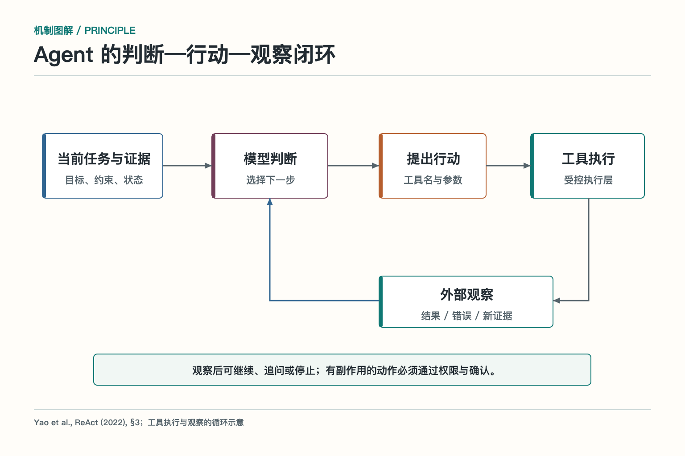
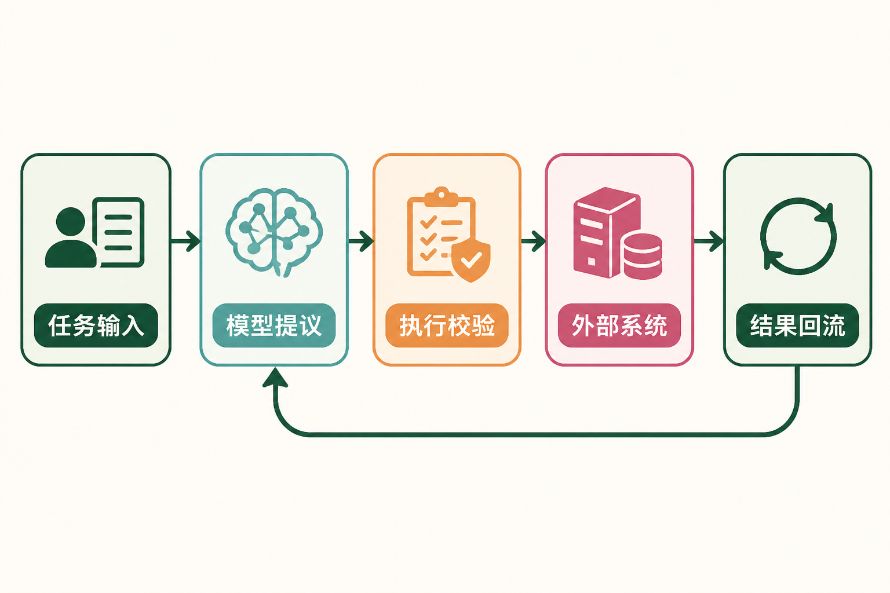
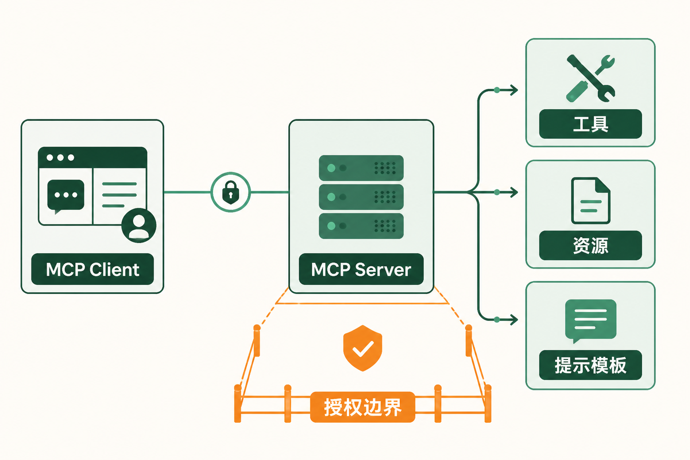
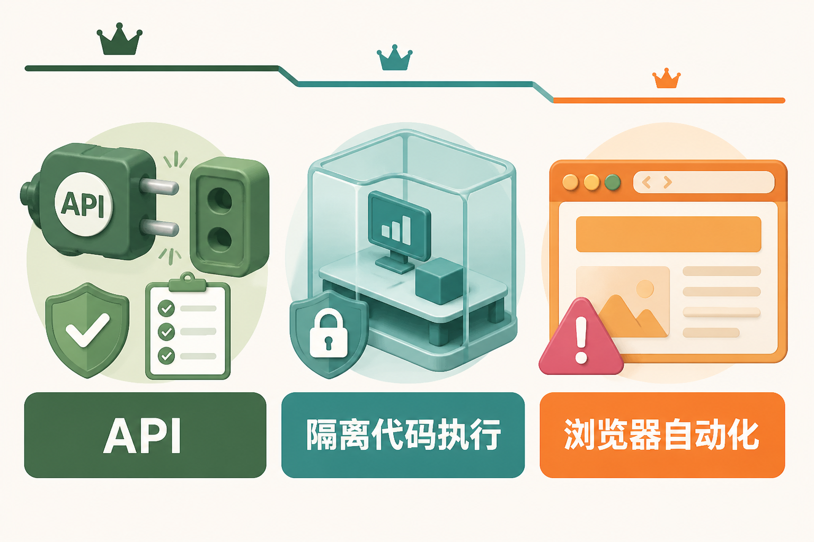
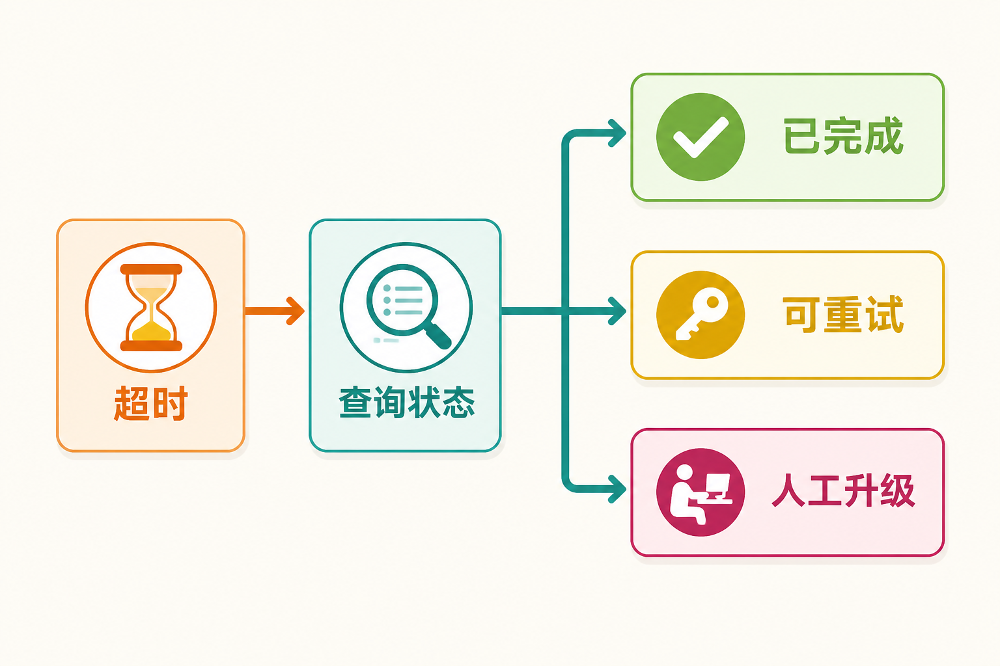

# 面试题：怎样设计完整的 Agent 能力扩展层

这篇只考跨模块架构，不再重复子模块里的 Schema、沙箱参数、MCP 对象方法、限流或连接器字段题。面试时要证明自己能把 Skill、Tool、执行通道、MCP 和连接器放进一条完整链路，并说明它们为什么需要分层。

## 问题 1：怎样划分 Agent 能力扩展层的职责？

### 原理

能力扩展层把模型意图转成真实动作。合理分层应把任务方法、动作契约、执行环境、连接协议、能力对象和具体系统适配分开，让每层有独立责任和演进边界。

### 答题点

1. Skill 组织任务方法和验收，Tool 描述具体动作；
2. API、代码、浏览器承担真实执行，执行层负责权限和结果；
3. MCP 统一跨应用连接与能力发现，对象模型区分动作、资料和模板；
4. 连接器适配供应商认证、字段和错误，不替上层决定业务流程。

### 记忆点

> 方法、动作、执行、连接、对象、适配，六层各有责任。

### 追问

为什么不做一个万能 Tool？万能 Tool 会混合权限、副作用和错误语义，难以评测与审计；外部系统变化也会直接影响所有流程。

### 失分点

只列出名词，没有说明输入输出、责任边界和变化由哪一层吸收。

## 问题 2：请设计一条从用户意图到真实结果的端到端链路。

### 原理

端到端链路要覆盖理解、能力选择、参数准备、授权、执行、状态确认和结果解释。任何中间返回都不能直接冒充业务完成。

### 答题点

1. 从用户目标和约束匹配 Skill，补齐缺失输入；
2. Skill 选择少量 Tool，模型生成结构化调用建议；
3. 执行层检查身份、参数、风险和审批，经连接器访问外部系统；
4. 用业务任务 ID 回读权威状态，记录证据后再向用户报告。

### 记忆点

> 先选方法，再定动作；先校验，再执行；先确认状态，再报告。

### 追问

链路中哪一步最适合人工确认？动作已经明确、参数和权限校验完成、但副作用尚未发生时。确认内容要展示对象、金额、接收方和影响。

### 失分点

从模型直接跳到外部 API，没有 Skill、执行策略、连接器和结果回读。

## 问题 3：哪些部分应该标准化，哪些必须保留业务差异？

### 原理

标准化适合消除重复接线和表达差异，业务规则则由组织、用户和资源决定。把业务决策硬塞进协议会失去通用性，把所有差异暴露给上层又会失去维护性。

### 答题点

1. 工具契约、对象类型、错误分类、追踪和协议消息适合标准化；
2. 供应商字段和认证差异由连接器吸收；
3. 任务步骤和验收由 Skill/Workflow 沉淀；
4. 权限、额度、审批和完成条件保留在业务系统和策略层。

### 记忆点

> 标准化接法和语义，不替业务做决定。

### 追问

MCP 是否意味着所有系统都要提供相同 Tool？不是。协议统一交互方式，每个 Server 仍按自己的业务域提供对象，Client 根据任务和权限选择。

### 失分点

把“统一协议”理解成统一所有业务字段和规则，或让每个应用继续直接理解供应商原始接口。

## 问题 4：怎样做跨层权限治理，避免每层各自放大权限？

### 原理

权限从用户意图贯穿到后端资源。目录负责最小暴露，Host 负责本地策略，执行层负责参数和审批，连接器持有短期凭据，后端做最终资源授权。

### 答题点

1. 候选 Skill、Tool 和 MCP 对象先按身份与任务过滤；
2. 模型不接触长期凭据，只提出业务参数；
3. 写操作按风险分级，关键动作需要人工确认和幂等键；
4. 后端按当前用户、租户、资源和状态重新授权，并留下审计。

### 记忆点

> 能发现不等于能调用，能调用不等于后端会放行。

### 追问

为什么 Client 和 Server 都要做权限控制？Client 减少无权能力暴露，Server 和后端提供不可绕过的强制边界；任何一侧单独承担都不够。

### 失分点

只在提示词里写禁止越权，或给连接器一个全局万能账号。

## 问题 5：怎样选择是否引入 Skill、MCP 和连接器这些抽象？

### 原理

抽象应解决重复、权限、演进和可解释问题。小系统不必第一天搭齐所有层，复杂度随复用和风险逐步增加。

### 答题点

1. 一次性短任务可直接用少量 Tool，不急着封装 Skill；
2. 流程重复并有稳定验收时沉淀 Skill；
3. 多应用、多能力提供方和动态目录出现时引入 MCP；
4. 对接第三方且存在字段、认证、限流和版本差异时建立连接器。

### 记忆点

> 抽象要消除长期重复，不为完整架构图而增加层次。

### 追问

浏览器原型什么时候迁移 API？高频路径、页面改版导致故障、权限和结果难确认时，应优先迁移稳定动作，浏览器只保留页面特有部分。

### 失分点

认为所有 Agent 都必须同时使用 Skill、MCP、多 Agent 和浏览器，忽略系统规模与维护成本。

## 问题 6：怎样评测整个能力扩展层？

### 原理

总体评测要同时看过程和结果。最终回答正确但调用越权，不能算成功；接口成功但业务未完成，也不能算成功。

### 答题点

1. Skill 层看匹配、步骤完整和交付验收；
2. Tool 与执行层看选择、参数、权限、超时和副作用；
3. MCP 与连接器看兼容、可用性、错误归一和供应商变化；
4. 端到端看任务成功、证据、人工接管、成本、延迟和安全事件。

### 记忆点

> 方法选对、动作做对、系统落地、结果可证。

### 追问

为何不能只看工具调用成功率？它不说明选的是不是正确工具、参数是否指向正确对象，也不说明最终业务状态和用户目标是否完成。

### 失分点

只报单一成功率，没有分层指标、真实失败样本和跨版本回归。

## 问题 7：如何把一个能跑的原型演进成生产系统？

### 原理

生产化不是换一个更强模型，而是逐步收紧契约、权限、执行和观测，把高频脆弱路径迁移到稳定能力。

### 答题点

1. 从少量只读 Tool 开始，记录真实调用和失败；
2. 重复流程沉淀 Skill，外部差异进入连接器；
3. 写操作补最小权限、确认、幂等和权威状态回读；
4. 多客户端复用时引入 MCP，建立版本、评测、灰度和回滚。

### 记忆点

> 先跑通，再收紧；先有证据，再扩大自动化。

### 追问

生产化第一优先级是什么？先明确高风险副作用和真实完成状态，保证系统不会误报成功或重复执行；随后再优化覆盖率、成本和速度。

### 失分点

只谈模型、提示词和功能数量，没有权限、状态、审计、评测和回滚。

## 问题 8：跨模块故障怎样定位责任层？

### 原理

同一个“退款失败”可能来自技能漏步骤、工具参数错误、执行通道超时、MCP 连接中断、对象目录过期或连接器映射错误。分层 Trace 才能判断责任。

### 答题点

1. 用统一任务 ID 串联 Skill、Tool、Client、Server、连接器和外部请求；
2. 每层记录版本、输入摘要、决策和分类错误；
3. 协议错误、权限错误、业务错误和未知状态分开告警；
4. 修复后把真实轨迹加入对应层的回归集，并做端到端验证。

### 记忆点

> 故障沿链路定位，修复在责任层完成，验证回到端到端。

### 追问

为什么不让上层统一捕获所有错误？统一状态是必要的，但若丢掉原始层级和外部请求证据，会无法修复根因，也无法判断能否安全重试。

### 失分点

只说“增加日志”，没有统一标识、版本、错误分类和权威业务状态。

## 问题 9：跨团队怎样划分能力层的所有权？

### 原理

分层架构只有在责任清楚时才有价值。业务团队负责方法和验收，平台团队负责契约与执行，接入团队负责协议和连接器，后端系统负责最终授权与业务状态；跨层变更通过版本和依赖关系协调。

### 答题点

1. 每个 Skill、Tool、Server 和连接器都有所有者、版本和下线策略；
2. 业务专家维护流程口径，平台提供通用安全与执行边界；
3. 变更通知关联受影响技能、对象、权限和评测集；
4. 事故按责任层修复，但最终仍做端到端回归。

### 记忆点

> 分层不等于甩锅，每层有主人，整条链有人验收。

### 追问

谁对最终任务失败负责？产品或任务负责人对端到端结果负责，各技术层对自己的契约和证据负责。不能因为外部供应商失败就向用户报告虚假成功。

### 失分点

只画技术组件，没有所有者、发布流程和下线机制，长期形成无人维护的能力目录。

## 问题 10：跨层版本怎样发布和回滚？

### 原理

Skill、Tool Schema、Server 目录、连接器和业务 API 可能一起变化。发布需要兼容策略和版本组合，回滚不能只退一层，导致新旧契约错配。

### 答题点

1. 发布清单记录各层版本、依赖、权限和评测证据；
2. 优先做向后兼容，破坏性变化提供迁移期和功能开关；
3. 用沙盒、影子或小流量灰度验证端到端任务与安全指标；
4. 回滚时处理正在执行的任务、缓存、目录和异步事件，保留现场证据。

### 记忆点

> 发布是一组兼容版本，回滚也要整链考虑。

### 追问

连接器已升级但 Skill 还没升级怎么办？兼容期由连接器同时接受旧契约，或用功能开关限制新能力；不能让模型临时猜新字段。

### 失分点

把发布成功等同于代码部署成功，没有端到端评测、灰度、在途任务和回滚演练。

## 问题 11：如何判断能力层是否过度设计？

### 原理

每一层都应解决真实的重复、权限、演进或可解释问题。若层次只转发数据、没有独立契约和治理价值，就可能是多余抽象。

### 答题点

1. 看是否减少多个应用的重复接入和供应商耦合；
2. 看是否带来可独立授权、测试、发布和回滚的边界；
3. 看新增延迟、运维和排障成本是否低于长期收益；
4. 用真实任务和团队规模决定，不照搬大型平台架构。

### 记忆点

> 每一层都要能回答：我替系统消除了什么长期复杂度？

### 追问

小团队怎样开始？先做清楚的 Tool 和执行边界，记录失败；流程重复再做 Skill，第三方差异明显再做连接器，多客户端复用再引入 MCP。

### 失分点

把组件数量当成熟度，或者反过来为了简单把权限、供应商差异和流程全塞进一个函数。

## 收束答法

完整的能力扩展层不是“给模型接几个插件”，而是把方法、动作、执行、协议、对象和系统适配分层。模型负责理解与建议，确定性系统负责权限和执行，连接器隔离供应商差异，业务系统提供权威状态。架构是否合理，最后要用端到端任务成功、安全事件、人工接管、成本和可维护性来证明。

## 参考资料

- [OpenAI 官方文档：Tools](https://developers.openai.com/api/docs/guides/tools)
- [Model Context Protocol 官方文档：Architecture overview](https://modelcontextprotocol.io/docs/learn/architecture)
- [Anthropic：Building Effective AI Agents](https://www.anthropic.com/engineering/building-effective-agents)

想看本文在 AI Agent 中的位置，可点击下方 [阅读原文](https://github.com/Jennifer123www/ai-agent-knowledge-map)，从“工具、技能与协议”继续阅读。
