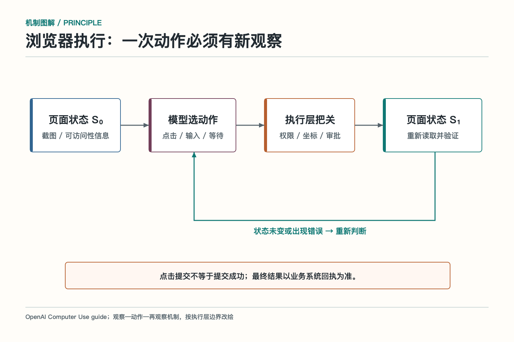
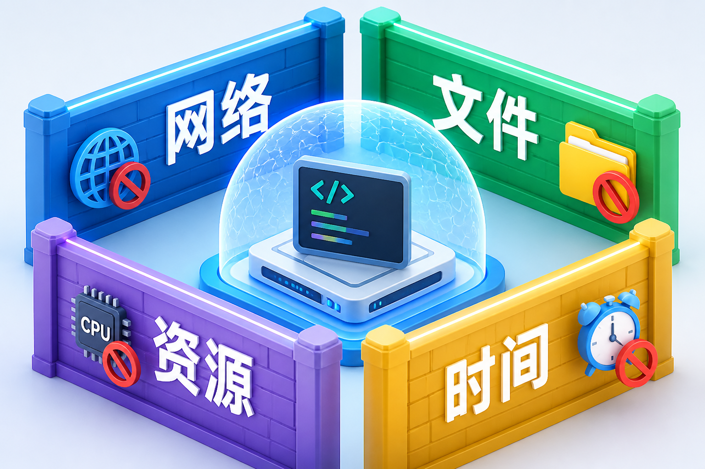
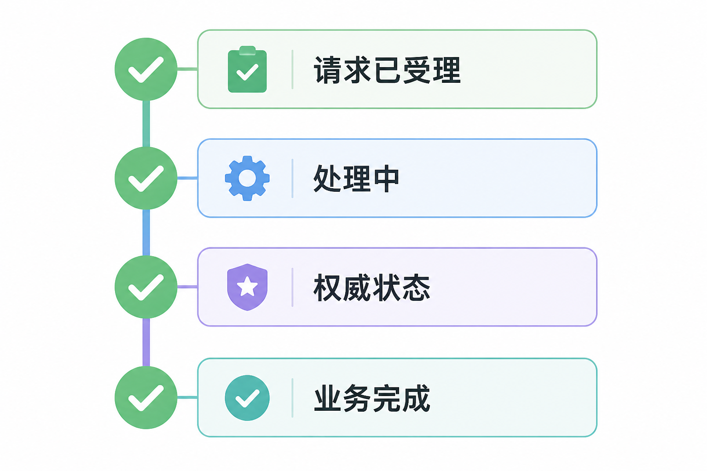

# 面试题：API、代码沙箱和浏览器自动化怎么选

总览只需要说明“不同通道各有取舍”。面试时要进一步讲清：什么场景优先 API，代码执行如何隔离，浏览器为什么脆弱，写操作怎样确认真实状态。

## 问题 1：API、代码执行和浏览器自动化怎样选？

### 原理

API 提供稳定的业务契约；代码执行提供受限的开放计算能力；浏览器自动化覆盖没有接口或必须依赖页面语义的系统。选型要综合稳定性、权限、可观测性、版本维护和结果验证。

### 答题点

1. 固定业务动作优先 API，便于版本、权限、幂等和审计；
2. 数据转换、统计、文件处理放入隔离代码环境；
3. 没有 API 或必须使用现有页面会话时才考虑浏览器；
4. 不论通道，都要统一超时、日志、追踪、结果回读和人工升级。

### 记忆点

> 稳定动作走 API，开放计算进沙箱，无接口再进浏览器。

### 追问

浏览器什么时候比 API 更合适？目标没有可用 API、任务依赖用户可见页面或已有登录会话时可以，但要接受页面改版和时序脆弱性，并保留提交前确认。

### 失分点

回答“看情况”却不给判断维度，或认为浏览器能点通一次就适合生产。

## 问题 2：代码执行沙箱需要隔离哪些边界？

### 原理

代码执行的风险不只来自代码本身，还来自网络、文件、依赖、进程和资源。沙箱要把生成代码限制在任务所需的最小环境里。

### 答题点

1. 限制网络出口、域名和内网访问，避免数据外传；
2. 限制可读写目录，禁止访问宿主机敏感路径；
3. 控制 CPU、内存、进程数、运行时间和依赖安装；
4. 捕获代码、日志、退出码和产物，执行后清理临时环境并检查输出。

### 记忆点

> 代码能跑，不代表代码能看、能联网、能长期占资源。

### 追问

为什么不能只在提示词中禁止危险代码？提示词不是进程隔离，也不能阻止依赖库或间接输入造成的行为。强制限制必须由运行时、容器、权限和网络策略完成。

### 失分点

只说“用 Docker”而不讲容器权限、网络、文件挂载、资源上限和输出检查。

## 问题 3：浏览器自动化为什么比 API 难维护？

### 原理

浏览器自动化依赖页面结构、元素语义、登录状态和加载时序。页面 UI 是面向人的交互表面，供应商改版不一定提供兼容承诺，因此比稳定 API 更容易退化。

### 答题点

1. 选择稳定定位器，减少依赖易变的 CSS 层级和视觉位置；
2. 每个关键动作后读取页面状态，不连续盲点；
3. 管理登录、弹窗、超时、下载、验证码和页面改版；
4. 保留截图、页面状态和业务任务号，提交后回读权威状态。

### 记忆点

> 浏览器是操作界面，不是稳定业务契约。

### 追问

怎样降低页面改版影响？优先使用官方 API；必须用浏览器时，集中封装页面适配器，建立页面回归用例和失败告警，不让每个 Agent 自己写一套点击逻辑。

### 失分点

只讨论元素定位，没有讲登录凭据、确认点、页面状态和业务结果验证。

## 问题 4：有副作用动作完成后怎样确认？

### 原理

请求发出、接口受理、后台处理、业务完成是不同状态。Agent 只能在读到权威状态后报告完成，不能把某个中间信号包装成最终结果。

### 答题点

1. 为动作生成任务 ID、外部请求号或幂等键；
2. 区分已提交、处理中、完成、失败和部分成功；
3. 通过 API 查询、数据库状态或受控页面读取确认结果；
4. 结果不明时先停止自动重试，进入查询、补偿或人工接管。

### 记忆点

> 请求返回是过程信号，权威状态才是完成证据。

### 追问

浏览器显示“提交成功”还要查什么？要查业务系统是否生成订单、工单或任务，状态是否完成，金额和对象是否正确；页面提示本身可能只是前端收到请求。

### 失分点

把 HTTP 200、页面 Toast 或进程退出直接当作业务完成。

## 问题 5：三种通道的失败处理有什么区别？

### 原理

API 失败通常有结构化错误码；代码执行有退出码、日志和产物；浏览器失败常表现为页面状态、元素缺失或登录过期。错误形态不同，但都要进入统一的任务状态和恢复流程。

### 答题点

1. API 按错误码区分参数、权限、限流、超时和供应商故障；
2. 代码保留 stdout、stderr、环境版本、文件产物和资源消耗；
3. 浏览器保存截图、页面状态、当前步骤和会话信息；
4. 统一判断是否重试、补偿、回滚、转人工或向用户报告未完成。

### 记忆点

> 通道不同，恢复入口不同；任务状态必须统一。

### 追问

是否所有临时错误都能自动重试？不能。读操作通常可以有限重试，写操作要先查状态；认证、参数、权限和业务冲突应快速失败并暴露原因。

### 失分点

只讲指数退避，不讲副作用、状态查询和三种通道的证据差异。

## 问题 6：如何控制执行通道的成本和权限？

### 原理

执行通道的成本不只包括模型 Token，还包括 API 调用、沙箱运行、浏览器会话、人工接管和失败重试。权限也应随通道和任务风险变化。

### 答题点

1. 按只读、低风险写入、高风险写入分级能力；
2. 为代码和浏览器设置时间、资源、会话和并发上限；
3. 优先选择可缓存、可批量、可查询状态的 API；
4. 记录每种通道的成本、成功率和人工接管率，用任务完成衡量优化效果。

### 记忆点

> 便宜不是少调用一次，而是用合适通道把事情一次做对。

### 追问

浏览器自动化很慢，是否一定要全部改 API？如果 API 能覆盖稳定动作，应迁移；但页面语义、登录会话或没有接口的任务仍可保留浏览器，并用缓存、批处理、会话复用和小步验证降低成本。

### 失分点

只按单次调用价格选型，忽略失败重试、维护、权限风险和人工成本。

## 问题 7：API 版本变化和部分成功怎样处理？

### 原理

外部 API 会改字段、权限、限额和错误语义，批量请求还可能部分成功。连接器需要提供稳定契约，把供应商变化隔离在适配层，并逐项返回业务结果。

### 答题点

1. 对外暴露领域字段和版本化契约，不让上层绑定供应商原始字段；
2. 升级前做兼容测试，必要时同时支持新旧版本和功能开关；
3. 批量操作逐项返回对象 ID、状态和错误，不能只给整体成功或失败；
4. 只重试明确未执行且可幂等的项，已成功项不得重复写入。

### 记忆点

> 接口变化由适配层消化，批量结果按对象说清楚。

### 追问

供应商突然删除字段怎么办？先降级或关闭依赖该字段的能力，保留明确错误；通过版本适配和回归修复后再恢复，不能让模型猜字段含义。

### 失分点

认为有 OpenAPI 文档就不会变化，或批量失败后整批重放造成重复副作用。

## 问题 8：代码执行产物怎样验收和交付？

### 原理

进程退出码为零，只能说明程序正常结束。产物还需要检查存在性、格式、内容、敏感信息和业务正确性。

### 答题点

1. 记录代码、环境、依赖、输入摘要、日志和退出码；
2. 检查产物路径、MIME 类型、大小、可打开性和必要字段；
3. 用规则或样本验证计算口径，图表还要检查非空和可读性；
4. 对宏、可执行文件和敏感数据做隔离或阻断，交付后清理临时环境。

### 记忆点

> 程序跑完不等于产物能用。

### 追问

怎样保证结果可复现？固定基础镜像和依赖版本，保存代码与输入版本，使用确定性参数，并记录随机种子和外部数据来源。

### 失分点

只返回下载链接，没有校验文件内容，也没有记录运行环境和输入版本。

## 问题 9：浏览器自动化如何管理登录凭据和用户确认？

### 原理

浏览器会话包含 Cookie、令牌和用户身份。凭据应由受控会话管理，模型不直接读取。权限升级、验证码、外部提交和敏感上传要设置明确的人类关口。

### 答题点

1. 使用隔离会话和最小权限账号，模型只看到可操作页面；
2. 凭据、Cookie 和密码不进入提示词、日志和下载文件；
3. 提交前向用户展示对象、金额、接收方和影响，再执行最终点击；
4. 遇到验证码、新权限提示或敏感数据传输时暂停并交给用户。

### 记忆点

> 浏览器继承的是受控会话，不是模型拥有的万能账号。

### 追问

能否长期复用登录会话降低成本？可以在安全策略允许时复用，但要管理过期、撤销、租户隔离和设备风险；高风险任务仍应重新确认身份与权限。

### 失分点

把登录态当作长期共享资源，未区分用户和租户，也没有确认点和凭据脱敏。

## 问题 10：跨通道任务怎样保持数据最小化和可追踪？

### 原理

API、沙箱和浏览器之间传递数据时，应只传下一步需要的字段，并携带来源、版本和任务标识。整包转发上下文会扩大泄露面，也难以复现结果。

### 答题点

1. 为每个阶段定义输入输出契约，删除无关字段；
2. 对敏感字段做脱敏、令牌化或受控引用，不复制长期凭据；
3. 用统一 Trace 关联 API 请求、代码运行、浏览器动作和最终产物；
4. 记录数据版本与权威来源，结果能回到原始记录和用户确认。

### 记忆点

> 通道之间传交付物，不传整间仓库。

### 追问

为何不直接把完整上下文交给每一步？完整上下文增加 Token、权限和泄露风险，还会让子步骤受到无关信息影响。最小上下文更容易评测和审计。

### 失分点

只画出三个通道的流程图，没有定义数据契约、身份传递和统一追踪。

补充一句容易拿分的判断：原型阶段可以用浏览器快速验证价值，稳定后应把高频业务动作逐步迁移到 API，把重复计算固化到受控工具。选型不是一次决定，而是一条从灵活验证走向可靠运行的演进路线。

## 收束答法

我的默认顺序是：能用稳定 API，就不让 Agent 去点页面；需要开放计算，就放入隔离环境；确实没有 API，才使用浏览器自动化。无论走哪条路，模型只提出动作，执行层负责权限和参数，系统再用权威状态确认结果。这样既保留灵活性，也不会把执行风险藏起来。

## 参考资料

- [OpenAI 官方文档：Tools](https://developers.openai.com/api/docs/guides/tools)
- [OpenAI 官方文档：Code interpreter](https://developers.openai.com/api/docs/guides/tools-code-interpreter)
- [OpenAI 官方文档：Computer use](https://developers.openai.com/api/docs/guides/tools-computer-use)

想看本文在 AI Agent 中的位置，可点击下方 [阅读原文](https://github.com/Jennifer123www/ai-agent-knowledge-map)，从“工具、技能与协议”继续阅读。
