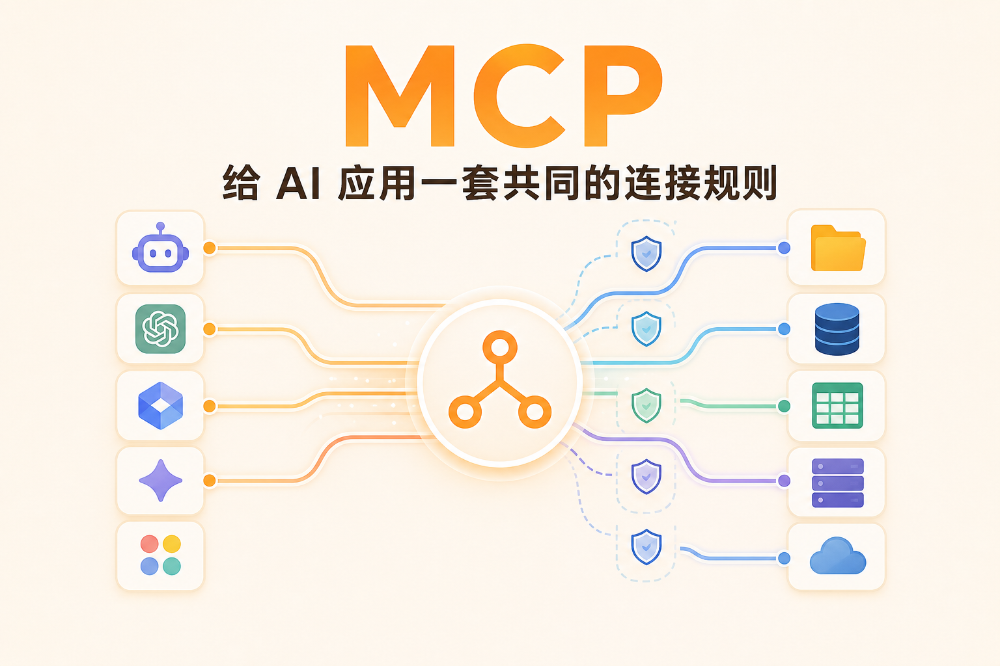
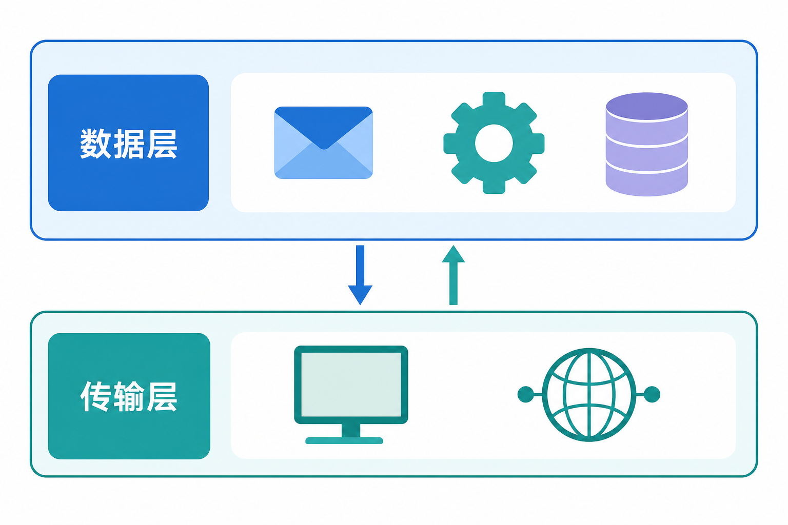
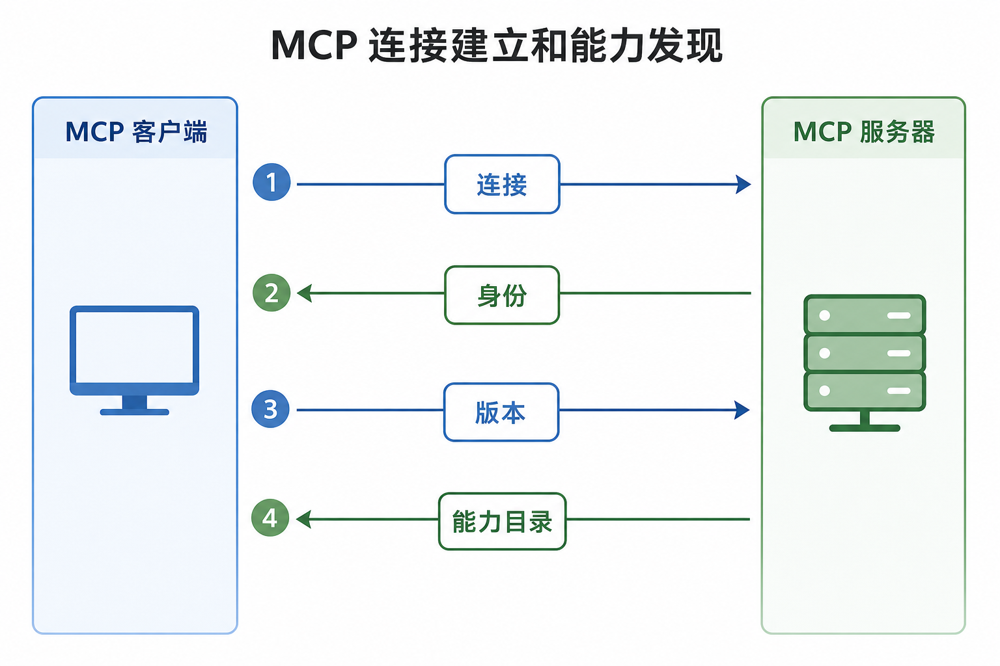
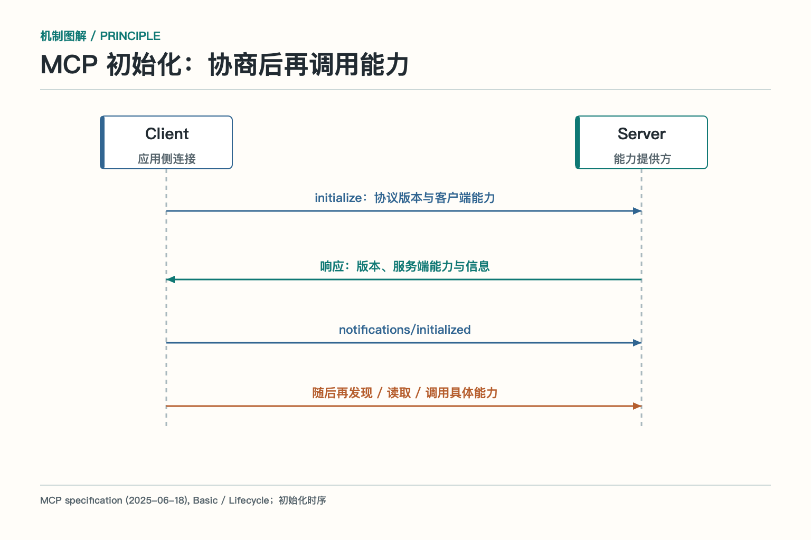
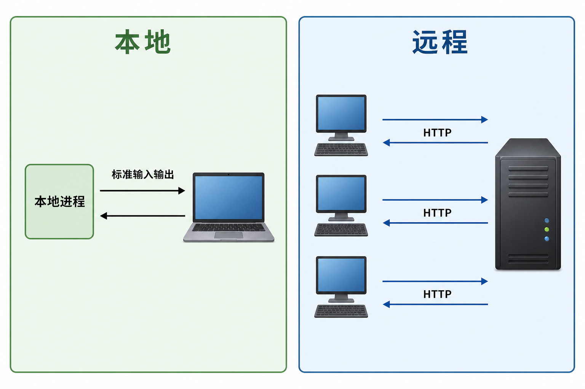
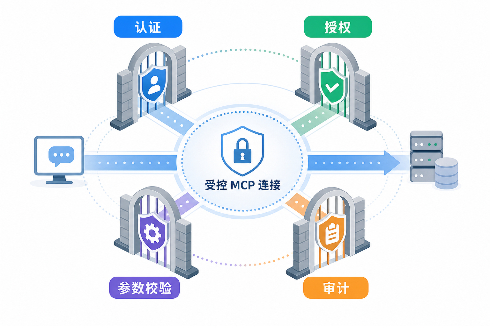
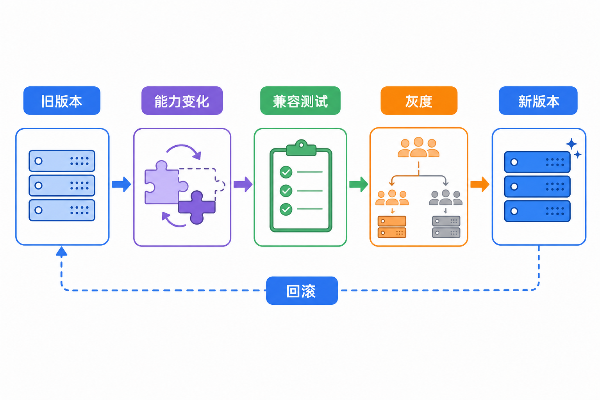

# MCP：给 AI 应用一套共同的连接规则

一个团队有多个 AI 应用：桌面助手、代码助手、客服机器人、内部研究工具。它们都想访问文件、数据库、工单和监控系统。如果每个应用都各写一套接入方式，能力提供方要维护一堆适配，使用方也要重复处理认证、目录和错误。

MCP，Model Context Protocol，中文通常译作“模型上下文协议”，就是为这类连接提供共同规则。它让 AI 应用能够发现外部能力，以统一的方式读取或调用，再把结果带回自己的任务流程。

先把边界说清楚：MCP 是连接和交互协议，不是 Agent 框架，不负责替你规划任务，也不是一套自动授权系统。它把“怎么接、怎么发现、怎么说话”统一起来，具体能看什么、能做什么，仍由服务端和业务系统决定。

## MCP 的两层结构

MCP 可以分成数据层和传输层。

数据层规定消息和能力的语义。客户端和服务器如何交换请求、响应、通知，如何发现版本和能力，工具、资源和提示模板如何描述，都属于这一层。它通常建立在 JSON-RPC 这类结构化消息之上。

传输层负责消息怎样到达对方。一个本地程序可以通过标准输入输出与客户端通信；远程服务可以通过 HTTP 传递请求，并使用相应的认证方式。两种传输的网络位置、生命周期和安全边界不同，但上层看到的对象和交互语义可以保持一致。

把两层分开有一个好处：应用不用因为从本地进程换成远程服务，就重新理解工具和资源的含义；传输层也不用替业务系统定义“创建工单”到底意味着什么。

## 连接开始前，双方要先自我介绍

MCP 连接不是插上就能用。客户端要知道服务端支持什么版本、哪些能力和哪些操作；服务端也要知道客户端的身份和能力。双方先交换信息，再决定后续如何交互。

*依据 MCP 2025-06-18 版 Basic / Lifecycle 规范改绘。*

发现过程可以理解成一次“能力目录交换”：服务端声明自己支持哪些对象，客户端读取目录并结合本地策略筛选。目录变更时，服务端还可以通过通知让客户端更新缓存。

发现不等于信任。一个远程服务自称能读公司文件，客户端仍要核对来源、身份、授权和数据范围。目录里列出“删除数据”，也不代表当前用户或当前任务允许调用它。

能力目录还要有版本意识。工具参数改了、资源地址变了、认证方式变了，都可能影响已有技能。客户端需要记录服务端版本和能力摘要，发生不兼容时快速失败或切换到已验证版本，而不是让模型拿旧参数盲试。

## 请求、响应和通知各管什么

协议通信里不只有“问一次、答一次”。请求带有标识，接收方处理后返回对应响应；通知则用于告诉对方某件事发生了变化，但不要求对方逐条回复。工具目录变化、进度更新和状态变更，都可能适合通知。

请求标识很重要。一个客户端同时向多个 Server 发请求，结果返回顺序可能不同，必须按标识匹配。发生超时后，也要知道哪一次请求仍在处理中，哪一次已经失败。不能只靠消息到达的先后顺序猜测。

通知也不能无限发送。客户端要明确订阅什么，服务端控制频率和内容。目录每变化一次就推送完整列表，会浪费带宽和上下文；更合理的做法是发送变化信号，让客户端按需重新读取。

长任务需要持久句柄。某个 Tool 要跑十分钟，不应该让 HTTP 连接一直悬着，也不应该让模型每隔几秒盲目询问。服务端可以返回任务标识，客户端按状态查询、接收进度或稍后取结果。取消、超时和结果保留时间也要有清楚约定。

## MCP 是无状态消息，不代表应用没有状态

协议层可以要求每个请求携带处理所需的版本和能力元数据，服务端不靠隐藏会话猜上下文。但 Agent 应用本身仍会保存任务状态、用户身份、工具结果和审批记录。

这两件事不要混淆。协议消息尽量自描述，有利于重试、路由和横向扩展；业务任务状态则由运行时或数据库持久化。服务端若需要一个长期任务，也应返回显式任务 ID，而不是把关键状态藏在某个进程内存里。

无状态还意味着请求可能被重复送达。读操作通常问题较小，写操作需要幂等键或状态查询。协议能传递这些字段，但怎样实现幂等，仍由具体 Server 和后端业务负责。

## 本地和远程有什么差别

本地 MCP Server 通常由 AI 应用在本机启动，通过标准输入输出通信。它适合个人文件、开发环境和本机工具，延迟低，但进程权限直接靠近用户机器，启动配置和本地安全很重要。

远程 MCP Server 运行在服务端，多个客户端可以连接。它适合共享业务系统和团队能力，但要处理网络延迟、身份认证、租户隔离、限流、审计和服务可用性。

同一个协议不代表同一种部署安全。把本地文件服务搬到远程，并不是换一个 URL 就结束了。远程场景要明确谁是用户、谁是客户端、服务器代表谁访问后端，以及每次调用如何传递授权上下文。

本地 Server 也不是天然可信。配置文件可能指向错误程序，安装包可能被替换，进程可能读取过宽的目录。应用启动本地服务时，要固定来源和版本，限制工作目录、环境变量和子进程权限，并向用户展示将开放哪些能力。

远程场景还要考虑令牌受众和转发。给 MCP Server 的令牌不应被拿去访问无关服务，也不能把上游用户令牌原样传给任意后端。更稳妥的方式是服务端按当前任务申请短期、细粒度凭据，并在审计中关联用户、客户端和工具调用。

## MCP 不替代业务授权

MCP Server 可以暴露一个工具，但执行工具时仍要经过业务系统自己的权限判断。用户 A 能查看自己的工单，不代表他能通过同一个 MCP 连接查看用户 B 的工单；研发人员能读代码，也不代表能删除生产数据。

认证回答“你是谁”，授权回答“你能做什么”。两者还要结合资源范围、租户、时间、风险和审批。客户端发现了工具，只说明它知道工具存在；真正调用前，服务端和后端系统必须再次检查。

协议层也不能替代数据治理。Resource 可能包含合同、客户信息和内部指标，返回内容要按用户权限过滤和脱敏。远程服务返回的文本也应当被当作不可信数据，不能因为它来自“工具”就自动提升优先级。

权限变化还要及时生效。用户离职、项目权限撤销或令牌过期后，客户端缓存的能力目录可能已经不再适用。执行时必须以当前授权为准，必要时让客户端重新发现能力。目录缓存提高速度，不能成为绕过撤权的理由。

## “大话”MCP：统一插座，不是万能电源

MCP 更像统一插座。插头规格统一后，电脑、台灯和充电器不用为每个房间重做接口；但房间有没有电、插座承受多少功率、谁拿到钥匙，仍由电路和门禁决定。

如果把 MCP 当成万能电源，就会期待它自动解决权限、数据质量和业务流程。结果往往是：连接是通的，工具也列出来了，真正执行时才发现账号没权限、字段不兼容、返回结果没有证据。

正确的分工是：协议统一连接方式，Server 适配外部系统，执行层检查权限和规则，Agent 决定何时使用，业务系统给出最终状态。

## 协议升级和兼容

协议和服务都在演进。版本协商、能力声明和错误分类，都是为了让升级变得可控。客户端遇到不支持的版本，应选择双方都支持的版本或明确失败；服务端新增能力，不应悄悄改变已有工具的参数语义。

生产环境可以给 MCP Server 建兼容测试：连接建立、能力发现、工具列表、资源读取、错误响应、超时和权限拒绝都要覆盖。远程服务还要测试断线重连、请求重复和并发限制。

监控上要区分协议错误和业务错误。版本不兼容、消息格式错误属于连接或协议问题；订单不存在、权限不足和业务状态冲突属于后端业务问题。分类清楚，才知道应该升级客户端、修复适配器，还是联系业务系统负责人。

观测一条 MCP 链路时，至少记录客户端和服务端版本、传输方式、请求方法、调用标识、时延、错误分类、能力版本和后端任务 ID。日志要脱敏，不能把凭据和完整业务数据都留下。客户端的任务 Trace 与服务端日志通过追踪 ID 关联，排查时才不会各说各话。

服务不可用时要有降级路径。只读资料可以使用短时缓存并明确更新时间；高风险写操作不能在身份或状态不明时离线执行；非关键能力可以暂时关闭，让 Agent 说明限制。协议统一之后，失败也应该统一说清，而不是让模型拿旧数据装作一切正常。

## 什么时候值得引入 MCP

如果只有一个应用连接一个内部函数，直接工具调用可能已经够用。MCP 的价值在于多个客户端、多个能力提供方、动态发现和可替换接入。当接入数量增长，统一协议能减少重复适配，也能让能力目录、权限和观测有共同入口。

引入协议也有成本：需要运行 Server、维护版本、处理认证、监控连接和兼容客户端。不要因为名字流行就把每个本地函数包成 MCP Server。先看是否存在跨应用复用、独立部署、动态能力目录或团队边界，再决定是否值得。

评估时还可以问：能力是否需要被不同语言和不同产品重复使用，提供方是否希望独立发布，权限是否能在一个清楚的安全域内治理。若答案大多是否，简单接口往往更合适；若答案大多是，统一协议才会真正省下长期接线成本。

## 参考资料

- [MCP 2025-06-18：初始化生命周期](https://modelcontextprotocol.io/specification/2025-06-18/basic/lifecycle)
- [Model Context Protocol 官方文档：Architecture overview](https://modelcontextprotocol.io/docs/learn/architecture)
- [MCP 官方规范：Basic protocol](https://modelcontextprotocol.io/specification/latest/basic)
- [OpenAI 官方文档：MCP servers](https://developers.openai.com/api/docs/guides/tools-connectors-mcp)

想看本文在 AI Agent 中的位置，可点击下方 [阅读原文](https://github.com/Jennifer123www/ai-agent-knowledge-map)，从“工具、技能与协议”继续阅读。
