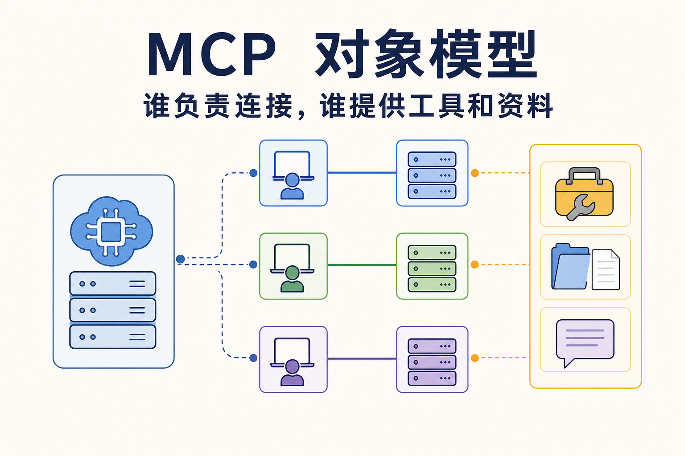
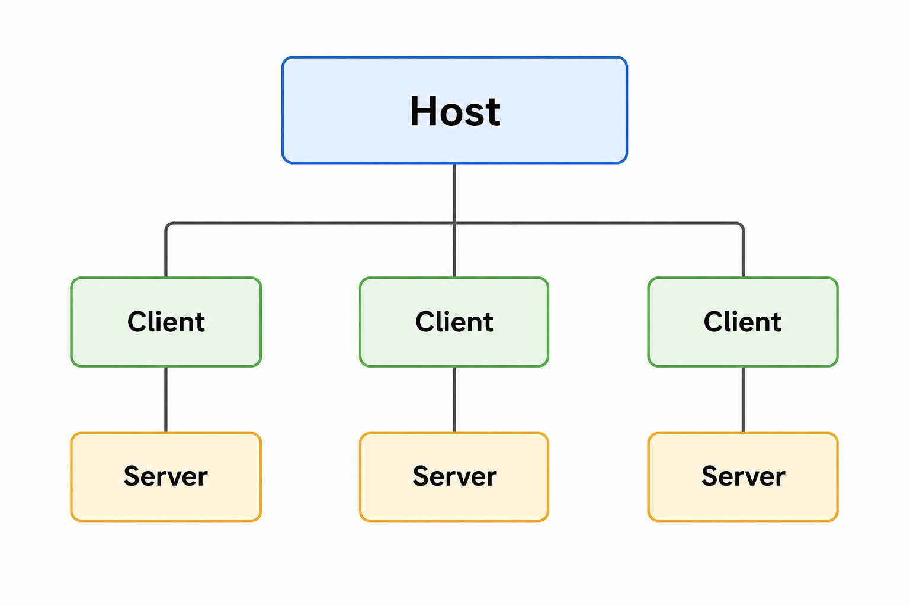
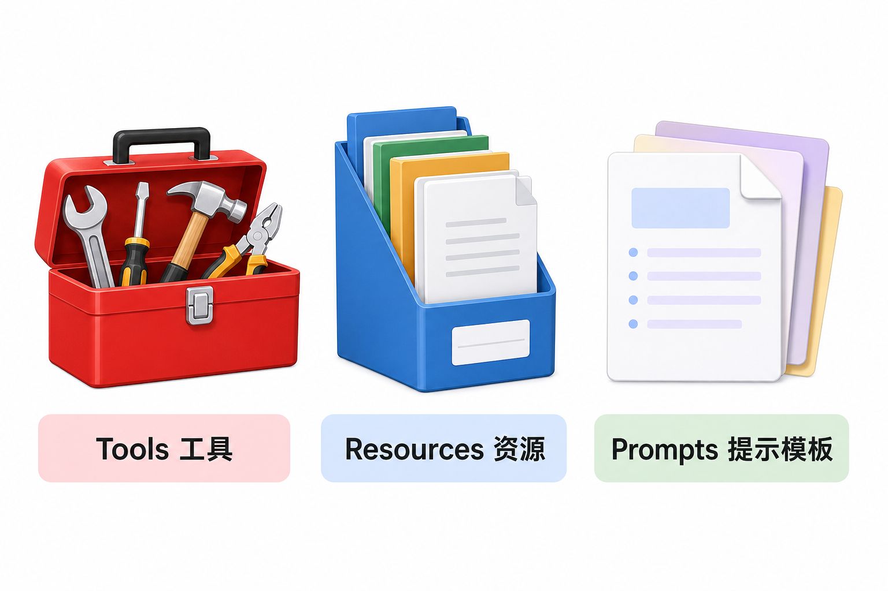
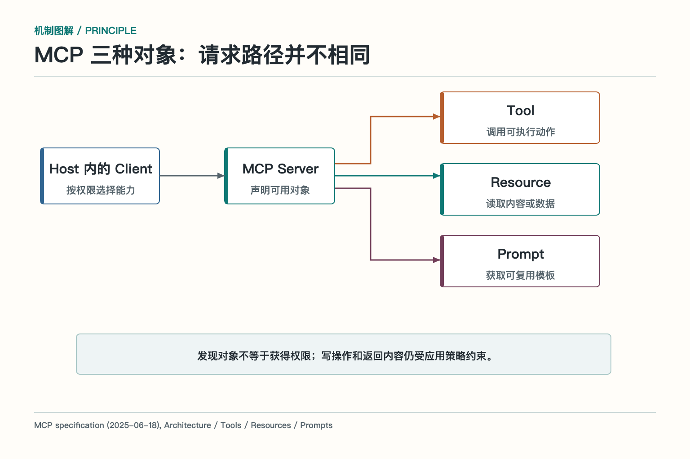
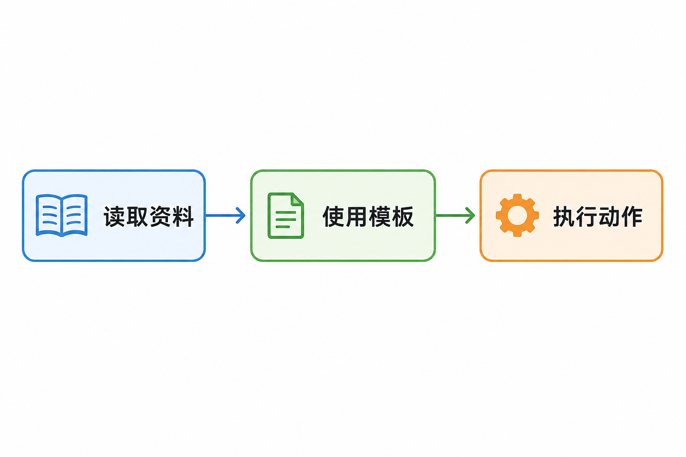
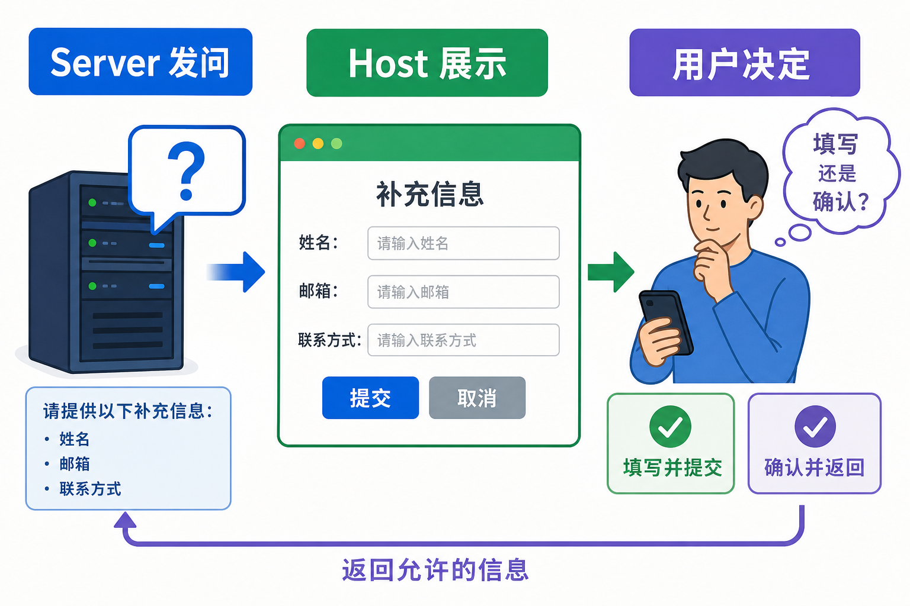

# MCP 里谁负责连接，谁提供工具和资料

前一篇讲了 MCP 的协议边界。这一篇只看协议里的角色和对象：谁承载 Agent，谁维护连接，谁提供能力，以及工具、资源和提示模板为什么不能混成一个“插件列表”。

一个常见误解是：MCP Client 就是用户使用的整个 AI 应用，MCP Server 就是远程云服务。实际没有这么简单。Client 是 Host 内部管理某条连接的组件，Server 是提供 MCP 能力的程序；Server 可以在本机，也可以在远程。

## Host、Client、Server 是怎样配合的

MCP Host 是承载 AI 能力的应用，例如代码编辑器、桌面助手或企业 Agent 平台。它负责管理模型、用户界面、权限策略、上下文和多个外部连接。

Host 连接一个 MCP Server 时，通常创建一个对应的 MCP Client。Client 负责维护这条连接、发现能力、发起请求、接收结果，再把结果交给 Host。Host 若连接文件服务、数据库服务和监控服务，会有多条 Client—Server 连接。

这种关系有利于隔离。文件 Server 出错，不必拖垮数据库连接；某个 Server 只向有权限的 Client 暴露能力；Host 可以按任务选择使用哪条连接。对本地标准输入输出传输来说，一个 Server 往往服务一个 Client；远程服务则可能同时服务多个 Client。

Server 不等于业务系统本身。它可以直接实现能力，也可以做适配层，把后端 API、数据库或文件系统转换成 MCP 对象。真正的数据和动作仍在后端，Server 负责把它们按协议暴露出来。

## Tool：让 Agent 执行一个动作

Tool 表示可调用的动作，通常包含名称、说明、参数结构和返回结果。查询数据库、创建工单、写入文件、运行诊断，都可以做成 Tool。

*依据 MCP Architecture、Tools、Resources 与 Prompts 规范改绘。*

Tool 可能只读，也可能产生副作用。名称看起来像“查询”的动作，也可能触发计费或写审计日志，因此 Server 应明确风险和权限。Client 收到目录后，还可以结合用户身份和本地策略进一步过滤。

调用 Tool 时，模型或上层流程提出参数，Host 的执行策略先检查，再由 Client 向 Server 发起请求。Server 仍要在后端重新校验身份和业务规则。目录里有 Tool，不等于任何人都能调用。

Tool 返回值要能说明真实状态。创建工单后返回工单 ID、状态和来源；长任务返回任务句柄；部分成功返回逐项结果。只给一句“操作成功”，后续很难验证。

Tool 的命名和分组也会影响使用。名称要包含动作和对象，例如 `tickets.create`、`customers.search`，避免几个 Server 都提供一个含糊的 `search`。描述要写清使用条件、风险和结果，参数模式要限制非法状态。Host 还可以加上 Server 前缀或命名空间，防止不同来源的同名工具冲突。

对于长时间执行的 Tool，返回一个可持续查询的任务句柄，比保持连接等待更稳。句柄应能读取进度、结果和错误，也应支持取消或超时。若 Tool 会写入外部系统，还要带幂等键和业务对象 ID，确保恢复后不会重复执行。

## Resource：给 Agent 读取上下文

Resource 表示可读取的数据或内容，例如文件、数据库记录、系统状态、接口结果和业务文档。它通常有稳定标识、内容类型和读取方式。

Resource 不是向量数据库的同义词。向量库可以是 Resource 的后端之一，但普通文件、配置、日志片段和实时状态也都可以通过 Resource 提供。Resource 的重点是“读取什么内容”，不负责替模型执行动作。

读取同样有权限风险。合同、代码、客户信息和监控数据都可能敏感。Server 要按用户和租户过滤，Client 也不能因为是只读就跳过审计。缓存 Resource 时，还要保留版本、更新时间和权限上下文。

Resource 返回的文字可能包含错误、过期信息或提示注入。Host 应把它当作证据数据，而不是更高优先级的系统命令。关键结论需要引用来源，敏感内容在进入模型前做过滤和脱敏。

Resource 通常需要稳定标识，可以是 URI 或其他资源 ID。标识应能指向同一个逻辑对象，而版本、更新时间、内容类型和权限作为元数据返回。这样客户端缓存后，才能判断内容是否变化、是否仍可访问。

大型 Resource 不宜一次全部送进模型。Client 可以先读取目录和元数据，再按任务选择片段；日志、表格和代码仓库还可能提供分页、范围读取或订阅变化。读取策略由 Host 决定，Server 不应把整个知识库塞进一次响应。

资源变化时，缓存要有失效办法。文档更新、权限撤销、文件删除，都需要让 Client 重新读取或停止使用旧内容。缓存键要包含用户和权限上下文，不能把管理员读取的内容复用给普通用户。

## Prompt：复用交互模板

Prompt 是可复用的提示模板，可以带参数并返回一组消息。代码审查模板、事故复盘提纲、周报写作框架，都可以由 Server 作为 Prompt 提供。

Prompt 与 Tool 的差别很直接：Prompt 组织模型输入，Tool 触发外部动作。Prompt 与 Resource 也不同：Resource 提供资料，Prompt 提供使用资料的模板。一个代码仓库 Server 可以用 Resource 提供文件，用 Prompt 提供审查格式，用 Tool 提供运行测试。

服务端 Prompt 不能覆盖 Host 的系统策略。模板来自外部能力提供方，Host 要决定是否展示、是否允许使用，以及怎样与本地指令合并。用户选择模板，不等于模板获得更高权限。

Prompt 可以有参数，例如语言、目标受众、审查类型和输出格式。参数要有说明和约束，缺少必填项时由 Host 提示用户补充。模板结果最好返回明确的消息结构，而不是拼接成一段难以检查的长字符串。

Prompt 的版本也要可见。同名模板如果悄悄改了判断标准，Agent 输出可能发生明显变化。Host 可以记录模板来源和版本，在重要流程里固定已验证版本，并通过回归样本检查升级后的效果。

## 三类对象为什么要分开

对象类型分开后，Host 才能正确展示和治理。Tool 可以显示风险、参数和确认按钮；Resource 可以显示来源、大小和更新时间；Prompt 可以显示模板说明和参数。全部塞进 Tool，会让读取资料也变成调用动作；全部塞进 Resource，又无法表达副作用。

分开还便于权限控制。某个用户可以读取项目文档，但不能运行部署；可以使用代码审查模板，但不能修改模板源。权限应落到具体对象和资源范围，而不是“一连上 Server 就全部开放”。

在任务中，三类对象经常协作。Agent 先读取制度 Resource，再使用报销审查 Prompt 整理检查项，最后调用创建报销单 Tool。对象各司其职，轨迹也更容易解释。

对象目录不要只面向模型，也要面向人。管理界面应能看到对象来自哪个 Server、版本是什么、需要哪些权限、是否产生副作用、最近是否健康。这样管理员可以停用单个 Tool，而不是为了一个危险动作断开整个 Server。

目录还要支持变更。新增对象可以渐进开放，删除对象要给依赖方迁移时间，参数或资源标识变化要有兼容方案。Host 在每次任务中记录实际使用的对象版本，之后才能复现行为。

## 对象结果怎样进入上下文

不同对象的结果不应该不加区分地拼成一段文本。Tool 结果应标明调用 ID、状态和业务对象；Resource 内容应带来源和版本；Prompt 应标明模板来源和参数。Host 负责把这些内容放进模型上下文，并控制长度和优先级。

模型看到的是任务所需的最小信息。Resource 太长时做选择和压缩，Tool 错误只提供判断下一步所需的分类，Prompt 不得夹带覆盖系统策略的指令。原始结果保存在轨迹或存储中，模型上下文只放当前轮需要的部分。

这一步决定了可追溯性。最终回答引用某份制度，系统应知道对应 Resource；执行了某项动作，应知道对应 Tool 和 Server；使用了某个模板，应记录 Prompt 版本。否则协议连接虽然统一，结果仍然说不清从哪里来。

## Elicitation：Server 也可以向用户要信息

有时 Server 缺少完成动作所需的信息，或者需要用户确认。Elicitation 可以理解成服务端发起的一次补充信息请求，由 Client/Host 以适合的界面呈现给用户。

例如创建工单前缺少影响范围，Server 可以请求用户补充；高风险操作前需要确认，也可以请求 Host 展示动作详情。用户输入再通过 Client 返回 Server。

Elicitation 不能变成随意索取敏感信息的入口。Host 要控制允许的问题类型、展示来源、限制字段，并在传输敏感数据前明确告知去向和用途。Server 的请求只是请求，最终交互和授权仍由 Host 与用户掌握。

用户拒绝或关闭窗口时，Server 要得到明确的取消结果，不能继续猜测参数。需要多轮补充时，每一轮都要保持任务 ID 和已确认字段，避免反复询问。涉及金额、收件人或外部提交时，最终动作前仍要单独确认，补充信息不能替代交易授权。

## 对象设计的常见坏味道

第一个坏味道是把一个万能 Tool 暴露成“执行任意请求”，参数里塞自由文本。这很灵活，也很难授权、测试和审计。第二个是把动态查询全部伪装成 Resource，结果没有参数契约和错误分类。第三个是 Prompt 中包含隐含工具调用要求，试图绕过 Host 的选择策略。

更好的做法是让对象语义清楚、职责内聚、权限可描述。对象数量可以多，但当前任务只加载少量候选；Server 可以强大，但 Host 保留最终编排和安全策略。目录的目标不是展示能力有多少，而是让正确能力在正确边界内被使用。

做对象设计评审时，可以让开发者不用看实现，只读对象名称、说明、参数和权限，就能回答三个问题：它会读取什么，会改变什么，失败后怎样确认。若这三个问题说不清，模型也很难稳定使用，管理员更无法放心授权。

把对象目录当成产品来维护，会比把它当作代码附属物更稳。使用者能看懂，管理员能授权，排障人员能追踪，版本升级才有可靠基础。

## “大话”对象模型：商场、柜台和三种服务

Host 像商场，Client 像每个专柜的联络员，Server 像具体专柜。专柜可以提供三种东西：Tool 是办业务的窗口，Resource 是可查阅的资料架，Prompt 是填表和沟通模板。

你可以拿资料，不代表能办所有业务；可以使用模板，也不代表模板能替你盖章。商场还要管理每个专柜的准入、权限和投诉。把这几个角色分清，MCP 架构就不再是一串缩写。

## 参考资料

- [MCP 2025-06-18：Tools、Resources 与 Prompts](https://modelcontextprotocol.io/specification/2025-06-18/server/tools)
- [Model Context Protocol 官方文档：Architecture overview](https://modelcontextprotocol.io/docs/learn/architecture)
- [MCP 官方文档：Server concepts](https://modelcontextprotocol.io/docs/learn/server-concepts)
- [MCP 官方文档：Client concepts](https://modelcontextprotocol.io/docs/learn/client-concepts)

想看本文在 AI Agent 中的位置，可点击下方 [阅读原文](https://github.com/Jennifer123www/ai-agent-knowledge-map)，从“工具、技能与协议”继续阅读。
