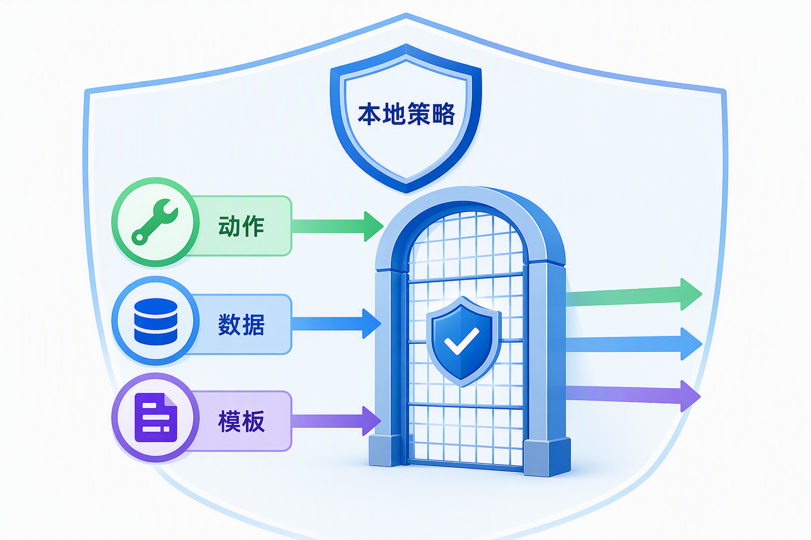

# 面试题：MCP 三类对象和调用责任怎么分

这组问题不再考协议传输和版本协商，只看对象与责任：Host 为什么要管理多个 Client，Server 提供哪些对象，Tools、Resources、Prompts 应怎样治理，Server 何时可以向用户补问。

## 问题 1：MCP Host、Client、Server 分别是什么？

### 原理

Host 是承载 Agent 的应用，管理模型、界面、策略和多条连接；Client 是 Host 内维护一条 Server 连接的组件；Server 是提供 MCP 能力的程序，可以本地运行，也可以远程部署。

### 答题点

1. Host 负责整体任务、用户交互和本地安全策略；
2. Client 负责连接、发现、请求、响应和通知处理；
3. Server 暴露能力并适配后端系统，不等于后端系统本身；
4. Host 可连接多个 Server，分别隔离故障、权限和生命周期。

### 记忆点

> Host 统筹，Client 联络，Server 提供。

### 追问

一个 Server 可以服务多个 Client 吗？远程服务通常可以；本地标准输入输出场景常见一对一。无论数量如何，身份、租户和请求状态都要清楚隔离。

### 失分点

把 Host 和 Client 当成同义词，或认为 Server 一定在云端。

## 问题 2：Tools、Resources、Prompts 的语义怎样区分？

### 原理

Tool 表示可调用动作，Resource 表示可读取内容，Prompt 表示可复用交互模板。三者用途不同，因此发现、展示、权限、调用和审计方式也不同。

### 答题点

1. Tool 有参数和执行结果，可能产生副作用；
2. Resource 有标识、内容类型、版本和读取权限；
3. Prompt 有说明、参数和消息模板，不应覆盖 Host 系统策略；
4. 同一 Server 可组合三类对象，但不能因为实现方便把语义混在一起。

### 记忆点

> Tool 做事，Resource 给资料，Prompt 给模板。

### 追问

查询数据库应该做 Tool 还是 Resource？如果是参数化查询和执行动作，更像 Tool；若提供一个稳定可读取的数据对象，更像 Resource。要根据交互语义、权限和副作用判断，不只看后端是不是数据库。

### 失分点

把 Resource 等同于向量数据库，把 Prompt 等同于系统提示词，或把所有能力都塞进 Tool。

## 问题 3：三类对象的授权策略有什么差别？

### 原理

Tool 和 Resource 都可能敏感，只是风险形态不同。Tool 重点治理动作和副作用，Resource 重点治理数据范围与泄露，Prompt 重点治理模板来源和指令优先级。

### 答题点

1. Tool 按动作、资源、额度和审批授权，每次执行重新校验；
2. Resource 按用户、租户、字段、时间和用途过滤，读取也要审计；
3. Prompt 按来源和使用范围管理，不能覆盖 Host 的安全指令；
4. Client 先按本地策略过滤目录，Server 和后端再做强制授权。

### 记忆点

> 对象类型不同，风险模型也不同；只读不等于无风险。

### 追问

为什么 Client 和 Server 都要校验？Client 提供最小暴露和用户体验，Server 才是强制边界。只靠 Client 会被绕过，只靠 Server 又会把无权能力全部展示给模型。

### 失分点

只保护写 Tool，不管 Resource 数据泄露和 Prompt 指令污染。

## 问题 4：MCP 对象在 Agent 任务里怎样组合？

### 原理

Agent 可以先读 Resource 获取证据，用 Prompt 组织交互，再调用 Tool 执行动作。组合顺序由 Host 的任务逻辑决定，不由 Server 自动接管整个 Agent。

### 答题点

1. Host 根据任务选择 Server 和对象，不把整个目录一次交给模型；
2. Resource 结果携带来源和版本，作为判断证据；
3. Prompt 只提供模板，Host 合并本地规则和用户输入；
4. Tool 调用经过权限、参数、审批和结果回读，再更新任务状态。

### 记忆点

> 对象由 Server 提供，任务由 Host 编排。

### 追问

Server 能否返回一个 Prompt，要求调用另一个 Tool？可以提供建议模板，但最终工具选择仍受 Host 策略和用户权限控制，不能由远端模板绕过允许列表。

### 失分点

认为 Server 一旦接入就能自行规划和调用所有能力，没有 Host 的治理责任。

## 问题 5：Elicitation 适合什么场景，风险是什么？

### 原理

Elicitation 允许 Server 请求用户补充信息或确认。Client/Host 负责把请求呈现给用户，再把允许的输入返回 Server。它适合缺字段、歧义和高风险确认，不是任意收集信息的通道。

### 答题点

1. Server 说明需要什么、为什么需要、字段类型和用途；
2. Host 控制可展示问题、敏感字段和发送范围；
3. 用户明确输入或确认后，Client 才返回数据；
4. 记录请求来源、用户决定和后续动作，支持审计与取消。

### 记忆点

> Server 可以发问，Host 决定怎么问，用户决定答不答。

### 追问

Elicitation 能否收密码或密钥？不应通过普通文本请求收集长期凭据。敏感认证应走专用授权流程，Host 需要阻断不合适字段并提示风险。

### 失分点

把补问当成 Server 直接读取用户数据，忽略用户界面、同意和数据去向。

## 问题 6：怎样设计一个对象目录，避免模型过载？

### 原理

一个 Server 可以暴露很多对象，但 Host 不必把全部定义放进每次上下文。应按任务、用户权限和对象类型筛选，必要时先搜索目录再加载详细定义。

### 答题点

1. 名称、说明和标签能区分对象用途和风险；
2. 按身份、租户、任务和阶段裁剪目录；
3. 大目录使用分页、搜索或延迟加载；
4. 记录目录版本和候选集合，评测对象选择准确率。

### 记忆点

> Server 可以有大目录，模型只看当前小菜单。

### 追问

目录缓存怎样处理权限变化？缓存绑定用户和权限上下文，设置有效期；执行时仍重新授权，撤权后触发失效或重新发现。

### 失分点

把所有对象说明永久塞进系统提示词，没有权限裁剪、缓存失效和选择评测。

## 问题 7：Resource 怎样设计标识、版本和缓存？

### 原理

Resource 需要稳定标识指向逻辑对象，同时通过版本、更新时间、内容类型和权限元数据描述当前内容。缓存必须能因内容更新、删除或授权变化而失效。

### 答题点

1. 使用稳定 URI 或资源 ID，不把临时下载地址当逻辑标识；
2. 返回版本、时间、类型、来源和访问范围，支持条件读取；
3. 大资源支持分页、范围读取或片段选择，不一次塞进模型；
4. 缓存键绑定用户和权限，撤权或内容变化时触发失效。

### 记忆点

> 资源标识要稳定，内容版本要变化，权限缓存不能串用户。

### 追问

Resource 是否必须是静态文件？不是。实时状态、数据库记录和 API 结果也可以，只要读取语义、标识和授权清楚。动态查询若参数复杂，更适合 Tool。

### 失分点

只讨论内容格式，不讲稳定标识、版本、缓存和权限上下文。

## 问题 8：Prompt 对象怎样避免成为策略后门？

### 原理

Prompt 是外部提供的可复用模板，属于输入材料，优先级不能高于 Host 的系统规则。Host 决定是否展示、怎样传参、如何合并和是否允许其中建议的工具。

### 答题点

1. 标明来源、版本、用途和参数，模板更新进入回归；
2. Host 将模板放在受控层级，禁止覆盖安全策略和权限；
3. 模板中涉及外部动作，只作为建议，仍走本地工具允许列表；
4. 对模板输出做长度、敏感信息和提示注入检查。

### 记忆点

> Prompt 是模板，不是远程系统指令。

### 追问

为什么不直接把模板复制进系统提示词？会丢失来源和版本，也会让外部内容获得过高优先级。保留对象边界更便于审计和撤销。

### 失分点

认为 Prompt 来自 MCP Server 就天然可信，允许它改写 Host 策略或自动调用工具。

## 问题 9：Tool 长任务应该返回什么？

### 原理

长任务不能只靠同步连接等待。Tool 可以返回任务句柄，包含任务 ID、当前状态和后续读取方式；Host 根据任务句柄查询进度、取消或获取最终结果。

### 答题点

1. 返回稳定任务 ID、初始状态和结果获取方式；
2. 定义待处理、运行中、完成、失败、取消和过期等状态；
3. 写操作携带幂等键，恢复前查询权威任务状态；
4. 进度通知只是辅助，最终状态仍从权威任务读取。

### 记忆点

> 长任务先拿号，再查进度，最后取结果。

### 追问

任务句柄应该保存多久？根据业务恢复窗口和数据治理决定，并明确过期后的行为；敏感结果不能无限保留。

### 失分点

让模型不断重复调用同一个 Tool 询问“好了吗”，没有任务状态和幂等设计。

## 问题 10：对象目录变化怎样避免破坏上层 Agent？

### 原理

对象新增、删除、改名、参数变化和语义变化都会影响选择与执行。Host 需要感知目录版本，并对依赖对象的技能和评测做回归。

### 答题点

1. 对象和目录有版本，变更带说明和兼容级别；
2. 删除或破坏性修改提供迁移期，不能突然消失；
3. Host 记录任务使用的 Server、对象和模板版本；
4. 目录变化触发候选选择、权限和端到端任务回归。

### 记忆点

> 对象目录也是接口，改目录也要做发布管理。

### 追问

新增一个相似 Tool 为什么可能让旧任务变差？模型候选集合变了，原来清晰的选择边界可能被稀释；即使旧 Tool 没改，也要回归选择准确率。

### 失分点

只关注 Schema 向后兼容，忽略候选集合变化对模型路由的影响。

## 问题 11：怎样判断对象设计得过粗或过细？

### 原理

对象过粗会把不同权限和副作用揉在一起，难以校验；对象过细会增加选择、调用和状态管理成本。粒度应围绕独立语义、权限边界和可验收结果设计。

### 答题点

1. 一个 Tool 尽量对应一个清楚业务动作和副作用范围；
2. 不同权限或确认级别的动作应拆开，避免万能 Tool；
3. 永远连续、没有独立产物的底层步骤可以在 Server 内封装；
4. 用真实任务比较对象选择准确率、调用轮次、成本和失败定位难度。

### 记忆点

> 能单独授权、单独验收，才值得单独成为对象。

### 追问

“查询并更新”能否放在同一个 Tool？若查询只是更新必需的内部步骤，可以封装；若用户可能只查不改，或两步权限不同，应拆开并在 Host 中编排。

### 失分点

用函数数量决定粒度，没有考虑权限、副作用、复用和任务语义。

## 问题 12：怎样观测对象级调用链？

### 原理

对象级轨迹需要关联 Host 任务、Client 连接、Server 版本、对象标识、权限判断、输入输出和后端业务 ID。不同对象还要记录不同的关键元数据。

### 答题点

1. Tool 记录调用 ID、参数摘要、审批、副作用和任务状态；
2. Resource 记录 URI、版本、权限、读取范围和引用位置；
3. Prompt 记录来源、版本、参数和合并方式；
4. 用统一 Trace 关联模型选择、对象使用和最终任务结果，敏感字段脱敏。

### 记忆点

> 记录用了哪个对象，也记录用了哪一版、为谁用、结果去哪了。

### 追问

是否要永久保存完整 Resource 内容？不一定。按数据治理保存摘要、版本、来源和受控引用即可；敏感内容不应因为调试方便无限留存。

### 失分点

只记录 Server 名称和耗时，无法还原具体对象、权限和业务结果。

## 收束答法

MCP Host 是承载 Agent 的应用，Client 负责一条连接，Server 提供对象。Tools、Resources、Prompts 分别表示动作、内容和模板，授权与展示方式不能混用。Host 负责把对象接入任务和本地策略，Server 负责后端适配与强制授权；需要用户补充信息时，再通过 Elicitation 让 Host 以受控界面交互。

## 参考资料

- [Model Context Protocol 官方文档：Architecture overview](https://modelcontextprotocol.io/docs/learn/architecture)
- [MCP 官方文档：Server concepts](https://modelcontextprotocol.io/docs/learn/server-concepts)
- [MCP 官方文档：Client concepts](https://modelcontextprotocol.io/docs/learn/client-concepts)

想看本文在 AI Agent 中的位置，可点击下方 [阅读原文](https://github.com/Jennifer123www/ai-agent-knowledge-map)，从“工具、技能与协议”继续阅读。
