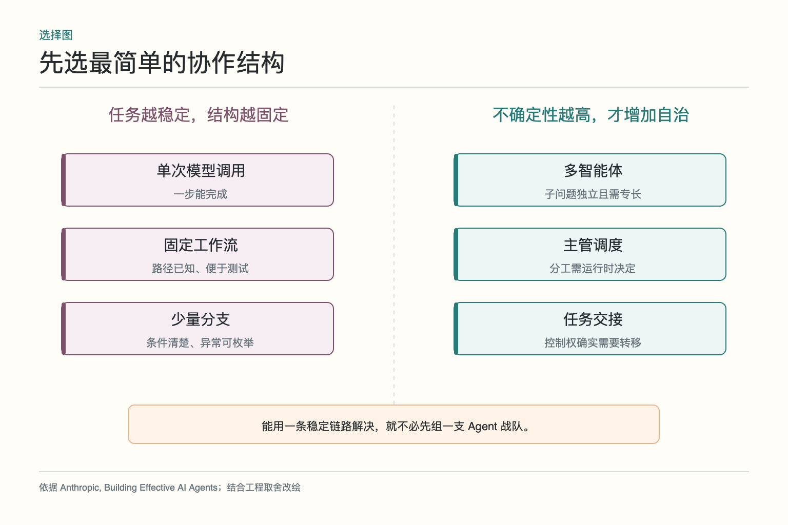
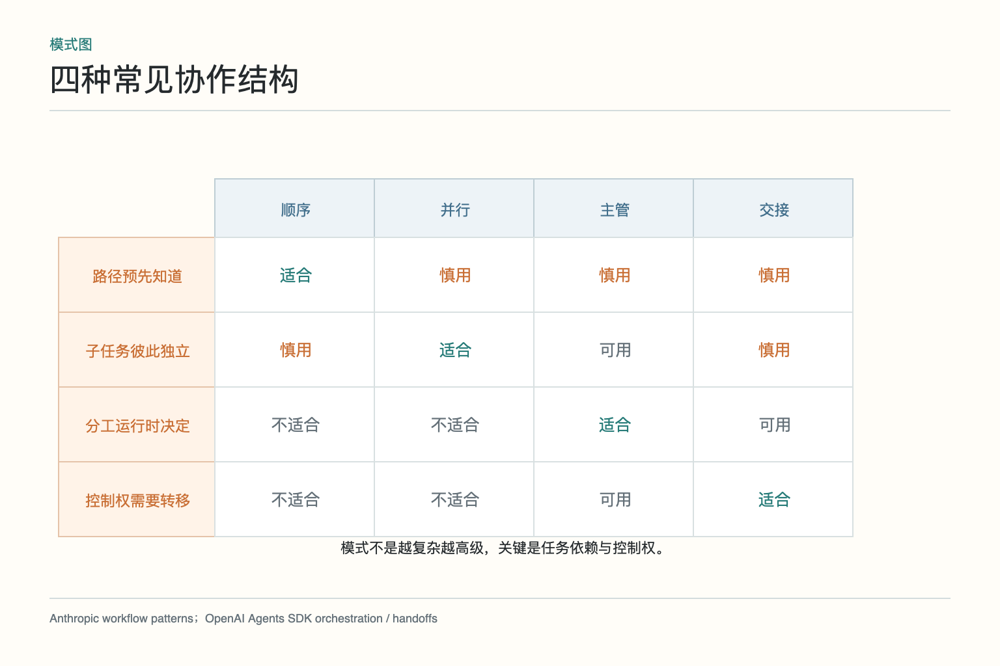
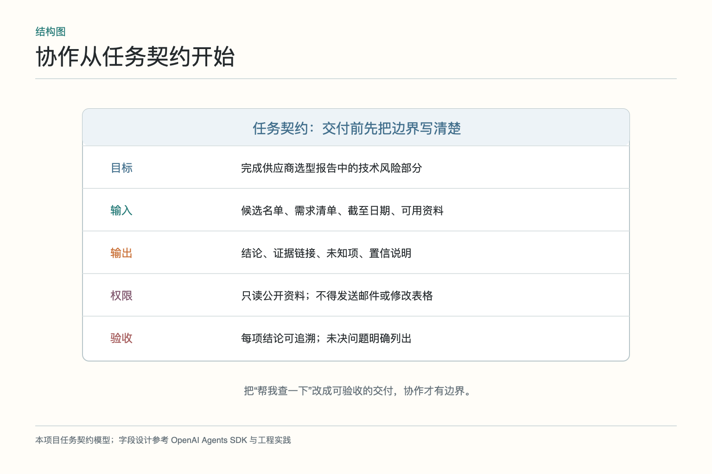
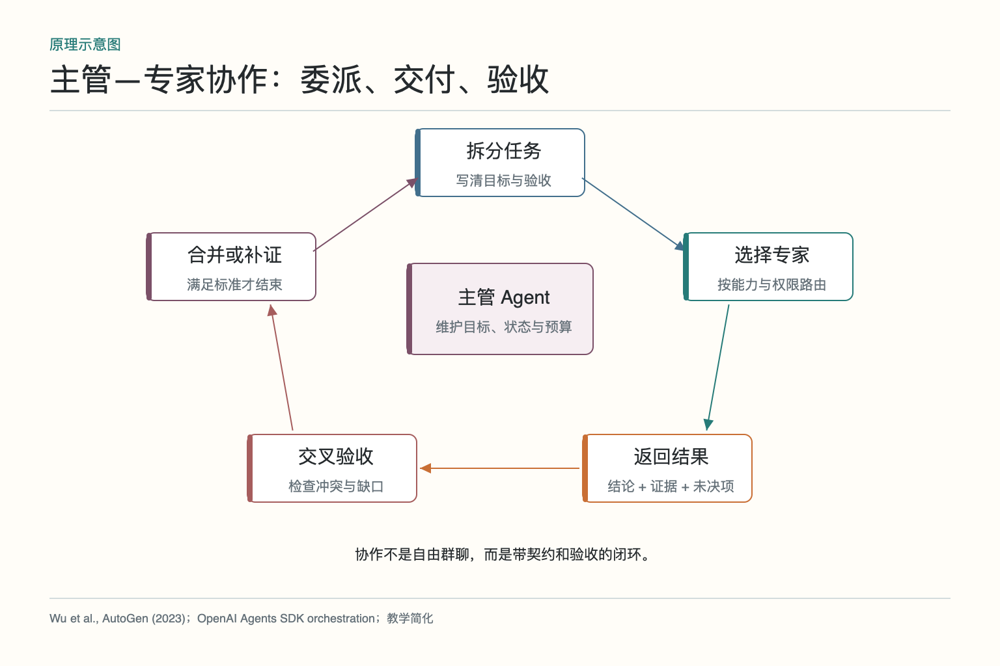
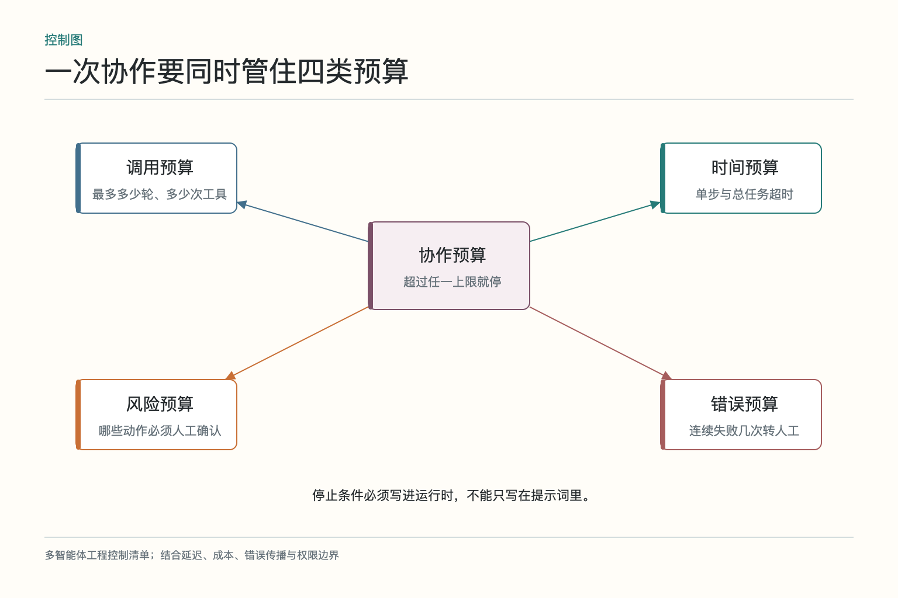

# 面试题：多智能体怎样分工而不变成群聊

面试官让你设计一套供应商选型 Agent：市场、技术、财务三路调研，最后给采购负责人一份有证据的建议。回答若只是“用三个 Agent 并行，再让一个 Supervisor 汇总”，只说出了角色数量，没有说明为什么要拆、怎样交付、错误如何拦截、何时停止。下面九道题沿用同一案例，把多智能体系统从漂亮架构图落到可运行的边界。

## 问题 1：什么时候多智能体值得用

**原理：**多智能体的收益主要来自独立分工、并行执行、上下文隔离、专业工具和相互验收；成本来自更多模型调用、通信、等待、状态同步和错误接口。子任务若高度耦合、无法单独验收，拆分通常只会增加协调成本。

**答题点：**先给单 Agent 基线，再列拆分条件：市场、技术、财务资料来源不同；需要不同权限；三路可并行；每路有明确交付格式；最终能按统一口径验收。若任务只是按固定评分表计算，优先固定工作流而非多 Agent。用成功率、事实错误、证据覆盖、时延和成本做对照，收益稳定才保留。

**记忆点：**先问“为什么不能一个做”，再问“拆开后如何验”。

**常见追问：**上下文太长是否足以使用多 Agent？可以是信号，但先尝试检索、压缩和分段；只有分段之间存在明确任务边界时，角色化才有价值。

**失分点：**把“模型更多”直接等同于“准确率更高”，不给基线，也不计算协调开销。

## 问题 2：五个子模块如何接成端到端链路

**原理：**工作流负责稳定步骤，状态图负责显式状态与恢复，多智能体负责独立分工，主管负责动态委派与验收，任务交接负责控制权转移。它们可以嵌套，而不是互相替代。

**答题点：**供应商选型先用工作流收需求和候选；将目标、资料版本和进度写入状态；主管生成三份任务契约并并行派发；专家交付结论、证据和未知项；主管统一口径并验收；高风险推荐暂停等待采购负责人；若进入合同谈判，再将会话交给法务 Agent。每个节点有输入、输出、失败出口和动作回执。

**记忆点：**工作流管路，状态图记路，多 Agent 分路，主管验路，Handoff 换司机。

**常见追问：**能否只用一个编排框架实现全部能力？可以，但概念边界仍要分清，否则恢复、路由和交接会混成一团。

**失分点：**只罗列名词，不说明控制权、状态和数据在链路中怎样移动。

## 问题 3：顺序、并行、主管和交接怎样选择

**原理：**选择取决于任务依赖和控制权。顺序用于后一步依赖前一步；并行用于相互独立；主管用于运行时决定分工；交接用于后续责任真正换人。

**答题点：**确认三年规模后再算价格是顺序；市场、技术、财务调研是并行；发现特殊许可后由主管临时增派法务是动态调度；客服识别到退款后把用户交给退款 Agent 是任务交接。实际系统可以混合：外层固定、内层自治、末端人工审批。

**记忆点：**看两件事：谁依赖谁，谁拥有下一步控制权。

**常见追问：**为什么不能把所有任务都并行？依赖未满足会让不同角色基于不同假设开工，还会浪费调用和产生难以合并的结果。

**失分点：**把 Handoff 当普通函数调用，或把 Supervisor 当消息转发器。

## 问题 4：任务契约应包含哪些字段

**原理：**自然语言分工若没有共同完成标准，上游以为“查完了”，下游却无法使用。任务契约把目标与验收从暗示变成结构化边界。

**答题点：**至少包含任务标识、目标、输入引用与版本、输出 schema、证据要求、权限、截止时间、调用预算、停止条件、失败原因和回传对象。供应商技术调研可要求覆盖备份、审计和可用区，每项带一手来源、日期和适用版本；未知项不得补写。

**记忆点：**目标、输入、输出、证据、权限、停止。

**常见追问：**契约是否等于一段更长的 Prompt？不等于。契约还应进入运行时校验、日志和验收器，关键字段不能只靠模型自觉遵守。

**失分点：**只写角色性格和背景，不写可检查交付物与越权边界。

## 问题 5：共享状态和证据怎样避免串线

**原理：**共享全部聊天会造成上下文污染、隐私扩散和来源丢失。协作需要的是可验证状态，不是所有角色的完整思考记录。

**答题点：**状态保存目标版本、任务分配、结构化交付、证据索引、未决问题、预算和动作回执；使用最小权限按角色读取；并行写入采用字段分区、追加事件或版本控制；每条事实附来源、读取时间、适用范围。专家之间通过产物接口交换信息，不直接覆盖彼此上下文。

**记忆点：**共享账本，不共享脑内草稿。

**常见追问：**两个 Agent 同时改同一对象怎么办？可以用乐观锁、版本号、事件追加后归并，或把合并权集中给主管；重点是冲突能被发现。

**失分点：**回答“放进向量库”就结束。向量检索解决相关性，不自动解决并发、一致性、权限和证据版本。

## 问题 6：如何阻断错误沿协作链放大

**原理：**上游的一个错误会被下游计算、改写和总结，最后变成更难察觉的完整结论。链路越长，接口验收越重要。

**答题点：**专家交付结论、证据、适用范围、置信与未知项；主管进行 schema 校验、来源可达性检查、关键数字复算和跨角色冲突检测；高风险事实使用确定性工具或人工确认；保留数据血缘，让最终结论能追溯到原始来源；未通过验收的产物不能进入下一步。

**记忆点：**错误要在接口处拦，不要等到最终文案再看。

**常见追问：**多 Agent 投票能否解决幻觉？只能缓解独立误差；若模型共享训练偏差或引用同一错误来源，多数票仍会一致地错。事实问题优先看证据。

**失分点：**让另一个模型“看看对不对”，却没有独立数据、规则或来源。

## 问题 7：怎样控制调用预算与停止条件

**原理：**模型无法可靠地只靠一句“别循环”约束自己。运行时必须维护硬预算，并判断每轮是否产生了可验收增量。

**答题点：**设置最大轮次、模型与工具调用数、token、单步和总超时、可用金额、同一任务重派次数；用任务指纹识别重复委派；连续若干轮没有新证据就停止；高风险动作进入人工审批；预算耗尽时返回已有结果、缺口和建议，而不是伪装完成。

**记忆点：**每一轮都要回答：新增了什么？还剩多少？为什么继续？

**常见追问：**停止后用户体验会不会差？清楚交付阶段性结果和缺失信息，比无限显示“正在处理”更可信。

**失分点：**只有 token 上限，没有时间、风险、失败次数和人工升级条件。

## 问题 8：如何设计单 Agent 基线和端到端评测

**原理：**没有同任务基线，就无法判断多 Agent 的提升来自协作、更多调用，还是更长等待。评测需同时看质量、效率、风险和可解释性。

**答题点：**准备正常、缺资料、来源冲突、版本过期、工具超时和越权诱导样本；在相同模型、工具权限和验收标准下跑单 Agent 与多 Agent；统计任务成功、事实准确、证据覆盖、遗漏、冲突发现率、人工介入、总时延和成本；按角色、接口和端到端三层分析失败。

**记忆点：**同一套题，同一把尺，同时算质量与代价。

**常见追问：**离线评测够吗？不够。上线后还要看真实分布、长尾失败、服务波动和用户纠正，但先有可重复的离线集才能回归。

**失分点：**只用一个成功案例展示“团队讨论很精彩”，没有对照和统计。

## 问题 9：依赖服务退化时怎样安全降级

**原理：**协作系统依赖更多模型、工具和存储，故障面也更大。降级目标不是维持角色数量，而是保住关键事实和不可逆动作的安全边界。

**答题点：**专家不可用时回退到单 Agent 或固定流程；状态存储异常时停止写操作，避免无回执执行；非关键调研超时可交付部分结果并标注缺口；关键数据缺失时转人工；主管失败时不让专家自行争夺控制权。降级过程保留同一任务标识、已有证据和错误原因，服务恢复后才能安全续跑。

**记忆点：**少做可以，乱做不行；缺结论可以，假完成不行。

**常见追问：**是否应该自动切到更便宜的小模型？可以处理低风险摘要，但路由变更也要经过评测，不能在关键判断上静默降级。

**失分点：**把重试当唯一容错方案，忽略重复副作用、状态丢失和外部系统已成功的情况。

回答多智能体系统设计题时，可以用一条主线收束：先证明拆分价值，再写任务契约；用状态承载事实和回执，用主管做验收；错误在接口拦截，循环由预算终止；最后拿单 Agent 基线证明收益。这样即使框架名称换了，设计依据仍然站得住。

## 现场回答怎样在五分钟内讲完整

可以先用三十秒定边界：“这不是先决定上多 Agent，而是先做单 Agent 基线。只有市场、技术、财务能独立交付，且确实需要不同工具或权限时才拆。”这句话先回答选型，而不是一上来报框架名。接着画出外层固定流程和三条并行分支，标出主管保留控制权、专家只返回结构化结果。

第二分钟讲任务契约与共享状态。用一张任务单举例：技术专家只核对指定版本，输出结论、来源、未知项和工具回执；状态保存需求版本、任务进度、证据索引和预算，不广播完整聊天。面试官若追问一致性，就补充分区写入、版本检查和主管归并。

最后两分钟讲失败与评测：证据不足时允许返回未知，冲突先统一口径再补证，连续两轮无新增信息就停止；高风险动作转人工。然后用同案例的单 Agent 做基线，比较事实准确、证据覆盖、时延和成本。这样的回答从“为什么拆”讲到“怎样证明拆得值”，闭环会比堆叠名词更清楚。

## 参考资料

- [Anthropic：Building Effective AI Agents](https://www.anthropic.com/engineering/building-effective-agents)
- [AutoGen: Enabling Next-Gen LLM Applications via Multi-Agent Conversation](https://arxiv.org/abs/2308.08155)
- [OpenAI Agents SDK：Agent orchestration](https://openai.github.io/openai-agents-python/multi_agent/)
- [OpenAI Agents SDK：Running agents](https://openai.github.io/openai-agents-python/running_agents/)
- [OpenAI Agents SDK：Human-in-the-loop](https://openai.github.io/openai-agents-python/human_in_the_loop/)

想看本文在 AI Agent 中的位置，可点击下方 [阅读原文](https://github.com/Jennifer123www/ai-agent-knowledge-map)，从“多智能体协作”继续阅读。
