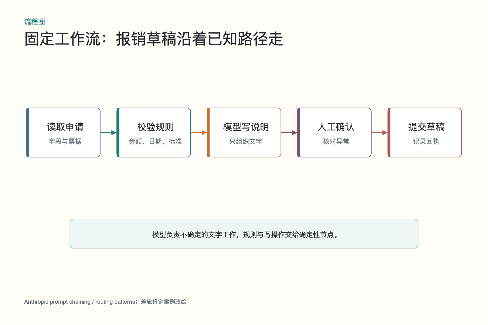
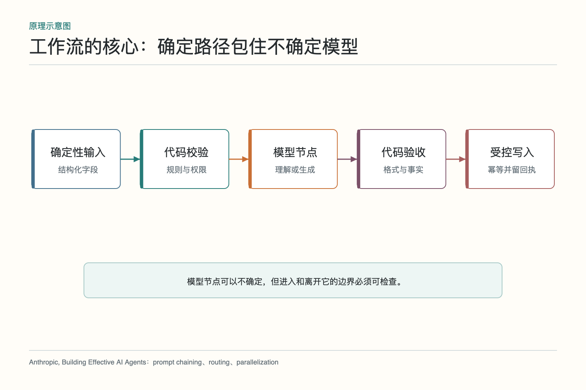
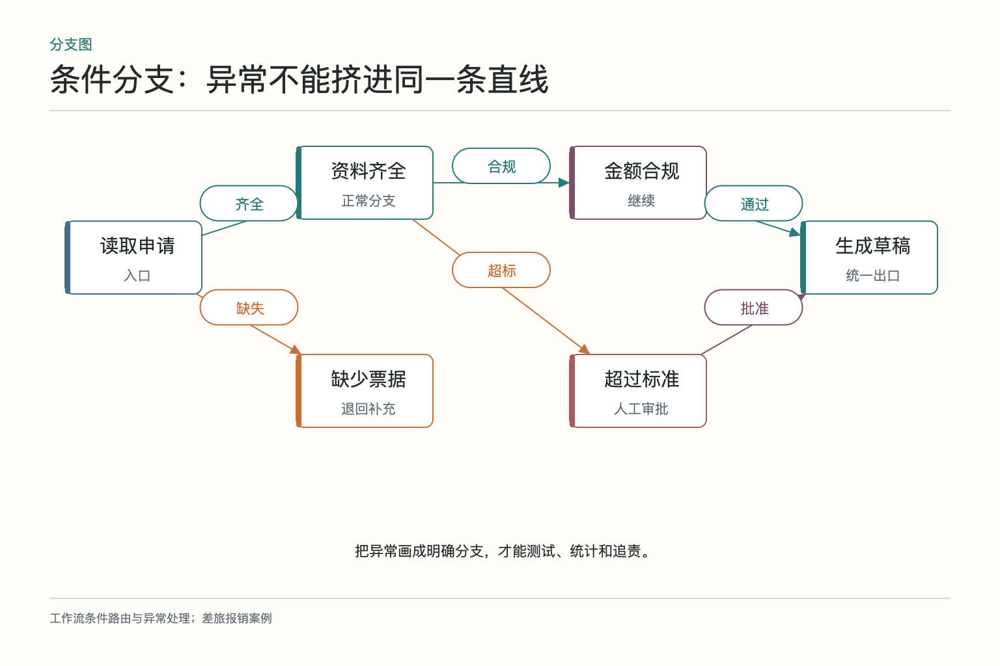
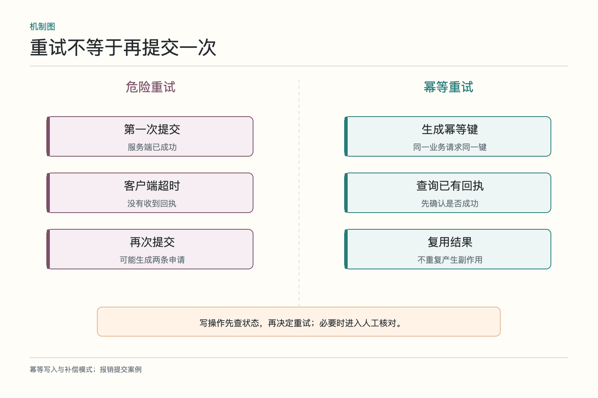
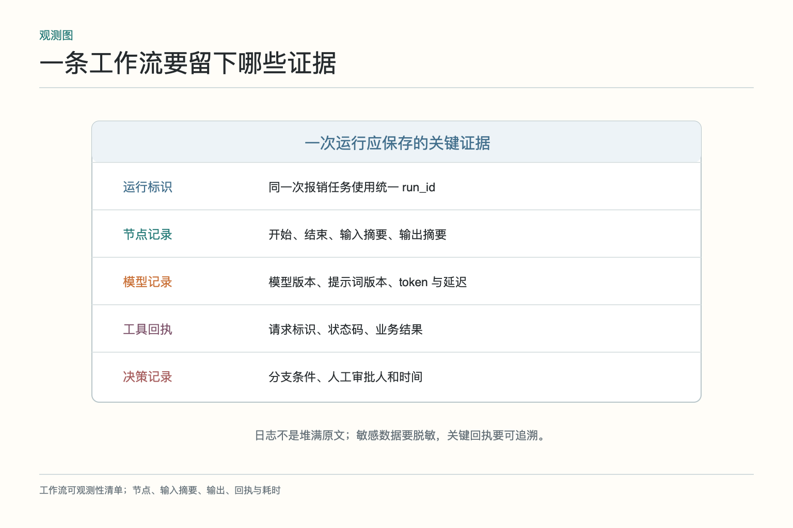

# 面试题：工作流怎样重试又不重复提交

面试官给出一个差旅报销场景：读取票据、校验制度、生成说明、人工确认，最后创建报销草稿。系统要能处理缺票据、超标准和接口超时，还不能因为重试生成两条申请。回答这类题，别只画一串方框；要说清模型和代码的边界、分支、状态、幂等与业务回执。

## 问题 1：工作流和 Agent 有什么差别

**原理：**工作流的执行路径主要由代码预先定义，Agent 则让模型在运行时决定下一步。两者不是二选一，常见做法是外层工作流约束关键路径，局部节点使用 Agent 处理不确定任务。

**答题点：**报销规则和写入顺序稳定，适合工作流；票据文字识别、备注理解和说明生成可交给模型。固定路径便于测试、审计和恢复；Agent 适合无法穷举的探索。优先使用满足需求的最低复杂度方案。

**记忆点：**工作流把路画好，Agent 决定临场怎么走。

**常见追问：**路径中有条件分支还算工作流吗？算。只要分支条件和允许路径由程序定义，就仍是工作流。

**失分点：**把任何调用大模型的系统都称为 Agent，忽略控制权究竟在代码还是模型。

## 问题 2：怎样划分模型节点与代码节点

**原理：**语言理解和开放式生成具有不确定性；金额、日期、格式、权限和业务状态适合确定性处理。边界应让模型输出可校验结构，再由代码决定是否进入下一步。

**答题点：**模型提取票据字段并标注不确定项、把员工备注归类、生成超标说明；代码做金额求和、日期比较、制度匹配、schema 校验、权限检查和接口调用。关键数字可由 OCR 与人工确认交叉核对，不能让模型既读数又验自己的数。

**记忆点：**语言交给模型，规则交给代码，副作用交给受控执行层。

**常见追问：**制度是一大段自然语言怎么办？可以先用模型抽取候选规则，但发布前由人确认并版本化，运行时使用已批准的结构化规则。

**失分点：**把模型输出的“校验通过”直接当业务事实。

## 问题 3：条件分支和异常分支怎样设计

**原理：**正常、资料不足、业务冲突和技术故障需要不同路径。分支条件应基于可观测字段，而不是“模型觉得差不多”。

**答题点：**票据齐全进入制度校验，缺失进入等待补充；金额合规生成草稿，超标进入人工审批；接口超时进入有限重试或查询状态；参数错误直接失败并修正；权限不足停止并提示。每条分支定义汇合点和终态，避免异常处理后误入旧路径。

**记忆点：**先分清错误是什么，再决定去哪儿。

**常见追问：**分支太多怎么办？将稳定的业务规则下沉为决策表或规则服务，把相关异常分组，但不要用一个“其他错误”吞掉全部语义。

**失分点：**所有异常都重试，或所有异常都交给模型重新解释。

## 问题 4：重试为什么可能重复扣款或提交

**原理：**超时表示调用方没有收到结果，不表示服务端没有执行。网络可能在服务端成功后丢失响应，盲目重试会产生第二次副作用。

**答题点：**为同一业务请求生成稳定幂等键；服务端按键去重并返回原结果；客户端重试前查询业务状态；保存请求标识和回执；只对临时错误退避重试；状态未知时暂停转人工。读操作通常容易重试，写操作需逐个评估。

**记忆点：**没收到成功，不等于没有成功。

**常见追问：**外部接口不支持幂等键怎么办？用业务唯一键查询、建立本地去重表或将写操作串行化；仍无法确认时不要自动重放。

**失分点：**只回答指数退避。退避减少压力，不能消除重复副作用。

## 问题 5：补偿与回滚有什么区别

**原理：**数据库事务可以回滚未提交更改，但跨系统动作往往已经生效，只能执行语义上的反向操作，这就是补偿。补偿本身也可能失败。

**答题点：**草稿创建后附件上传失败，可删除草稿，或保留并标注待补；已发送邮件只能发送更正；已付款需要退款流程。为每个写节点记录回执、查询接口、可否补偿、补偿动作和人工兜底。采用 Saga 一类思路时，也要说明顺序与最终一致性。

**记忆点：**回滚像没发生，补偿是发生后再处理。

**常见追问：**补偿失败怎么办？记录为需要人工处理的明确状态，停止后续危险动作，并提供原动作与补偿动作的全部回执。

**失分点：**声称跨系统可以像单库事务一样“一键回滚”。

## 问题 6：超时和取消怎样在链路中传递

**原理：**只有单节点超时，没有总任务截止时间，会让后续节点在用户已经取消后继续运行。取消也不能抹掉已经发生的外部动作。

**答题点：**设置单步超时、总 deadline 和取消令牌；下游调用继承剩余时间；收到取消后不再启动新节点；正在执行的工具若支持取消则终止，不支持则等待回执并更新状态；对已完成写操作执行必要补偿。返回“取消到哪一步”而不是笼统说已取消。

**记忆点：**取消的是未来动作，已经发生的动作仍要对账。

**常见追问：**模型生成中断需要保存半成品吗？通常不把不完整输出当正式产物；可保存诊断日志，但恢复时从节点输入重新生成。

**失分点：**用户关掉页面就当任务停止，后台却继续提交。

## 问题 7：怎样记录一次完整执行

**原理：**可观测性要连接技术调用和业务结果。只有模型日志，无法证明草稿是否真实创建；只有最终申请号，又无法解释为何通过。

**答题点：**统一 run_id，记录节点状态、输入输出摘要、模型与提示词版本、规则版本、分支理由、重试次数、耗时、工具请求标识、业务回执和人工审批。敏感字段脱敏，原件放受控存储并在日志中保留引用。Trace（链路追踪）应能从最终草稿追到票据和制度条款。

**记忆点：**模型说成功不是成功，业务系统回执才是。

**常见追问：**是否保存完整 Prompt？按合规要求决定；至少保存模板版本和必要摘要，涉及个人信息时需脱敏与访问控制。

**失分点：**只记录报错堆栈，没有分支原因、业务标识和外部回执。

## 问题 8：流程版本怎样灰度和回退

**原理：**运行中的任务依赖旧节点和旧状态结构，直接替换流程可能让恢复时找不到节点，或用新规则解释旧数据。

**答题点：**流程定义、规则、提示词和状态 schema 分别版本化；新任务按灰度策略进入新版本，旧任务继续旧版本或经过显式迁移；记录版本到每次运行；设影子执行或小流量对照；异常指标上升时停止分流并回退。写操作的回退还要避免两个版本重复提交。

**记忆点：**发布新图容易，安置图上正在跑的任务更难。

**常见追问：**旧流程存在严重风险怎么办？暂停旧任务，迁移前人工确认状态与副作用，不应为了兼容让危险路径继续。

**失分点：**只说用 Git 管版本，不谈运行中实例和状态迁移。

## 问题 9：怎样构造工作流测试集

**原理：**测试不能只覆盖正常路径，还要验证分支、故障恢复和副作用安全。工作流的价值正是在异常时仍可预测。

**答题点：**准备正常、缺票据、金额超标、规则缺失、识别低置信、工具超时、写入成功但回执丢失、附件失败、人工拒绝等案例；断言节点顺序、分支条件、调用次数、最终状态和业务回执；在关键位置注入中断并恢复，检查是否重复创建草稿；用真实历史样本做回归但去除敏感信息。

**记忆点：**测路径，也测中断；测答案，也测副作用。

**常见追问：**模型输出不完全确定，断言怎么写？断言结构、必须事实、禁止事实、引用和行为边界；文案可用语义评测与抽样人工复核，不必逐字相同。

**失分点：**只验证 HTTP 200 或最终文本存在，没有检查错误分支和重复写入。

这类面试题的主线可以归结为：用工作流控制路径，用代码守住规则，用模型处理语言；每个写操作要有幂等与回执，每个异常要有明确出口，每次发布要照顾正在运行的状态。说清这些，比在白板上多画几个方框更有分量。

## 现场设计题怎样落到一张白板

先画五个节点：读取申请、解析票据、规则校验、生成草稿、人工确认。再把缺票据、超标准和接口超时三条异常分支补上，分别落到补资料、人工审批和查询状态。此时主动说明：金额与权限由代码判断，模型只负责票据理解和文字生成。面试官能立刻看到你把确定性与不确定性分开了。

随后在“创建草稿”旁标出幂等键、业务申请号和查询接口。假设服务端成功但客户端超时，恢复过程先按幂等键查询，不直接再提交；若状态不明则暂停。再给每个节点补上 run_id、开始结束时间、规则版本和回执，说明可观测性怎样支持排查。

最后补一个发布与测试框：正常、缺票据、超标、回执丢失、附件失败五类案例；新版本只接新任务，运行中的旧任务绑定旧图或显式迁移。这样一张图同时覆盖路径、错误、副作用、日志和版本，比单独背“重试三次、指数退避”更接近真实系统。

若还有时间，再说明取消语义：用户取消后不再启动新节点，但已经提交的草稿要查询并标记，必要时走补偿。这个细节能把“流程停止”和“业务没有发生”区分开，也能自然引出为什么总 deadline、取消令牌和业务回执必须同时存在。

一句话收尾：工作流可靠性不来自“永不失败”，而来自每类失败都有确定状态、可查回执和可执行出口。

## 参考资料

- [Anthropic：Building Effective AI Agents](https://www.anthropic.com/engineering/building-effective-agents)
- [OpenAI Agents SDK：Running agents](https://openai.github.io/openai-agents-python/running_agents/)
- [OpenAI Agents SDK：Human-in-the-loop](https://openai.github.io/openai-agents-python/human_in_the_loop/)

想看本文在 AI Agent 中的位置，可点击下方 [阅读原文](https://github.com/Jennifer123www/ai-agent-knowledge-map)，从“多智能体协作”的“工作流”继续阅读。
