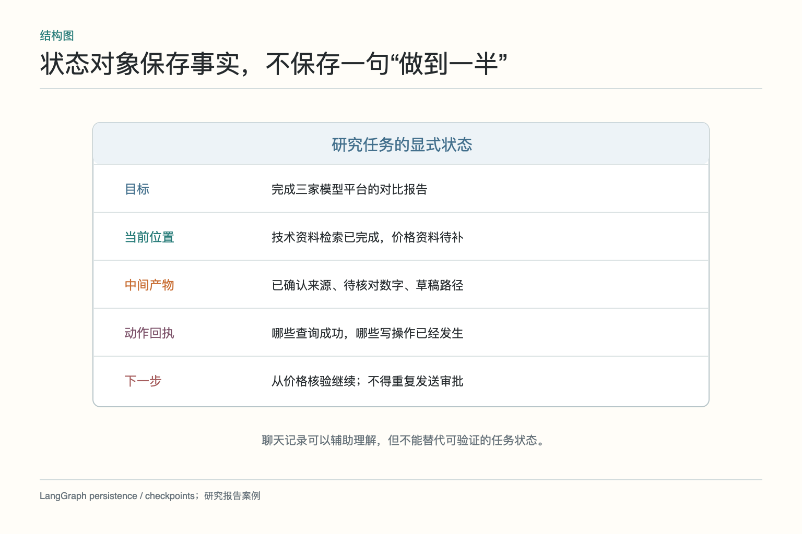
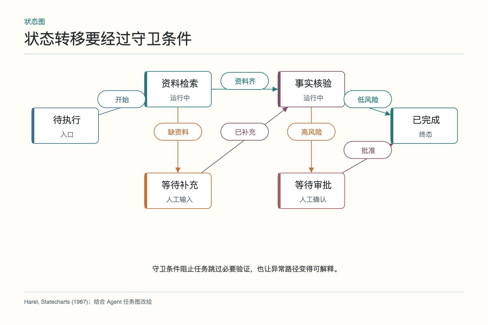
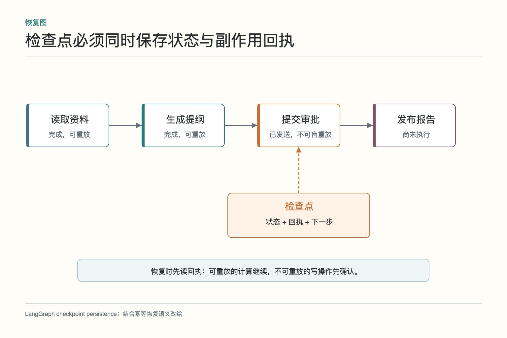
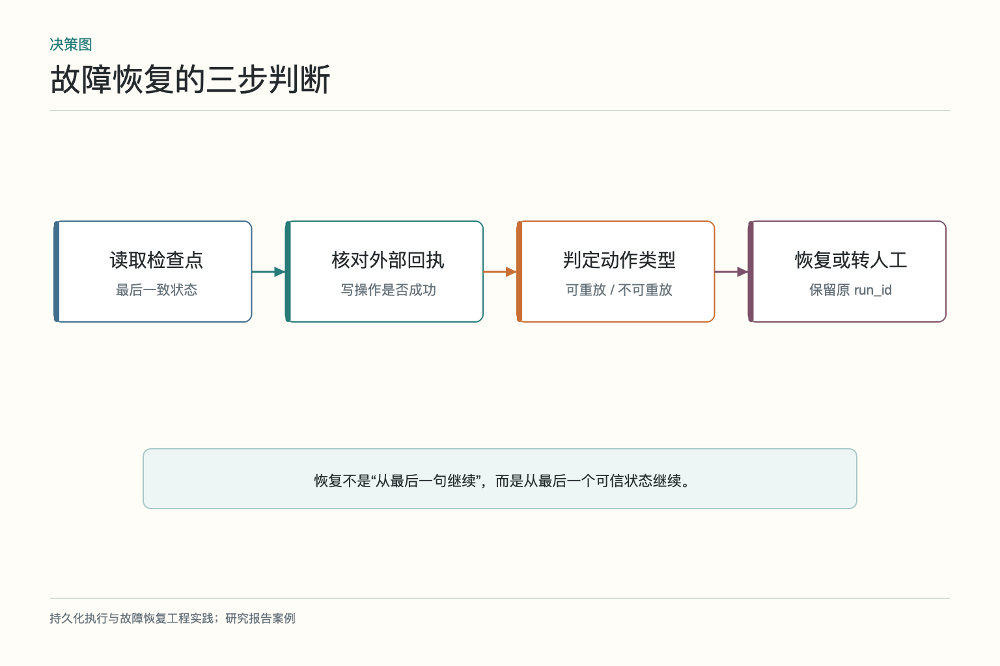
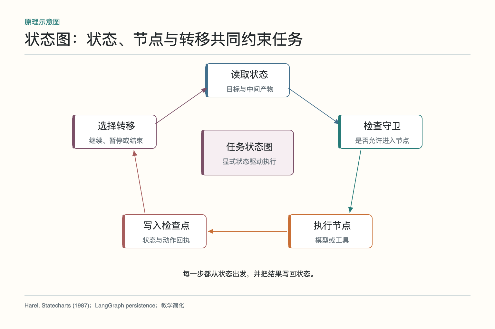

# 大话状态与任务图：做到一半怎样接着跑

小乔让研究助手比较三家模型平台，要求核对功能、价格和数据政策，先写草稿，不发给任何人。助手已经查完两家功能资料，价格页刚打开，电脑突然重启。第二天它若只看到一句“正在研究”，既不知道哪些资料已经确认，也不知道有没有向外部系统写过东西。把昨天的聊天全文塞回模型，也许能猜出进度，却不能保证从正确位置继续。

长任务要可靠恢复，需要显式状态和任务图。状态记录当前事实、产物和回执；节点表示下一段可执行工作；转移条件决定何时继续、暂停或结束；检查点把一致状态保存下来。它们解决的不是“模型记性不好”这么简单，而是让系统在中断、并行和人工介入时仍能说清自己做过什么。

## 一、为什么不能只靠聊天历史续上

聊天记录是按时间排列的对话，里面混着用户要求、模型解释、工具结果、改口和无效尝试。它适合帮助理解语境，却不天然表示任务的真实状态。模型说“价格已核对”可能只是计划，也可能引用了过期页面；工具返回成功后，下一句聊天甚至可能因为断线没有保存。

恢复需要的是结构化事实：目标版本、当前节点、已完成任务、来源、未决问题、剩余预算、外部动作回执和下一步候选。系统应能直接判断“功能资料已核验，价格只读到 A 厂商，邮件从未发送”，而不是让模型从几千行对话中重新推理。

聊天也会越来越长。每次恢复都重放全文，不仅昂贵，还可能把早期错误和无关讨论重新带入上下文。可以保留聊天作为审计资料，但任务控制要建立在显式状态上。两者关系像会议录音与项目看板：录音能查细节，看板决定今天从哪项工作继续。

## 二、状态对象应保存哪些事实

状态对象不必成为包罗万象的垃圾桶。以研究报告为例，至少包括任务标识、用户目标、资料截止日期、候选平台、每个子任务状态、已确认来源、结构化发现、待核数字、人工决定、工具回执和预算。大文件可放对象存储，状态只保存受控引用和摘要。

字段要区分事实、推断和计划。“A 平台价格页显示每百万 token 多少钱”是带来源的事实；“A 可能更便宜”是基于规模假设的推断；“下一步核对企业折扣”是计划。三者若都写进一段 summary，恢复时很容易把计划当成已经完成。

状态还要有版本和更新时间。用户把比较范围从公开版改成企业版，旧的功能与价格结论可能失效；系统应标记受影响字段，而不是把新要求附在聊天末尾。状态设计的目标不是一开始就完美，而是让变化可定位、可迁移、可清理。

## 三、节点和转移条件怎样限制下一步

任务图可以有“收集需求、检索资料、核验事实、撰写草稿、人工确认、完成”等节点。转移不是模型想去哪就去哪，而要满足守卫条件。例如资料来源不足时从检索进入等待补充；关键数字齐全后才能进入事实核验；高风险结论必须经过人工确认才能完成。

守卫条件最好由状态字段和确定性规则判断。像“至少两条独立来源”“价格页发布日期不早于截止日期”“草稿中没有未标记占位符”，都可以检查。模型可提出下一节点，但运行时验证是否合法；这样既保留一定动态性，又不允许跳过关键关卡。

任务图还应有终态和暂停态。完成、取消、失败、等待用户、等待审批并不是同一件事。暂停意味着状态可继续，失败意味着需要修复或人工处理，完成意味着验收条件成立。若所有停止都写成“结束”，恢复和统计都会失去意义。

## 四、检查点保存的不是一句进度口号

检查点是某一时刻可恢复的一致快照。它至少包含状态版本、已完成节点、节点输出引用、外部动作回执和下一节点。保存时机通常在一个节点成功并完成必要写入之后，或在需要人工暂停之前。只写“进度 60%”没有恢复价值。

检查点与数据库事务不是一回事。模型调用、浏览器和第三方 API 往往跨越多个系统，无法用一个本地事务全部包住。正确做法是记录每一步的业务标识和回执，恢复时核对外部真实状态。若价格查询只是读操作，可以安全重做；若已发送审批，就必须先确认审批单是否存在。

检查点也不必每个 token 保存一次。保存太频繁会增加存储和锁竞争，太稀疏又会丢掉大量已完成工作。通常按可独立验收的节点、昂贵工具完成后、写操作回执到达后和人工中断前保存。

## 五、并行分支怎样合并而不互相覆盖

功能、价格和数据政策可以并行研究。三条分支不应同时修改同一段长文本，而应写入各自命名空间，例如 findings.features、findings.pricing、findings.policy。汇合节点等待必需分支完成，再生成统一报告。可选分支超时，可以带明确缺口继续。

并行分支还可能更新共同字段，如“平台版本”。可以使用版本号和条件写入：分支基于版本 5 读取，提交时若状态已到版本 6，就触发合并或重新核对；也可以将更新记录为事件，由汇合节点按规则归并。最后写入者覆盖前一位，虽然省事，却会悄悄丢数据。

合并需要处理冲突。价格分支认为比较对象是企业版，功能分支用的是公开版，不能简单拼接。汇合节点应检查关键维度是否一致，不一致就回到澄清或补证。并行只是节省等待，不会自动让结果兼容。

## 六、重放时哪些步骤能做，哪些不能重做

纯计算、格式转换和只读检索通常可重放，但仍要考虑资料是否更新和调用成本。创建审批、发送邮件、扣款、删除文件等有副作用的动作不能因为本地没看到结果就再次执行。恢复时先读检查点，再查外部回执，判断动作是否已经发生。

每个节点可以声明重放策略：安全重放、按幂等键重放、查询后决定、禁止自动重放。研究报告里的网页读取可重做；保存草稿可用稳定文档标识覆盖；发送给采购负责人则应禁止自动重放，因为用户本来就没授权发送。

“恰好执行一次”在跨系统里很难凭一句承诺实现，更实际的目标是至少一次调用配合幂等、或至多一次调用配合人工确认。设计者要讲清允许重复什么、不允许重复什么，以及状态不明时怎样停下。

## 七、人工暂停怎样从同一状态恢复

研究助手发现两家价格口径不同，需要小乔确认按标价还是按合同报价比较。系统应保存当前状态，生成一条具体问题，进入等待用户；小乔回答后，把决定写入状态，再从价格核验节点继续。不是重新创建一个“新对话”，也不是让模型回忆昨天聊过什么。

人工输入要带作用域。小乔说“按合同价”，应关联这次任务和价格比较字段，不能成为所有未来任务的永久规则。审批还要记录审批人、时间、原提议、修改内容和结果。恢复节点先验证决定仍适用于当前状态，若资料在等待期间已变更，需要重新核对。

暂停期间也可能过期。价格页面、登录令牌、临时文件和库存都可能变化。状态中应保存有效期或重新验证标记；恢复不是无条件从下一行继续，而是先检查哪些事实仍然可靠。

## 八、状态过期、迁移和清理怎样处理

任务图会升级，字段也会变化。新版把 source_url 拆成 source_id、retrieved_at 和 version，旧检查点若直接交给新代码，可能缺少守卫条件需要的字段。流程定义和状态 schema 都要带版本；旧任务可以继续旧版本，或经过显式迁移并留下记录。

迁移不是简单补默认值。若旧状态没有保存价格适用版本，就不能填一个“未知”后让任务自动完成，应回到核验节点。对无法安全迁移的写操作任务，宁可人工接管，也不要让新流程误判旧回执。

完成或取消后的状态要按合规要求保留与清理。中间网页缓存、临时截图和模型日志可能含敏感信息，不应永远保存；审计需要的回执、来源和审批记录则按策略留存。状态持久化不是“越多越保险”，还要控制访问、生命周期和删除。

## 九、怎样用故障注入验收恢复能力

准备同一研究任务，在检索前、检索后未保存、检查点写入后、外部草稿保存成功但回执丢失、等待人工和并行分支合并时分别中断。恢复后检查：已完成的昂贵步骤是否复用，写操作是否重复，缺口是否保留，任务标识是否一致，最终报告是否仍能追溯来源。

*图参考 [Statecharts](https://www.sciencedirect.com/science/article/pii/0167642387900359) 对状态与转移的表达，并结合 LangGraph 的持久化机制改绘。这里是面向 Agent 任务的教学简化，不代表某个框架的内部实现。*

还要测试并发：两个分支同时更新状态、用户在 Agent 运行时修改目标、同一任务被重复唤醒。正确系统应发现版本冲突，选择合并、重试或转人工；不应静默覆盖。测试时不仅看最终文本，还要检查经过的节点、状态版本和外部回执。

状态与任务图的价值，在平稳运行时不太显眼；一旦中断、等待或故障发生，它让系统知道自己在哪、哪些事实可信、哪些动作已经发生、下一步为何允许执行。能从可信状态继续，比让模型“凭感觉接着聊”可靠得多。

还有一个容易遗漏的细节：恢复页面应把“上次可靠检查点”和“恢复前重新核对项”直接展示给人。这样人工接管时能快速分辨哪些工作已经落盘，哪些只是模型口头计划，也能避免为了求稳把整份研究从头再做一遍。

## 参考资料

- [Harel：Statecharts: A Visual Formalism for Complex Systems](https://www.sciencedirect.com/science/article/pii/0167642387900359)
- [LangGraph：Checkpointing reference](https://langchain-ai.github.io/langgraph/reference/checkpoints/)
- [LangGraph：Persistence with Postgres](https://langchain-ai.github.io/langgraphjs/how-tos/persistence-postgres/)
- [OpenAI Agents SDK：Human-in-the-loop](https://openai.github.io/openai-agents-python/human_in_the_loop/)

想看本文在 AI Agent 中的位置，可点击下方 [阅读原文](https://github.com/Jennifer123www/ai-agent-knowledge-map)，从“多智能体协作”的“状态与任务图”继续阅读。
