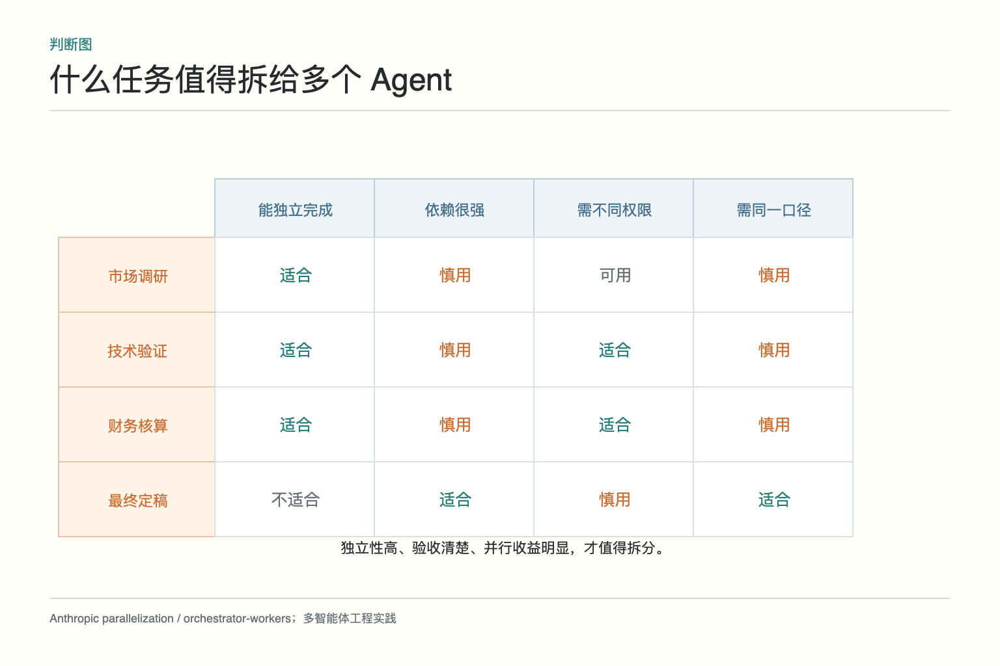
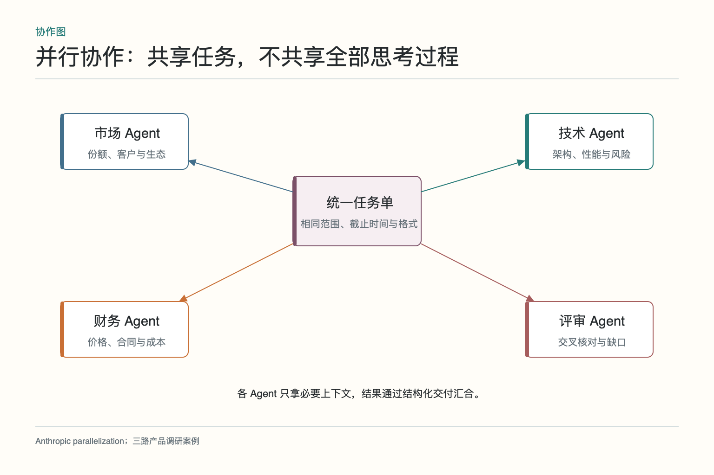
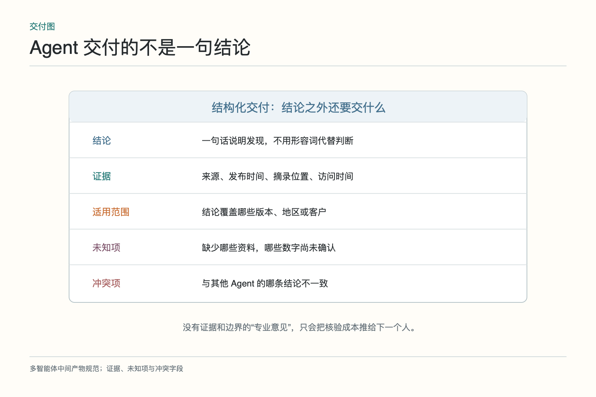
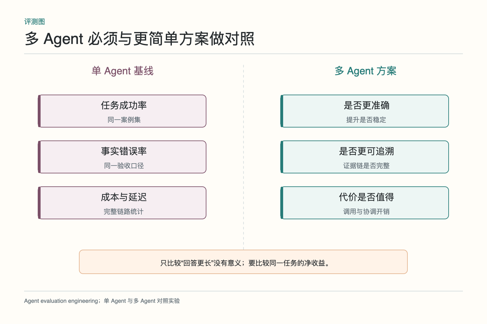
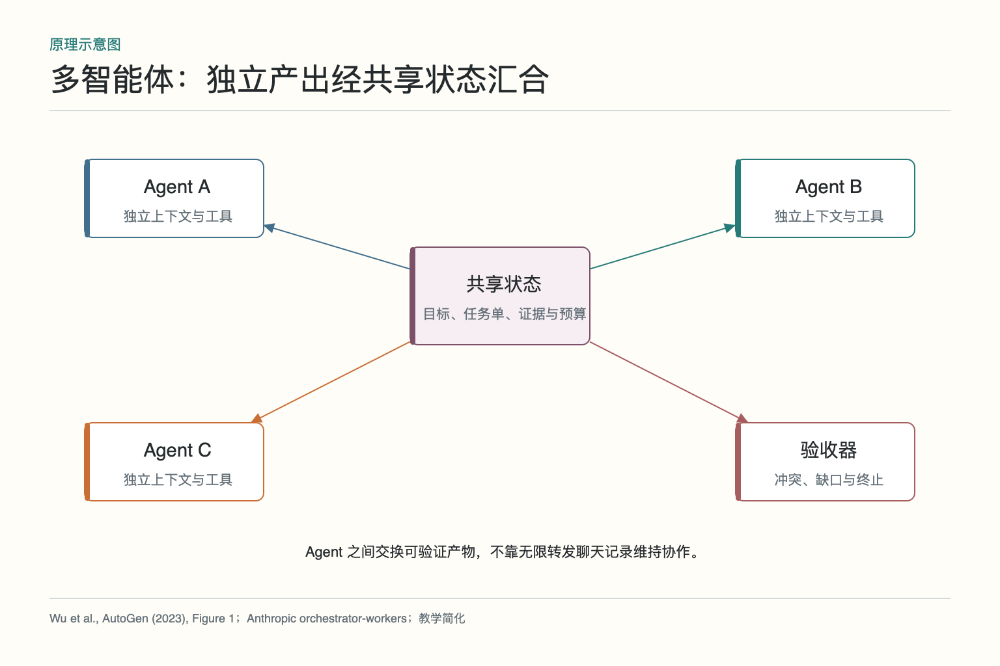

# 大话多智能体：三个人一起做就一定更好吗

产品经理让助手调研三款客服系统，比较功能、接入难度、价格和客户评价。最直观的做法是开三个 Agent，每人研究一家；也有人想按专业分工，一个看产品，一个看技术，一个算成本。角色一多，页面上会出现很忙碌的消息流，可最后报告仍可能把不同版本、不同地区和不同计费周期混在一起。

多智能体不是把会议室里的“人多力量大”原样搬进软件。每个 Agent 都有自己的上下文、工具调用和出错机会。它的价值来自可独立分工、并行、权限隔离和交叉验收；它的代价是通信、等待、合并、冲突与额外成本。能否把任务拆成清楚的接口，往往比起几个响亮角色名更重要。

## 一、三名专家同时开工为什么未必更快

如果三名专家都要先等同一份需求清单，提早并行只会让他们基于不同假设开工。一个把“客服系统”理解为国内版，一个用海外版价格，另一个默认坐席数是一百。三份报告同时完成，合并时却得从头统一口径，表面节省的时间全花在返工上。

并行还有尾部等待。市场 Agent 两分钟完成，技术 Agent 因试用环境排队二十分钟，最终报告仍要等最慢分支。若慢分支不是必需，可以在截止时间后带缺口交付；若是关键项，就要优化该分支，而不是再增加更多 Agent。

通信同样有成本。每次把长聊天转给下一个角色，都要重新占用上下文，还可能传播无关信息。协作应交换结构化产物和证据，而不是让所有 Agent 读完整群聊。真正的加速来自独立工作可以同时做，不是界面里同时闪动几个头像。

## 二、什么样的子任务适合独立分工

合适的子任务通常有四个特点：输入边界清楚，产物可单独验收，与其他任务依赖少，完成所需工具或权限有差异。比如产品功能表、API 接入试验、三年成本测算可以分别进行，最后按统一产品版本和坐席规模汇合。

不合适的拆法是把同一推理过程硬切成很多角色，例如一个 Agent 只写第一段、另一个接着写第二段；上下文依赖太强，交接开销大。也不要为了角色对称强行把任务均分。某些产品资料丰富，一人即可完成；某家需要登录试用和技术验证，可以单独投入更多预算。

按产品拆还是按专业拆，要看最终比较方式。若每家资料来源完全不同，按产品拆更顺；若技术验证需要统一环境与指标，按专业拆更容易保持口径。拆分策略不是固定模板，应服务于独立性与验收。

## 三、并行、顺序和评审结构怎样选择

三家产品的公开资料可以并行查；接入难度评估要先完成统一测试脚本，再分别试验；成本测算要等坐席规模和计费项确认；最终推荐要等关键分支完成。这是一张有并行也有顺序的依赖图，而不是所有人同时自由对话。

评审结构适合高风险结果：研究 Agent 提交证据，评审 Agent 按清单检查版本、日期和遗漏，必要时退回补证。评审者应有独立标准或额外证据，而不是简单把原答案改写一遍。否则只是多一次模型调用，看起来有复核，实质仍同源。

若运行前就能确定所有步骤，工作流通常比自由协作更稳；若子任务要根据发现动态增加，可以由主管调度。多 Agent 描述的是多个执行主体，不代表它们必须像群聊一样互相发消息。

## 四、每个 Agent 应拿到多少上下文

每个角色只拿完成任务所需的信息：共同需求、产品版本、时间范围、输出格式、可用工具和权限。技术 Agent 不需要客户评价原文，市场 Agent 不需要测试环境密钥，财务 Agent 不应看到无关的个人数据。最小上下文既减少干扰，也缩小泄露面。

共享事实通过版本化任务单和状态引用提供。需求变更后，不是把新消息再转发一遍，而是更新任务版本，并标记哪些正在运行的分支需要作废或重做。每个交付写明基于哪个版本，合并时才能发现过期结果。

不要把隐藏思考当协作材料。下游需要的是结论、证据、计算假设、未知项和必要的理由摘要。传递一大段未整理的推理草稿，既占上下文，也让下游难以分辨事实与猜测。

## 五、中间产物怎样带证据与未决项

一份合格交付不能只有“产品 A 接入方便”。它应说明适用版本、测试环境、使用的 SDK、完成了哪些步骤、失败在哪里，并附文档或运行回执。价格结论要带币种、税费、坐席数、计费周期和来源日期；客户评价要说明样本来源，不能用几条评论代表全部用户。

未知项也要进入产物。厂商没有公开并发限制，就写“未确认，需要销售或压测补充”，不要用同类产品常见值代替。冲突项同样明示：官网定价与合同报价不同，不能悄悄选一个更好看的数字。

结构化产物便于程序先做基础校验：必填字段是否存在、证据链接是否可达、版本是否一致、金额是否能复算。自然语言仍用于说明，但不再承担全部状态和接口职责。

## 六、两个结论冲突时怎样处理

市场 Agent 说产品 A 适合大型企业，技术 Agent 却发现审计功能只在最高套餐开放。两者不一定谁错，可能是评价范围不同。先核对概念、版本、地区、时间和数据来源，再要求双方补充证据。若冲突无法消除，在报告中保留分歧与影响。

多数票不是万能办法。三个 Agent 可能都引用同一篇错误转载，也可能共享相似训练偏差。事实问题应回到一手资料和可重复试验；价值判断可以列出不同权重下的结果，再交给决策者。把“意见最多”当“事实最真”，只是让错误穿上民主外套。

冲突处理还要有预算。低影响表述不一致可以由汇总者统一，高影响价格和合规结论需要补证或人工确认。不要让 Agent 为一个不影响推荐的词语来回辩论十轮。

## 七、权限、预算和停止条件怎样限制

不同 Agent 使用不同工具和凭据。公开资料 Agent 只能浏览网页；技术 Agent 可访问隔离试用环境；财务 Agent 只读报价；任何角色都不能自动联系厂商或提交采购申请。权限跟任务绑定，而不是因为角色名叫“专家”就获得所有能力。

预算包括每个分支的模型调用、工具次数、时间和失败次数。重复搜索同一关键词、没有新增证据、连续工具失败，应触发停止或换策略。总任务还有截止时间：非关键分支超时可标明缺口交付，关键分支超时则暂停推荐。

停止条件要具体，例如“每个关键比较项至少有一条一手来源，三家价格都按同一规模复算，所有高风险未知项已经人工确认”。“大家都觉得差不多”不是可执行条件。

## 八、如何比较单 Agent 与多 Agent

准备相同的产品清单、需求和工具权限，让单 Agent 与多 Agent 分别完成。比较事实准确率、关键项覆盖、证据完整、冲突发现、总成本、总延迟、人工修改和失败恢复。多 Agent 使用更多调用，若只比最终文字丰富度，会天然占便宜；要看净收益。

还要观察方差。某次多 Agent 表现很好，不代表稳定；不同运行中路由、搜索结果和合并可能变化。对案例集重复运行，记录最差情况和长尾故障。高风险场景尤其要看错误是否更容易被发现，而不是平均分提高一点。

评测应按阶段定位失败：任务拆错、某专家产物不合格、共享状态被覆盖、冲突未处理，还是最终汇总失真。这样才能决定修契约、修工具还是取消多 Agent，而不是一律换大模型。

## 九、什么时候应退回更简单的方案

如果任务量很小、依赖紧密、没有独立工具、产物无法分别验收，多 Agent 往往不值。若评测显示单 Agent 已达到要求，固定工作流更快更稳；若某个角色行为已经稳定，可把它固化成普通节点，减少模型调用。

多 Agent 也可能只在高峰或复杂样本启用。普通产品对比走单 Agent，发现资料冲突、需要试验或权限隔离时再升级。架构能够降级，比永远维持“豪华团队”更实用。

*图依据 [AutoGen](https://arxiv.org/abs/2308.08155) 对多 Agent 可组合对话的描述，以及 Anthropic 的 orchestrator-workers 模式改绘。工程重点放在共享状态、产物接口和验收，不等同于让角色无限互聊。*

判断标准很朴素：拆开后是否更容易做好、验证和控制。如果答案只是“看起来更像一个团队”，那就先别组队。三个人一起做可以更好，也可以只是三倍账单加一次漫长会议。

## 十、从一个 Agent 演进到三个 Agent

实际落地不要直接搭完整团队。第一阶段让单 Agent 完成三款产品对比，记录它最常漏掉的字段和最耗时的步骤；第二阶段把稳定计算交给代码，把独立且昂贵的技术试验拆成单独任务；第三阶段只有在市场、技术和财务确实可以并行、且每份结果都有验收标准时，才启用三路协作。

上线时保留一部分任务走单 Agent，作为持续基线。若多 Agent 在资料冲突样本上更好、普通样本却更慢，就只对复杂样本启用；若某个专家长期没有带来增量，就取消这个角色或固化为普通工具。多 Agent 架构也需要做减法，角色不是一旦加入就必须永久留编。

团队边界还要随业务变化重新评估。某家厂商开放了标准价格 API，原来的财务搜索 Agent 可能被确定性计算取代；新增合规地区后，反而需要独立权限和人工审核。协作结构服务于任务，不服务于一张永远不变的组织图。

保留一张角色清单也很有用：每个角色为何存在、使用什么工具、产出什么、最近一次带来多少质量提升。如果说不清某个 Agent 比一个普通函数多解决了什么问题，就应该考虑合并或删除它。

## 参考资料

- [AutoGen: Enabling Next-Gen LLM Applications via Multi-Agent Conversation](https://arxiv.org/abs/2308.08155)
- [Microsoft Research：AutoGen paper PDF](https://www.microsoft.com/en-us/research/wp-content/uploads/2023/08/LLM_agent.pdf)
- [Anthropic：Building Effective AI Agents](https://www.anthropic.com/engineering/building-effective-agents)
- [OpenAI Agents SDK：Agent orchestration](https://openai.github.io/openai-agents-python/multi_agent/)

想看本文在 AI Agent 中的位置，可点击下方 [阅读原文](https://github.com/Jennifer123www/ai-agent-knowledge-map)，从“多智能体协作”的“多智能体协作”继续阅读。
