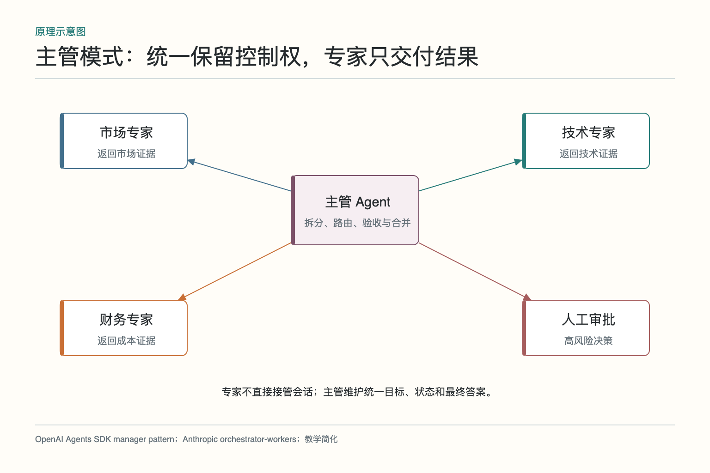
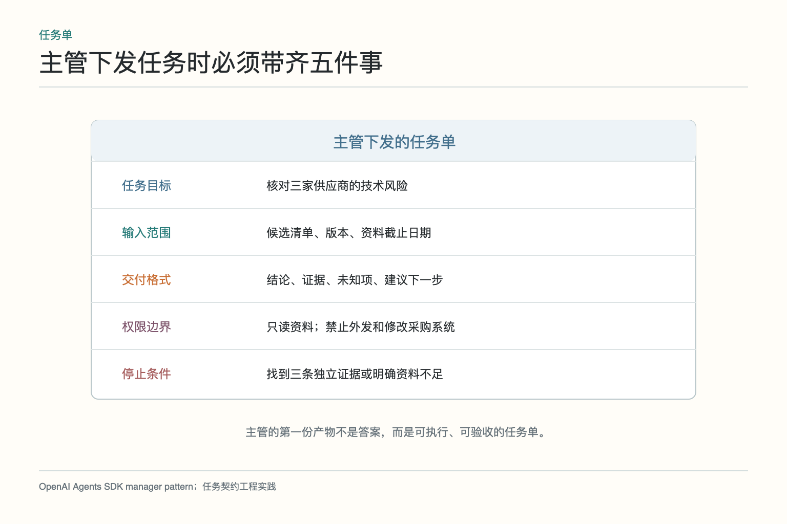
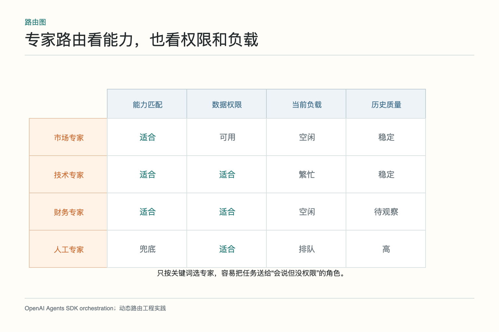
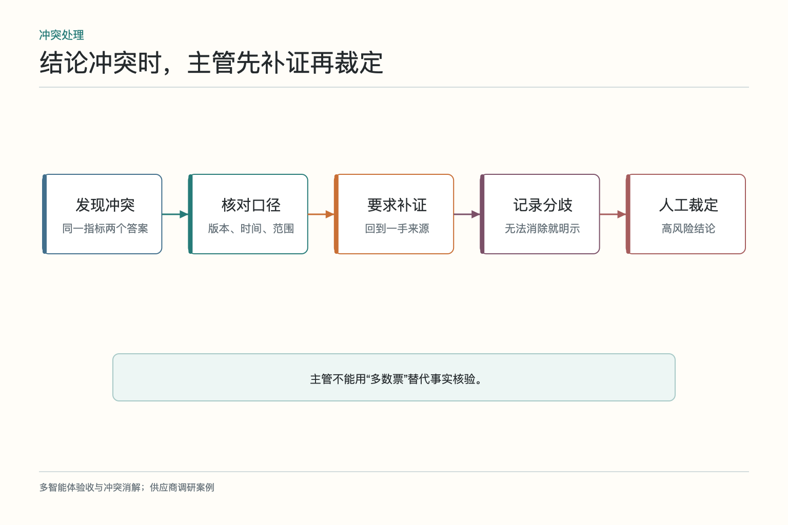
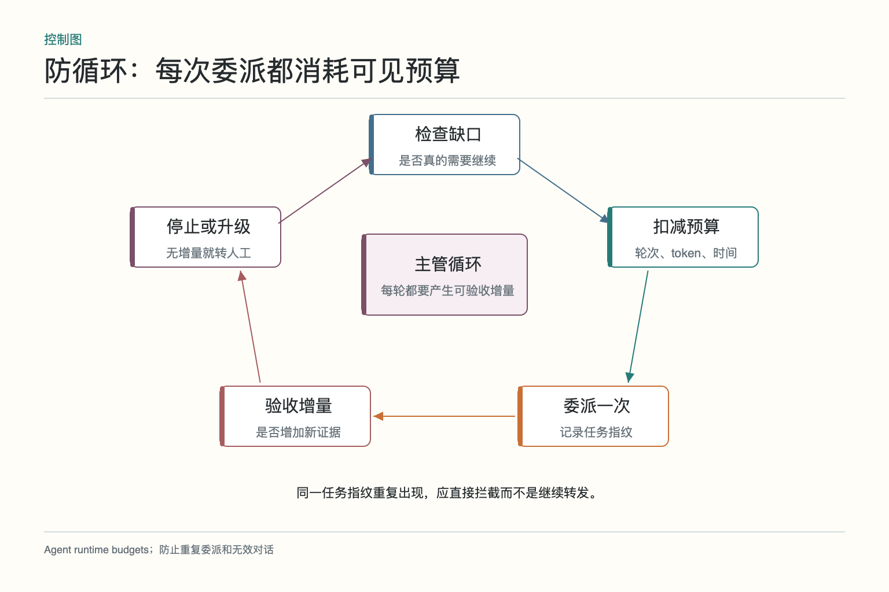

# 面试题：Supervisor 怎样委派又不陷入循环

面试官让你设计一个 Supervisor（主管 Agent），协调市场、技术和财务专家完成供应商评估。只答“主管负责分配任务并汇总结果”，很快会被追问：任务怎么拆，专家怎么选，冲突怎么办，何时停止，主管本身怎么评测。下面九道题沿同一案例展开。

## 问题 1：主管模式与任务交接有什么区别

**原理：**主管模式中，主管保留控制权和用户会话，专家像受限工具一样返回子任务结果；Handoff（任务交接）则把后续控制权交给新 Agent。

**答题点：**供应商调研适合主管模式，因为最终报告需要统一口径；退款分诊后由退款专员继续对话，适合交接。主管调用专家时应传最小任务包，专家不得自行改变总目标；交接则需要传递状态、责任和权限边界。

**记忆点：**请专家办事是调用，正式换负责人是交接。

**常见追问：**专家能否再调用工具？可以，在任务契约和权限范围内；不等于获得主管的全部权限。

**失分点：**把两种模式都描述成“把消息发给另一个 Agent”。

## 问题 2：总目标怎样拆成可验收任务

**原理：**拆分要沿最终交付所需事实、数据依赖和权限边界进行。子任务必须能独立判断完成，而不是只对应一段文案。

**答题点：**先列最终报告字段，识别市场、技术、成本和合规维度；明确前置输入和共享口径；每个子任务定义目标、输入版本、输出 schema、证据、权限、预算、停止条件。检查任务是否遗漏、重叠或存在循环依赖。

**记忆点：**从最终验收倒推子任务，不从角色名称正推故事。

**常见追问：**动态任务如何拆？先给最小初始任务，依据新发现增派，但每次增派都更新状态与预算。

**失分点：**主管把原始长 Prompt 原封不动转发给所有专家。

## 问题 3：专家路由应依据什么

**原理：**路由既是能力匹配，也是权限与资源调度。关键词相似不代表专家有工具、数据或许可完成任务。

**答题点：**维护能力目录，包含任务类型、输入输出 schema、工具、权限、成本、延迟和历史质量；先按权限与输入硬条件过滤，再按质量、负载和成本排序；记录候选与选择理由；路由失败时退回固定规则或人工。

**记忆点：**会不会、能不能、忙不忙、贵不贵一起看。

**常见追问：**路由模型错了怎么办？设置规则兜底、验收反馈和离线混淆矩阵，关键权限由执行层再校验。

**失分点：**只用任务描述与角色描述做向量相似度，忽略硬权限。

## 问题 4：任务契约怎样约束专家

**原理：**Prompt 是自然语言指令，契约还要成为运行时可校验接口。没有输出结构和停止条件，专家容易无限探索或返回不可用长文。

**答题点：**任务含稳定 task_id、目标、输入引用与版本、输出 schema、证据要求、允许工具、禁止动作、预算、deadline、停止条件和失败码。执行层实施权限，返回后做 schema 校验；缺资料是允许的结构化结果，不强迫专家补全。

**记忆点：**契约定义能做什么、交什么、做到哪儿停。

**常见追问：**专家返回格式错误怎么处理？有限次数修复或结构化重试；仍失败则标记失败，不能让主管凭猜测解析。

**失分点：**角色设定很详细，却没有输入、输出和权限字段。

## 问题 5：主管如何验收专家结果

**原理：**主管的核心价值是保证局部产物能进入整体答案。验收包括结构、证据、口径、业务规则和权限结果。

**答题点：**检查字段覆盖、来源可达、日期与版本、关键数字复算、未知项与冲突；用确定性校验处理金额和格式；高风险结论交人工；失败反馈指出具体缺口。验收通过后才写入共享状态和最终报告。

**记忆点：**专家说完成不算，验收条件成立才算。

**常见追问：**主管也是模型，如何可信？把客观检查交代码和工具，保留证据与抽样人工审计，并评测主管误收与误拒。

**失分点：**让主管用一句“看起来合理”判断全部结果。

## 问题 6：两个专家结论冲突怎么办

**原理：**冲突先做语义与范围对齐，再补独立证据；事实问题不能靠多数票或语气强弱解决。

**答题点：**检查产品版本、地区、时间、指标定义和来源；生成窄范围补证任务；优先一手资料、可重复工具结果和权威规则；无法消除时保留分歧及影响，关键决策转人工。主管记录裁定依据和被否决证据。

**记忆点：**先对齐口径，再寻找证据，最后才裁定。

**常见追问：**多个 Agent 投票有用吗？适合主观候选生成或独立误差场景；共享来源的事实判断不能仅投票。

**失分点：**让主管选更长、更自信或多数的答案。

## 问题 7：怎样防止重复委派和无限循环

**原理：**自然语言任务容易被换个说法重复派发，模型也难靠自律停止。需要任务指纹、增量检查和硬预算。

**答题点：**用目标、输入版本和关键参数生成指纹；记录已派发、运行中和已完成；重试必须改变输入、专家或策略；每轮验收是否新增证据或关闭未知项；连续无增量则停止；设置最大轮次、委派数、token、工具和时间。

**记忆点：**同一任务别换个说法再花一次钱。

**常见追问：**专家结果不好能重试几次？没有固定答案，应结合错误类型和风险；关键是每次重试有明确变化与上限。

**失分点：**只在提示词写“不要循环”，没有运行时计数和终止。

## 问题 8：预算、超时和人工升级怎样设计

**原理：**主管要在质量、成本、延迟和风险之间分配资源。所有专家同预算既浪费，也可能让关键分支不够用。

**答题点：**按重要性和复杂度设置分支预算；维护总 deadline 和剩余调用；可选分支超时带缺口结束，关键分支超时暂停；涉及采购提交、敏感报价和合规例外进入人工；依赖故障时回退简单流程。审批绑定具体动作和状态版本。

**记忆点：**预算按风险分，超时按依赖处理，越权动作交人。

**常见追问：**主管能动态调预算吗？可以，但要有总上限、调整理由和审计记录，不能无限挪用。

**失分点：**只优化 token 成本，不看用户等待和风险。

## 问题 9：怎样单独评测主管 Agent

**原理：**最终结果由专家与主管共同产生，只看最终分数无法判断主管是否有效。需要隔离路由、验收和循环控制能力。

**答题点：**固定专家输出，评测任务拆分覆盖、路由选择、契约字段、误收误拒、冲突发现、重复委派、无效轮次和预算；再做端到端评测。准备缺权限、专家超时、无证据结论、来源冲突和重复唤醒样本；与规则路由和固定工作流比较。

**记忆点：**先固定队员，再看组长会不会带队。

**常见追问：**路由准确率怎么定义？按任务是否送到满足能力与权限、且达到验收结果的专家统计，可同时看 top-k 和最终成功。

**失分点：**把专家很强导致的成功都算成主管能力。

主管 Agent 的完整答案可用“拆、选、交、验、停”概括：拆出可验收任务，选择有能力和权限的专家，交付最小任务包，验收证据与口径，在无增量或超预算时停止。少一个环节，都可能把调度系统变成昂贵群聊。

## 现场白板题怎样把主管讲透

先在中间画主管，四周画市场、技术、财务和人工，不急着画箭头。先写主管持有的总目标、共享状态和总预算，再给每位专家写能力、工具、权限和输出 schema。这样架构图表达的不是“有四个角色”，而是谁能处理什么、谁不能看到什么。

然后画一次完整委派：主管根据任务契约和能力目录选择技术专家，发送目标、输入版本、允许工具和停止条件；专家返回结论、证据、未知项和回执；主管先做 schema 与来源检查，再决定接受、补证或转人工。若补证，任务范围应缩小，并扣减剩余预算，而不是把原问题重新发一遍。

接着主动讲失败。专家超时不等于换三个人轮流问；先判断是服务故障、权限不足还是资料不存在。相同任务指纹已在运行就不重复派发，连续两轮无新增证据就停止。价格和合规冲突先对齐版本与范围，再用一手证据或人工裁定。

最后给主管单独做评测：固定专家输出，看它是否拆对任务、选对专家、拒绝无证据结论、发现冲突并按预算停止；再做端到端对照。这样能避免把“专家本来就很强”误算成主管能力，也能回答为什么不用一张静态路由表。

如果面试官追问主管是否会成为单点瓶颈，可以回答：稳定路由先下沉规则，独立任务并行派发，验收分为结构化自动检查与少量模型判断；状态与任务队列支持水平扩展，但同一任务用版本或租约保证只有一个主管提交最终状态。这样既避免所有消息排队，也不让多个主管同时改同一答案。

安全方面补一句：主管可以决定“向谁请求什么”，但不能自行创造权限。专家工具调用仍经过独立授权，敏感数据按任务最小化提供，最终高风险动作走人工。把路由权、数据权和执行权分开，能防止一个被诱导的主管把整套系统权限一起交出去。

最后给出降级策略：主管不可用时回退固定工作流或人工队列，专家结果保留但不自行拼成最终建议；能力目录不可用时只走白名单路由。可靠系统允许暂时少做，不允许在失去统一控制时让专家自由接管。

一句话总结主管价值：不是让更多 Agent 开口，而是让正确的人在正确权限下完成可验收任务，并在继续不再划算时果断停下。

这也是主管是否真正有效的判断标准。

## 参考资料

- [OpenAI Agents SDK：Agent orchestration](https://openai.github.io/openai-agents-python/multi_agent/)
- [Anthropic：Building Effective AI Agents](https://www.anthropic.com/engineering/building-effective-agents)
- [AutoGen: Enabling Next-Gen LLM Applications via Multi-Agent Conversation](https://arxiv.org/abs/2308.08155)

想看本文在 AI Agent 中的位置，可点击下方 [阅读原文](https://github.com/Jennifer123www/ai-agent-knowledge-map)，从“多智能体协作”的“主管调度与 Agent 通信”继续阅读。
