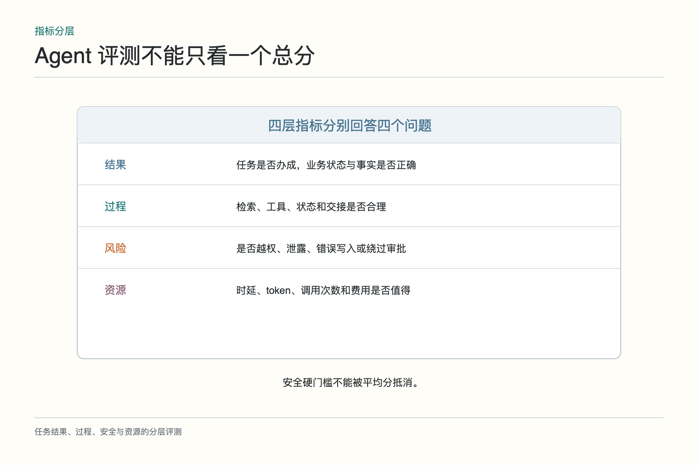
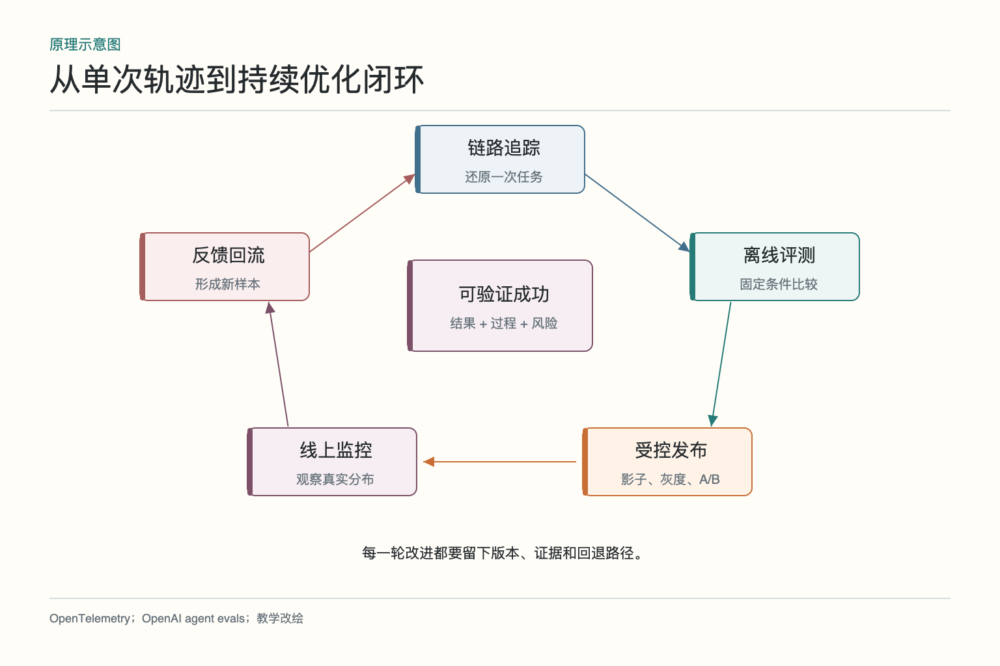
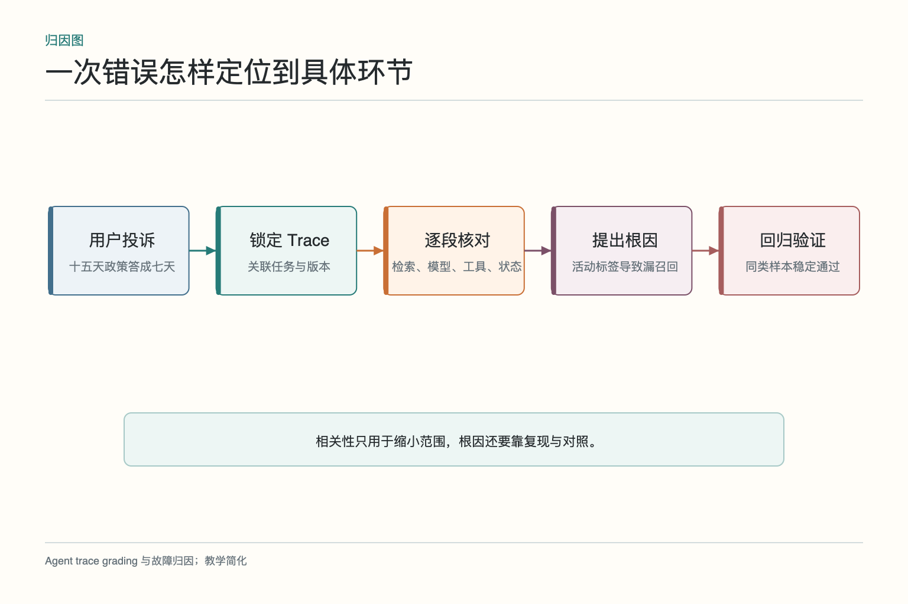
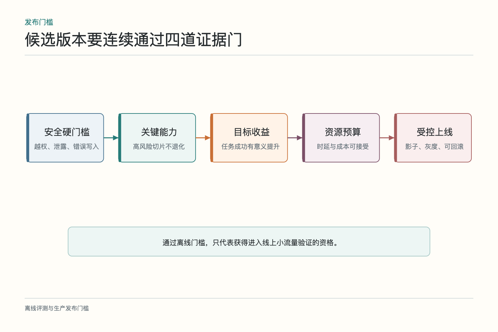
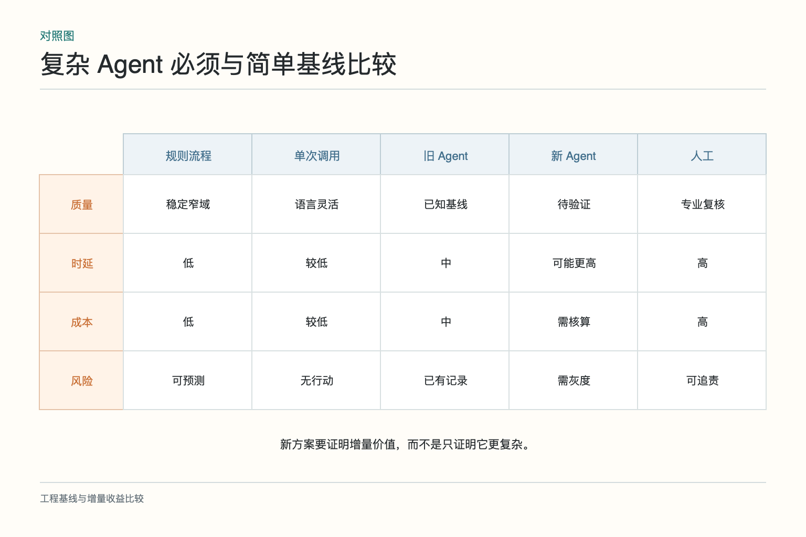

# 面试题：怎样证明智能体真的可靠

面试官给出一个售后 Agent：它会检索政策、查询订单、生成回复并创建换货草稿。新版自动结单率从 62% 升到 74%，但重新进线和人工重开也在上升。高分回答不能停在“多做几个指标”，而要把任务定义、过程证据、离线回归、线上监控、版本发布和反馈回流接成闭环。

## 问题 1：如何定义一个 Agent 是否可靠

**原理：**可靠不是偶尔写出好答案，而是在代表性任务中稳定完成可验证目标，并在证据不足、权限不够或依赖失败时采取正确的停止、降级或升级动作。

**答题点：**先定义业务完成条件，例如换货资格正确、库存已查、草稿已创建、用户承诺与系统状态一致；再定义过程约束，包括工具选择、参数、状态转移和预算；安全、隐私、越权与不可逆动作设硬门槛；最后比较成功率、延迟、成本和人工返工。正确转人工也应计入合格结果，而不是一律算失败。

**记忆点：**结果办成，过程可查，风险受控，失败会停。

**常见追问：**任务没有唯一答案怎么办？把开放结果拆成必须满足的事实、禁止出现的错误、证据覆盖、工具行为和人工评分标准，不要求逐字一致。

**失分点：**只看最终文本的流畅度，或把用户点赞直接当正确率。

## 问题 2：为什么只看最终答案不够

**原理：**Agent 会在环境中行动。相同答案可能来自不同过程：一个查了权威政策，另一个凭记忆猜；一个只生成草稿，另一个越权提交。最终文字无法完整反映证据与副作用。

**答题点：**结果层看业务状态和事实；过程层检查检索、工具参数、重试、交接和停止；风险层检查授权、敏感数据和护栏；资源层看耗时、`token` 与费用。对高风险动作要求外部系统回执。不能用一个加权总分把严重安全失败平均掉。

**记忆点：**文字相同，不代表路径相同；路径不同，风险可能完全不同。

**常见追问：**过程合理但结果错怎么算？仍是失败，但过程证据能帮助判断是资料、模型还是外部系统问题，并选择不同修复。

**失分点：**声称“答案正确就行”，忽略工具写入和权限。

## 问题 3：五个子模块怎样接成端到端证据链

**原理：**Trace 解释单次任务，离线评测比较固定样本，线上监控观察真实分布，版本发布控制变更，反馈把新失败变成下一轮样本。它们解决的时间尺度不同。

**答题点：**线上发现退款工单重开率上升；按任务标识找到 Trace，定位旧政策检索；把失败样本脱敏标注后加入离线集；修复索引并跑回归；候选版本通过影子和灰度发布；持续观察任务成功、安全与成本，异常则回滚。每个环节都携带版本和证据。

**记忆点：**线上发现，轨迹定位，离线复现，受控发布，反馈回流。

**常见追问：**哪个环节最先建设？先写可验证完成条件，再补基本 Trace 和小型回归集；否则采集很多数据也不知道如何判好坏。

**失分点：**把五部分列成工具清单，没有说明信息怎样流动。

## 问题 4：离线评测与线上监控如何配合

**原理：**离线环境固定，适合可重复对照和发布守门；线上环境真实，能发现分布变化、外部依赖和未见过的失败。两者不能互相替代。

**答题点：**离线集覆盖常见、边界、对抗、高风险和历史故障；固定政策、库存、工具模拟与时间条件；新版本先过回归。上线后按任务、语言、客户和工具版本监控任务成功、重新进线、延迟、成本和安全事件。线上失败经复核后回到离线集，形成新的门槛。

**记忆点：**离线做可比，线上看现实；现实里的失败回到考卷。

**常见追问：**离线高分能否直接全量？不能。真实流量、依赖、并发和用户行为仍可能不同，需要灰度与回滚。

**失分点：**只在生产做 A/B，把明显回归也交给用户发现。

## 问题 5：怎样把异常归因到具体版本和步骤

**原理：**归因依赖统一标识和版本清单。没有模型、提示词、索引、工具契约和流程版本，指标变化只能与发布时间相关，不能证明是哪项改动造成。

**答题点：**一次运行保存 `Trace ID` 与父子 Span；记录模型、提示、检索索引、规则、工具和流程版本；从失败结果向上查工具回执、检索证据和状态转移；与同版本成功样本比较；形成“旧政策被排序到首位”这类可验证假设，再用回归样本确认。

**记忆点：**没有版本的 Trace 只能看故事，不能复现实验。

**常见追问：**耗时最长的 Span 是否就是根因？不一定。它可能只是症状，必须结合输入、状态和业务结果判断因果。

**失分点：**看到发布后指标下降，就直接把所有问题归咎于新模型。

## 问题 6：如何设计总体发布门槛

**原理：**发布门槛应区分硬约束与优化目标。安全和不可逆副作用通常是一票否决；质量、成本和时延在约束内做取舍。

**答题点：**先定义必须不退化的能力与高风险样本；设置任务成功、关键切片、引用或工具准确率；越权、错误写入和敏感数据泄露设零容忍或极低阈值；给 P95 延迟、单任务费用和人工接管设置预算；要求差异达到业务上有意义的幅度；灰度阶段预设停止条件和回滚版本。

**记忆点：**先过安全底线，再谈质量收益，最后算成本账。

**常见追问：**指标互相冲突怎么办？明确业务优先级与风险容忍度，报告帕累托取舍，不要用一个权重掩盖关键退化。

**失分点：**只写“总分提升 5% 即发布”，没有切片、风险和统计不确定性。

## 问题 7：用户反馈怎样进入评测集

**原理：**反馈是线索，不是天然标签。差评、改稿、重试和最终业务结果含义不同，必须关联轨迹并经复核归因。

**答题点：**保存反馈类型、修改前后差异、任务标识、版本和必要上下文；将错误归到知识、检索、工具、流程、权限或表达；领域人员复核正确答案和验收标准；脱敏并避免把同一样本同时用于优化和独立测试；加入对应切片并设置回归阈值。

**记忆点：**差评先变问题，问题再变样本，样本最后才变门槛。

**常见追问：**能否把所有差评直接用于微调？不能。很多差评来自产品政策、数据缺失或工具故障，直接训练会把噪声和错误固化。

**失分点：**把点赞当金标，或只收集负面文本却不保留任务状态。

## 问题 8：怎样平衡质量、成本、时延与安全

**原理：**四者常有冲突，需要简单基线和分层预算。更复杂的 Agent 只有在增量收益超过调用、协调和运维成本时才值得。

**答题点：**与旧版、单次模型调用、规则流程或人工方案比较；按任务风险分配模型和工具预算；高价值复杂任务允许更多检索与核验，简单问题走短路径；安全门槛不因成本压力降低；报告任务成功每提升一个百分点对应的延迟、费用和人工变化。

**记忆点：**先有简单基线，再给复杂度定价。

**常见追问：**如何减少成本又不伤质量？先分析 Trace 中无效重试、重复检索和过长上下文，按任务路由，而不是统一砍掉步骤。

**失分点：**只报平均 token，忽略失败重试和长尾任务。

## 问题 9：证据不足时怎样做上线决策

**原理：**不确定性本身应进入决策。样本过少、评分器未校准、线上结果窗口太短时，正确做法是缩小影响范围，而不是把“暂未发现问题”当安全证明。

**答题点：**列出已知证据和缺口；扩大离线样本或人工复核；使用影子流量收集候选轨迹；灰度只覆盖低风险人群并限制写权限；延长观察直到主要业务结果成熟；任何硬门槛失败立即停止。无法得出因果结论时，明确标记为未确认。

**记忆点：**没有证据支持扩大，就让风险保持小。

**常见追问：**业务催着上线怎么办？给出低风险试点、只读模式、人工审批和明确退出条件，让速度与风险同时可见。

**失分点：**用“模型厂商已经测试过”替代自己的场景评测。

## 综合案例：把一次指标上涨讲清楚

如果面试官继续追问“自动结单率从 62% 涨到 74%，你会批准上线吗”，可以先拒绝直接下结论，再按证据顺序回答。第一步核对口径：分母是否包含转人工、用户撤回和系统超时，观察窗口是否覆盖换货真正完成，旧版与新版面对的任务分布是否一致。自动结单只是中间状态，若用户随后重新进线，或者客服把工单重新打开，这个增长可能只是把失败藏到了后面。

第二步看切片和过程。分别比较普通换货、缺货、跨区域、会员订单和高金额订单，检查新版是不是只改善了简单样本，却让少数高风险任务恶化。再抽取成功、重开和投诉三类 Trace，核对检索到的政策、工具参数、写入回执与人工修改。若重开集中在“旧政策被排到首位”，就形成了一个可以复现的根因假设，而不是笼统地说模型不稳定。

第三步补实验设计。把相关失败加入回归集，固定知识与工具环境，对旧版和候选版重复运行；安全失败设硬门槛，质量、延迟和费用按切片比较。离线通过后先跑影子流量，再对低风险任务随机灰度。主要指标可以是最终换货完成率，护栏包括重新进线、错误写入、人工接管、P95 延迟和单任务成本。发布前写明停止条件、回滚版本和在途任务的处理办法。

最后给出结论格式：“目前只能确认自动结单表面上涨，尚不能证明业务成功提升；完成口径校正、关键切片、轨迹归因和受控实验后，若最终完成率改善且安全护栏不退化，再逐步扩大流量。”这类回答的重点不在背出多少指标，而在于知道每份证据能回答什么、不能回答什么，以及证据不足时如何把风险控制在小范围。

回答这组题时，可以用一条线串起全部内容：先定义什么叫办成，再让每次运行可追踪；用离线回归守住发布，用线上监控观察现实，用反馈补齐未知样本。最终决策同时看结果、过程、风险和资源，并保留简单基线与回滚路径。

收尾时最好主动说出边界：评测只能降低未知和控制风险，不能证明系统永远正确。真正可靠的方案，会把不确定性写进采样、审批、灰度和停止条件，而不是用一个高分把它藏起来。

## 参考资料

- [OpenAI：Evaluation best practices](https://developers.openai.com/api/docs/guides/evaluation-best-practices)
- [OpenAI：Evaluate agent workflows](https://developers.openai.com/api/docs/guides/agent-evals)
- [OpenTelemetry：Signals](https://opentelemetry.io/docs/concepts/signals/)
- [NIST：AI RMF Core](https://airc.nist.gov/airmf-resources/airmf/5-sec-core/)
- [GAIA：A Benchmark for General AI Assistants](https://arxiv.org/abs/2311.12983)

想看本文在 AI Agent 中的位置，可点击下方 [阅读原文](https://github.com/Jennifer123www/ai-agent-knowledge-map)，从“评测、可观测性与持续优化”继续阅读。
