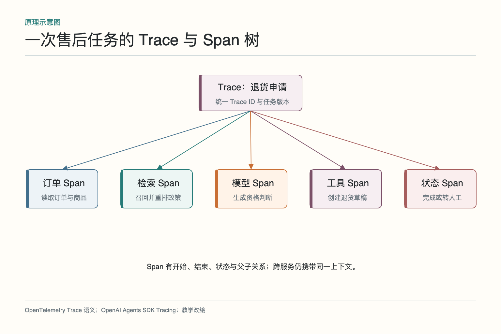
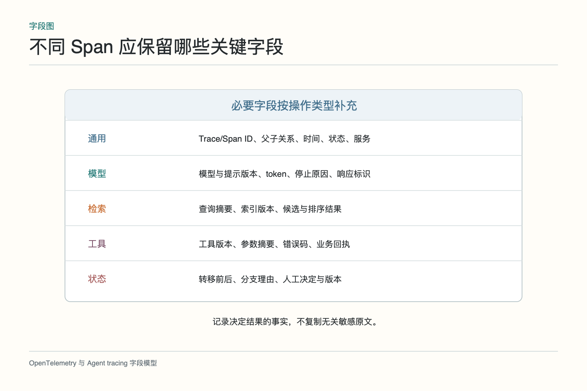
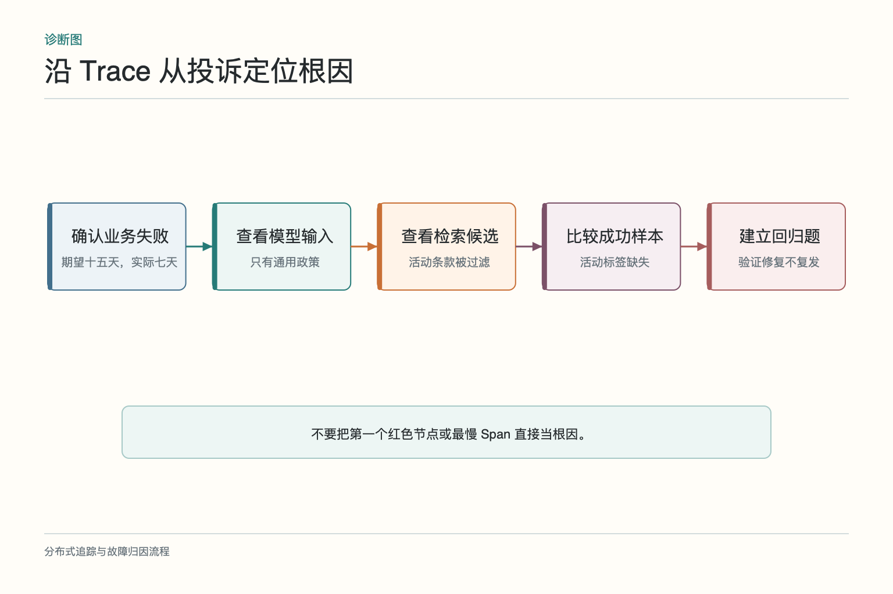
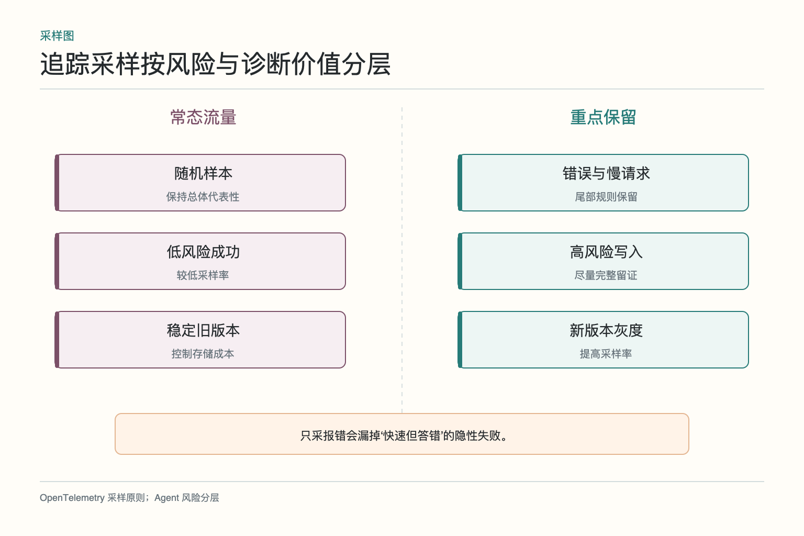
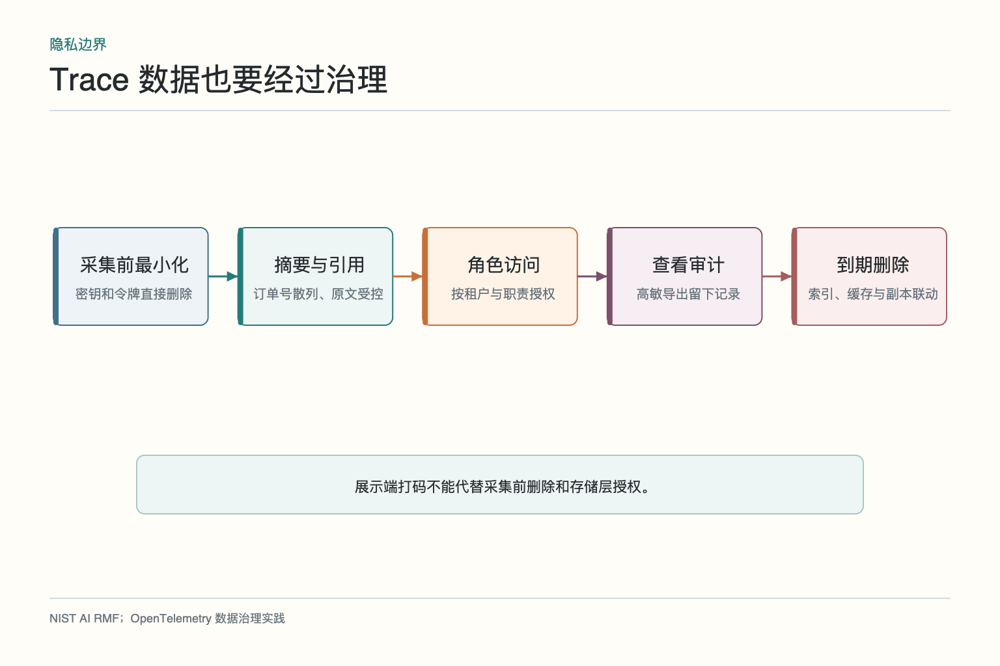

# 面试题：一条 Trace 应记录什么

案例仍是咖啡机退货：商品承诺十五天可退，Agent 却引用通用七天规则拒绝。面试官通常不会满足于“加日志”，而会继续问 Trace 与 Span 怎么设计、跨服务怎样关联、采样怎么做、敏感内容能不能保存。回答要让一位排查者能够沿证据定位，而不是得到一仓库聊天记录。

## 问题 1：Trace、Span、日志和指标有什么区别

**原理：**Trace 描述一次请求的端到端路径，Span 描述其中一段操作；日志记录事件，指标聚合大量运行的数值分布。四者可以关联，但不能互相替代。

**答题点：**一次售后任务一个 Trace；订单查询、政策检索和模型调用各有 Span；错误码和状态变化写结构化日志；失败率、P95 延迟和调用量做指标。监控从异常指标跳到 Trace，再从 Span 查看日志。所有信号共享服务、环境、版本和关联标识。

**记忆点：**指标看全局，Trace 看路径，Span 看操作，日志看事件。

**常见追问：**为什么不能只存日志？跨组件日志缺少稳定父子和时间关系，难以还原一条完整请求。

**失分点：**把 Trace 当作一份更长的文本日志。

## 问题 2：一次 Agent 运行应记录哪些 Span

**原理：**Span 边界应对应可独立观察的操作。它需要有输入契约、开始结束、状态和结果，粒度太粗无法定位，太细则成本和噪声过高。

**答题点：**至少包括工作流或 Agent 回合、模型调用、检索、工具执行、护栏、交接和关键状态转移；每个 Span 记录操作名、父子关系、耗时、状态、服务与版本；模型补充响应标识和 token，检索补充索引与候选标识，工具补充参数摘要、错误码和业务回执。

**记忆点：**一段可独立失败、可独立计时的工作，才值得一个 Span。

**常见追问：**每个函数都建 Span 吗？不需要。优先覆盖跨组件、成本高、风险高和影响路由的操作。

**失分点：**整个 Agent 只有一个大 Span，或每个内部小函数都上报造成噪声。

## 问题 3：跨服务和多 Agent 怎样传播关联标识

**原理：**调用边界改变，Trace 上下文不能丢。同步调用通过请求头传播，异步任务通过消息属性或任务载荷传播，并建立正确父子或链接关系。

**答题点：**入口生成或接收 `Trace ID`；HTTP/RPC 注入标准传播头；消息队列保存 Trace 上下文、生产者和消费者关系；远程 Agent 接收父任务标识和委派标识；防止不可信用户伪造内部追踪字段；跨租户传播前过滤敏感 baggage。

**记忆点：**请求过边界，关联标识也要过边界。

**常见追问：**异步消费者晚几个小时执行怎么办？时间线仍可关联，语义上可用 Span Link 表示非严格父子；关键是保留任务与消息标识。

**失分点：**每个服务重新生成 ID，最后只能按时间猜。

## 问题 4：Span 粒度怎样控制

**原理：**粒度由诊断价值和采集成本共同决定。一个 Span 应能说明“谁执行了什么操作，结果如何，花了多久”。

**答题点：**模型每次请求通常一个 Span，工具每次外部调用一个 Span，检索可将召回和重排序分开；纯内存的小函数不必全部记录；循环迭代要能区分轮次；批量调用可以记录整体和异常项；对高风险写入保留更细业务回执。

**记忆点：**能定位一个独立故障，又不会把时间线切成芝麻。

**常见追问：**如何调整粒度？从真实事故出发：若现有 Span 无法区分两个可能根因，再拆；若字段从不参与诊断，考虑删除。

**失分点：**按代码目录机械建 Span，而不看业务操作。

## 问题 5：怎样从错误结果定位根因

**原理：**从业务完成条件反向检查决定结果的证据和动作，不能只找第一个红色节点，也不能把相关性直接当因果。

**答题点：**确认期望与实际业务状态；锁定 Trace 和失败切片；查看模型输入引用、检索候选、工具回执和状态转移；比较同版本成功样本；提出可验证修复假设；把故障转成回归用例。咖啡机案例最终定位为活动商品标签缺失导致检索范围错误。

**记忆点：**从结果倒查证据，从证据定位版本，再用回归证明修复。

**常见追问：**Trace 能自动给根因吗？可以辅助聚类和缩小范围，但最终因果仍要靠对照、复现和业务知识验证。

**失分点：**耗时最长就判为根因，或模型 Span 成功就排除模型输入问题。

## 问题 6：为什么必须记录版本

**原理：**Agent 行为由模型、提示、索引、规则、工具契约、工作流和环境共同决定。缺少任一关键版本，复现都可能失真。

**答题点：**记录模型标识和参数、提示模板版本、知识和索引快照、重排序器、工具 schema、业务规则、工作流图和部署版本；版本进入 Span 或 Trace 元数据；不要把完整提示原文当唯一版本记录；变更时保持可回溯清单。

**记忆点：**Trace 告诉你发生了什么，版本告诉你为什么这次会这样发生。

**常见追问：**外部 SaaS 没有版本号怎么办？至少记录请求时间、接口版本、响应标识和关键返回摘要，必要时保存受控快照。

**失分点：**只记录模型名，忽略索引和工具变化。

## 问题 7：全量采集与采样怎样取舍

**原理：**全量细节成本高且扩大隐私面，采样又可能漏掉低频严重事件。策略应按风险、错误和诊断价值分层。

**答题点：**稳定低风险请求随机头部采样；错误、慢请求、护栏触发和高风险写操作使用尾部规则保留；新版本灰度提高采样率；指标保持聚合；记录采样策略版本；用随机样本防止只看失败导致偏差。

**记忆点：**常态随机看，异常重点留，高风险尽量保真。

**常见追问：**只采错误请求行不行？不行。HTTP 成功仍可能业务错误，需要随机样本、反馈关联和业务结果信号。

**失分点：**固定 1% 采样应用所有任务，不考虑风险与尾部事件。

## 问题 8：敏感输入输出怎样治理

**原理：**可观测数据本身也是受保护数据。应先最小化采集，再做脱敏、访问控制、保留和审计，而不是全存后靠界面遮挡。

**答题点：**密码、令牌和密钥在采集前删除；个人信息用摘要、哈希或安全引用；原文放独立受控存储；按租户和角色授权；查看与导出高敏 Trace 留审计；设置保留期和删除联动；测试下游索引与备份是否同步清理。

**记忆点：**先不采，再脱敏；先授权，再查看；到期还要真删除。

**常见追问：**为了复现能不能存完整 Prompt？视合法用途和授权决定，高风险场景可受控保留；默认不应把所有原文复制到普通追踪平台。

**失分点：**把日志系统当成天然安全区。

## 问题 9：怎样验证追踪系统可用

**原理：**埋点存在不等于追踪可用。要通过故障注入检查完整性、传播、字段语义、查询效率和隐私控制。

**答题点：**注入检索旧版本、工具超时、回执丢失和交接失败；检查 Trace 是否完整、父子关系是否正确、业务回执是否可见；跨 HTTP、队列和异步任务验证传播；测查询能否从订单号安全定位 Trace；用敏感测试值验证采集前删除；评估采样后关键事件保留率。

**记忆点：**用已知故障考试，看 Trace 能不能给出同一个答案。

**常见追问：**追踪的质量指标有哪些？完整率、关联成功率、关键字段覆盖、查询延迟、采样命中、敏感字段泄漏和实际排障时间。

**失分点：**只检查仪表盘上有彩色瀑布图。

## 综合案例：一句错答怎样沿 Trace 查到底

假设用户问“这笔订单能否免费换货”，Agent 回答可以，并已经创建了换货草稿；客服后来发现订单超过期限，而且草稿写入了错误原因。排查时先按任务标识找到根 Trace，确认入口时间、用户和版本，再沿父子 Span 看检索、订单查询、规则判断、草稿创建和回复生成。不要先搜错误关键字，因为整条链路可能没有抛异常。

检索 Span 显示旧政策排在第一位，但元数据里索引版本是最新的；继续查看订单查询，发现接口返回的购买日期缺失。规则 Span 却把缺失日期当成“仍在期限内”，随后草稿创建工具成功写入。这里至少有两层问题：工具数据不完整没有触发停止，规则又给缺失值设置了危险默认值。模型最后的流畅回复只是把前面的错误说得更像真的。

接下来用对照样本验证。找同版本中日期完整的成功任务，确认规则在正常输入下没有普遍错误；再重放日期缺失样本，验证能够稳定复现。修复方案可以是订单日期缺失时禁止写入并转人工，同时为旧政策检索增加有效期过滤。两项修改分别建立回归样本，避免把所有功劳或责任都算给提示词。

这段回答还应补治理边界：原始订单字段采集前脱敏，写入工具只保留必要参数和回执标识；高风险写入 Trace 全量保留，普通问答抽样；版本字段覆盖规则、索引和工具契约。最后用故障演练验证跨服务关联没有断、告警可跳到代表轨迹、值班人员能在规定时间内给出根因与受影响范围。面试官真正想听的，是你能否把“看看日志”变成一条可复现、可修复、可验收的证据链。

如果继续追问技术实现，可以说明跨服务传播只携带关联上下文，不把整段业务数据塞进请求头；消息队列中的异步消费也要保留父级关系或显式链接。Span 状态表示技术执行是否正常，业务成败另设字段，避免“工具调用成功”被误读成“换货成功”。高基数字段不直接做指标标签，具体订单通过受控 Trace 查询。这样既能支持聚合告警，也不会把可观测系统做成昂贵且危险的明文仓库。

面试收尾可以说：Trace 不是为了把所有内容存得更全，而是用统一标识、明确 Span、可靠版本和业务回执，保留足够的因果线索；再用采样、脱敏和访问控制限制成本与风险。能复现、能定位、能治理，三者缺一不可。

也可以补一句成本原则：默认采集结构化元数据和摘要，高风险事件、失败样本与随机样本提高保留率，原文按授权进入独立存储。这样既能算出整体趋势，也能对少量关键案例深入排查，不必在“什么都不留”和“什么都全存”之间二选一。

若被问到成功标准，可以给出量化口径：关键链路关联完整率、版本字段覆盖率、敏感字段泄漏数、代表故障采样命中率、从业务标识定位轨迹的耗时，以及未参与开发人员的平均排障时间。追踪系统也需要自己的验收指标。

指标达标后仍要靠定期故障演练复验。

## 参考资料

- [OpenTelemetry：Observability primer](https://opentelemetry.io/docs/concepts/observability-primer/)
- [OpenTelemetry：Trace semantic conventions](https://opentelemetry.io/docs/specs/semconv/general/trace/)
- [OpenTelemetry：Logs](https://opentelemetry.io/docs/concepts/signals/logs/)
- [OpenAI Agents SDK：Tracing](https://openai.github.io/openai-agents-python/tracing/)

想看本文在 AI Agent 中的位置，可点击下方 [阅读原文](https://github.com/Jennifer123www/ai-agent-knowledge-map)，从“评测、可观测性与持续优化”的“链路追踪”继续阅读。
