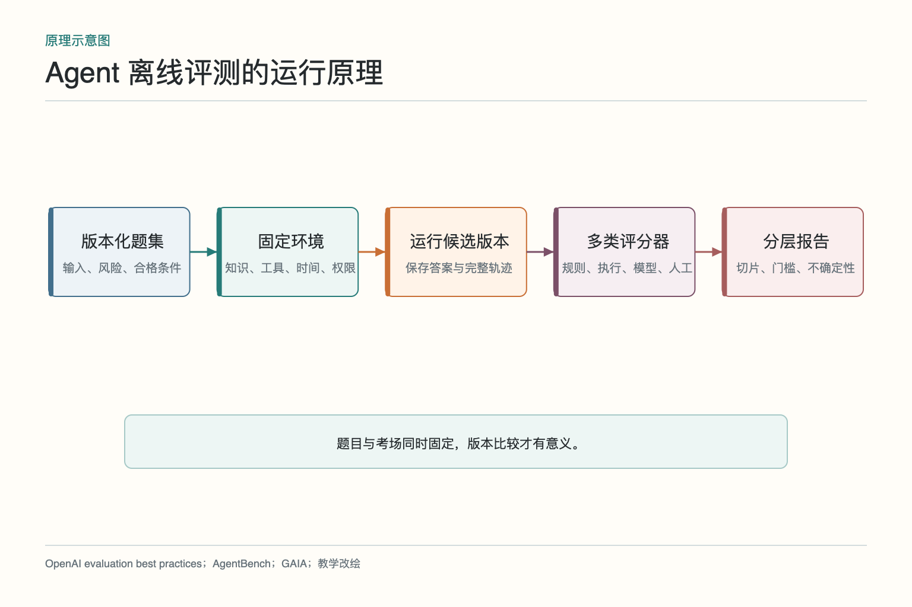
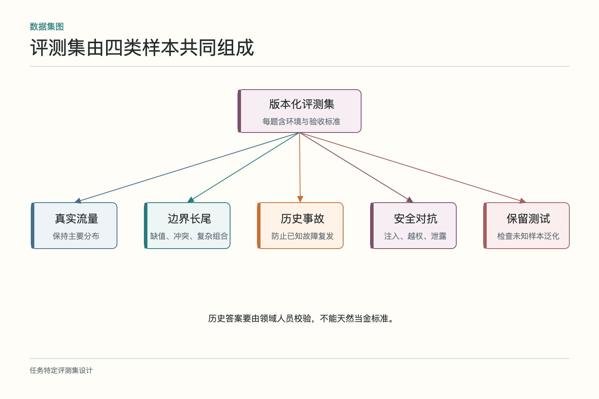
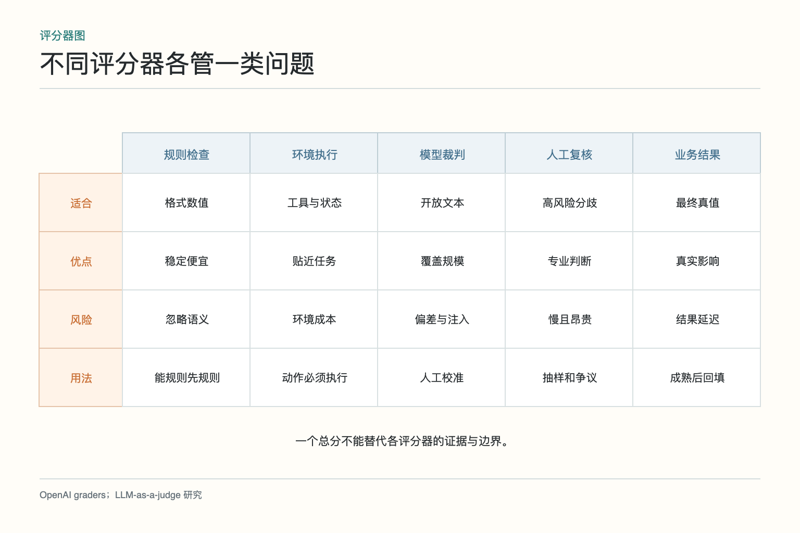
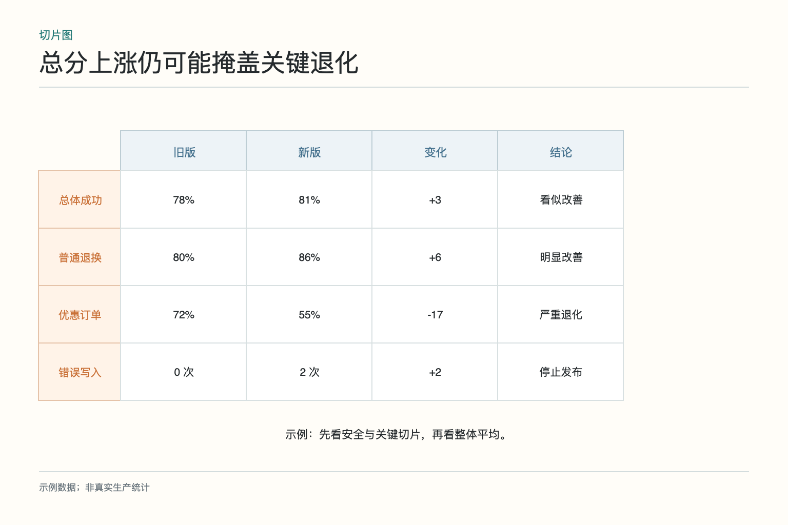
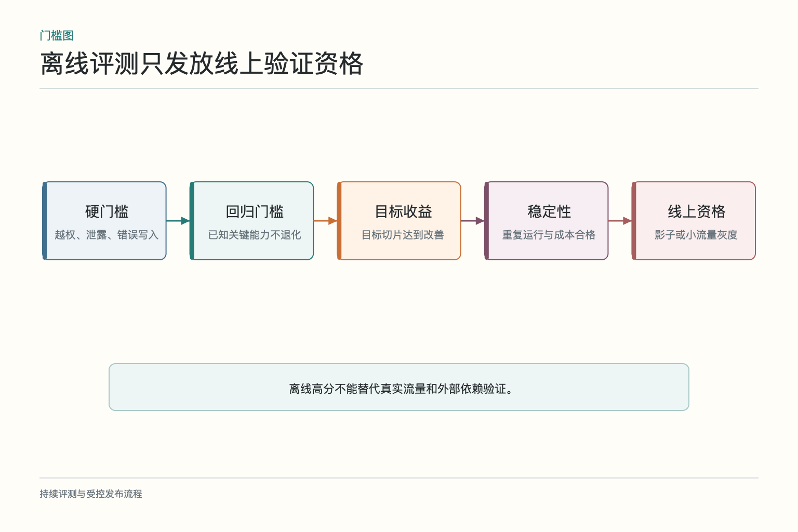

# 面试题：离线评测怎样避免虚高

场景是用 300 个历史售后工单比较 Agent 新旧版本。新版本总体分数更高，但优惠叠加工单退化，还多了两次错误写入。回答时要主动拆开任务目标、数据、环境、评分和发布门槛；否则“做一个评测集，再用大模型打分”很容易得到体面的假成绩。

## 问题 1：如何定义 Agent 的任务成功

**原理：**Agent 在环境中完成任务，成功应由业务结果、过程约束和风险边界共同定义，而不是只看文本与参考答案相似。

**答题点：**换货案例检查资格、库存、草稿和承诺一致；资料不足时正确追问或升级也可合格；工具选择、参数和状态转移属于过程评分；越权、泄露和错误写入设硬失败；明确分母是全部任务还是允许自动处理的子集。

**记忆点：**先写“办成什么”，再写“怎么打分”。

**常见追问：**最终状态正确但走了危险路径怎么算？失败。结果偶然正确不能抵消越权和不可控副作用。

**失分点：**用 BLEU、相似度或用户点赞代表端到端成功。

## 问题 2：怎样构造有代表性的评测集

**原理：**数据集既要反映真实分布，也要主动覆盖边界、对抗和低频高风险任务。纯随机抽样会被高频简单题占满。

**答题点：**组合真实流量样本、历史事故、专家边界题和攻击样本；记录任务、语言、风险、资料完整性与工具依赖；去除不必要个人信息；由领域人员校验标签；保留无答案和正确拒答；版本化数据集并记录修订原因。

**记忆点：**常见题看覆盖，边界题看稳健，高风险题守底线，事故题防复发。

**常见追问：**合成数据能不能用？可以补稀缺边界，但应与真实样本分开报告，并由专家检查是否符合业务分布。

**失分点：**把历史客服答复直接当金标准。

## 问题 3：为什么要固定工具和知识环境

**原理：**评测要比较候选版本，其他条件应尽量一致。外部数据、时间和工具返回变化会形成混杂因素。

**答题点：**固定政策和索引快照、订单和库存数据、系统时间、权限和工具 schema；写操作进入沙盒；外部搜索使用快照或受控来源；记录随机参数并对关键样本重复运行；环境版本与结果一起保存。

**记忆点：**题目相同还不够，考场也要相同。

**常见追问：**完全固定会不会不真实？离线先求可比，再用故障注入和多环境覆盖稳健性，真实变化由灰度线上验证。

**失分点：**旧版和新版连接不同数据，却把差异归因于模型。

## 问题 4：规则、模型和人工评分怎样组合

**原理：**不同目标适合不同测量方式。能确定检查的优先程序化，开放质量再用模型和人工，最终以业务环境结果为准。

**答题点：**金额、schema、工具参数和业务状态用规则；引用存在和证据一致可做结构检查；完整性、相关性与表达用带 rubric 的模型评分；关键与分歧样本人工复核；定期用人工标注测评分器的准确率与稳定性。

**记忆点：**能执行就执行，能规则就规则，开放部分才请裁判。

**常见追问：**为什么不全部人工？质量高但慢且贵，适合校准和高风险，不适合每次提交的全量回归。

**失分点：**所有问题都交给一个 LLM 裁判打总分。

## 问题 5：LLM-as-a-judge 有哪些偏差

**原理：**模型裁判可能受答案顺序、长度、写作风格、自身模型家族和输入中诱导文本影响，且在缺乏事实依据时会把流畅误认为正确。

**答题点：**使用具体 rubric 和参考证据；优先分类、成对比较而非空泛打分；随机交换候选顺序；限制无关文风影响；用人工集测一致率和各类错误召回；分歧样本升级人工；防止被评测文本向裁判注入指令。

**记忆点：**模型裁判能扩容，不能免校准。

**常见追问：**裁判与被评模型用同一家模型可以吗？可以作为一种方案，但要测自我偏好和相关误差，不能把同源当独立真值。

**失分点：**认为更大的裁判模型天然无偏。

## 问题 6：为什么不能只报平均总分

**原理：**平均数会隐藏局部退化和不同严重度错误。发布决策需要切片、样本量和错误类型。

**答题点：**按任务、风险、语言、渠道、工具和资料完整性拆分；同时报告分母与置信区间；安全错误单列，不参与普通质量平均；比较新旧差异和绝对水平；对小样本关键切片增加人工复核。

**记忆点：**先看底线，再看切片，最后看平均。

**常见追问：**切片太多怎么办？从业务风险、历史故障和主要流量维度开始，避免无限交叉；每个切片对应一个行动问题。

**失分点：**总体提升就忽略退款类明显退化。

## 问题 7：如何防止数据污染和评测过拟合

**原理：**反复针对同一评测集优化，会把测试集变成训练集；公开或泄漏样本也可能被模型见过，分数不再代表泛化。

**答题点：**划分开发、回归和保留集；优化数据与独立测试去重；跟踪样本来源和是否进入训练、提示或检索库；保留新鲜时间切片；限制保留集访问；公开基准只作参考；定期加入线上新失败并淘汰过期标签。

**记忆点：**看过答案的卷子，只能证明记住了答案。

**常见追问：**线上失败加入回归集后还能当独立测试吗？适合防复发，但不再证明对未知样本的泛化，应另有保留集。

**失分点：**把通过已知事故题称为整体能力提升。

## 问题 8：怎样设置回归与发布门槛

**原理：**门槛要包含硬失败、关键能力不退化和优化收益三层，并考虑随机性与样本不确定性。

**答题点：**越权、泄露、错误写入等硬门槛；主要任务与高风险切片不低于基线；总体质量达到业务有意义提升；P95 延迟和成本在预算内；关键样本多次运行达到稳定通过率；失败即阻断，全部通过才进入影子或灰度。

**记忆点：**离线通过只拿到入场券，不拿到全量通行证。

**常见追问：**指标只提升 0.5% 怎么办？看样本量、统计不确定性、业务价值和成本，不足以证明收益时保持基线或扩大实验。

**失分点：**为了让版本通过，评测后临时降低门槛。

## 问题 9：开放式任务怎样验收

**原理：**没有唯一参考文本，不代表无法评测。可以拆成事实约束、证据、行为和结果，再对表达质量做结构化人工或模型评审。

**答题点：**列必须覆盖与禁止主张；检查引用是否支持关键结论；让环境验证动作结果；评估未知项和升级是否恰当；采用匿名配对评审；记录评审分歧；对多种合格方案使用范围标准而非唯一答案。

**记忆点：**开放的是表达，不是事实、权限和完成条件。

**常见追问：**研究报告怎么测？按来源覆盖、主张—证据对齐、关键事实、推断标记、任务要求和人工可复核性分项评估。

**失分点：**因为答案开放就退回“凭感觉看看”。

## 综合案例：怎样评测一个退款 Agent

面试官若要求现场设计方案，可以先限定任务：Agent 读取订单与退款政策，判断资格，计算可退金额，并生成退款草稿；真正提交仍需人工批准。成功条件不是“回复像客服”，而是资格判断正确、金额正确、证据可追溯、草稿字段完整，并且在资料缺失或权限不足时停止。错误退款、越权提交和泄露其他用户订单属于硬失败。

评测集从真实流量分层抽样，加入普通退款、部分退款、优惠叠加、跨境订单、超期申请和历史事故；另设注入、越权与工具异常样本。每题固定政策版本、订单快照、当前时间、工具契约和允许权限。开发集供调试，回归集守住已知能力，保留集只在阶段验收时使用。相似订单应按簇拆分，避免一张订单的改写同时落入训练和测试。

评分时先用规则核对金额、币种、字段格式和禁止动作；在沙箱执行工具，检查草稿是否真的创建、有没有重复写入；对解释质量使用带明确 rubric 的模型裁判，并用领域人员样本校准；高风险和争议案例人工复核。报告总体成功率之外，还列各任务切片、硬失败数、P95 延迟、单任务费用和重复运行波动。总分上涨但优惠叠加金额错误增加，仍不能发布。

发布门槛可以写成：硬失败为零，历史事故全部通过，核心切片不退化，目标切片达到预设改善，成本与延迟在预算内。离线通过只取得影子和小流量资格；上线后继续看最终退款、人工改稿、用户申诉与重复进线。新失败经复核后加入回归集，同时更新题目版本和政策快照。这样回答既包含指标，也交代环境、评分、污染防治与上线连接，能说明离线评测为何可比，又为何不等于生产结论。

若面试官问“分数波动怎么办”，应把随机性当成测量对象。同一样本在固定配置下重复运行，报告均值、分位数和失败类型，而不是只保留最好的一次；模型裁判也用固定模板与温度，并定期和人工结果比较。版本差异很小时，不急着宣布胜负，可以扩大样本、增加重复次数或保持旧版。评测的职责是减少不确定性，不是替候选版本制造一个好看的结论。

评测报告还应保存失败样本而非只给汇总数字。对每类失败列出输入条件、环境版本、轨迹、评分证据和复核结论，让研发能重放，让业务能判断影响。评分器升级后，用一组锚点样本比较新旧口径，避免分数变化其实来自裁判换了尺度。没有这些记录，评测平台只能告诉团队“今天少了三分”，却说不清该修哪里。

这组题的收尾可以是：先把任务成功写成环境中可验证的条件，再用代表性数据和固定环境比较版本；确定性问题交给规则与执行，开放质量由校准过的模型和人工补充；最后按风险切片设门槛。离线评测不能保证线上永远正确，但能让大部分已知错误在发布前被看见。

若时间允许，再强调评测资产的所有权：业务负责验收含义，领域专家负责真值，工程团队负责可复现环境，评测平台负责执行与报告。把责任写清楚，题库才不会在政策变化后无人维护。

报告中的每个结论都应能回到样本和轨迹，便于复核与重跑。

无法重现的分数，不宜作为发布依据。

## 参考资料

- [OpenAI：Evaluation best practices](https://developers.openai.com/api/docs/guides/evaluation-best-practices)
- [OpenAI：Graders](https://platform.openai.com/docs/api-reference/graders)
- [AgentBench：Evaluating LLMs as Agents](https://arxiv.org/abs/2308.03688)
- [GAIA：A Benchmark for General AI Assistants](https://arxiv.org/abs/2311.12983)
- [Judging LLM-as-a-Judge with MT-Bench and Chatbot Arena](https://arxiv.org/abs/2306.05685)

想看本文在 AI Agent 中的位置，可点击下方 [阅读原文](https://github.com/Jennifer123www/ai-agent-knowledge-map)，从“评测、可观测性与持续优化”的“离线评测”继续阅读。
