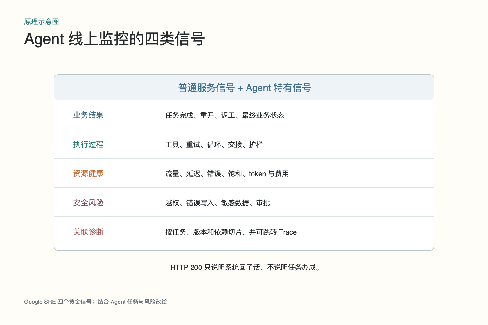
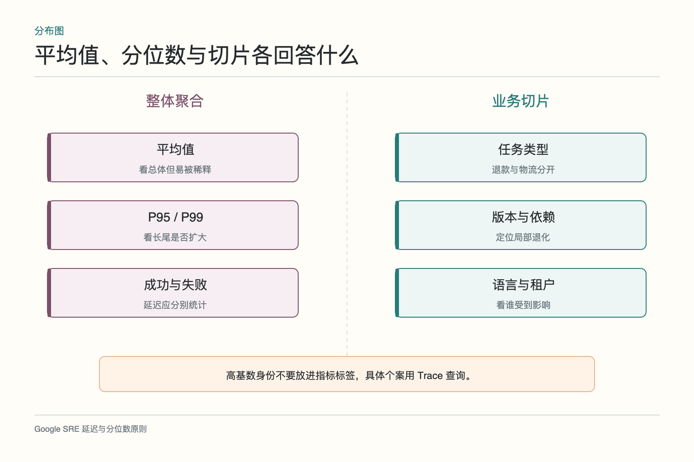
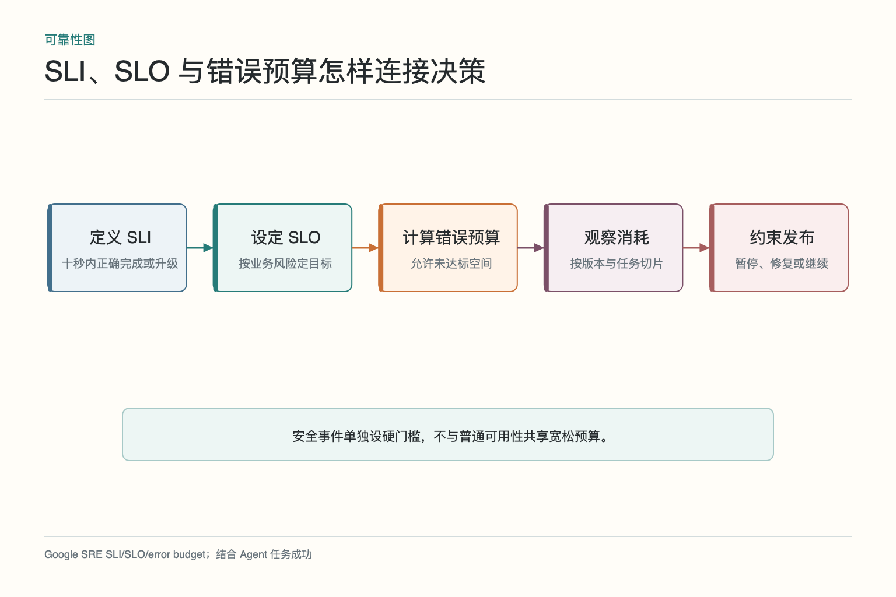
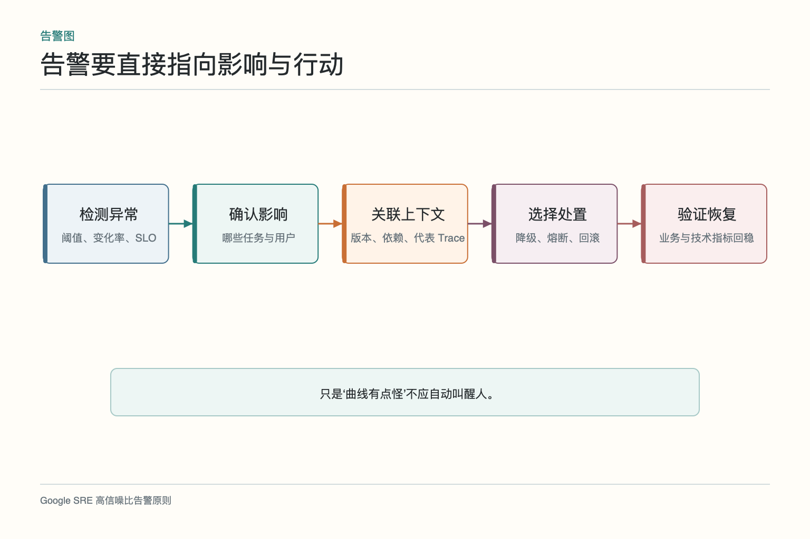
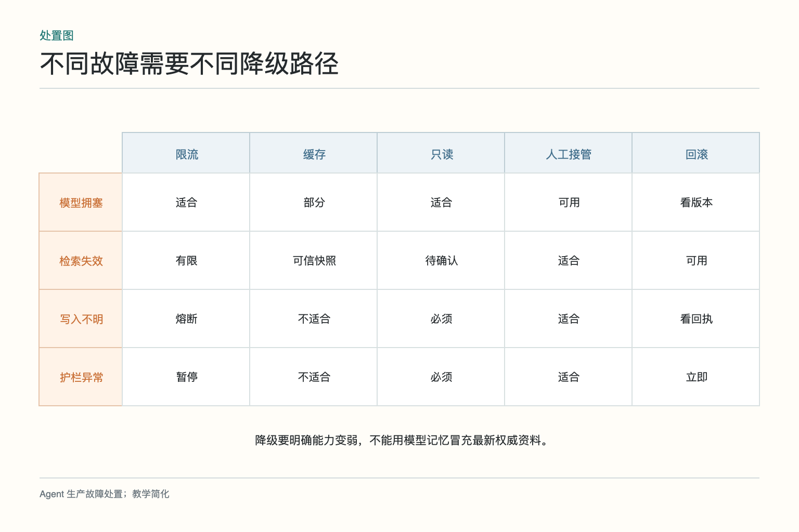

# 面试题：Agent 线上监控看什么

面试场景：售后 Agent 的 HTTP 成功率仍是 99.9%，但政策搜索从 300 毫秒变成 4 秒，部分任务走降级话术，用户重复进线。回答要把普通服务信号与 Agent 特有的任务、工具、风险和成本信号结合，并说明告警后怎样降级与恢复。

## 问题 1：Agent 线上监控应该看什么

**原理：**监控既要覆盖服务健康，也要覆盖任务结果、执行过程和风险。单一技术指标无法证明 Agent 完成业务。

**答题点：**业务看任务完成、重开、返工和最终状态；过程看工具选择、失败、重试、循环、交接和护栏；资源看流量、延迟、token、并发与费用；风险看越权、错误写入、敏感数据和审批。按任务和版本切片，并能跳到 Trace。

**记忆点：**结果、过程、资源、风险，四张表一起看。

**常见追问：**普通四个黄金信号还要不要？要。延迟、流量、错误和饱和是基础，但需补业务成功和 Agent 行为。

**失分点：**只列 CPU、内存和接口错误率。

## 问题 2：为什么 HTTP 成功不等于任务成功

**原理：**协议层成功只表示得到响应；业务可能错误、未完成或产生不合规副作用。Agent 还能用流畅文本掩盖依赖失败。

**答题点：**关联订单或工单最终状态；检查申请编号和业务回执；统计用户再次进线和人工重开；区分正确升级与错误拒绝；对“已完成”声明核对外部系统。定义成功率分母，防止通过转走难题美化指标。

**记忆点：**200 说明回了话，不说明办成了事。

**常见追问：**业务结果延迟几天才知道怎么办？先监控过程代理指标，结果成熟后回填并校准代理指标的相关性。

**失分点：**把模型输出中的 `success: true` 当真实成功。

## 问题 3：平均值、P95 与切片怎样配合

**原理：**平均值容易被大量简单请求稀释；分位数揭示尾部，业务切片揭示哪些群体或任务受影响。

**答题点：**同时看 P50、P95、P99 和成功/失败请求延迟；按任务、语言、区域、工具、模型和版本切片；给每个切片分母；控制标签基数，不把用户 ID 放入指标；具体个案通过 Trace 查询。

**记忆点：**平均看整体，分位看尾部，切片看谁受伤。

**常见追问：**P95 是不是最慢 5% 的平均？不是。它是 95% 样本不超过的分位点，不表示尾部平均值。

**失分点：**只报平均延迟，或无限加标签导致高基数失控。

## 问题 4：如何定义 SLI、SLO 与错误预算

**原理：**SLI 是测量方式，SLO 是目标，错误预算是允许未达标的空间。它们要连接用户结果和发布决策。

**答题点：**例：符合自动处理条件的换货任务，10 秒内正确创建草稿或明确升级的比例；设月度目标；计算未达标预算；预算快速消耗时暂停发布、收紧自动化或优先修复；越权与错误退款等安全指标单列严格门槛。

**记忆点：**先定义用户成功，再定目标，最后用预算管变化。

**常见追问：**SLO 越高越好吗？不一定。目标要结合业务价值、成本和人工兜底；不现实的目标会让规则失去决策作用。

**失分点：**把内部接口可用率直接当 Agent SLO。

## 问题 5：告警怎样减少噪声又保持及时

**原理：**告警应代表需要行动的用户影响或风险，而不是任何曲线波动。阈值、变化率和异常检测要服务于处置。

**答题点：**关联 SLO 消耗和高风险事件；聚合重复告警；设置持续窗口避免瞬时抖动；告警带影响范围、版本、依赖、代表性 Trace 和处置手册；区分页、工单和仪表盘；定期复盘误报、漏报和响应时间。

**记忆点：**叫醒人之前，先说明谁受影响、要做什么。

**常见追问：**异常检测模型是否比固定阈值好？适合复杂基线，但仍需可解释处置和硬安全阈值，不能把因果判断全交给黑箱。

**失分点：**所有异常都发同一优先级通知。

## 问题 6：出现异常后怎样降级

**原理：**降级要减少用户损害，并保持诚实。不同故障对应限流、缓存、熔断、只读、转人工或回滚。

**答题点：**政策搜索不可用时停止自动承诺，使用可靠缓存或输出待确认草稿；写入状态不明时熔断并查询回执；模型拥塞可路由备用模型但重新检查能力边界；高风险护栏异常直接暂停；恢复后逐步放量并处理积压任务。

**记忆点：**能少做就少做，不能确认就停，不要假装完整。

**常见追问：**降级为模型记忆回答可以吗？若政策需要最新权威数据，不可以。应明确资料不可用并转人工。

**失分点：**为保持可用率绕过安全校验。

## 问题 7：token 和成本怎样纳入监控

**原理：**成本异常常反映循环、重复上下文、工具失败或路由错误，也是可靠性问题。应按任务价值和成功结果观察。

**答题点：**监控输入输出 token、模型调用、工具次数、重试、缓存命中和单任务费用；按任务设置预算；关注每个成功任务总成本；超预算时停止、降级或转人工；从 Trace 区分正常复杂度与无效循环。

**记忆点：**看单次费用，更看成功一次要花多少。

**常见追问：**怎么降成本？先消除重复上下文、无效重试和错误路由，再按任务使用不同模型，不直接砍必要验证。

**失分点：**只看总账单，不按版本和任务归因。

## 问题 8：线上没有标准答案时怎么办

**原理：**并非每次运行都能即时得到真值，可以组合代理信号、抽样评审、业务结果和延迟标签，并持续校准。

**答题点：**监控工具回执、引用、规则违反、重新进线和人工改稿；随机抽样由领域人员审查；等待退款、解决率等延迟结果回填；将反馈关联 Trace；比较代理指标与最终结果，发现偏离时调整。

**记忆点：**没有即时真值，不等于只能看点赞。

**常见追问：**能否线上让另一个模型实时评分？可作辅助，但要校准偏差、控制成本，并避免评分器被内容注入。

**失分点：**选择最容易采集的指标冒充质量。

## 问题 9：怎样测试监控与告警

**原理：**监控也是系统，需通过故障注入、演练和事后复盘验证。没有被触发过的回滚开关不算退路。

**答题点：**注入模型超时、搜索变慢、工具错误、成本循环和护栏失败；检查指标是否出现、切片是否正确、告警是否及时、Trace 是否可达；演练限流、熔断、降级和回滚；统计发现时间、恢复时间、误报和漏报；事后补回归样本。

**记忆点：**把告警和退路也放进考场。

**常见追问：**多久演练一次？按业务风险和变更频率决定，高风险关键路径在重大变更前后应有针对性验证。

**失分点：**只在真实事故中第一次测试处置流程。

## 综合案例：线上成功率下降时怎样处置

假设退款 Agent 的接口错误率没有变化，但最终退款成功率在半小时内从 86% 降到 73%，人工接管和单任务费用同时上涨。第一步先确认指标口径与数据延迟，检查下降是否集中在某个租户、订单类型、语言、模型版本或工具版本。不要立刻重启所有服务；HTTP 正常而业务失败，问题很可能位于检索内容、工具返回语义、循环或状态判断。

第二步把聚合信号落到代表性 Trace。对比失败与成功任务的工具次数、检索版本、状态转移和最终回执。若异常任务都在库存查询后重复调用，并在达到步数上限后转人工，可以初步判断依赖返回格式变化导致解析失败。再核对部署和依赖变更，确认时间与版本吻合；如果没有对照证据，只能称为相关线索，不能直接宣布根因。

第三步按风险选择处置。对于查询类任务，可暂时读取可信缓存或缩短回答并说明数据时间；涉及退款写入时，结果不明必须熔断，不能自动重试制造重复退款。将异常工具版本摘流，必要时回滚稳定版本；对已受影响任务核对外部系统状态，补偿或转人工。告警中应携带业务影响、版本、代表 Trace、处置手册和负责人，让值班人员不必从零猜测。

最后验证恢复：业务成功、人工接管、P95 延迟和每个成功任务的成本都回到正常区间；检查积压任务、重复写入和用户通知；把代表故障加入离线回归，修正 SLO、告警与降级演练。这个案例能同时体现指标、日志、Trace 和业务结果的分工，也说明监控的终点不是发现红线，而是限制影响、恢复业务并减少复发。

如果面试官把问题推进到体系设计，可以再补三点。第一，指标应有清楚分母与成熟时间：退款提交率可以实时看，退款最终成功率可能几天后才完整，二者不能混用。第二，指标标签只放任务类型、版本、区域等有限维度，订单号这类高基数字段留在 Trace，避免时序系统膨胀。第三，告警按症状触发，诊断信息随后关联；不要为每个猜测的根因都建一条告警，否则依赖抖动一次就能叫醒整栋楼。

SLO 也不是越高越专业。对只读查询和资金写入应设置不同目标与硬门槛，错误预算只适用于可接受的普通故障，越权、泄露和重复退款不能拿预算抵扣。发布期间按版本计算预算消耗，候选版异常燃烧时停止扩大；稳定版仍提供业务兜底。这样 SLO 才真正进入发布决策，而不是季度报告里的装饰数字。

最后可以补充告警治理。每条告警都要有明确所有者、影响说明、查询入口和第一步处置；定期统计误报、漏报、确认耗时和真正采取行动的比例。经常触发却无人处理的告警应改阈值、合并或删除，关键故障未触发则补信号。监控的成熟度不以面板数量衡量，而看团队能否更早发现、更准确定位，并在扩大影响前采取有效动作。

回答这组题时，用一条故障链最清楚：搜索延迟升高，部分任务降级，HTTP 仍成功，但重新进线和人工接管上升；监控通过分位数和切片发现，告警带 Trace 定位依赖，系统停止自动承诺并转人工，恢复后逐步放量。这样既讲了信号，也讲了行动。

最后把恢复条件说具体：技术错误、业务成功和风险事件都回到稳定区间，积压与副作用已经核对，降级解除后经过小流量验证。只看到服务恢复就关闭事故，会把业务补偿和用户影响留给下一班人。

如果只能选少数指标，优先保留用户任务结果、高风险事件、关键依赖、长尾延迟和每个成功任务的成本，再用 Trace 承担个案诊断。指标少而有行动，比面板多而无人负责更可靠。

## 参考资料

- [Google SRE：Monitoring Distributed Systems](https://sre.google/sre-book/monitoring-distributed-systems/)
- [Google SRE Workbook：Monitoring](https://sre.google/workbook/monitoring/)
- [OpenTelemetry：Metrics](https://opentelemetry.io/docs/concepts/signals/metrics/)
- [OpenTelemetry：Signals](https://opentelemetry.io/docs/concepts/signals/)

想看本文在 AI Agent 中的位置，可点击下方 [阅读原文](https://github.com/Jennifer123www/ai-agent-knowledge-map)，从“评测、可观测性与持续优化”的“线上监控”继续阅读。
