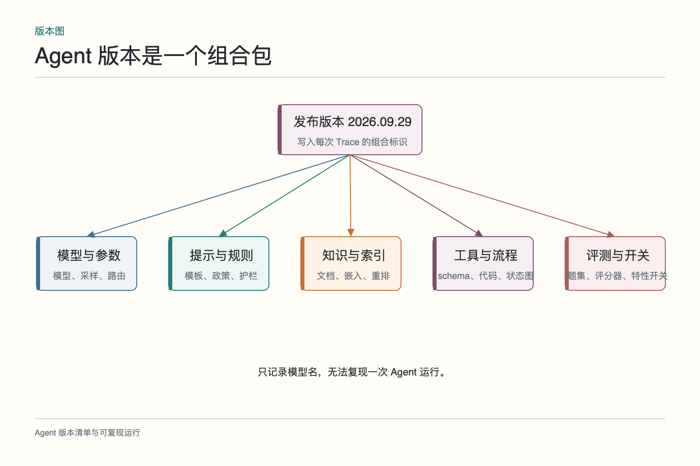
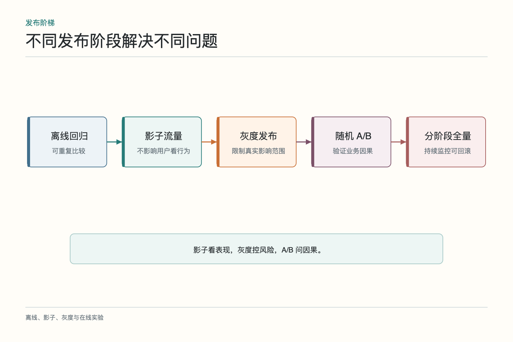
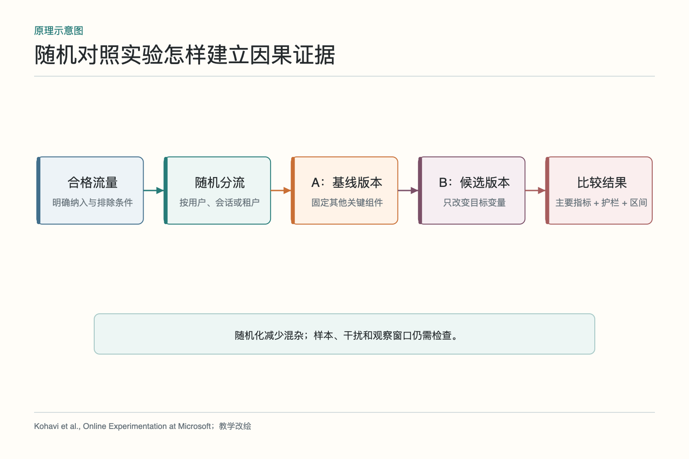
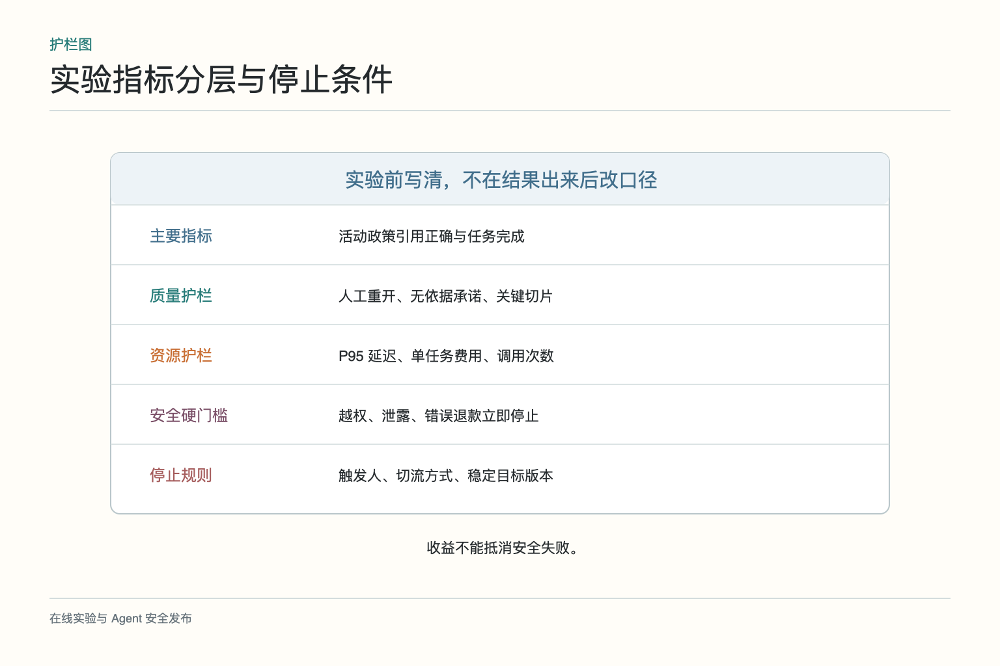
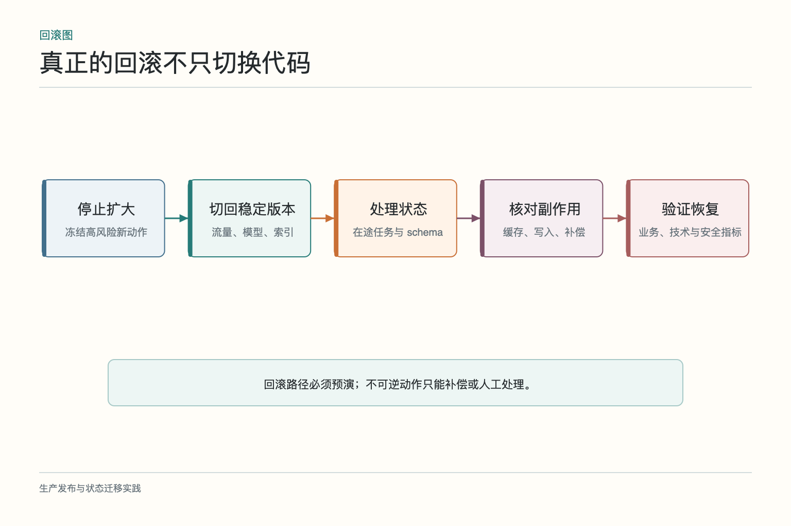

# 大话版本与发布：变好不能只凭感觉

售后 Agent 的知识库把整页政策切成大段，遇到“活动商品十五天退换”时，经常只检索到通用七天条款。团队换成更细的分段策略，内部试用觉得引用明显更准。恰好第二天简单物流问题变多，线上满意度也上涨。是新策略有效，还是用户问题变容易了？如果模型、提示和流量同时变化，这个问题没有可靠答案。

版本与发布管理的价值，是让“改了什么”和“结果为什么变化”尽量建立清楚关系。它不仅管理代码，还要管理模型、提示、知识、索引、工具、规则、流程和评测集。随后通过离线对照、影子流量、灰度和 A/B 实验逐步扩大影响，而不是周五下午一键全量，再祈祷周末平静。

## 一、新版指标上涨为什么不能立刻归功于新策略

线上指标同时受任务分布、季节、渠道、客户、外部依赖和其他发布影响。若新版恰好接到更多简单问题，它的成功率会天然更高；若同一天库存 API 恢复，延迟下降也不一定来自检索优化。发布时间前后比较只能说明相关，不能自动说明因果。

先写实验假设：“在模型、提示和知识版本固定时，细粒度分段将提高活动政策的引用正确率，不增加严重错误，P95 延迟增加不超过 200 毫秒。”它明确改变对象、目标切片、主要指标和代价。没有假设，看到哪个数字好就讲哪个，实验会沦为事后挑故事。

一次尽量改变有限变量。若必须同时升级模型和索引，至少建立组合版本并安排消融或分阶段测试，知道各部分贡献。生产事故时也才能决定回退模型、索引还是整个版本包。

## 二、Agent 的版本不是一个模型名字

一份可复现版本包至少包含：模型与参数、系统提示和模板、知识文档与索引、嵌入和重排模型、工具契约、规则、工作流、代码部署与特性开关。评测集与评分器也要版本化，因为考卷变化会改变分数。

版本清单要进入每次 Trace。用户投诉时，团队能知道这次运行用了哪个索引和政策，而不是只查“当天大概发布过一次”。外部服务不能完全固定，也应记录 API 版本、请求时间、响应标识与关键结果摘要。

组合版本可以使用稳定发布编号，内部再映射各组件。这样回滚有明确目标，仪表盘也能按发布版本切片。若线上同名“v2”背后每天悄悄换提示和索引，任何长期趋势都不可信。

## 三、离线对照先验证基本假设

新旧分段策略在同一批活动政策工单、同一模型、同一提示和同一知识快照上运行。比较召回覆盖、引用正确、最终任务成功、延迟和费用，并单列通用政策、活动政策、冲突政策与无答案案例。

离线结果若没有达到预先门槛，就不应靠线上“大样本也许会好”碰碰运气。反过来，离线通过只说明候选版本具备进入受控线上验证的资格。真实流量、缓存、并发和依赖仍可能带来新问题。

测试还要覆盖回退兼容：新索引创建失败是否仍能使用旧索引，旧任务恢复时是否绑定原版本，切换过程中是否出现一半请求查新库、一半引用旧文档的混杂状态。

## 四、影子流量、灰度和 A/B 分别解决什么

影子流量复制真实请求给候选版本，但候选结果不影响用户和业务写入。它适合观察行为、成本和工具选择，却无法完整测量用户反应，也要注意复制数据的权限与隐私。

灰度发布让少量真实流量使用新版本，重点是限制爆炸半径和验证运行稳定性。可以先选内部用户、低风险任务或少量租户，逐级扩大。灰度并不天然建立因果，因为分流人群可能与基线不同。

A/B 实验通过随机分流，让两组在期望上可比，适合估计改动对用户与业务结果的因果影响。随机单位要选择清楚：按用户、会话、工单还是租户。一个用户在同一会话中来回切版本会污染体验；企业客户跨用户共享流程时，可能需要按租户分组。

三种方法常按顺序组合：离线守门，影子观察，灰度限风险，A/B 验证收益，最后分阶段全量。它们不是名字不同的同一个按钮。

## 五、随机 A/B 为什么仍会出错

随机化减少系统性差异，不保证每次实验都完美平衡。样本太少时，任务难度、渠道和客户分布仍可能偶然不均。实验前可检查协变量，结果按预设切片报告，并说明置信区间与最小业务效应。

还要防干扰。客服可能同时处理 A、B 两组工单并学习某种话术，库存或政策是共享资源，一个版本的动作会影响另一个版本。无法避免干扰时，应调整随机单位、采用集群实验或承认估计边界。

新奇效应也常见。用户第一次看到新交互会更多尝试，几天后行为可能回落；业务结果如退款争议要数周才成熟。观察窗口不能只挑最早、最好看的两天。

## 六、主要指标和护栏指标怎样配合

主要指标回答假设是否成立，例如活动政策引用正确率和合格任务完成率。护栏指标防止为了一个目标伤害其他方面，例如错误写入、越权、人工重开、P95 延迟和单任务费用。

安全指标通常是硬停止，不参与普通收益权衡。即使引用正确率提高，只要出现新的跨租户泄露，就应立刻停。质量指标还要看关键切片，不能让简单物流问答的进步掩盖退款任务退化。

停止条件应在实验前写好：哪些事件立即终止，哪些指标连续多久恶化就停止扩大，出现何种不确定性需要延长观察。临时修改阈值会引入人为偏差。

## 七、在途任务和状态版本怎样处理

Agent 任务可能运行数分钟甚至跨天等待人工。发布新流程时，旧任务的状态结构、节点名称和工具契约未必与新版本兼容。若恢复时强行进入新图，可能重复执行写操作或找不到下一节点。

常见做法是让在途任务继续绑定原版本，新任务进入新版本；若旧版存在严重风险，则暂停实例，读取业务回执后做显式迁移。迁移脚本也要可测试、可回退，并记录原状态与目标状态。

缓存同样带版本。提示缓存、检索缓存和工具结果缓存的键需要包含影响语义的版本与权限，避免新版本读取旧政策结果。回滚时还要考虑缓存是否需要清理，不能只换代码镜像。

## 八、回滚为何必须预先演练

回滚不是把流量开关拨回去这么简单。新版本可能已经写入新状态、创建新索引、改变数据库结构或产生外部副作用。旧版本能否理解这些状态，索引是否仍保留，工具契约是否向后兼容，都要提前确认。

真正的回滚计划包含稳定目标版本、切流方式、数据与状态处理、缓存策略、在途任务处置、负责人和验证指标。通过演练测出恢复时间，而不是事故时第一次读文档。对于不可逆动作，回滚程序只能停止继续影响，并通过补偿或人工处理已发生的业务。

回滚后也要验证：错误率是否恢复，业务状态是否一致，用户是否需要补救，Trace 是否仍可查询。代码回到旧版本不等于事故结束。

## 九、实验结果怎样沉淀为下一轮证据

实验结束记录假设、版本、样本、分流、指标定义、异常、结论和未解决问题。成功改动进入稳定版本，失败与反常样本进入离线评测。若结果不确定，也应保留而不是只归档“胜利案例”。

避免把每次 A/B 都当作独立彩票。多个实验共享用户、时间和指标，容易出现重复检验和选择性汇报；团队需要实验注册、互斥规则和统一数据口径。结论应说明适用范围，例如“活动政策工单在移动端改善”，不能扩写成“所有售后任务都更好”。

版本与发布管理最终不是拖慢迭代，而是让团队知道哪次改动真的有效、出了问题能退到哪里、哪些用户曾受影响。快并不等于一次全推；有证据地逐步扩大，通常才是生产环境里更快的路。

## 十、一次小流量发布该怎样走完

假设团队修改了活动政策的检索排序。先在固定评测集比较旧版和候选版，确认目标切片改善，历史事故、安全样本与普通查询不退化。然后用影子流量执行候选链路，但禁止真实写入，检查检索证据、工具参数、延迟和费用。影子结果稳定后，只给少量低风险查询开放候选版，并保持同一用户会话版本一致。

进入随机 A/B 前，写清假设：“新排序提高活动政策引用正确率，并提升最终问题解决率。”主要指标看正确引用和最终解决，护栏看人工重开、错误承诺、P95 延迟与成本；越权和敏感数据事件直接停止。实验窗口覆盖活动完整周期，不在看到第一天上涨时提前收工。结果按任务难度、渠道与客户类型切片，并报告不确定性。

扩大流量时每一步都保留观察期。若候选版异常，先冻结扩大，核对真实影响和代表 Trace，再决定降级或回滚。回滚后检查在途任务、缓存、索引和已产生的业务写入，不能只把路由拨回旧模型。最终发布记录包含版本组合、证据、审批、停止条件与恢复结果。这样一次发布留下的不只是“上线成功”，而是一套下次还能复用的判断依据。

发布结束还要回答两个问题：哪些用户和任务真正进入了候选版，哪些结果尚未成熟。分流日志、版本 Trace 与业务结果要能对应，才能区分“没被实验覆盖”和“覆盖后没有改善”。对于仍在等待退款完成或人工复核的任务，报告应标注未成熟，后续补算，不能在发布当天全部当作成功。把观察窗口关得太早，常常比模型本身更会制造好消息。

最后清理临时开关，但不要立刻删除稳定版本和回滚资料。等业务结果成熟、投诉窗口过去、在途任务结束，再按计划下线旧资源。过早清理可以省一点存储，却可能让一次普通回退变成临时抢修。

发布负责人也要明确：谁能扩大流量，谁能触发停止，谁负责核对业务副作用。按钮很多并不等于责任清楚。

## 参考资料

- [Microsoft Research：Online Experimentation at Microsoft](https://www.microsoft.com/en-us/research/publication/online-experimentation-at-microsoft/)
- [Microsoft Research：The Benefits of Controlled Experimentation at Scale](https://www.microsoft.com/en-us/research/publication/the-benefits-of-controlled-experimentation-at-scale/)
- [OpenAI：Evaluation best practices](https://developers.openai.com/api/docs/guides/evaluation-best-practices)
- [Google SRE：Monitoring Distributed Systems](https://sre.google/sre-book/monitoring-distributed-systems/)

想看本文在 AI Agent 中的位置，可点击下方 [阅读原文](https://github.com/Jennifer123www/ai-agent-knowledge-map)，从“评测、可观测性与持续优化”的“版本、实验与发布管理”继续阅读。
