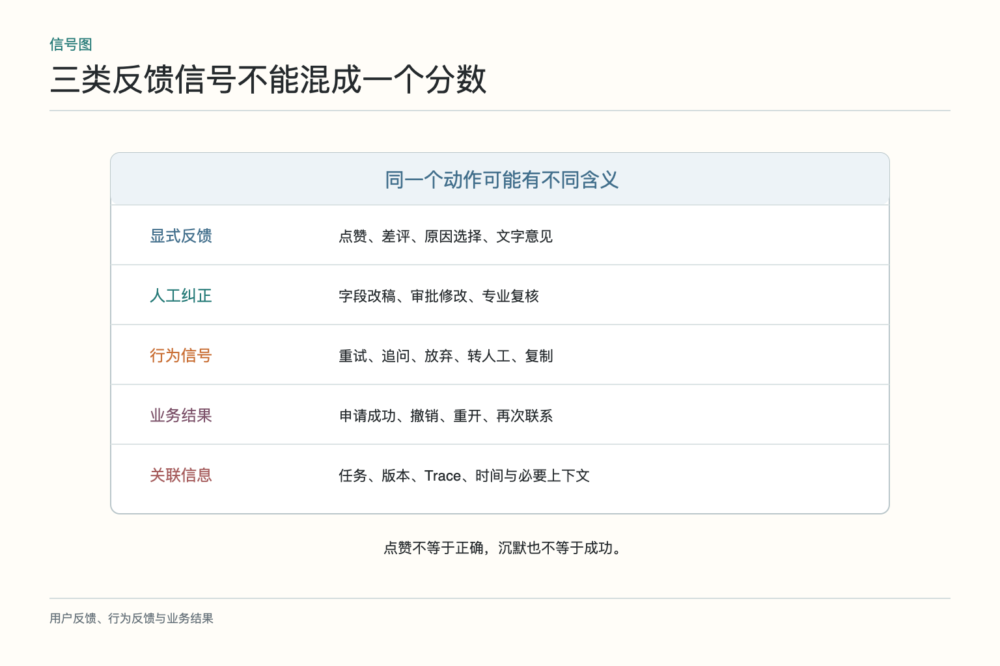
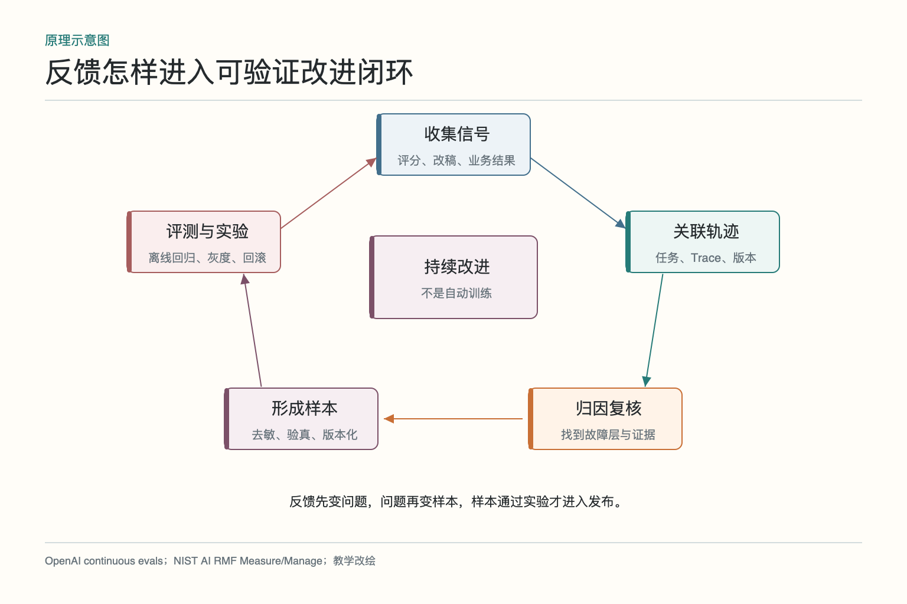
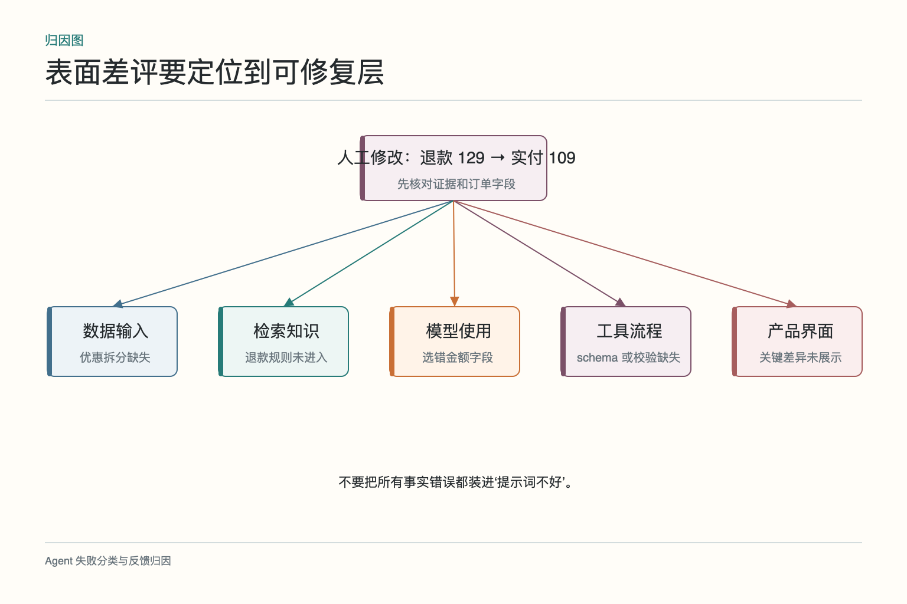
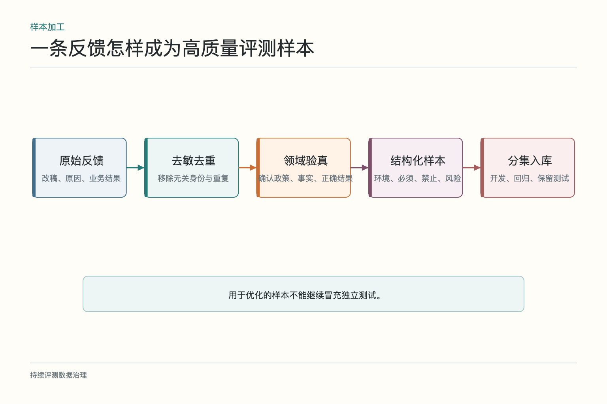
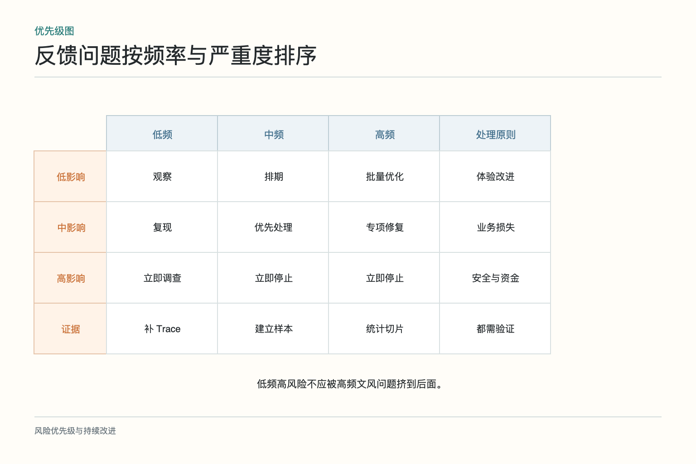

# 大话反馈闭环：把差评变成可验证问题

客服主管发现，Agent 生成的退款摘要经常被人工修改。原文写“退款 129 元”，客服改成“退回实付 109 元，20 元优惠券原路退回账户”。后台只记录了“人工编辑”，并不知道改了哪一处、为什么改、最终退款是否成功。产品看到编辑率上升，第一反应是调提示词写得更谨慎；工程师却怀疑订单接口没有返回优惠拆分。

这就是反馈系统常见的尴尬：信号很多，问题仍说不清。反馈闭环不是把点赞和差评倒进训练集，而是把用户行为、人工纠正和业务结果关联到原任务与版本，经过归因和复核，形成可验证的改进假设，再用离线与线上实验判断改动是否有效。

## 一、一排差评为什么仍不知道该改哪里

“不满意”可能表示事实错、没解决、太慢、语气不合适，也可能只是用户不接受政策。若按钮只有赞和踩，团队只能知道结果不受欢迎，无法判断检索、模型、工具、流程还是产品规则出了问题。

重新提问也不一定是失败。用户可能补充了新信息，或想问另一个问题。客服修改文本可能修正事实，也可能只是统一公司语气。**反馈首先是线索，只有与任务上下文和业务结果结合后，才可能成为标签。**

设计入口时，可以让反馈更可行动：事实错误、没有解决、缺少依据、操作未完成、太慢或其他；人工改稿记录字段级差异和原因；业务系统回写退款是否成功、是否撤销和是否再次联系。不要为了分类方便，让用户填一张小论文。

## 二、显式、行为和业务信号各说明什么

显式反馈包括评分、原因选择、文字意见和人工审核。行为信号包括重试、重新提问、放弃、复制答案、转人工和修改草稿。业务结果包括申请是否成功、工单是否重开、退款是否撤销和问题是否最终解决。

三层需要分开保存。点赞说明主观满意，不直接证明事实正确；复制一段答复可能表示有用，也可能是拿去投诉；工单未重开可能是真的解决，也可能是用户放弃。用多种信号交叉验证，比把某一个动作封为“真值”更稳。

还要记录反馈出现的时间。即时评分适合衡量交互感受，退款是否正确可能几天后才知道。延迟业务结果成熟后，应回填到原任务，而不是只留在另一张报表里。

## 三、反馈怎样关联到一次运行

每条反馈至少要关联任务 ID、Trace ID、会话与必要业务标识，并保存模型、提示、索引、工具和流程版本。人工把 129 改成 109 时，还要知道 Agent 当时读取了哪个订单字段、是否拿到优惠券明细、金额如何进入摘要。

*图依据 [OpenAI Evaluation best practices](https://developers.openai.com/api/docs/guides/evaluation-best-practices)中持续评测思路和 [NIST AI RMF Core](https://airc.nist.gov/airmf-resources/airmf/5-sec-core/)的 Measure—Manage 关系改绘。反馈先形成问题与证据，再进入评测和发布，不直接跳到训练。*

关联不意味着永久保存全部会话。可以保留字段差异、证据引用、版本与受控原文位置。用户身份和敏感订单信息遵循最小化、访问控制与保留期。若反馈数据被用于新的目的，例如训练个性化模型，应重新确认授权和退出机制。

没有稳定关联标识，团队只能统计“今天有 300 条差评”，却无法知道都来自哪个版本、哪类工单和哪项工具。这样的反馈更像天气预报：提醒带伞，但修不了屋顶。

## 四、先归因，再决定改哪一层

把修改前后和 Trace 放在一起，团队发现订单工具只返回“商品原价 129 元”和“实付 109 元”，提示词却使用了前一个字段；优惠券退回规则在政策文档里，但没有结构化进入工具结果。这里至少有字段选择和资料组合两个问题，不只是“模型算错”。

归因可以按层次进行：输入资料缺失，检索未找到，模型理解或推理错误，工具选择与参数错误，业务规则或权限错误，界面没有展示关键信息。每类修复手段不同。资料缺失应改数据契约，工具参数错应改 schema 与校验，政策冲突要改规则，不宜都塞回提示词。

代表性样本由领域、产品和工程共同复核。一次反馈可能包含多个问题，需区分主因和伴随问题。结论写成可检验假设，例如“优惠订单中 Agent 更常使用原价字段；增加实付金额优先规则后，该切片的字段错误率应下降”。

## 五、人工改稿怎样变成高质量样本

修改差异很有价值，但不能直接把“改后文本”当唯一答案。先确认改稿是否事实正确、是否符合当前政策、哪些改动只是语气。然后保存原输入、必要环境、错误类型、合格条件和禁止行为。

金额案例可生成一条回归样本：订单原价 129，实付 109，优惠券 20；期望摘要明确两种去向；禁止写成现金退款 129；工具必须读取支付拆分。这样它不只是一个参考句子，而是一项可执行检查。

相似反馈要去重，避免一个高频客户或一个重复事故占据数据集。保留来源和时间，政策更新时重新审核。用于优化的样本与独立测试集分开，防止修到“会背旧错题”后误以为泛化提升。

## 六、为什么不能把差评原文直接拿去训练

差评可能包含错误建议、恶意内容、个人信息和与任务无关的情绪。用户说“直接给我全额退，不然投诉”，不代表业务规则应改为无条件全退。人工修改也可能为赶时间写了不完整措辞。

先做权限与隐私检查，再进行去重、纠错、归因和领域审核。训练、提示优化、规则修复、检索更新和工具改造是不同方案，选择取决于根因。稳定表达问题可能适合提示或微调；实时政策问题适合知识更新；金额计算应交给确定性代码。

还要防止反馈回路偏斜。只优化愿意点击反馈的用户，可能忽略沉默用户；只追求点赞，系统会更迎合；只看人工改稿，可能把客服个人习惯固化为全局规则。

## 七、高频小错与低频大错怎样排序

优先级至少考虑频率、严重度、受影响范围、可复现性和修复成本。语气稍长出现一万次，影响主要是体验；错误退款只出现一次，可能涉及资金和合规。后者通常先处理。

安全、隐私、越权和不可逆副作用进入紧急通道，不与普通文风问题竞争同一总分。高频问题适合统计趋势和批量改善，低频严重问题要保留完整证据并进行事故处置。

优先级也要看修复是否可验证。若一个问题没有复现条件，先补观察和样本；若只需修正错误字段映射且有明确测试，可以快速解决。路线图应写“降低优惠订单金额字段错误”，而不是模糊的“提升智能程度”。

## 八、改动怎样经过离线和线上验证

将已复核反馈加入开发和回归集，先验证目标错误下降，同时检查普通订单、部分退款和多优惠组合没有退化。候选版本通过安全与质量门槛后进入影子或小流量灰度，再观察人工修改、最终退款、投诉、延迟和成本。

若做 A/B，随机单位和观察窗口要提前确定。客服看到两种摘要后可能相互学习，按工单分组或许产生干扰；可以按客服队列或时间窗设计，并说明限制。护栏指标出现错误退款应立即停止。

修复只在那条差评上表现更好，不算完成。需要证明目标切片整体改善，关键能力不退化，线上真实结果也一致。否则只是把一个案例擦得很亮。

## 九、反馈收集怎样兼顾隐私和退出权

只采完成改进所需的数据，清楚说明用途和保留期。用户明确删除或退出后，关联的反馈、原文、训练副本和索引应按政策处理。不要把售后抱怨偷偷扩展成永久用户画像，也不要把客服内部备注无差别暴露给模型。

访问反馈详情需要权限，导出和标注操作应审计。交给外部标注人员前进一步去标识化，只提供判断所需信息。高敏领域要明确哪些内容不得进入训练。

一个健康的反馈闭环不会承诺“用户越用，模型自动越聪明”。它会把模糊意见变成带证据的问题，把问题变成经过复核的样本，把候选修复放进评测和受控实验，再决定是否发布。差评不是燃料，经过清洗、归因和验证的差评才可能是。

## 十、先做一张能闭环的问题单

团队可以从一张简单的问题单开始，而不是先建庞大的反馈平台。每条记录至少包括：反馈发生在哪项任务、关联哪次运行和哪个版本、用户看到了什么、最终业务结果是什么、初步故障层、证据是否齐全、由谁复核。若只留下“回答不好”四个字，这条反馈既无法修复，也无法验证。

每周选择少量高价值记录做完整闭环。先重放 Trace 确认事实，再决定是修知识、工具、流程、界面还是模型；将匿名化后的代表样本加入开发集，并另补同类回归样本；候选改动通过离线门槛后小流量发布，最后回看相同切片的用户行为和业务结果。关闭问题单时写明证据，不以“已经优化提示词”代替结果。

还要允许结论是“暂不改模型”。例如差评源于退款规则本身不受欢迎，模型只是准确转述；此时产品或政策团队才是责任方。反馈闭环最怕把所有不满都塞进一个训练队列，那会让模型替系统设计背锅，也让真正的产品问题一直留在原地。

问题单还应记录“没有采用”的建议及原因。某条改稿可能更客气，却遗漏必要风险提示；某个点赞增长可能来自界面把反馈按钮放得更显眼。保留这些判断，可以防止几个月后又把同一条噪声当成新发现。反馈系统不是许愿池，它更像维修记录：故障、证据、处理、验证和未解决项都要说清楚。

当同类问题反复出现时，不要只累计工单数量。选择几条完整轨迹，确认它们真的是同一根因，再合并统计；表面都写着“金额不对”，背后可能分别是订单缺字段、政策过期和工具写错。错误标签越接近可修复层，优先级和负责人越清楚。

最后为问题单设置复查日期。修复上线一段时间后，再看同类错误、人工改稿和最终业务结果；没有复发证据之前，只能叫“已发布”，还不能叫“已解决”。

## 参考资料

- [OpenAI：Evaluation best practices](https://developers.openai.com/api/docs/guides/evaluation-best-practices)
- [OpenAI：Evaluate agent workflows](https://developers.openai.com/api/docs/guides/agent-evals)
- [NIST：AI Risk Management Framework](https://www.nist.gov/itl/ai-risk-management-framework)
- [NIST：AI RMF Playbook](https://airc.nist.gov/airmf-resources/playbook/)

想看本文在 AI Agent 中的位置，可点击下方 [阅读原文](https://github.com/Jennifer123www/ai-agent-knowledge-map)，从“评测、可观测性与持续优化”的“反馈与实验”继续阅读。
