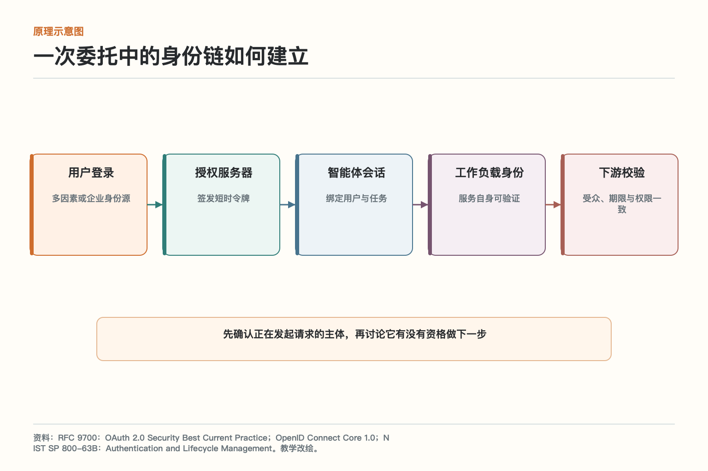
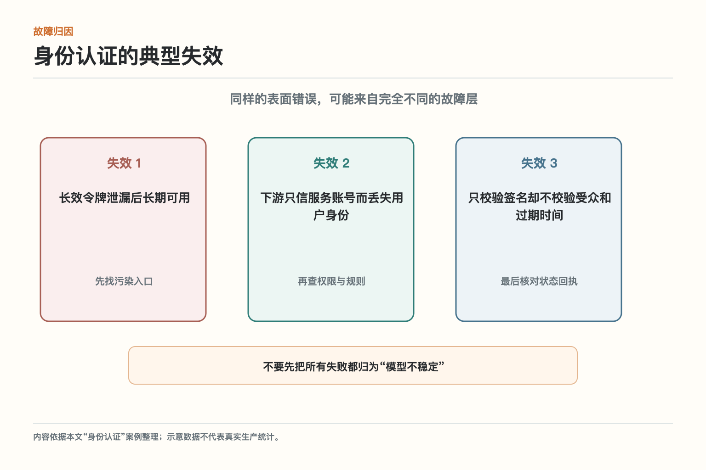
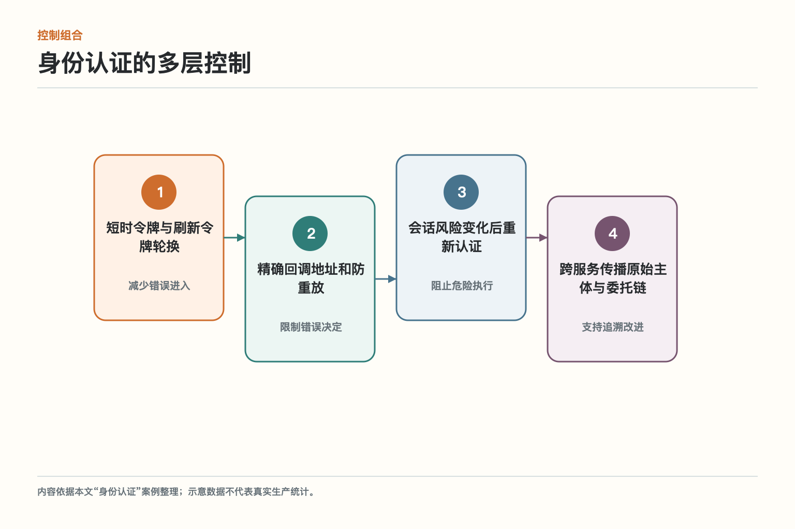
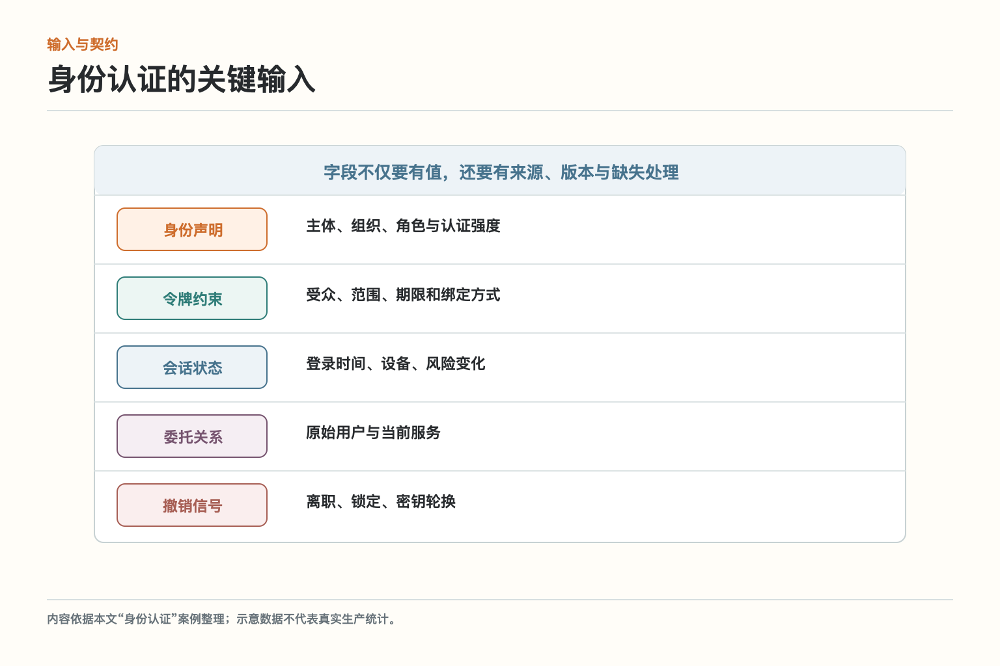
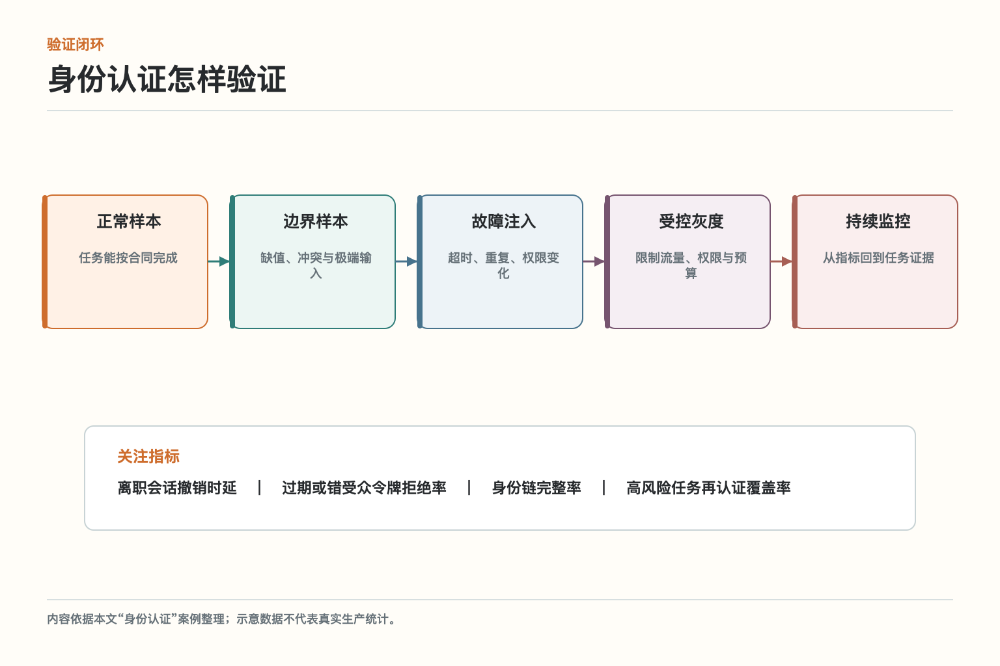

# 面试题：智能体身份认证怎么设计

面试题沿用主文案例：一名采购员工离职后，浏览器登录已被禁用，但旧会话里的访问令牌还能让智能体查询供应商并创建采购草稿。后台日志只写着“agent-service 调用成功”，既看不出最初是谁发起，也分不清这是用户委托、服务自身任务还是远程智能体转交。

回答身份认证，不要停在名词解释。更完整的结构是：先说它保护或交付什么，再画出控制流和状态，随后说明失败、取舍和验证。下面九道题围绕同一案例展开。

## 问题 1：身份认证如何定义目标与边界

**原理：**它的目标是为人、服务、工作负载和远程智能体建立可验证且可撤销的身份链，并把原始委托者与当前执行者同时带到下游。边界要落到真实对象、动作和完成条件，而不是只约束模型措辞。

**答题点：**先描述案例中的主体和对象，再说明允许、禁止与必须暂停的动作；列出身份声明、令牌约束、会话状态、委托关系、撤销信号；最后说明结果怎样由回执或业务状态验证。

**记忆点：**先定任务合同，再谈模型能力。

**常见追问：**为什么提示词写明规则仍不够？因为提示属于概率控制，真正权限和状态必须由执行层校验。

**失分点：**只说提高安全性、稳定性或效率，没有对象和验收口径。

## 问题 2：身份认证如何解释“一次委托中的身份链如何建立”

**原理：**核心链路是用户登录 → 授权服务器 → 智能体会话 → 工作负载身份 → 下游校验。每一步都要接收结构化输入并返回状态。

**答题点：**用户登录负责多因素或企业身份源；授权服务器负责签发短时令牌；智能体会话负责绑定用户与任务；工作负载身份负责服务自身可验证；下游校验负责受众、期限与权限一致。说明同步与异步边界、任务标识、版本和失败去向。

**记忆点：**输入有来源，步骤有状态，动作有回执。

**常见追问：**某一步超时后能否直接重试？要看是否产生副作用、是否有幂等键和真实回执。

**失分点：**把五个框照着念一遍，却不说明数据、控制和状态怎样传递。

## 问题 3：身份认证如何设计输入与数据契约

**原理：**自然语言适合表达意图，不适合独自承担权限、状态和业务不变量。关键输入应结构化并带来源与版本。

**答题点：**逐项覆盖身份声明（主体、组织、角色与认证强度）、令牌约束（受众、范围、期限和绑定方式）、会话状态（登录时间、设备、风险变化）、委托关系（原始用户与当前服务）、撤销信号（离职、锁定、密钥轮换）；区分必填、可选、推导和禁止猜测字段；缺失时选择追问、草稿、拒绝或转人工；敏感值用安全引用。

**记忆点：**能校验的字段不要只藏在一段话里。

**常见追问：**结构化会不会降低灵活性？意图仍可由模型理解，但进入关键动作前要转成受约束参数。

**失分点：**把完整对话原样传给所有下游，既难校验又扩大隐私面。

## 问题 4：身份认证如何识别最危险的失效模式

**原理：**失效不能只按“模型答错”分类，还要区分输入污染、控制缺失、状态竞争和外部依赖。

**答题点：**案例至少包含长效令牌泄漏后长期可用、下游只信服务账号而丢失用户身份、只校验签名却不校验受众和过期时间。回答时为每项指出发生层、可观察证据、用户影响和阻断位置；再说明为什么换模型不能替代系统控制。

**记忆点：**先定位故障层，再选择修复手段。

**常见追问：**最应该先修哪一个？优先看严重度、暴露面、可检测性和是否产生不可逆副作用。

**失分点：**列一串风险名词，却没有映射到具体任务和失败证据。

## 问题 5：身份认证如何组合多层控制

**原理：**单层控制会误判或失效，高风险系统需要不同性质的控制互相兜底。

**答题点：**组合短时令牌与刷新令牌轮换、精确回调地址和防重放、会话风险变化后重新认证、跨服务传播原始主体与委托链；说明哪些在输入前、哪些在决定时、哪些在执行前、哪些用于事后追溯；给出依赖失败时的安全降级。

**记忆点：**软控制帮助判断，硬控制守住动作。

**常见追问：**控制越多是否越安全？不一定，互相矛盾和不可观察的控制会增加盲点，需要统一状态与测试。

**失分点：**把所有责任交给内容过滤器或系统提示。

## 问题 6：身份认证如何处理严格性与体验的取舍

**原理：**风险控制要比较误允许和误拒绝的成本，并按可逆性、影响范围、敏感度和证据强度分级。

**答题点：**令牌越短，泄漏窗口越小，但刷新和可用性压力更大；会话越顺滑，持续校验越容易被忽略。应把高风险动作和身份风险变化作为再认证触发点。 面试中还应给出一条分级规则和对应动作：自动、生成草稿、要求确认、强制审批或拒绝。

**记忆点：**不是所有任务都自动，也不是所有任务都弹窗。

**常见追问：**怎样避免人工审批成为瓶颈？缩小审批范围、提供结构化证据、设置明确 SLA，并用低风险样本抽检。

**失分点：**用一个固定阈值处理所有租户、数据和动作。

## 问题 7：身份认证如何制定上线与回滚方案

**原理：**上线目标不是功能可用，而是风险受控、收益可归因、异常可停止。

**答题点：**从一条写操作开始，明确用户令牌、服务身份和下游受众；模拟离职、令牌重放和服务间转交，确认每层都能拒绝失效身份。 先固定基线和版本，限制流量、权限和预算；设置停止条件；在每次变更中只改变可归因的少量变量；保存旧版本和状态兼容方案。

**记忆点：**小范围、可观察、能停止、可回退。

**常见追问：**为什么离线通过仍要灰度？真实流量、依赖和用户行为无法完全在离线环境复现。

**失分点：**上线只准备扩容，没有准备降级、取消和在途任务处理。

## 问题 8：身份认证如何设计验证指标与故障演练

**原理：**指标要同时覆盖结果、过程、风险和资源，故障演练要证明系统在非理想条件下仍按边界行动。

**答题点：**核心指标包括离职会话撤销时延、过期或错受众令牌拒绝率、身份链完整率、高风险任务再认证覆盖率。先测正常和边界样本，再注入超时、重复、权限变化和数据版本变化；从异常指标跳到具体任务、输入、版本和回执。

**记忆点：**不只问成功多少，还要问错在哪里、代价多大。

**常见追问：**没有标准答案的开放任务怎么评？结合结构化事实、过程约束、引用或工具结果、人工抽检和最终业务结果。

**失分点：**只看平均分或接口成功率，掩盖高风险切片。

## 问题 9：身份认证如何说明与相邻模块的关系

**原理：**安全、权限与治理不是单点组件，必须与身份、知识、工具、运行时、观测和评测共享必要语义。

**答题点：**说明身份认证输入来自哪里、向下游交付什么、由谁验证；接口保留任务、主体、资源、动作、版本、风险、状态和回执；跨服务只传必要信息并保护敏感数据。

**记忆点：**模块可以分开建设，证据链不能断。

**常见追问：**哪些能力适合平台统一？身份、追踪、运行时和评测框架可复用，业务规则、完成条件和风险阈值应场景化。

**失分点：**把相邻模块画成连线，却不说明责任和失败边界。

## 综合案例：怎样把答案讲成一套可落地方案

面试官如果给出一名采购员工离职后，浏览器登录已被禁用，但旧会话里的访问令牌还能让智能体查询供应商并创建采购草稿。后台日志只写着“agent-service 调用成功”，既看不出最初是谁发起，也分不清这是用户委托、服务自身任务还是远程智能体转交。，可以先用一句话界定目标：为人、服务、工作负载和远程智能体建立可验证且可撤销的身份链，并把原始委托者与当前执行者同时带到下游。随后画出用户登录 → 授权服务器 → 智能体会话 → 工作负载身份 → 下游校验，逐步说明输入、状态、控制和回执。这样回答不会散成概念清单。

接着指出三类真实故障：长效令牌泄漏后长期可用；下游只信服务账号而丢失用户身份；只校验签名却不校验受众和过期时间。每个故障都要落到阻断位置：输入前能过滤什么，执行前必须校验什么，动作之后怎样确认，状态不明时如何暂停。高风险场景至少用一项确定性控制兜底，不把成功寄托在模型每次都听话。

上线部分从从一条写操作开始，明确用户令牌、服务身份和下游受众；模拟离职、令牌重放和服务间转交，确认每层都能拒绝失效身份。开始，并给出离职会话撤销时延、过期或错受众令牌拒绝率、身份链完整率、高风险任务再认证覆盖率。离线用历史和对抗样本，线上限制流量、权限和预算；异常时能停止新任务、处理在途状态并切回稳定版本。若不能说明回滚对象和业务副作用，发布方案还不完整。

最后说清取舍：令牌越短，泄漏窗口越小，但刷新和可用性压力更大；会话越顺滑，持续校验越容易被忽略。应把高风险动作和身份风险变化作为再认证触发点。。一个成熟答案既不宣称完全自动，也不把所有责任推给人工。模型负责最擅长的理解、生成与候选比较，确定性系统负责权限、状态、约束和真实动作，人负责高影响且证据不足的决定。

可以用这句话收尾：认证回答“你是谁”，授权回答“你能做什么”。二者必须相连，但不能用登录成功替代动作权限检查。 设计的价值最终要由真实任务和证据证明，而不是由架构图的框数证明。

如果面试官继续追问落地，可以补充一条验收原则：不仅测顺利样本，也主动制造依赖超时、重复请求、权限变化和数据缺失。候选人应说明系统如何停下、恢复、回滚和留证，而不是只描述理想路径。

回答成本问题时，不要只报模型 token。身份认证的总成本还包括检索、工具、队列等待、人工复核、失败重试和运维。更有意义的分母是“每个成功且合规完成的任务”，不是每次接口调用。

## 参考资料

- [RFC 9700：OAuth 2.0 Security Best Current Practice](https://www.rfc-editor.org/rfc/rfc9700.html)
- [OpenID Connect Core 1.0](https://openid.net/specs/openid-connect-core-1_0.html)
- [NIST SP 800-63B：Authentication and Lifecycle Management](https://pages.nist.gov/800-63-4/sp800-63b.html)

想看本文在 AI Agent 中的位置，可点击下方 [阅读原文](https://github.com/Jennifer123www/ai-agent-knowledge-map)，从“安全、权限与治理”的“身份认证”继续阅读。
